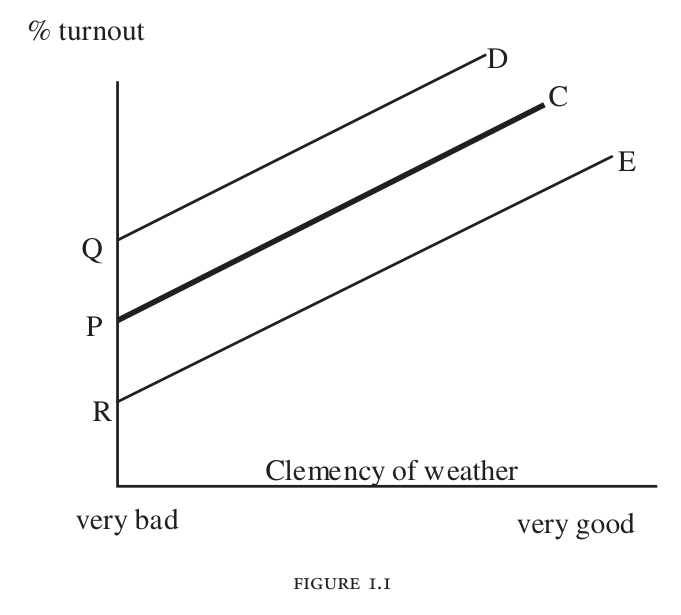
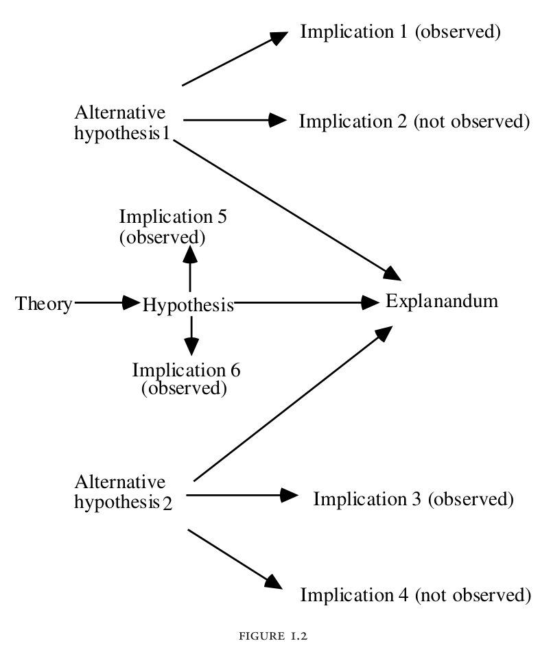

## What counts as an explanation? {.section-title}

A forum participant becomes more tolerant of a political opponent.

1.  What would establish that this happened?
2.  What would explain why it happened?
3.  What evidence would distinguish competing accounts?

::: notes
Timing: 2 minutes. Elapsed: 0–2 minutes.

Opening, including the title slide. Before providing definitions, ask: “What would we need to know to understand this claim?” Take two or three quick contributions. Keep three columns on the board, labeled in student-facing language: WHAT HAPPENED? / WHY? / HOW WOULD WE KNOW? These correspond to target, account, and evidence.

-   **What happened? (Target):** Specify the outcome that needs explaining. Did this person’s private attitude change, or did their public answer change? Those are different explanatory targets.
-   **Why? (Account):** Propose an explanation. An opponent’s story might have changed their beliefs; pressure might have encouraged a socially acceptable answer. Record these as hypotheses, not established processes.
-   **How would we know? (Evidence):** Identify observations that establish the outcome or distinguish accounts. Examples include privately collected responses, follow-up interviews, and comparisons of public and private answers. Ask what each observation would actually establish; no single measure automatically settles the question.

Sort student contributions into the columns as they speak. If someone says “their survey score increased,” put it under evidence and ask: “Evidence of a changed answer, or of a changed attitude?” If someone says “they empathized with the opponent,” put it under account and ask: “What would support that explanation?” A higher survey score is initially evidence for a descriptive claim, not automatically evidence that the forum caused private attitude change.

The teaching purpose is to distinguish specifying an outcome, proposing an explanation, and assessing evidence. Do not fill every column exhaustively during this two-minute opening. Leave the headings visible and return to them during Semmelweis and the independent forum exercise: “Have we specified the outcome, proposed an account, and identified evidence that could distinguish it from rivals?”

The forum is a hypothetical teaching case, not a reported study. Its working outcome is willingness to extend a political right to a disliked opponent, not agreement with that opponent. We will repeatedly change the question asked about this same case. Tell students that the point is to become precise about the achievement an account claims, rather than to memorize labels.

The two-hour session includes a five-minute break. Discussion is part of the allocated time, not something to add after a two-hour lecture. Invite students to keep one example from their own project in mind for the final workshop.

Source: Week 1 forum example, adapted as a hypothetical. Elster, pp. 15–20. Hedström, pp. 11–14.
:::

## Workshop vocabulary: concepts and measures

| Term | Meaning | Text-analysis example |
|------------------------|------------------------|------------------------|
| Concept | The idea or property we want to study | Incivility |
| Conceptual definition | What we mean by that concept | Disrespect expressed toward another person |
| Indicator | An observable sign of the concept | A personal insult in a comment |
| Operationalization | Rules for turning the concept into observations | Code whether a comment contains a personal insult |

::: key-line
A concept is not identical to the indicator used to measure it.
:::

::: notes
Timing: 2 minutes. Elapsed: 2–4 minutes.

Use this as a short shared vocabulary review for the September 9 workshop, which asks students to select a project, define two concepts, and identify observable textual indicators. The workshop names the tasks; these definitions and the incivility example are lecture explanations. The example is provisional, not an established codebook or a definition students must adopt.

Walk through one concept rather than offering four unrelated examples. Incivility is what we want to study. A conceptual definition specifies the intended meaning and boundaries. A personal insult is something we might observe as evidence of it. Operationalization specifies how to recognize and record that evidence, including the coding unit, inclusion and exclusion rules, and possible values. Coding only insults may miss other forms of disrespect; a quoted insult may not express the author’s own incivility. Those cases show why an indicator requires interpretation and explicit rules.

An observable indicator need not be a numerical score; it might be a coded category or a textual feature. A variable records an attribute that can take different values across cases, such as insult present versus absent. Do not equate the concept, the indicator, and the recorded variable.

Ask students to name one concept from their project and one possible indicator. Keep this to one response. The next slide defines the collection of texts and the entities about which the project makes claims.

Source: [Week 2 workshop, September 9: Selecting and Refining a Research Project](https://docs.google.com/document/d/14FmPo5tXL27_DV_Ijy4YwT0f-iVGjPjLq3-DL951Edg/edit). Definitions and example are lecture elaborations.
:::

## Workshop vocabulary: population, units, and corpus

| Term | Meaning | Example |
|------------------------|------------------------|------------------------|
| Population | The bounded set the question concerns | All comments on selected news articles in September |
| Unit of analysis | The kind of entity the claims concern | An individual comment |
| Corpus | The collection of texts assembled for analysis | The comments actually collected |
| Metadata | Information describing the texts or their context | Article ID, timestamp, reply ID |

::: key-line
A descriptive question specifies what, among whom or what, and which comparison.
:::

::: notes
Timing: 2 minutes. Elapsed: 4–6 minutes.

Use the same hypothetical comment study throughout. The population needs explicit boundaries: which outlet, which articles, what dates, and what counts as a comment. The corpus is the text collection actually available for analysis. It may cover the population or only part of it. Deleted comments, inaccessible replies, or collection failures can limit coverage. A convenient corpus does not automatically support claims about every online discussion.

The unit of analysis is the type of entity about which the research question makes claims. If we compare individual comments for incivility, it is the comment. If we compare discussion threads by the proportion of uncivil comments, it is the thread. The unit is not automatically a person or the same thing as a document file. One file may contain many comments, and one thread may span several files.

Distinguish units when needed: a sentence can be the coding unit on which an insult is marked, while a comment remains the unit of analysis. Comments can also provide observations used to construct a thread-level measure. State these choices explicitly rather than treating every data row as interchangeable. Claims about threads do not automatically establish the attitudes of individual authors.

Metadata describe the records and their context, such as time, source, and reply relationships. They can help define eligibility, identify duplicates, and organize comparisons. A timestamp is not by itself evidence of incivility. Corpus feasibility concerns whether the necessary texts and metadata can actually be obtained with adequate coverage.

Give one descriptive question: “Among comments on these selected articles in September, how does the proportion containing personal insults differ between replies and top-level comments?” It specifies a measured feature, population, unit, and comparison. It does not yet explain why any difference exists. Transition to the forum: “We need the same precision before deciding whether participants became more tolerant.”

Source: [Week 2 workshop, September 9: Selecting and Refining a Research Project](https://docs.google.com/document/d/14FmPo5tXL27_DV_Ijy4YwT0f-iVGjPjLq3-DL951Edg/edit). Definitions, unit distinctions, and example are lecture elaborations.
:::

## Description establishes the explanatory target (the explanandum)

**Claim:** “Forum participants became more tolerant.”

-   Tolerance of whom, measured how?
-   Change relative to their earlier responses or to another group?
-   A survey response; a behavioral response?

::: notes
Timing: 3 minutes. Elapsed: 6–9 minutes.

Ask pairs to choose the single ambiguity they would resolve first, then take two answers. Expected answers include defining tolerance, establishing the denominator, comparing the same people, and specifying when and privately or publicly the response was measured. A participant who leaves before the final survey can change the observed average without anyone changing attitude.

Connect to Week 1: Hirschman treats stylized facts as empirical regularities that call for explanation. They do more than condense findings: they identify a pattern as important and worth explaining. To assess one, ask what was measured, whose experiences it characterizes, which differences it leaves out, and why this characterization deserves attention.

Use “Forum participants became more tolerant” to illustrate the choices involved in constructing a descriptive summary:

-   **Selected as important:** We foreground tolerance rather than political knowledge or trust. Choosing this pattern as the puzzle also claims that it deserves explanation; an alternative characterization might foreground persistent disagreement or unequal participation.
-   **Operationalized:** We specify how to measure tolerance—for example, willingness to let a disliked political group hold a public meeting. That measure captures a particular meaning of tolerance, not every possible meaning.
-   **Summarized:** We condense the results into a broad statement, even though some participants may have changed more than others and some may not have changed at all.

These choices do not make the claim arbitrary. They help us assess what evidence supports it and how broadly it applies. A claim about one forum is not automatically a stylized fact: the term usually refers to a broader empirical regularity. This forum illustration explains the descriptive choices; it does not establish such a regularity. Elster says we must establish the fact before explaining it, while Hedström values descriptive and statistical work that identifies what needs explaining.

Distinguish a descriptive before–after change from an effect of the forum. The first can be real even if something outside the forum caused it. There is also a legitimate descriptive research project here: documenting whose tolerance changes and how long the pattern persists can challenge an assumed regularity without yet establishing its cause.

Source: Elster, pp. 15–16. Hedström, pp. 12–14, 21–23. Week 1 bridge: Hirschman (2016), discussion of stylized facts.
:::

## Application: what exactly changed?

A forum’s average tolerance score rises between its opening and closing surveys.

With a partner:

1.  Write the descriptive fact you would first verify.
2.  Propose one reason the average might have risen.
3.  Give a rival account, e.g., attrition.

::: project-caption
Be explicit about the population and the comparison.
:::

::: notes
Timing: 3 minutes. Elapsed: 9–12 minutes.

Give one minute for pair work and two minutes for debrief. Expected descriptive formulation: among the same participants who completed both surveys, a specified tolerance measure increased over this interval. Even that does not establish a causal forum effect, but it removes one compositional ambiguity. If the observed increase instead concerns different respondents at the two times, less tolerant participants leaving is a rival account.

A candidate event is hearing a particular reason, reconsidering an opponent’s intentions, and revising a judgment. The dropout account might involve feeling unwelcome and leaving, which also consists of events. Thus multiple mechanisms can account for the same aggregate movement.

Board output should contain a target with a denominator, one process hypothesis, and one rival. If students claim “the survey proves tolerance,” distinguish the indicator from the construct. Segue to say aloud: “We have asked whether the forum average rose because people changed or because different people answered. Now suppose we have established real individual change. Explaining that increase still differs from explaining how participants came to hold their starting attitudes. Elster makes this distinction especially clear with voting: explaining why rain reduces turnout is not the same as explaining why people vote in the first place.”

Source: Elster, pp. 15–20. Hedström, pp. 12–14. Hypothetical exercise.
:::

## Voter turnout: levels and differences

**Are we explaining why it occurs, or why it varies?**

:::::: two-column
:::: figure-panel
### Why vote at all?

What produces citizens’ willingness to participate?

### Why does turnout vary?

Why do otherwise willing voters stay home when it rains?

::: key-line
The same weather response can coexist with different baseline turnout.
:::
::::

::: figure-panel
{width="520px" fig-alt="Elster’s Figure 1.1: three parallel turnout lines with the same weather response but different baseline levels."}

Elster, Figure 1.1, p. 11 — conceptual, not estimated data.
:::
::::::

::: notes
Timing: 3 minutes. Elapsed: 12–15 minutes.

Make the purpose explicit: this is a continuation of defining the explanatory target, not a detour into voting research. The forum exercise distinguished individual change from changing respondent composition. Turnout introduces a different distinction: explaining the production of a phenomenon versus explaining a difference in its level. Both require us to say exactly what our explanation claims to accomplish.

Say: “We are using voting because the gap between these two questions is easy to see. Rain might tell us why fewer people voted today. It does not yet tell us why the others were willing to vote at all.” Point to the two questions on the slide before discussing possible answers. A single vote is very unlikely to determine a national election, yet many people vote. An account of rain increasing the cost of getting to a polling place can explain why some stay home while presupposing the underlying willingness to participate.

Use invented numbers verbally: sixty percent in dry weather and fifty-five in rain. A credible weather effect can explain the five-point difference without explaining what produces the sixty-percent baseline. Economists’ phrase “at the margin” concerns an additional unit or incremental change relative to a starting position. Elster’s footnote uses it to characterize this focus on variation, not to establish that economics never studies origins or levels.

Return briefly to the forum: explaining a two-point increase in tolerance could leave the participants’ starting attitudes unexplained. That does not make the explanation of the increase wrong; it answers a narrower question. Elster’s concern is silently changing the question while presenting the narrower answer as an account of the entire phenomenon.

Ask: if every election had the same weather, would the voting puzzle vanish? No. A generating process can operate in every case and explain none of the observed differences. This is not the same distinction as states versus events: each target can be formulated using states or occurrences.

Source: Elster, pp. 10–12, especially p. 10 note 4. Numerical illustration invented.

Use the first two minutes for the questions and the final minute to read the figure alongside them.

Use the actual source figure. Point to the shared slope and the distinct intercepts. Explaining why turnout changes with weather does not by itself tell us why C begins at P rather than Q or R. Elster proposes explaining each election’s turnout and deriving the difference from those accounts.

Do not say regression cannot estimate an intercept. The distinction is between estimating the baseline and explaining the processes generating it. Nor is every regression slope a causal effect. A design and assumptions are needed to interpret it causally.

Invite a brief objection: if the research question is how rain affects participation, why is that second best? A defensible answer is that it may fully answer that narrower question. Elster ranks it below explaining the entire phenomenon, which is an evaluative position students can contest. Keep this disagreement visible. Next distinguish states from events: this is another question about the form of the claim, not the same distinction as levels versus differences. An account should be judged against the question it claims to answer.

Source: Elster, pp. 11–12. Figure reproduced from the assigned PDF.
:::

## Four forms of explanatory claim

**A state is a condition; an event is an occurrence or change.**

| Form           | Forum example                                              |
|------------------------------------|------------------------------------|
| State to state | More educated participants hold more tolerant attitudes.   |
| State to event | Her prior distrust helps explain her refusal to speak.     |
| Event to state | After hearing her opponent’s account, she trusts him. |
| Event to event | After hearing her opponent’s account, she withdraws her accusation.   |

::: key-line
Which statement identifies a process? What remains to be shown?
:::

::: notes
Timing: 2 minutes. Elapsed: 15–17 minutes.

The turnout example distinguished explaining a level from explaining a difference. Now introduce a separate distinction: do our claims connect conditions, occurrences, or both? This classifies the form of the explanatory claim before we compare explanatory strategies. We will define mechanisms fully after the testing exercises. His use of fact as a state of affairs distinguishes conditions from occurrences; it is separate from Hirschman’s account of selecting empirical regularities as explanatory problems. An event can be a scientific fact, and a stylized fact can summarize recurring events. All four claims in the table are hypothetical. Let students classify the left-hand and right-hand sides before asking which is most explanatory. The state-to-state line initially describes an association; as an explanatory claim it needs more. The state-to-event line names a relevant disposition without reconstructing how it mattered in this interaction. Event-to-state targets a resulting attitude; event-to-event targets a particular action. “After hearing” establishes temporal order in the wording; a causal explanation additionally requires evidence that hearing the account helped produce the outcome.

Clarify the last two rows by holding the initial event fixed: she hears her opponent’s account. “She trusts him” describes a condition that holds afterward; “she withdraws her accusation” describes something she does on a particular occasion. These could be two outcomes of the same encounter. Either could also occur without the other: she might trust him without publicly withdrawing the accusation, or withdraw it for strategic reasons without trusting him.

If students say the earlier wording sounded identical, agree. “Leaves her less distrustful” implies an attitude change, while “revise her judgment” names a mental change; they could describe the same process. A state can begin through an event, and an event can establish a state. Mental changes can be events too: the public action simply makes the contrast clearer. Do not teach state/event as private/public or lasting/instantaneous. Ask whether the claim targets a condition that holds or an occurrence or transition. This is a distinction in how the explanatory claim describes its terms, not a claim that an episode has only one possible description.

Keep this separate from levels versus differences. “Why does she trust him now?” targets a state; “why does she trust him more than before?” targets a difference in that state. “Why did she withdraw her accusation?” targets an event; “why did she withdraw it while another participant did not?” targets a contrast involving events. Levels/differences concerns the target and comparison; states/events concerns conditions versus occurrences. Neither classification by itself establishes explanatory adequacy.

Optional evidence prompt: what would show trust, and what would show withdrawal? A private attitude measure or subsequent willingness to rely on the opponent could bear on trust; a recording could establish withdrawal. Neither alone shows that hearing the account caused it. Ask what evidence would distinguish persuasion from pressure to appear conciliatory. Judge an explanation against the question it claims to answer: evidence of withdrawal is not automatically evidence of trust. These examples and prompts are instructor elaborations.

The exercise does not imply that only the final sentence could be a useful explanation. Each requires evidence and could be elaborated. Elster privileges event-to-event accounts at the level of first principles while allowing states as shorthand and accepting practical constraints. The instructor’s point is to identify what the language leaves implicit.

Follow-up: can we simply replace “distrust” with “became distrustful” and obtain an explanation? No. Relabeling a variable with a verb is no substitute for identifying its formation and causal role. We need to know what happened and how it affected the subsequent action.

Source: Elster, pp. 9–14. Table adapts his four forms to the hypothetical forum.
:::

## Why Elster privileges events

**His ideal:** reconstruct how the actual outcome came about.

1.  A participant hears an opponent describe exclusion.
2.  She revises her belief about the opponent’s intentions.
3.  She decides to defend the opponent’s right to speak.

::: key-line
The sequence proposes causal links. Each link needs evidence.
:::

::: notes
Timing: 2 minutes. Elapsed: 17–19 minutes.

Develop why events are attractive to Elster. An account of occurrences directs us toward the production of the outcome, rather than only describing conditions that accompany it. “She was educated” may matter, but what experiences and judgments made education relevant in this case? A process account also seeks the actual pathway, rather than a path that merely could have produced the outcome.

The displayed sequence is a candidate mechanism, not a verified account. Ask where a rival explanation could enter. She might change her public answer to please the facilitator without revising any private belief. Ask what evidence would bear on the proposed links. Keep answers provisional: students will develop explicit rival tests in the later Semmelweis and forum exercises.

Elster’s preference is a philosophical and methodological commitment, not a proof that states cannot explain. His practical concessions matter: social researchers cannot always reconstruct every occurrence, and established mechanisms can be communicated through shorthand. Temporal order alone is insufficient. His own view demands that the events be causally linked, not simply narrated in order.

Source: Elster, pp. 9, 13–14, 21, 24–25.
:::

## An absence and a decision

::::: two-column
::: column
### Unawareness

“She never heard about the forum, so she did not attend.”
:::

::: column
### A decision

“She read the invitation, anticipated hostility, and decided to stay home.”
:::
:::::

**Does the first answer explain less, or answer a different question?**

::: notes
Timing: 2 minutes. Elapsed: 19–21 minutes.

Explain why the first is harder for Elster’s strict formulation: unawareness is a state and nonattendance is an absence. The second supplies occurrences, including a decision whose content is not to act. He does not assume every omission hides a conscious decision. Where no such decision exists, he asks for earlier events, such as an official deciding to withhold information, or an account of how other people became informed and acted.

Give students thirty seconds to defend the first answer. It identifies a missing prerequisite and suggests an intervention: informing her might change attendance. That makes it scientifically useful even if it does not satisfy his preferred form. This is a place to distinguish accepting his demand for process evidence from accepting his exclusion of absence-based explanations.

Use the benefits example if needed: Elster contrasts deciding not to claim because of stigma with being unaware of entitlement. His later citation example distinguishes not knowing an article from deciding not to cite it in retaliation.

Transition: we have distinguished levels from differences and states from events. With the target and form of the claim clearer, compare three ways of making an account explanatory: laws, statistical accounts, and mechanisms. Later we will ask why even a true causal description can leave the relevant pathway unspecified.

Source: Elster, pp. 12–14, 28. Forum example is an instructional adaptation.
:::

## Three explanatory strategies {.section-title}

| Strategy | What would count as an explanation? |
|------------------------------------|------------------------------------|
| Covering law | A general law and conditions make the outcome necessary or highly expectable. |
| Statistical | Relevant factors account for differences in the outcome’s distribution. |
| Mechanistic | Organized entities and activities generate the outcome. |

::: notes
Timing: 2 minutes. Elapsed: 21–23 minutes.

Introduce Hedström’s table as a distinction among explanatory ambitions, not software, methods, or data types. A regression can test a mechanism’s implication. Qualitative evidence can establish a descriptive fact or merely support an untested story. A deductive argument can concern a mechanism without invoking an exceptionless social law.

Ask students to hold all three strategies against the forum case. What would a general law need to say? What variation might a statistical analysis account for? Which actions might a mechanism specify? Accept provisional answers because the following slides sharpen the distinctions.

Hedström uses “statistical explanation” for a variable-oriented approach, not as a label for all contemporary causal inference. He thinks the mechanism approach is preferable for explanatory sociology, yet insists on rigorous statistical testing. This preserves the distinction between an argument and the evidence used to evaluate it.

Source: Hedström, Table 2.1, p. 14, and pp. 20–24, 30–33.
:::

## The deductive-nomological model

**General laws + particular conditions entail the outcome.**

| Part of the argument | Radiator example |
|------------------------------------|------------------------------------|
| Laws | Freezing water’s expansion and pressure can rupture a container. |
| Conditions | Contents freeze and pressure exceeds the radiator’s bursting strength. |
| Explanandum | The radiator cracks. |

::: key-line
“Deductive” concerns entailment. “Nomological” concerns laws.
:::

::: notes
Timing: 2 minutes. Elapsed: 23–25 minutes.

Give this model its full name and distinguish it from the method of testing hypotheses. The explanandum is the outcome to be explained. The explanans contains general laws and particular conditions from which that outcome follows. If the premises are true and the deduction valid, the conclusion must be true. A valid argument with a false premise is not a successful explanation.

The radiator is Hempel’s example as presented by Hedström. The displayed description is simplified; a complete reconstruction would specify the relevant material relations, volume, temperature, and bursting pressure. “It was cold” alone does not entail the cracking. Ask students which additional conditions the explanation requires.

The model’s appeal is that it shows why the outcome was expected under general principles. Its critics ask whether fitting a lawful argument is sufficient for explanation. After the cognitive-dissonance example, separate three objections: an argument can run in the wrong explanatory direction, invoke irrelevant factors, or lack a defensible general law. Do not collapse these into a generic complaint about correlation.

Source: Hedström, pp. 15–20, describing Hempel’s model.
:::

## Cognitive dissonance as a covering law?

**Theory:** Inconsistency can motivate attempts to reduce discomfort.

| DN component | Attempted explanation of Maya’s response |
|------------------------------------|------------------------------------|
| Proposed law | Everyone who freely pays a high price for a disappointing show comes to like it more. |
| Conditions | Maya freely paid \$150 and found the show disappointing. |
| Explanandum | Maya subsequently evaluated the show more favorably. |

::: notes
Timing: 3 minutes. Elapsed: 25–28 minutes.

Use this single worked social-science example throughout the session. Maya and the \$150 price are invented lecture details adapting Elster’s Broadway discussion, not an empirical case. Begin with the broad theory, then distinguish it from the much stronger proposed law in the table. In this hypothetical case we suppose that Maya’s evaluation improved and ask whether the stated argument explains it.

Say: “The theory gives us a reason to consider reevaluation. But to deduce this particular response, we need a premise that makes it necessary. Does cognitive dissonance theory supply that premise?” The displayed deduction is logically valid if its premises are true: everyone in these conditions reevaluates favorably; Maya meets the conditions; therefore Maya reevaluates favorably. Its weakness is the unsupported universal premise, not a failure of elementary deductive logic.

The conflict is between choosing to spend a substantial amount and judging the experience disappointing. Reevaluation is one possible adjustment. Maya might instead value the time with her friend, blame misleading advertising, or acknowledge a poor purchase. Those alternatives do not require liking the show more. Even the experience of dissonance depends on factors such as perceived responsibility and how consequential the expense is to her. The broad theory does not uniquely select the favorable-reevaluation pathway.

Ask three questions, giving students time to distinguish logical entailment from an empirically supported explanation.

“Which premise supplies the necessity?” The proposed law: everyone who freely pays a high price for a disappointing show comes to like it more. The particular conditions place Maya within that general claim: she freely paid \$150, the price was substantial for her, and she found the show disappointing. Together, those premises entail the conclusion that her evaluation improves. The conditions alone do not establish that she must respond this way. Here “necessity” means that the conclusion must follow if the premises are true; a valid deduction does not establish that its proposed law is true.

“Does the broad theory warrant that premise?” Not as stated. Cognitive-dissonance theory gives us a reason to investigate pressure to reduce an inconsistency between Maya’s choice and her disappointing experience. It does not by itself establish that everyone in these circumstances improves their evaluation of the show. Regret, minimizing the expense, or finding another justification for attending could provide different responses. Pressure to resolve an inconsistency does not entail one particular resolution. The displayed universal is a deliberately stronger lecture construction, not a law established by citing the theory.

“Does that mean dissonance could not explain Maya’s actual response?” No. Failure to establish that the response was necessary does not show that the process was absent. A specific hypothesis is that Maya experienced discomfort about freely spending a substantial amount on a disappointing show and reduced that discomfort by reassessing the show more favorably. This proposes a pathway that could have produced the observed outcome. We still need evidence that it actually operated.

Keep four things separate. A broad theory identifies dissonance and its reduction as a possible explanatory process. A specific hypothesis proposes that Maya reduced dissonance about her spending by evaluating this show more favorably. A law-and-conditions argument claims that a general premise plus Maya’s circumstances entails her response; that requires a stronger premise than the broad theory supplies. Evidence for the account bears on whether the hypothesized process operated and whether rival accounts explain the observations better. Naming the theory is not evidence, and stating a specific hypothesis is not the same as testing it.

Optional evidence discussion: ask what we would need to learn about Maya’s initial disappointment, perceived freedom of choice, the importance of the expense, subsequent discomfort, and timing and reasons for reassessment. Her own account could contribute evidence, but it would not be decisive by itself. A more favorable final rating alone does not distinguish dissonance reduction from pressure to sound positive or new enjoyable experiences during the show. Evidence about the sequence and comparisons that distinguish these alternatives would strengthen the account. Treat these as proposed tests of an invented case, not findings.

Close with: “Have we shown that Maya’s response had to follow from the premises, that it could occur through dissonance reduction, or that it actually occurred through dissonance reduction?” These are different achievements. Use the expanded explanation as an answer bank within the existing three-minute slot; reserve the optional evidence discussion for follow-up or the later testing exercises.

Brief comparison if useful: demand theory can yield conditional results, but a decline in market purchases does not entail that every buyer purchases less. Keep this to one sentence; Maya is the main example, so students can follow the same case through probability, testing, and mechanisms.

Use roughly one minute to reconstruct the deduction, one to generate alternative responses, and one to distinguish an unsupported universal from a potentially useful mechanism hypothesis. A limited domain does not by itself disqualify a law; the issue is independently justifying the general premise and showing its conditions apply.

Source: Elster, pp. 17–20, 24–27; Hedström, pp. 15–20. The universal premise, Maya, and the price are lecture constructions, not claims or findings attributed to the readings.
:::

## Criticism: explanatory asymmetry

**Shared setup:** Vertical pole, level ground, straight-line sunlight at 45°.

| DN component | Explain the shadow | Infer the pole’s height |
|------------------------|------------------------|------------------------|
| Law + geometry | Shadow = height ÷ tan(angle) | Height = shadow × tan(angle) |
| Particular conditions | Pole height = 10 m; angle = 45° | Shadow length = 10 m; angle = 45° |
| Proposed explanandum | Why is the shadow 10 m long? | Why is the pole 10 m tall? |
| Deduction | Shadow = 10 ÷ 1 = **10 m** | Height = 10 × 1 = **10 m** |

::: key-line
Both deductions work. Only the first explains the causal dependence in this setup.
:::

::: notes
Timing: 2 minutes. Elapsed: 28–30 minutes.

Segue: “We have asked whether a proposed general law is defensible. Now suppose we have a good law and a valid deduction. Is that sufficient for explanation?” The target in the first argument is the shadow’s length; the proposed target in the reverse argument is the pole’s height. The point is to compare two arguments using the same lawful relationship, rather than to claim they have the same explanandum.

Start with the explanatory direction. The physical premise is straight-line light propagation in the assumed setting. Combined with a vertical pole, level ground, and the sun’s elevation angle, geometry gives shadow length s = pole height h divided by tan(theta). Geometry supplies a mathematical relation; the account also relies on a physical law and the specified arrangement. Treat sunlight as parallel rays and the shadow boundary as well defined. At a 45-degree elevation, tan(theta) = 1. Given a 10-metre pole, the shadow must therefore be 10 metres long in this idealized setup.

State the DN components aloud: law and geometry; particular conditions; explanandum. The explanans is the law together with those conditions. It explains the shadow because the pole’s height and illumination determine where sunlight is blocked. Ask: “What would happen to the shadow if we made the pole taller while keeping the illumination fixed?” It would become longer.

Now reverse the inference. The same relationship can be rearranged as h = s × tan(theta). Given a 10-metre shadow and a 45-degree angle, the height must be 10 metres. This deduction is valid under the assumptions. But observing or measuring the shadow tells us what the height is; it does not tell us why the pole has that height. Construction, growth, or another relevant prior process would address that causal question. Do not change the target to why we believe the pole is 10 metres tall: the shadow can help explain that belief, but that is a different explanandum.

Ask: “Does the pole have its height because its shadow is that long?” No, in the stipulated ordinary setup. The shadow depends on the pole and illumination; the pole’s height does not depend on the shadow. We can alter a shadow by changing illumination without altering the pole. An intervention that changes illumination no longer holds the original light conditions fixed, so it illustrates causal direction rather than contradicting the equation.

This is the explanatory-asymmetry objection: lawful derivability alone appears to admit both arguments, while only one captures the causal dependence at issue. The reverse calculation is useful evidence about height but not a causal account of its production. The example does not show that all deductions are reversible, that all explanations must be causal, or that reverse inference is scientifically useless.

Use roughly one minute for the two DN reconstructions and one minute for the Maya application. Ask: “Are we explaining why her evaluation changed, or using that change to infer something about her earlier psychological state?” If dissonance produced the change, the explanatory sequence runs from the earlier conflict to later reevaluation. Observing the later evaluation can provide evidence about the earlier conflict; it does not explain why the earlier conflict arose. That earlier conflict would instead require an account of her choice, expectations, disappointment, and perceived responsibility.

Keep the targets distinct. Target one is the later evaluation; dissonance is a proposed cause. Target two is the earlier dissonance; the later evaluation is possible evidence, not its producing cause. Evidence can support reasoning backward in time without the causal explanation running backward. Later evaluations could affect subsequent psychological states, but that would be a different sequence and target.

The pole remains the cleaner formal DN counterexample: both directions permit valid deductions under the same lawful relationship. The Maya example applies the direction-of-explanation issue but does not reproduce that logical structure. “If dissonance then reevaluation; reevaluation; therefore dissonance” would affirm the consequent if offered as deductive proof. As an uncertain inference to a possible cause, it can be useful, but needs comparison with rivals. Do not conflate this inferential problem with the formal symmetry of the pole equation.

Optional Semmelweis connection: later mortality can be evidence about earlier exposure without mortality causing that exposure. The same distinction separates evidence about a cause from an account of how it produced its effect.

Source: Supplementary example: [Stanford Encyclopedia of Philosophy, “20th Century Theories of Scientific Explanation,” §2.5](https://plato.stanford.edu/entries/scientific-explanation-20th/). The 10-metre and 45-degree values and the Maya application are illustrative lecture choices.
:::

## Criticism: explanatory relevance

**Peter was assigned male at birth and has no uterus.**

For this thought experiment, stipulate:

1.  Everyone taking the contraceptive pill avoids pregnancy.
2.  Peter takes the pill.
3.  Therefore, Peter does not become pregnant.

::: key-line
The deduction works under the stipulated premise. Taking the pill does not explain Peter’s nonpregnancy.
:::

::: notes
Timing: 2 minutes. Elapsed: 30–32 minutes.

Introduce this as a modernized version of the relevance example Hedström adapts from Salmon. Peter is described as assigned male at birth, and the scenario explicitly specifies that Peter has no uterus and cannot become pregnant. Assigned sex at birth is not a substitute for stating the anatomical premise relevant to this hypothetical case. The argument does not turn on Peter’s name or gender identity.

The universal premise about the pill is stipulated solely for the logical exercise. It is not an empirical claim that contraception is perfectly effective. Ask students to grant the premise temporarily so they can distinguish a valid deduction from a relevant explanation.

Spell out the DN-style structure: the proposed general premise is that everyone taking the pill avoids pregnancy; the particular condition is that Peter takes it; the proposed explanandum is Peter’s nonpregnancy. Given the stipulated universal and the particular condition, the conclusion follows. But Peter would not become pregnant without the pill either, under the scenario’s anatomical assumptions. Pill-taking is therefore irrelevant to this outcome in this case.

Ask: “What explains the outcome here?” The specified lack of reproductive capacity, not taking the pill. “Does the valid deduction establish that the pill did explanatory work?” No. Its appearance in an argument with a true conclusion does not show that it accounts for that conclusion.

Distinguish relevance from the previous asymmetry objection. In the pole example, a lawful relationship allows inference in both directions, while the causal dependence runs in one direction. Here the problem is an irrelevant factor: the purported explanatory condition does not account for the outcome. Together the examples challenge the sufficiency of lawful derivability for explanation.

If students focus on actual contraceptive failure rates, acknowledge that the first premise is deliberately idealized and return to the logical point. Do not describe the example as evidence about medication or about anyone’s actual reproductive capacity.

Use the second minute to return to Maya. Stipulate a rival version of the case: a conversation supplies an interpretation she had missed, and that new understanding produces her more favorable evaluation. She really did pay a high price and experience discomfort, but in this version those facts did not produce the improvement. The explanandum remains her favorable reevaluation. The question is which factor actually accounts for it, not whether we can find facts compatible with it.

Ask: “Did dissonance produce the change, or was it merely present?” Unlike asymmetry, this does not reverse the proposed causal direction. It challenges the relevance of the proposed cause. An earlier condition can precede an outcome, fit a plausible theory, and still fail to explain that occurrence.

Then remove the stipulation and ask how we would investigate an actual case. When did her evaluation change? What new interpretation did the conversation provide? Did her private account of the show change in ways connected to that information? Do comparable changes occur when people did not personally bear the cost? These observations need assumptions and rival comparisons. Conversation and dissonance could both contribute, so evidence for understanding does not automatically rule out dissonance. The scenario stipulates a single pathway to make the distinction clear; a real inquiry must establish the causal roles.

Bring the two slides together: asymmetry asks whether the argument follows the relevant causal direction; relevance asks whether the proposed factor contributed to this outcome. The birth-control example demonstrates irrelevance within a stipulated law-and-conditions argument. Maya transfers that question to a candidate social mechanism without pretending to supply an exceptionless psychological law.

Source: Hedström, p. 16, adapting Salmon’s explanatory-relevance example. Wording and anatomical stipulation updated for the lecture. Maya’s alternative pathway is a hypothetical lecture application, not a reported finding.
:::

## What would a defensible law require?

1.  **A precise claim:** Which response follows, and for whom?
2.  **Independent conditions:** How much cost, choice, and perceived inconsistency?
3.  **Empirical support:** Do those conditions reliably produce favorable reevaluation?

::: notes
Timing: 1 minutes. Elapsed: 32–33 minutes.

Return to Maya rather than introduce a new social-science example. The circular claim explains favorable reevaluation by invoking a process identified only from favorable reevaluation. To test the proposal, specify conditions without first knowing the response: what she paid, whether she chose freely, her initial evaluation, and evidence of perceived inconsistency.

Such conditions make a hypothesis assessable; they do not automatically establish a universal law. We still need independent evidence about which response follows. Ask whether the account would permit any observation to count against it. If every response is redescribed as confirmation, the explanation has lost empirical bite.

If students propose that freely paying more increases the probability of reevaluation, acknowledge the different claim. “More likely” need not mean “highly likely.” The next slide explains the probabilistic model. Keep this one-minute transition focused on what changes when necessity is replaced by probabilistic support.

Source: Hedström, pp. 15–20, 30–32; Elster, pp. 17–20, 24–27. Maya application is hypothetical.
:::

## The probabilistic model

A lawlike generalization gives **P(B given A) = p**, with **p high**.

This case satisfies **A**.

Therefore, **B** was highly expectable in this case.

::: notes
Timing: 2 minutes. Elapsed: 33–35 minutes.

Hedström calls this Hempel’s inductive-probabilistic model. Explain that probabilistic covering-law explanation tries to account for an outcome by showing that applicable probabilistic generalizations made it highly likely. A more fully specified account must use appropriate background information, not choose a convenient comparison group while ignoring known relevant differences.

The distinction from DN concerns the conclusion’s logical support. With a DN argument, true premises entail the outcome. With probabilistic premises, the outcome can fail to occur even if the generalization is correct. Our uncertainty about whether a deterministic premise is true is a different kind of uncertainty.

Return to Maya: suppose independent evidence established that favorable reevaluation was highly probable for people under clearly specified conditions, and Maya met them. The conclusion would be that her response was highly expectable, not logically necessary. No numerical probability is supplied by our example or by naming dissonance theory. Do not invent one or treat the hypothesis as already established. Evidence that paying more merely raises the probability could fall short of the high-probability requirement.

Semmelweis provides a second application. A probabilistic account would need information about the chance of illness or death conditional on specified exposure and relevant circumstances. The ward-level mortality percentages are not themselves estimates of risk under individually measured contamination exposure. We cannot substitute them for the missing conditional principle.

Also distinguish this model from Hedström’s later variable-oriented statistical explanation. Applying a previously justified probabilistic generalization to a case differs from searching for factors that account for observed variation. Neither automatically identifies a mechanism.

Source: Hedström, pp. 15–17, 20–23. Hempel, paras. 1, 8–13. Conditional-risk discussion is an instructor elaboration.
:::

## Criticisms of probabilistic explanation

-   **Relevance:** high probability may come from the wrong comparison group or factors.
-   **Process:** expecting an outcome can leave its production unexplained.
-   **Rare outcomes:** an event may be explicable even when it was unlikely.

::: notes
Timing: 2 minutes. Elapsed: 35–37 minutes.

Separate three objections rather than treating probability as inherently unscientific. First, a high predicted probability can fail to identify causally relevant conditions. Second, the estimate can establish what to expect without showing how exposure produces illness. Hedström’s dose–response discussion makes this process objection.

Third, if high prior probability were a necessary condition for explanation, explicable but uncommon outcomes would be excluded. Use the ward mortality figures only to formulate the question: the fact that most patients survived does not make the deaths beyond explanation. A more specific exposure group could have a different risk. Thus the ward figures are not by themselves a refutation of every probabilistic reconstruction.

A probabilistic mechanism can explain a risk distribution and provide an account of how a rare outcome became possible. Whether it fully answers why this individual rather than another experienced it may remain unresolved. This is the distinction between explaining a process or distribution and eliminating every uncertainty about a token outcome.

Ask students to name what extra evidence the historical account would need to estimate the relevant conditional risk. Avoid turning “highly likely” into “merely possible,” which would change the model under discussion.

Source: Hedström, pp. 16–17. Elster, pp. 27–30. Hempel, para. 1. Rare-outcome application is an instructor extension.
:::

## Statistical explanation {.section-title}

**Forum question:** Why do attendees score higher than nonattendees?

Compare people with similar:

-   Earlier tolerance
-   Education
-   Political interest

If the gap narrows, what have we learned?

::: project-caption
Hypothetical comparison. These differences need evidence.
:::

::: notes
Timing: 1 minutes. Elapsed: 37–38 minutes.

Connect this section to the probabilistic model just discussed. That model applies a justified probabilistic generalization to a case; Hedström’s statistical strategy asks which factors account for observed differences. Now explicitly change the forum target from the opening/closing survey difference in the earlier pair exercise to an attendee/nonattendee difference. Attendance selection can explain this new contrast; departure or nonresponse could instead explain the changing composition of opening and closing surveys. Introduce statistical explanation in Hedström’s particular sense: identifying factors that account for differences in a distribution. The next slide develops his gender earnings gap example before we work through the forum arithmetic. Use this opening minute to define the strategy and the changed forum target. Perhaps those who choose to attend already have different attitudes and interests.

Ask what a smaller adjusted gap means. It indicates that measured composition accounts statistically for some of the raw difference under the model. It does not automatically establish why those characteristics differ, whether the covariates are appropriately chosen, or that the remaining gap is causal. A comparison must connect to a substantive causal question.

Make the useful achievement clear. Discovering that the entire apparent difference was present before the forum changes the explanandum and weakens a naive claim of attitude change. Description and statistical analysis can prevent a theorist from explaining an artifact. Mechanistic theory depends on this work, rather than replacing it.

Source: Hedström, pp. 20–23. Elster, pp. 27–28. Forum is hypothetical.
:::

## Gender earnings gap: the overall difference

**A hypothetical workforce: 100 women and 100 men.**

| Group       | Workers | Mean annual earnings |
|-------------|--------:|---------------------:|
| Women       |     100 |             \$53,000 |
| Men         |     100 |             \$67,000 |
| Men − women |         |         **\$14,000** |

**What could produce this difference? What should we compare next?**

::: project-caption
Invented data illustrating Hedström’s decomposition logic—not findings from the reading.
:::

::: notes
Timing: 1 minutes. Elapsed: 38–39 minutes.

Introduce one invented dataset that stays the same across all three slides. It contains 100 women and 100 men, with annual earnings summarized in dollars. Hedström’s example and Figure 2.1 supply the decomposition logic; these counts and earnings are constructed for class. They are not empirical estimates and say nothing about the current distribution of education or pay.

The observed difference is \$67,000 − \$53,000 = \$14,000. Ask for two candidate accounts, then ask what education comparisons would tell us. Do not identify the raw gap as a causal effect of gender or a measure of discrimination. On the next slides, no person’s earnings change: only the groups being compared change.

Source: Hedström (2005), pp. 20–23, especially Figure 2.1, p. 22. All numerical values are invented. Supporting grouped data: assets/gender-earnings-hypothetical.csv.
:::

## Compare earnings within education groups

| Education            | Women: n | Women: mean | Men: n | Men: mean |      Gap |
|----------------------|---------:|------------:|-------:|----------:|---------:|
| No university degree |       60 |    \$45,000 |     40 |  \$55,000 | \$10,000 |
| University degree    |       40 |    \$65,000 |     60 |  \$75,000 | \$10,000 |

The overall gap is **\$14,000**; within each education group it is **\$10,000**.

**Education accounts for part of the difference. What might account for the rest?**

::: project-caption
Same invented workforce. Gap = men’s mean − women’s mean.
:::

::: notes
Timing: 1 minutes. Elapsed: 39–40 minutes.

Walk through the counts before interpreting the averages. In this constructed workforce, 40% of women and 60% of men have a university degree. The degree group earns more on average for both genders, so its larger share among men contributes to the overall difference. These are hypothetical compositions, not claims about actual educational attainment.

Verify the original means using the table: women, .60 × \$45,000 + .40 × \$65,000 = \$53,000; men, .40 × \$55,000 + .60 × \$75,000 = \$67,000. Compare like educational groups and a \$10,000 difference remains in each. With both genders standardized to the pooled 50/50 educational distribution, the means would be \$55,000 and \$65,000. The remaining standardized gap is therefore \$10,000, compared with the raw \$14,000. This arithmetic is not a causal allocation of \$4,000 to education.

Ask what could generate a difference among equally educated workers. Hedström’s next step is work experience. Introduce it as another comparison to make, not a variable that automatically explains causally. The next table will reveal that women and men in these education groups have different experience compositions.

Source: Hedström (2005), p. 21 and Figure 2.1, p. 22. Counts, means, and standardization are lecture illustrations using invented data.
:::

## Compare education and work experience together

| Education | Experience | Women: n | Men: n | Women: mean | Men: mean |
|-----------|------------|---------:|-------:|------------:|----------:|
| No degree | Lower      |       45 |     10 |    \$40,000 |  \$40,000 |
| No degree | Higher     |       15 |     30 |    \$60,000 |  \$60,000 |
| Degree    | Lower      |       30 |     15 |    \$60,000 |  \$60,000 |
| Degree    | Higher     |       10 |     45 |    \$80,000 |  \$80,000 |

**Within every education–experience group, the earnings gap is \$0.**

::: key-line
What produced these different education and experience distributions?
:::

::: project-caption
Same invented workforce; “degree” means university degree.
:::

::: notes
Timing: 2 minutes. Elapsed: 40–42 minutes.

Use one minute to read the table and one minute to discuss what it establishes. Lower and higher experience are simplified categories, not claims about a real workforce. Every mean is generated from the same grouped dataset. Within each education category, 25% of women but 75% of men are in the higher-experience group. Within each combined education–experience group, women and men have identical mean earnings. The composition differences therefore account arithmetically for the raw gap in this construction.

Show one calculation if needed: women without a degree earn (45 × \$40,000 + 15 × \$60,000) / 60 = \$45,000; men without a degree earn (10 × \$40,000 + 30 × \$60,000) / 40 = \$55,000. For degree holders, the corresponding means are \$65,000 and \$75,000. These reproduce the previous slide, which in turn reproduces the \$53,000 and \$67,000 overall means. The three tables are different summaries of one dataset, not three separate scenarios.

State the achievement precisely: the overall gap is statistically accounted for by the differing distributions across these categories, given this dataset. That does not establish how education and experience affect earnings, how those distributions arose, or why these pay levels prevail. Possible processes include access to education, allocation of care work, hiring, promotion, and employment interruptions. Each requires evidence. Hedström values decomposition for identifying the problem explanatory theory must address, while rejecting a list of variables as a complete causal theory.

Ask: “Does the zero within-group gap establish that discrimination played no role?” No. The measured education and experience could themselves reflect unequal opportunities or earlier discrimination. Conversely, a remaining adjusted gap would not automatically measure discrimination. Statistical accounting and causal explanation are different claims. These are lecture qualifications, not mechanisms established in Hedström’s hypothetical example.

The comparison uses a binary gender grouping to follow the reading’s illustration; it is not a claim that the categories exhaust gender. The simplified equal within-group means make the logic visible, not realistic in every detail.

Transition: “Now apply the same arithmetic to our forum. Different proportions of people can produce different overall means even when within-group outcomes match.” Keep that calculation brisk: students have just seen the logic in these tables.

Source: Hedström (2005), pp. 20–23. All data and calculations are invented lecture examples; causal-interpretation questions are lecture elaborations.
:::

## Composition can produce an overall gap

| Prior civic engagement | Attendees: support a right | Nonattendees: support a right |
|--------------------|-------------------------:|-------------------------:|
| High | 80% | 80% |
| Low | 40% | 40% |
| Share in high group | 75% | 25% |
| Overall support | **70%** | **50%** |

**What explains the 20-point overall gap in this constructed example?**

::: notes
Timing: 1 minutes. Elapsed: 42–43 minutes.

Use one minute to transfer the calculation from the gender earnings tables: ask students for the two weighted means and state what the contrast establishes. Attendees: .75 times .80 plus .25 times .40 equals .70. Nonattendees: .25 times .80 plus .75 times .40 equals .50. The overall twenty-percentage-point gap arises entirely from group composition in this constructed dataset.

This is not evidence that civic engagement causes tolerance, or that forum attendance has no effect in real settings. The arithmetic explains a distributional contrast given the table. It does not explain why the high-engagement group has eighty percent support or why more engaged people attend.

Ask for an action-based account of selection: receiving invitations through civic groups, anticipating a productive meeting, and deciding to attend could help generate the composition. Each remains a hypothesis needing evidence. This is the bridge between statistical decomposition and a mechanism account, not a choice to do one and discard the other.

Source: Teaching example adapted from Hedström’s decomposition logic, pp. 20–23. All numbers invented.
:::

## Application: what does adjustment establish?

“After accounting for education, attendees remain more tolerant.”

1.  Does this establish an effect of attendance?
2.  Would randomly assigning invitations answer the same question?
3.  Even with a credible average effect, what might remain unexplained?

::: notes
Timing: 2 minutes. Elapsed: 43–45 minutes.

Give pairs one minute and use the second minute for two brief responses. First, adjustment for one characteristic does not rule out other selection processes or model problems. Second, random assignment of invitations can identify an effect of invitation under appropriate implementation and outcome measurement, but that is not automatically the effect of attending. People may decline, and the invitation itself may matter. Keep this brief: the point is precision about the intervention, not a full instrumental-variable lecture.

Third, a credible average effect need not show whether any particular participant changed through recognition, facilitator pressure, information acquisition, or some other mechanism. It also need not affect everyone similarly. This develops Elster’s difference between a population tendency and a case explanation.

These design observations are instructor elaborations connecting the reading to research practice. Avoid a strawman in which statistics merely means careless regression. Statistical methods can support strong causal claims; a claim about how an effect operates is additional.

Source: Elster, pp. 21–23, 27–28. Hedström, pp. 21–23, 33. Invitation exercise is an instructor extension.
:::

## Statistical explanation: strengths and criticisms

| Contribution | Criticism to address |
|------------------------------------|------------------------------------|
| Establishes a distributional pattern | Measurement and selection can create artifacts. |
| Estimates an effect under justified assumptions | A fitted association alone does not identify causation. |
| Tests implications of a mechanism | Average effects need not identify the process or each case. |

**What evidence would address the relevant gap in the forum study?**

::: notes
Timing: 2 minutes. Elapsed: 45–47 minutes.

This slide prevents the discussion from becoming “statistics versus explanation.” Ask one student to defend the sufficiency of an average effect for a specified practical question, and another to identify a question requiring more process knowledge. For example, a program decision may concern whether an intervention works on average, while adaptation to a new format may require understanding which features matter and why.

Hedström says statistical analysis tests explanations and helps establish the facts they must address. He criticizes treating a list of significant factors as the entire theory. Elster regards statistical explanations as second best relative to reconstructing individual events, but acknowledges that they may be the best feasible achievement.

Transition to prediction: even accurate forecasts leave open which process produced an outcome. This gives us a reason to ask how to test rival accounts, rather than merely fit the observed pattern. Keep the distinction between an achievement and an unanswered question explicit.

Source: Hedström, pp. 21–23, 32–33. Elster, pp. 27–30.
:::

## Prediction and explanation can come apart

A model predicts who will report tolerance after the forum.

It uses prior attitudes, attendance history, and speech features.

**Predictive success:** accurate forecasts

**Explanatory question:** which process generated the response?

::: key-line
Afterward, we may identify a process we could not confidently predict beforehand.
:::

::: notes
Timing: 2 minutes. Elapsed: 47–49 minutes.

A predictor can exploit stable associations without identifying a causal pathway. Elster’s symptom example illustrates a reliable indicator that need not itself cause the later outcome. A high-performing forum model therefore does not establish whether recognition, compliance, selection, or another process generated the response.

The reverse possibility also matters. Evidence after an event may identify which process operated even though we could not predict beforehand which competing process would be triggered. This does not license retrospective invention: the explanation still needs evidence discriminating actual from possible routes.

Ask: if two rival accounts predict the same result, what observation might separate them? Introduce Elster’s Figure 1.2 as a framework for testing, then have students use it to reconstruct Semmelweis’s inquiry. The next sequence concerns testing, which can evaluate law-based, statistical, or mechanistic proposals.

Source: Elster, pp. 28–30. Forum predictor hypothetical.
:::

## Elster: how to test an explanation

:::::: two-column
::: figure-panel
{height="600px" fig-alt="Elster’s Figure 1.2: theory supports a hypothesis; it and two rivals imply the same explanandum, but differ in additional observed and unobserved implications."}
:::

:::: figure-panel
**From above:** Does a broader theory support the hypothesis?

**From below:** Are its additional implications observed?

**Laterally:** Do rival accounts survive their own tests?

::: key-line
All three accounts fit the original outcome. What else would distinguish them?
:::

Elster, Figure 1.2, p. 18
::::
::::::

::: notes
Timing: 2 minutes. Elapsed: 49–51 minutes.

Introduce Figure 1.2 before asking students to reconstruct Semmelweis. Start at Hypothesis → Explanandum: fitting the original outcome is a minimal requirement that several accounts can satisfy. Point to Theory → Hypothesis for support from above; implications 5 and 6 for support from below; and the rival branches, including unobserved implications 2 and 4, for lateral testing. The terms name evidential relationships, not literal locations on the page. These arrows represent implications, not a timeline of causal events.

Say: “You have read Semmelweis. We will now use this figure to reconstruct the inquiry ourselves. What is the explanandum? What does each candidate account predict beyond that outcome? Which observations support it or create a problem for it?” Draw an empty version of the figure on the board and keep it visible through the forum exercise.

Add a simple testing scaffold: hypothesis + auxiliary assumptions → expected observation. An observed consequence does not prove a hypothesis; an absent predicted consequence challenges the hypothesis together with its assumptions. The diagram depicts successful rival tests schematically. The Semmelweis case will let us examine the actual reasoning and its limits.

If students need an illustration of the figure before Semmelweis, point briefly back to Maya. From above: cognitive dissonance theory motivates the effort-justification hypothesis. From below: comparable people given free tickets might show less reevaluation, under stated assumptions. Laterally: actual enjoyment or public conformity might also explain favorable responses. Compare private evaluations, perceived responsibility, and the content of responses rather than treating applause as uniquely diagnostic. These are proposed tests, not reported results. Spending and ticket receipt can be confounded with prior preferences, so the comparisons require care. Then let students do the substantive work with Semmelweis.

Do not supply the historical answers yet. Students will fill the branches using the handout on the next slide; the completed comparison comes afterward. Support from above also needs careful handling: Semmelweis did not possess a mature modern germ theory. Ask what broader causal proposition his contamination hypothesis relied on, without supplying later microbiology as if it were available to him.

Source: Elster, Figure 1.2, p. 18; discussion, pp. 16–20. Figure reproduced from the assigned reading. Application to Hempel is a lecture exercise.
:::

## Together: reconstruct Semmelweis’s inquiry

| Year | First Division mortality | Second Division mortality |
|------|-------------------------:|--------------------------:|
| 1844 |                     8.2% |                      2.3% |
| 1845 |                     6.8% |                      2.0% |
| 1846 |                    11.4% |                      2.7% |

**Whole class:** What was the puzzle? Which rival hypotheses did Semmelweis consider?

Use Elster’s figure: **hypothesis → prediction → reported observation → inference**. What assumptions connect them?

::: project-caption
Mortality from childbed fever, as reported in Hempel’s handout
:::

::: notes
Timing: 4 minutes. Elapsed: 51–55 minutes.

Students have already read the case. Give one minute to consult the handout and sketch a branch, then three minutes to build the class map. Invite different students or pairs to take different accounts so the class covers the full set without every person repeating every test. Keep the answer table on the following slide hidden until they have worked through the arguments.

Elicit the candidate accounts first. If needed, prompt with the handout’s full set: epidemic influences; overcrowding; diet; general care; rough student examinations; fear of the priest and bell; delivery position; and material carried on examiners’ hands. Diet and care can share a branch because the reported comparison addresses both. For each branch, ask: “What should we observe if this were the explanation of the division difference? What assumption makes that prediction follow? What did Hempel report? How much does that result establish?”

Use the board columns HYPOTHESIS, ASSUMPTION, EXPECTED OBSERVATION, ACTUAL OBSERVATION, and INFERENCE alongside Elster’s diagram. A remembered fact alone is not enough: ask the student to explain why it bears on the hypothesis. Distinguish comparisons with existing observations from intervention tests. Use the next slide’s notes as the answer key only after students have proposed their reasoning.

Ask which branches show lateral testing and which further observations support contamination from below. Then ask what broader causal claim would support contamination from above. Treat this as a reconstruction with historical limits, not a claim that Semmelweis could deduce his hypothesis from an established modern germ theory. The class will reuse this structure for the forum with proposed rather than already reported observations.

The initial fact is the persistent contrast between adjacent divisions, not merely that some women die. The same broader phenomenon can support several explanatory targets: why fever occurs, why the divisions differ, why mortality changes after intervention, or why a particular patient dies.

These percentages come from the assigned historical account. Do not describe them as randomized estimates. The table provides a concrete example of descriptive work constraining explanation: an account must fit the pattern it seeks to explain, not just sound plausible in isolation.

Source: Hempel, handout p. 1, paras. 1–4; p. 2, paras. 6–7.
:::

## Hypotheses face consequences

| Hypothesis | Hempel’s reported observation |
|------------------------------------|------------------------------------|
| District-wide epidemic influences | Neighboring divisions differed; illness was not widespread in the city. |
| Overcrowding | The safer Second Division was more crowded. |
| Diet or general care | These did not differ between divisions. |
| Injuries from student examinations | Reducing students and examinations brought no sustained improvement. |
| Fear of the priest and bell | Changing the route and silencing the bell did not lower mortality. |
| Delivery position | Changing position did not lower mortality. |
| Material carried on examiners’ hands | Disinfection preceded a marked mortality decline. |

**What assumptions connect each hypothesis to its test?**

::: notes
Timing: 1 minutes. Elapsed: 55–56 minutes.

Reveal this table only after the class reconstruction. Use one minute to correct omissions and compare the types of evidence; do not retell each result. Invite students to explain an inference before supplying it. Overcrowding conflicts with the comparison as the hypothesis was posed. The priest and position hypotheses receive intervention tests whose predicted improvements fail to appear. These are distinct ways of confronting consequences, so testing does not always require a new experiment.

Backup for the full set of rivals: a district-wide influence should not selectively affect adjacent divisions without some additional difference in exposure or susceptibility; the division and city patterns therefore challenge the account as posed. A crowding account predicts worse outcomes in the more crowded division, other relevant conditions equal. Diet and general care, reported as similar, cannot by themselves account for the between-division difference. These arguments concern the proposed explanation of this contrast, not proof that crowding, diet, or care never matter.

For rough examination, Hempel reports three objections: birth injuries are more extensive, midwives examine similarly without the same mortality, and reducing students and examinations is followed by only a brief decline before mortality rises again. The intervention challenges the claim that those injuries account for the persistent excess, given adequate implementation and other assumptions. It does not show that examinations cannot transmit material. For fear and position, state the predicted reduction before identifying its reported absence. The hypotheses and auxiliary assumptions jointly face the tests.

For contamination, the crucial new clue is Kolletschka’s fatal illness following an autopsy injury. Semmelweis proposes transmission through material on examiners’ hands and predicts a reduction after effective chemical disinfection. Hempel reports 1848 mortality of 1.27% in the First Division and 1.33% in the Second.

Ask what a failed disinfection test would challenge: the hypothesis together with assumptions about effective implementation, exposure, and measurement. Later deaths following contact with a living patient lead Semmelweis to broaden the proposed source beyond cadavers. The history is evidence-responsive revision, not one observation logically proving a finished theory.

Source: Hempel, paras. 3–13. 1848 percentages: para. 9.
:::

## The hypothetico-deductive model

**H:** Examiners carry infectious material on their hands.

**A:** Disinfection removes the material and changes patients’ exposure.

**I:** Mortality should decline after disinfection.

::: key-line
H together with A implies a test consequence, I.
:::

Observing I supports H. It does not prove H.

::: notes
Timing: 1 minutes. Elapsed: 56–57 minutes.

Ask students to label the argument already on the board as the hypothetico-deductive model or method of testing. Have them identify the role of each term. Use one minute to name and consolidate the testing logic students have just applied. H is the hypothesis, A includes auxiliary assumptions about the intervention and measurement, and I is the predicted consequence. In a probabilistic setting, the consequence can concern a distribution or expected change, so one anomalous observation does not logically refute a probabilistic hypothesis.

Apply it to the mortality decline after chlorinated-lime washing. If another contemporaneous process could produce the decline, observing it alone does not deductively establish the contamination hypothesis. Treating H-implies-I and observed-I as proof of H affirms the consequent. Additional observations and strong rival tests matter.

Conversely, a failed prediction challenges H together with the auxiliary assumptions, not automatically H alone. Perhaps the intervention failed to remove material or was not implemented as assumed. This does not license protecting H from every failure; the auxiliary explanation itself needs evidence.

Ask students for one way the test could be uninformative. An intervention that changes several exposures may not isolate the proposed mechanism. Hempel’s account supplies converging comparisons and revision, rather than one decisive logical proof. The model explains how a hypothesis faces evidence, not what alone makes its content explanatory.

Source: Hempel, paras. 8–13. Elster, pp. 16–20. Formal reconstruction supplied for teaching.
:::

## Semmelweis: evidence and revision

| Stage | Contribution to the inquiry |
|------------------------------------|------------------------------------|
| Kolletschka’s illness after an autopsy wound | A clue suggesting a transmission hypothesis |
| Mortality falls after disinfection | Support for a predicted consequence |
| Midwives and street births have lower mortality | Additional observations the account accommodates |
| Illness follows contact with a living patient | Reason to broaden the proposed source beyond cadavers |

**Which evidence tests the hypothesis, and which changes its content?**

::: notes
Timing: 1 minutes. Elapsed: 57–58 minutes.

In one minute, ask a student which observation changed the hypothesis rather than merely supporting it. The notes below are backup for questions, not a further retelling. Hempel’s account distinguishes the origin of a conjecture from its evidential support. Kolletschka’s illness inspires an analogy; the analogy is not a deductive proof. The disinfection intervention and other patterns provide evidence bearing on the account.

For 1848, Hempel reports 1.27% mortality in the First Division and 1.33% in the Second. Midwives did not train by dissecting cadavers, and women arriving after street births were less often examined. These observations connect the proposed transmission process to differences beyond the initial ward comparison. They are not all novel predictions in the sense of observations collected after the hypothesis was proposed.

The final episode concerns examinations after contact with a living patient with a festering cancer. Hempel reports that eleven of the twelve subsequently examined patients died. Semmelweis broadens the hypothesis to putrid material from living organisms. Ask whether this is reasonable revision or an ad hoc rescue. A stronger revised account states new implications and exposes them to further tests. The excerpt illustrates that logic but does not provide a full subsequent testing program.

Source: Hempel, paras. 8–13, especially paras. 9–13.
:::

## Semmelweis across the three models

| Model | Job in a reconstruction of the case | Main question |
|------------------------|------------------------|------------------------|
| Deductive-nomological | Derive illness from a law and sufficient conditions. | What exceptionless law is warranted? |
| Probabilistic | Show how specified exposure made an outcome likely. | Which risk, for which patients? |
| Hypothetico-deductive | Test the consequences of the contamination hypothesis. | Which observations discriminate among rivals? |

::: notes
Timing: 1 minutes. Elapsed: 58–59 minutes.

Use one minute to distinguish testing from explanatory form and set up transfer to the forum. Point back to Elster’s figure and the board structure: students will now use the same procedure for the forum, supplying new tests rather than reconstructing reported results. The comparison primarily illustrates hypothetico-deductive testing. The explanation it tests can be examined for mechanistic content and reconstructed, more or less successfully, in law-based form.

DN and probabilistic models concern what makes an account explanatory. HD concerns how a hypothesis is assessed. Thus they are not three mutually exclusive labels for entire investigations. A mechanism hypothesis may have probabilistic consequences and be tested hypothetico-deductively. Deduction appears in deriving a prediction without establishing that the explanatory content consists of universal covering laws.

Use the criticism columns from earlier: a successful prediction does not by itself show the correct explanatory direction or causal relevance. In Semmelweis, the proposed path goes from prior contamination to later illness. Disinfection matters insofar as it changes exposure, not merely because a new ritual accompanies declining mortality. The historical account leaves many details unspecified, so we should not claim it supplies an exact formal DN argument or a fully estimated probabilistic model.

Source: Hempel, paras. 1–13. Hedström, pp. 15–17, 24–27. Elster, pp. 16–20. Model comparison is an instructional reconstruction.
:::

## Your turn: three forum explanations

**Observed pattern:** Closing-survey respondents score higher on tolerance than opening-survey respondents.

| Candidate account | Proposed explanation |
|------------------------------------|------------------------------------|
| Genuine attitude change | Participants revise their private judgments. |
| Public compliance | Participants express what the facilitator favors. |
| Selection | Less tolerant participants leave or skip the final survey. |

**Groups:** Specify H and its assumptions. Derive a new observation, a rival prediction, and a result that would weaken H.

::: notes
Timing: 4 minutes. Elapsed: 59–63 minutes.

Give groups four minutes. Assign each group one of the three hypotheses, but require it to predict what at least one rival would imply for the same proposed observation. Every group should write: our hypothesis; the assumptions connecting it to our proposed test; what we expect to observe; what a rival expects instead; and what result would lower confidence in our account. Keep the Semmelweis board structure visible as a scaffold. Avoid supplying the answer matrix until the next slide.

The outcome deliberately compares survey respondents at two times without saying they are the same people. Genuine change, public compliance, and selection can all account for that pattern. Here selection means changing composition through departure or nonresponse. Preexisting selection into attendance instead helps explain an attendee/nonattendee difference, and by itself does not explain an increase within a fixed set of respondents. If a group switches to that comparison, ask it to state the changed explanatory target.

For genuine change, ask what changed in the person and what evidence would distinguish that from expression alone. For compliance, ask which audience or incentive matters. For selection, ask who is missing and what is known about their earlier responses. Clarify that attrition can mean leaving the forum or simply not supplying the closing outcome. Ask whether those missing were initially more or less tolerant than those retained; do not give the worked numerical answer before groups propose their tests. Insist that predictions concern evidence beyond the original higher closing mean.

Circulate and use prompts rather than answers: What would the same people do under another measurement condition? Which missing observations matter? Could your rival produce that result too? All scenarios are hypothetical; no actual forum results are supplied.

Source: Instructor exercise applying Elster, pp. 16–23, and Hedström, pp. 20–27.
:::

## Debrief: observations that separate the accounts

| Account | A useful observation to propose |
|------------------------------------|------------------------------------|
| Genuine attitude change | The same people change on a private follow-up measure. |
| Public compliance | Responses differ with the facilitator’s presence. |
| Selection | Apparent improvement depends on who completes the surveys. |

::: notes
Timing: 3 minutes. Elapsed: 63–66 minutes.

Use two minutes for reports: roughly thirty seconds per account and thirty seconds for the shared qualification. Use the third minute for the attrition calculation below. Let students state their proposed observation before using the table as a possible answer key. Ask one group to identify a result that would weaken its preferred hypothesis, just as failed predictions challenged Semmelweis’s rivals.

Genuine change: a shift among the same people on a credible private measure would challenge a pure composition account and a narrow account of compliance tied only to the immediate facilitator. It does not uniquely establish belief revision. Assumptions include comparable measurement, effective privacy, and informative follow-up participation. A disappearance of the change in a well-measured private setting would weaken a claim of lasting private change, though short-lived change remains possible.

Public compliance: compare expression across public and private conditions or facilitator presence while holding relevant information constant. If judgments remain changed in credible private settings, that weakens a pure immediate-audience account. Audience manipulation can itself change interpretation, so it is not automatically a clean test.

Selection: compare matched respondents over time, inspect the opening responses of those who leave, and attempt follow-up with nonrespondents. If the same individuals change, composition alone is insufficient. Simply analyzing completers does not establish the effect for everyone, and missing responses can remain informative.

**Attrition: what actually happens?** Attrition means losing people from the observations over time. A participant might leave the forum before the closing survey, stay but refuse the survey, or skip the tolerance questions. What matters for the reported result is whose answers enter each average. One hypothetical pathway is: a less tolerant participant hears an opponent, feels alienated, leaves early, and contributes no closing response. The remaining respondents were already more tolerant. This is a candidate mechanism for changing the measured average, not evidence that anyone’s private attitude improved. Reasons for leaving require evidence; do not assume that every departure reflects intolerance.

**Worked example for the board (invented numbers).** Use a 0–10 tolerance scale, with higher scores indicating greater willingness to extend political rights to an opponent. Assume everyone’s underlying score stays exactly the same.

| Participants | Opening respondents | Opening score per person | Closing respondents | Closing score per person |
|---------------|--------------:|--------------:|--------------:|--------------:|
| Lower tolerance | 5 | 2 | 1 | 2 |
| Higher tolerance | 5 | 8 | 5 | 8 |
| Total respondents | 10 |  | 6 |  |

Opening mean: (5 × 2 + 5 × 8) / 10 = **5**. Four lower-scoring people then leave or do not respond. Closing mean: (1 × 2 + 5 × 8) / 6 = **7**. The reported average rises by two points even though **no person changes**. The opening average describes ten people; the closing average describes six. Saying “participants became more tolerant” would turn a change in respondent composition into a claim about individual change.

Ask: “What was the opening average of the six people who completed both surveys?” It was already **7**. Their matched comparison is **7 → 7**, not 5 → 7. The opening mean of the four missing respondents was **2**. Those two checks show exactly how the observed increase arises in this example. For a quick explanation, use just “5 → 7 overall, but 7 → 7 among the same people.” Use the third debrief minute for the board calculation; keep the remaining elaboration as backup for questions.

**Why the direction matters.** Attrition does not automatically increase the mean. Losing relatively low scorers pushes the remaining group’s mean upward; losing relatively high scorers pushes it downward. In the same example, if four high scorers dropped out instead, the closing mean would be (5 × 2 + 1 × 8) / 6 = **3**. Dropout unrelated to tolerance would not systematically move the mean in either direction, although chance differences remain possible. The number missing alone cannot tell us the bias’s direction or size.

**What would distinguish the accounts?** Link opening and closing records with confidential participant IDs. Count who supplied the relevant measure at each time, compare the opening scores of completers and noncompleters, and compare changes within matched people. Attendance logs help distinguish leaving the room from staying but withholding a response. Follow-up with nonrespondents may recover missing outcomes and reasons for leaving, though those who answer follow-up can themselves be selective. These observations turn “selection” from a label into a testable account.

**What matching does and does not solve.** A rise among the same people would rule out changing respondent composition as the whole arithmetic explanation of that matched rise. It would not by itself establish private attitude change, a causal forum effect, or improvement among everyone who started. People who remain may be those who respond positively, while missing participants remain unchanged or become less tolerant. Attrition and genuine change can therefore coexist. Completer results answer a narrower question unless the missing outcomes can be addressed.

Optional numerical decomposition: closing mean among completers minus opening mean among everyone equals (closing minus opening mean among completers) plus (opening mean among completers minus opening mean among everyone). Here **7 − 5 = (7 − 7) + (7 − 5)**. This separates observed change within the retained group from its different starting composition; neither term by itself identifies a causal effect. It assumes closing respondents are a subset of opening respondents with matched measurements.

After reports, connect to HD: hypothesis plus assumptions yields consequences, and rivals can share some consequences. There is no unique diagnostic observation guaranteed to settle the case. Preserve the group matrices for the mechanism section after the break and the final workshop. They now have a statistical comparison and a testing procedure; the next question is what an account of the producing process adds.

Source: Instructor debrief applying Elster, pp. 17–23, and Hedström, pp. 21–27. Hypothetical tests.
:::

## Five-minute break {.break-slide}

When we return: what would open the causal black box?

::: notes
Timing: 5 minutes. Elapsed: 66–71 minutes.

Take the full five-minute break. The clock should read 66 minutes at the start and 71 at the restart. Leave the question visible. If the first half ran late, use the shortened routes in the instructor guide rather than eliminating the final application exercise.

At restart, ask one person to restate the forum outcome and another to state the strongest rival. The transition should preserve the case across the break, rather than treating mechanisms as a disconnected new topic.

Source: Seminar schedule.
:::

## Mechanistic explanation {.section-title}

**A mechanism specifies entities, their activities, and their organization.**

| Forum component | Candidate content                                    |
|-----------------|------------------------------------------------------|
| Entities        | Participants, facilitator, beliefs, opportunities    |
| Activities      | Offering reasons, interpreting, revising, responding |
| Organization    | Who hears whom, in what order, under which rules     |

::: key-line
The account must show how this configuration generates the outcome.
:::

::: notes
Timing: 2 minutes. Elapsed: 71–73 minutes.

Return to the forum hypotheses students just tested: what would have to happen for each account to be true? Now give that process requirement a formal vocabulary. Hedström builds on the entities-and-activities approach. At one level, participants and their actions generate social outcomes; at another, beliefs, desires, and opportunities enter an account of individual action. Distinguish those levels without making the table into a fixed checklist of variables.

An arrow labeled “influence” is still a black box if it does not say who does what and how the response arises. “The mechanism is trust” names a possible intermediate state. We need an account of how trust forms and changes subsequent behavior. Organization matters: identical people exposed to the same words in different sequences or relationships can behave differently.

A real mechanism is also different from the model we use to represent it. An elegant sequence in our notes is a claim about the world. It becomes explanatory when there is adequate reason to think that process generated the outcome.

Source: Hedström, pp. 14 note 6, 24–27.
:::

## The forum’s proposed mechanism

1.  The facilitator gives opposing participants equal speaking opportunities.
2.  Participants hear reasons they had attributed to bad motives.
3.  Some revise their beliefs about opponents’ intentions.
4.  They become more willing to defend opponents’ political rights.

**At which step could the proposed process fail?**

::: notes
Timing: 2 minutes. Elapsed: 73–75 minutes.

Ask students to nominate a point of failure. Equal time need not mean equal credibility. A participant may not listen, may interpret the reason as strategic, may revise a belief without changing a normative commitment, or may become tolerant of only this individual. These failures give concrete scope conditions and observable implications.

Then ask for evidence of one link. A transcript can establish exposure and sequence, but not private interpretation by itself. An anonymous repeated belief measure can help, but it may be noisy or responsive to demand. A change in behavioral choice concerning an opponent’s rights would probe a different implication, although it too requires interpretation.

Do not imply that every mechanism must be intentional or conscious. Elster’s cognitive-dissonance example involves adjustment that need not be deliberate. The displayed mechanism happens to emphasize interpretation and belief revision because it fits the forum question. Other mechanisms may involve habit, affect, or strategic response.

Source: Hedström, pp. 25–28. Elster, pp. 19–20. Forum mechanism hypothetical.
:::

## Why mechanisms appeal in social science

-   Exceptionless social laws are difficult to defend across settings.
-   People interpret situations and respond to one another.
-   Several processes can generate the same statistical pattern.
-   Processes can recur even when their combined outcomes differ.

::: key-line
Hedström advocates mechanisms. He also says statistical explanation dominates much empirical practice.
:::

::: notes
Timing: 2 minutes. Elapsed: 75–77 minutes.

Qualify the question “why do social-science explanations tend to be mechanistic?” The reading argues that mechanisms should organize explanatory theory, not that all existing social science already works this way. Hedström explicitly describes statistical explanation as central to empirical sociology.

Mechanisms offer a form of generality short of exceptionless social laws. Similar processes of learning, social pressure, or coordination may recur while their effects depend on context and interaction. They can connect research areas that use different labels for similar processes. Action-based accounts can also discipline interpretations of suspicious aggregate correlations.

But mechanism language is no guarantee of truth. Researchers are skilled at inventing plausible processes. A process account still needs evidence and must confront alternatives. Natural science also uses mechanisms, so this is not an exclusive contrast between a lawful natural world and a lawless social world. The seminar’s substantive claim is that agency, contextual dependence, and interacting processes make mechanism-based theorizing attractive for these authors.

Transition: recurring processes do not guarantee identical outcomes. Explain how tendencies interact, then connect back to the earlier event discussion by asking which causal description identifies the pathway and how much detail it needs. Reserve the fuller debate about individualism, necessity, and just-so stories until that account is complete.

Source: Hedström, pp. 15–20, 24, 28–33. Elster, pp. 24–29.
:::

## Mechanisms describe tendencies

The same forum can activate:

::::: two-column
::: column
### Recognition

Hearing an opponent’s reasons can reduce attributed hostility.
:::

::: column
### Threat

Hearing those reasons can intensify perceived danger.
:::
:::::

**If the average change is zero, what can we conclude?**

::: notes
Timing: 3 minutes. Elapsed: 77–80 minutes.

Ask students to give at least two interpretations before discussing evidence. A null average could reflect no relevant process, counteracting processes, heterogeneous responses, an ineffective intervention, or an insensitive measure. We cannot infer the existence of offsetting mechanisms just because such a story is available.

Hedström follows Mill in treating theoretical claims as tendencies that can be counteracted. He sometimes prefers deterministic language for clarity while qualifying the claim’s scope. This is a modeling choice, not a denial that social processes can be stochastic.

Require empirical commitments: which conditions would activate recognition or threat, what intermediate observations would differ, and what evidence could reject the mechanism? Scope conditions should be specified independently of the outcome when possible. “It works whenever the conditions are right” is unhelpful if right simply means that the outcome occurred. Connect to Elster: rivals and additional implications prevent mechanism talk from becoming storytelling.

Source: Hedström, pp. 30–32. Elster, pp. 17–20, 24–27. Recognition and threat are hypothetical.
:::

## A cause under the wrong description

A person eats spoiled lobster and dies from food poisoning.

The person also has a lobster allergy.

-   “Eating lobster caused the death.”
-   “Eating food to which he was allergic caused the death.”
-   “Food poisoning from the spoiled meal caused the death.”

**Which wording identifies the relevant pathway?**

::: notes
Timing: 2 minutes. Elapsed: 80–82 minutes.

This is Elster’s example, not a clinical case to diagnose. The scenario stipulates poisoning as the actual pathway. The first statement identifies the relevant meal but leaves how it caused death open. The second truthfully describes that meal as something to which the person was allergic, yet misleadingly invites an allergy explanation. The third identifies the mechanism the scenario supplies.

The philosophical subtlety is that a true description of a causally involved event can be a poor explanatory description. Ordinary causal language often carries an implied mechanism. We do not always need a full biochemical account, but we must not suggest a different causal path from the one that operated.

Apply to the forum: suppose a respected physician speaks, and her testimony changes a listener’s judgment. Calling it “the physician’s statement” leaves open whether her professional authority, the content of her account, or the facilitator’s endorsement mattered. Naming the event is only a start. Ask what contrast would help distinguish these features.

Transition: a mechanism must identify the relevant causal pathway. But how far must we unpack that pathway? Move to infinite regress and defensible stopping points before debating explanatory levels and competing accounts.

Source: Elster, p. 21. Forum analogy hypothetical.
:::

## Infinite regress: how much mechanism?

**Social outcome:** greater public tolerance

**Interaction:** participants hear and respond to opposing reasons

**Individual process:** beliefs about intentions change

**Where must we go?** Elster’s methodological individualism grounds social outcomes in individuals’ actions and interactions.

**Where may we stop?** Must we also explain the neural process behind belief revision?

::: key-line
If every link needs another mechanism, where can explanation stop?
:::

::: notes
Timing: 4 minutes. Elapsed: 82–86 minutes.

Spend one minute on why methodological individualism belongs here: it is a position about the level at which a social explanation should be grounded. For Elster, ‘the institution changed behavior’ invites the question of how rules changed individuals’ information, incentives, beliefs, or actions, and how those actions combined. In the forum, did participants privately reconsider, respond to sanctions, or leave? Identifying the people and interactions can distinguish these processes.

This is not a claim that individuals are isolated, selfish, or always rational. Their actions depend on institutions and relationships. Nor does grounding an explanation in people automatically require reducing beliefs to neural activity. Critics ask whether organizational or structural explanations can sometimes answer the research question without reconstructing individual processes. Keep this as a short disagreement about where to stop, not a separate taxonomy of schools.

Give the infinite-regress objection its strongest form. If an unexplained correlation is inadequate, does opening it merely move the black box down a level? A belief-revision explanation might invite psychological questions, then neural questions, then further biological and physical questions. Why is stopping at beliefs any less arbitrary than stopping at the original association?

Hedström replies with disciplinary relevance and stopping rules. An account can resolve the causal uncertainty relevant to a sociological question without answering every lower-level question. Final in this sense means adequate for an explanatory purpose, not metaphysically ultimate. A neuroscientist may legitimately treat a sociologist’s mechanism as a black box.

Use Semmelweis: identifying and interrupting an exposure pathway could advance explanation without a full microbiological account. That does not make every detail of the historical account correct. The question is which unresolved detail would change our inference about the proposed explanation, its rivals, or the intervention.

Source: Elster, pp. 13–14. Hedström, pp. 26–29 and notes 13–16. Hempel, paras. 8–13.
:::

## Application: a defensible stopping point

You have recordings of the forum and anonymous follow-up responses.

1.  Which unresolved link matters for distinguishing belief change from public compliance?
2.  Would neural evidence resolve that uncertainty better?
3.  What would justify stopping at an account of beliefs and actions?

::: notes
Timing: 3 minutes. Elapsed: 86–89 minutes.

Allow one minute of pair discussion, then use two minutes to compare answers and justify the stopping point. The disputed link is whether expressed tolerance reflects a changed belief or a strategic response. Evidence across private settings and time can help distinguish those accounts. Neural evidence is not automatically better simply because it concerns a lower level; it must answer the relevant question.

A stopping point is more defensible when the key links have independent support, the remaining uncertainty would not alter the comparison among plausible accounts, and the explanatory scope is clear. These are practical elaborations of Hedström’s relevance argument, not a checklist printed in the chapter.

If students say “stop wherever we feel satisfied,” ask how different researchers could evaluate that decision. Require an explicit research question and an account of why the omitted layer is not needed for the claim being made. If the evidence cannot resolve the belief/compliance distinction, the correct endpoint may be a qualified conclusion rather than a confident mechanism claim.

Close the core mechanism discussion: we have specified entities, activities, organization, interacting tendencies, causal sequences, and a stopping rule. Elster’s individualism asks us to connect social outcomes to people and interactions; the stopping-point question asks which further detail is needed to resolve this particular uncertainty. Transition: even a claim that an outcome was inevitable can leave its actual causal route unresolved. Use the terminal-illness example to make that gap clear.

Source: Hedström, pp. 26–27. Instructor application to the hypothetical forum.
:::

## Necessity and the actual route

**Elster’s hypothetical:** A woman has cancer that will certainly kill her within a year. Before then, unbearable pain leads her to take her own life.

| Claim | What it establishes |
|------------------------------------|------------------------------------|
| “She had to die within a year.” | The outcome was inevitable under the stipulated conditions. |
| “She died directly from the cancer.” | A possible route—but not the one that produced this death. |
| “Illness → unbearable pain → suicide → death.” | The actual causal sequence in Elster’s example. |

::: key-line
An outcome can be inevitable while the explanation of its actual occurrence is wrong.
:::

::: notes
Timing: 4 minutes. Elapsed: 89–93 minutes.

Use two minutes for the example and the distinction, then two minutes to discuss why the illness can remain an upstream cause and transfer the issue to claims of social inevitability. The remaining notes provide backup. Elster stipulates a woman with pancreatic cancer certain to kill her within a year. Treat certainty as a premise of his philosophical hypothetical, not a general medical claim. Before the disease kills her through its physiological progression, unbearable pain leads her to take her own life. His alternative is that she dies in a car accident. Both cases preserve the prediction that she will be dead within a year while changing the explanation of the actual death.

Define necessitation: given certain conditions, the outcome must occur, even if the particular actors, triggers, or route could differ. The claim concerns what would happen across possible routes. A causal explanation of the particular occurrence asks which route actually operated. “It had to happen somehow” does not establish “this is how it happened.” Here, a sufficient potential process was available, but a different process preempted its completion. Knowing an earlier condition, a process capable of producing the outcome, and the later outcome does not by itself show that the process connected them in this case.

Walk through three questions. “Was the prediction that she would die within a year correct?” Yes, by the stipulation. “Does that establish that the disease’s direct physiological progression killed her?” No. “Is cancer therefore causally irrelevant?” Also no: in the suicide version, the illness produces pain, which motivates the action that leads to death. The illness remains an upstream cause, but the intervening sequence matters. In the car-accident version, the actual route need not depend on the illness at all. This contrast prevents students from reducing the lesson to ‘cancer did not cause her death.’ The issue is which causal account is accurate.

The explanatory target matters. Elster wants an account of this event as it happened: its timing and the process that produced it. A coarser question—why survival beyond a year was ruled out—can still be answered by the stipulated terminal condition. A defender of structural explanation can therefore dispute Elster’s ranking of explanatory targets. The point students should retain is that establishing inevitability does not settle the actual-process question. A correct prediction and a correct causal reconstruction are different achievements.

Explain causal preemption versus overdetermination if asked. In preemption, one process produces the outcome before another sufficient potential process can complete its operation. In overdetermination, multiple sufficient causes actually operate, as in Elster’s example of simultaneous independently fatal injuries. The terminal-illness case illustrates preemption, not two completed fatal processes acting together. It also shows why a simple ‘without the illness, would she still have died within the year?’ question is too coarse to identify the cause of the particular death: alternative routes can preserve the broad outcome while changing its timing and production.

Connect to social science. ‘The conditions made revolution inevitable’ might mean that many triggers could have produced revolution and that some trigger was certain to occur. Even if supported, this does not identify the actual mobilization, decisions, and interactions that produced the revolution when and as it occurred. Elster adds a second objection: unlike the stipulated illness, social inevitability is difficult to establish without hindsight. Observing that a revolution occurred is not evidence that every feasible route would have led to it. Ask what evidence could show that prevention or a different outcome was genuinely unavailable.

Transfer to the forum: ‘Given the speaking rules, someone would have defended the opponent’s rights’ concerns robustness across possible speakers. ‘A participant heard the opponent’s experience, reconsidered, and spoke in their defense’ concerns the actual sequence. One observed defender establishes neither the alternative-speaker claim nor that interpretation of the actual motive. Each needs its own evidence. Hedström’s discussion of programme explanations gives arrangements supporting alternative pathways a role, while asking how those arrangements connect to the processes producing the outcome.

Connect back to infinite regress: Elster says increasingly fine-grained evidence can reveal a preempting process. That makes causal accounts revisable; it does not make unlimited detail a practical requirement for every study. Seek enough detail to distinguish consequential rival routes at the level of the question, and state what remains uncertain.

Transition: another proposed explanation points to what a practice accomplishes for the group. Ask what would connect that beneficial consequence to the practice’s persistence.

Source: Elster, pp. 23–24 and notes 16–18; pp. 29–30 on prediction. Hedström, pp. 29–30.
:::

## Functional explanations: benefits and feedback

**Definition:** Explain a trait or practice by beneficial consequences that help account for its persistence or spread.

**Illustrative claim:** “Fear of the dark evolved because avoiding nighttime predators increased ancestors’ reproductive success.”

**The missing link:** How could that benefit make the predisposition more common?

::: notes
Timing: 3 minutes. Elapsed: 93–96 minutes.

Introduce the definition before the criticism. A functional explanation accounts for a trait or practice by consequences that contribute to its persistence or spread. Social examples often invoke benefits to a group or system; this evolutionary illustration instead concerns reproductive consequences for individuals carrying heritable variants. Do not slide from individual reproductive success to ‘good for the species.’ The example is an invented teaching claim, not an established finding about fear of darkness.

Specify the target: why a proposed predisposition became prevalent across generations. The proposed function is avoiding nighttime predators. ‘Fear can help someone avoid danger’ merely describes a possible benefit. ‘Fear evolved because that benefit increased its carriers’ reproductive success’ adds an explanatory claim about the trait’s history. The outcome to explain is the spread of the disposition, not a particular person’s fear on a particular night.

Walk through the candidate feedback process. Suppose ancestral individuals varied in a heritable disposition to fear darkness. Suppose that variation affected predator avoidance, that avoidance increased reproductive success in the relevant environment, and that inheritance made the disposition more prevalent in subsequent generations. Earlier consequences would then affect the distribution of the trait later. This is how a benefit could enter a causal explanation without a future benefit reaching backward and producing an earlier trait. Each link is hypothetical here and requires evidence.

Heritable differences in fear → predator avoidance → greater reproductive success → increased prevalence across generations

Distinguish survival from reproductive success. Avoiding a predator is not by itself enough to establish selection for a trait: the relevant variation must affect reproductive success, accounting for other consequences, and be heritable. Nor does the story require ancestors to anticipate evolutionary benefits or consciously choose fear. Selection is the proposed process; foresight is not.

Ask: ‘Does this explain the first appearance of a trait, its spread, or both?’ The displayed account takes heritable variation as its starting point and proposes an explanation of differential spread. It does not explain the initial production of that variation. Selection can contribute to the historical development of adaptations over generations, but identifying a useful consequence alone does not explain the first occurrence of the feature. Keep this separate from the proximate developmental question of how fear arises in an individual.

Connect to Elster: a beneficial consequence can support an explanation when a feedback process connects that consequence to the reproduction or persistence of what is being explained. Functional claims about social practices likewise need such a connection; usefulness to a group does not establish that the group preserves the practice because of that usefulness. Functional explanation is discussed outside his numbered seven distinctions.

Keep the teaching jobs of these two slides separate. This slide asks how an explanation by consequences could work: selection supplies a candidate causal connection. The next asks whether there is evidence that this particular process actually operated. Naming a recognized mechanism does not establish its operation in a specific case. A functional hypothesis can be investigated rather than simply accepted or dismissed.

Transition: ‘We now have a process that could connect the benefit to the trait’s spread. What would establish that this is actually why fear of the dark evolved?’ Keep the same example on the next slide to expose the gap between a possible adaptive account and an evidenced one.

Source: Elster, pp. 14–15, on functional explanation and feedback. The fear-of-darkness claim is a hypothetical lecture illustration, not a finding reported in the reading.
:::

## Just-so stories: an evolutionary explanation?

**Illustrative claim:** “People fear the dark because ancestors who avoided nighttime predators left more descendants.”

**Proposed process:** Heritable variation in fear → different reproductive success → an inherited predisposition

**Rivals:** ?

::: key-line
A plausible ancestral benefit does not establish that natural selection produced this particular trait.
:::

**What evidence would distinguish these accounts?**

::: notes
Timing: 3 minutes. Elapsed: 96–99 minutes.

Present this as an invented teaching example of an evolutionary-psychology claim, not a summary of a particular study or an established explanation of fear of darkness. Start by specifying the target: a proposed present-day tendency to fear darkness. Even that description needs evidence about what counts as fear, who exhibits it, under which conditions, and how it varies. Do not silently turn a familiar experience into a universal human trait.

The proposed explanation concerns the evolutionary origin of a predisposition. It claims that ancestral individuals differed in a heritable disposition, that the disposition affected reproductive success through avoidance of nighttime predators, and that selection consequently changed its prevalence. Drawing this sequence shows how the trait might have evolved; it does not establish that these links operated. ‘It would have been useful’ does not by itself demonstrate heritable variation, the relevant ancestral conditions, differential reproductive success, or the historical selection process.

This is the just-so-story problem: moving from a conceivable route to an assertion about the actual route without adequate evidence. The objection is not that evolutionary explanations are inherently unscientific or that historical causes cannot be investigated. A clearly identified conjecture is a legitimate starting point. It becomes an unsupported explanation when its plausibility is treated as sufficient evidence that it happened. Conversely, observing that fear of darkness is widespread would not uniquely establish this particular adaptation account.

Compare rivals carefully. Fear might be acquired through personal experiences or warnings, arise from a broader response to uncertainty, or involve an evolved learning capacity whose operation depends on experience. These accounts can overlap: learning and evolution are not mutually exclusive. The relevant comparison is between the specific proposed adaptation to nighttime predators and specified alternatives, not between ‘biology’ and ‘culture’ as total explanations.

Use Elster’s testing figure. Support from above: evolutionary theory makes selection a possible explanatory process, but does not identify the selective history of this particular trait. Support from below: derive additional predictions about development, specificity, and responses under independently specified conditions. Lateral testing: compare the predictions with learning, cultural-transmission, and general-uncertainty accounts. Developmental, cross-cultural, comparative, and historical evidence could constrain the hypotheses, but no single pattern automatically proves adaptation. Early appearance is not proof of innateness; cross-cultural similarity is not proof of the proposed ancestral function; present usefulness is not proof of historical selection. Evidence about inheritance would still leave the claimed selective history to establish.

Ask students: ‘What observation would make you less confident in the predator-adaptation account?’ Require them to explain why their observation would differ under a rival and which auxiliary assumptions it needs. If every possible result can be rescued by inventing another ancestral advantage after the fact, the account has not supplied a meaningful test. Predictions and scope should be specified before inspecting the evidence used to assess them where feasible.

Connect to the preceding functional-explanation slide. A benefit can contribute to an explanation when a process feeds it back into the persistence or spread of a trait. Natural selection is a candidate process connecting reproductive consequences to changes across generations; naming it does not establish selection for this particular trait. Also distinguish targets: an evolutionary account of a predisposition’s history does not by itself explain why a particular person became frightened on a particular night. That event requires a proximate account of perception, experience, and response.

Transfer briefly to the forum: a plausible sequence from hearing an opponent to reconsidering a belief is likewise a hypothesis until evidence supports the actual links and discriminates among rivals. The same evidential standard applies across fields.

Use three minutes: identify the proposed target and selection process, solicit one rival, then ask for a discriminating observation. Transition: summarize the distinct criticisms—unsupported stories, unfalsifiable appeals to counteracting tendencies, and unjustified demands for ever-deeper detail—before the workshop.

Source: Elster, pp. 24–27, on explanation versus storytelling. The fear-of-darkness claim and proposed tests are hypothetical lecture illustrations, not findings reported in the reading.
:::

## Mechanistic explanation: criticisms and responses

| Criticism | What a stronger mechanism claim needs |
|------------------------------------|------------------------------------|
| A plausible story can fit the outcome. | Evidence against strong rival processes |
| Counteracting tendencies can excuse every failure. | Independently specified scope and tests |
| Every link can invite a deeper explanation. | A justified stopping point for this question |

**Forum test:** what distinguishes belief revision from public compliance?

::: notes
Timing: 2 minutes. Elapsed: 99–101 minutes.

Use one minute to compare the three criticisms and one minute to ask for evidence distinguishing the forum mechanisms. Plausibility, unfalsifiable appeals to counteracting tendencies, and regress are different problems. Mechanisms earn explanatory status through evidence and a defensible scope, not simply through more detail. Private persistence is not uniquely diagnostic of one belief-revision process. Facilitator dependence could reflect changing information as well as compliance. Dropout can coexist with real individual change. We are comparing accounts, not seeking a single magical indicator.

This slide closes the mechanism block by reconnecting content to testing. A mechanism says what generates the outcome. A statistical comparison or a qualitative record supplies evidence bearing on that proposal. Neither a variable name nor a plausible sequence is enough.

If needed, return to Semmelweis: disinfection, division differences, and street-birth observations jointly support the transmission account, while subsequent clinical experience prompts revision. Multiple lines of evidence can narrow alternatives without proving every premise. Transition: use Elster’s seven distinctions to summarize the gaps we have now encountered, then apply them in the final workshop.

Source: Elster, pp. 17–23. Hedström, pp. 23–28, 33. Hypothetical evidence patterns.
:::

## Seven distinctions to use in the workshop {.section-title}

| Claim                    | What may remain unresolved?                  |
|--------------------------|----------------------------------------------|
| True causal statement    | The causally relevant mechanism              |
| Correlation              | Direction, common causes, or selection       |
| Necessitation            | The route that actually produced the outcome |
| Storytelling             | Whether the possible process operated        |
| Statistical explanation  | The cause of a particular case               |
| Answer to a why-question | The events Elster’s strict standard requires |
| Prediction               | How the predicted outcome comes about        |

::: notes
Timing: 1 minutes. Elapsed: 101–102 minutes.

Use this as a one-minute synthesis of Elster’s seven distinctions, not as the start of a new reading-by-reading block. Students have now encountered every row: the lobster description, attendee correlations, necessity and actual routes, an evolutionary just-so story, statistical accounts, absence-based why-answers, and prediction. Ask them to choose the relevant unresolved inference when diagnosing workshop claims. Functional explanation was an additional topic, not an eighth item in his numbered list.

The categories overlap and are not seven mutually exclusive rival methods. One model may be statistical, predictive, and accompanied by a story about a mechanism. The question is what it establishes and what remains open. Elster treats all seven as distinguishable from explanation in his preferred sense, but he does not say they are all worthless.

Invite students to use the right-hand column when criticizing a claim. “This is not an explanation” is less informative than identifying the particular unresolved inference. Keep the demanding standard and its contestability visible.

Source: Elster, pp. 21–30.
:::

## Workshop: classify and repair {.section-title}

For each claim, name its achievement, its gap, and one useful next test. For law-based claims, check **direction, relevance, and generality**.

| Claim | Your diagnosis |
|------------------------------------|------------------------------------|
| A. Attendees have higher tolerance scores. |  |
| B. Costly disappointing choices always prompt favorable reevaluation; Maya made one. |  |
| C. People must have revised beliefs because their answers changed. |  |
| D. Someone would have defended the opponent under these rules. |  |

::: project-caption
Work in groups. More than one label may apply.
:::

::: notes
Timing: 6 minutes. Elapsed: 102–108 minutes.

Allocate three minutes to group work, two minutes to comparing diagnoses, and one minute to repair. Assign one claim per group if the class is large. Require a sentence identifying what is established and what remains open, not merely a label.

Answer key: A is a descriptive association, potentially part of a statistical account; selection and direction remain unresolved. Earlier attitudes, consistent measurement, and a justified intervention can help. B has a covering-law form but an unsupported general premise; examine whether the proposed universal reevaluation rule is defensible and applies to Maya. C presents a possible mechanism as actual and reasons backward from a compatible outcome; compare belief revision with compliance using discriminating observations. D is a necessitation or structural-robustness claim; it needs evidence about alternative actors or paths and differs from an actual sequence.

For B, distinguish the unsupported universal premise from an asymmetry or relevance failure. It is not necessary that every criticism apply to every argument. For an additional oral challenge, ask why reconstructing earlier contamination from later mortality differs from claiming that mortality caused exposure. Accept an answer that classifies C as affirming the consequent if the student spells out the implied conditional. Accept multiple labels when justified. A good repair narrows the claim and proposes evidence capable of challenging it. A weak repair simply adds the word mechanism or more controls.

Source: Synthesis of Hedström, pp. 14–24, 29–33, and Elster, pp. 17–30. Claims invented for the workshop.
:::

## Workshop: one phenomenon, three accounts

Revisit your forum test, or transfer it to your own project.

1.  State the descriptive fact and the exact explanandum.
2.  Attempt a law-and-conditions account. Where does it strain?
3.  Give a statistical comparison and say what it would establish.
4.  Specify actors, activities, and organization for a mechanism.
5.  Name a rival and an observation that would distinguish it.

::: notes
Timing: 6 minutes. Elapsed: 108–114 minutes.

Give four minutes for groups to write and two minutes for one or two concise reports. Forum groups should revise the matrices they made after Semmelweis, using the earlier statistical comparisons and the mechanism discussion after the break. Ask what they would now change about their test. Students choosing their projects should transfer the same logic to that new target. Keep the same outcome across all three accounts. Students often silently change from a population difference to a particular person, so ask them to flag any intentional shift in target.

For the forum, a possible response is: establish individual change on a specified rights measure, attempt a general reason-exchange proposition under stated conditions, use an appropriate comparison to assess a change attributable to the intervention, and specify how interpretation and belief revision could produce that change. The law may remain a conditional tendency rather than a defensible exceptionless generalization. That recognition is a successful diagnosis, not a failure of the exercise.

Ask every group to name its strongest rival and one result that would reduce confidence in its favored mechanism. If a project is primarily descriptive, it can still do the exercise prospectively while keeping its present claims descriptive. Do not force students to claim causal evidence they do not have.

Source: Hedström, pp. 30–33. Elster, pp. 15–20. Instructor synthesis.
:::

## Discussion: when is an explanation enough?

A study establishes a credible average forum effect.

It cannot distinguish private belief change from public compliance.

-   Is that enough to recommend the forum?
-   Is it enough to explain how the forum works?
-   What would justify stopping the inquiry here?

::: notes
Timing: 4 minutes. Elapsed: 114–118 minutes.

Give one minute for students to take a position, two minutes for competing arguments, and one minute to synthesize. A decision-maker interested in reported attitudes might find the effect sufficient for a narrow aim, but a goal involving lasting private tolerance makes the unresolved mechanism and outcome validity more consequential. Do not imply that a credible average effect guarantees an appropriate policy recommendation regardless of costs, scope, or goals.

An Elster-style response demands more about the actual process. A Hedström-style response asks for a generative account and its relevant stopping rule. A pluralist response permits different standards for different targets while maintaining evidentiary discipline. All should specify what the effect actually measures.

Finish by returning to the board headings. TARGET: private tolerance or public expression? ACCOUNT: an average contrast or a mechanism? EVIDENCE: what can the study identify? The purpose is to produce a qualified, defensible claim rather than choose one universally correct level of explanation.

Source: Elster, pp. 13–14, 27–30. Hedström, pp. 26–33. Decision scenario hypothetical.
:::

## Exit: an explanation you can defend {.section-title}

Complete these sentences for your example:

1.  “The fact I need to establish is …”
2.  “My explanation claims that …”
3.  “A rival would also fit because …”
4.  “The evidence that would change my mind is …”

::: project-caption
Which unresolved link matters enough to investigate next?
:::

::: notes
Timing: 2 minutes. Elapsed: 118–120 minutes.

Use the final two minutes for an individual written response. Collect it or ask students to retain it for the next workshop. This is a diagnostic of whether they can connect a specified target to a substantive explanation and discriminating evidence, not a quiz on vocabulary.

Look for four problems when reviewing: a causal claim disguised as a fact, a label substituted for a mechanism, a deliberately weak rival, and evidence that merely repeats the original observation. A strong response can also say that the current project establishes a descriptive pattern while leaving the causal question open.

Close by revisiting the three readings in one sentence each: Hempel shows a hypothesis becoming accountable to consequences; Elster asks what actually produced the outcome and how rivals fare; Hedström asks theory to specify organized activities while defending relevant stopping points. These are complementary questions with genuine disagreements about explanatory adequacy.

Source: Elster, pp. 15–20. Hedström, pp. 32–33. Hempel, paras. 1–13.
:::