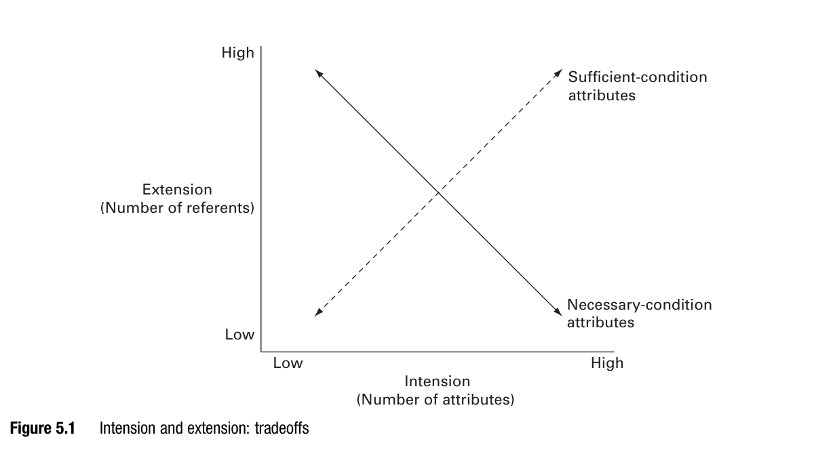
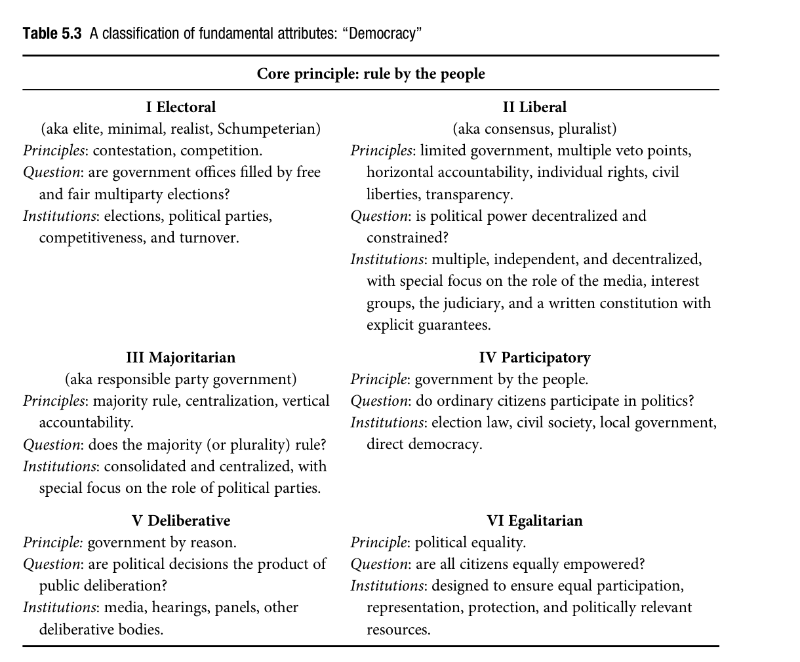
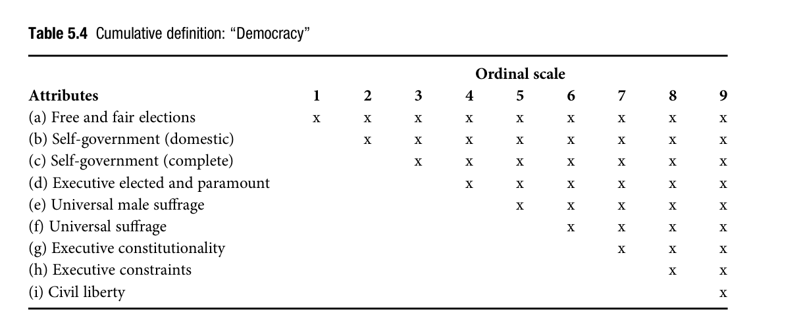
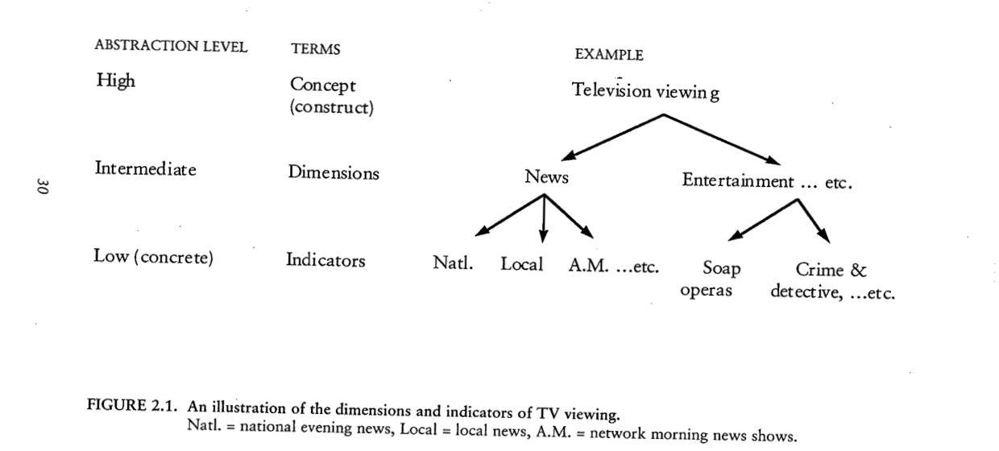

## Two weeks of "tolerance," never defined {.section-title}

We built explanations of a forum where "participants became more tolerant."

We never once asked: **what do we mean by tolerance?**

::: notes
Timing: 3 minutes. Elapsed: 0–3 minutes.

Opening, including the title slide. Put the forum sentence back on the board exactly as Week 2 used it: "Forum participants became more tolerant." Ask the class: over two full seminars, did we ever pin down what tolerance *is*? Take two or three quick answers. Expected responses will gesture at willingness to extend a right, or absence of hostility, or something similar — all plausible, none identical, none stated as an explicit definition at the time.

The point is not that Week 2 made a mistake. Description and explanation can proceed for a while on a shared, fuzzy sense of a term. The point is that this only works until it doesn't: the moment two people mean different things by "tolerance," every claim about it — descriptive or causal — becomes ambiguous in a way neither the descriptive-target machinery nor the covering-law/mechanism machinery from Weeks 1–2 can rescue. Concepts are prior to both.

Tell the class directly what today accomplishes: Weeks 1–2 asked what counts as an explanation once you already have a target and a set of variables. Week 3 asks where the target and the variables come from in the first place — how a fuzzy idea like "tolerance" becomes a usable concept at all. This is not a detour from explanation; it is what has to happen before explanation can start.

Source: Week 2 forum example, revisited. Course framing.
:::

## Bad concepts break description and causation alike

**Descriptive claim:** "Participants became more tolerant." Tolerant of *what*, exactly?

**Causal claim:** "Education increases tolerance." Which of several different things called "tolerance"?

::: key-line
A vague concept doesn't just weaken an explanation — it can make it impossible to state.
:::

::: notes
Timing: 2 minutes. Elapsed: 3–5 minutes.

Land the pivot concretely using both halves of Weeks 1–2. First, the *explanandum* problem: Hirschman's stylized fact and Elster's "fact to be established" both presuppose that we already know what the fact is a fact about. If "tolerance" bundles three different things — willingness to let a disliked group speak, absence of hostile feeling, and public compliance with a norm — then "tolerance rose" isn't one descriptive claim, it's an ambiguous compression of at least three, and we can't even agree on what needs to be explained.

Second, the *causal-variable* problem: Hedström's variable concepts and Gerring's causal-utility criterion (previewed, not yet named) both require a variable clean enough to serve as one side of a causal claim. "Education increases tolerance" is not testable until "tolerance" picks out one specific, measurable thing — otherwise a study confirming the claim under one operationalization and a study refuting it under another are not actually in disagreement; they were never talking about the same variable.

State the thesis for today plainly: a concept is not a free byproduct of having an idea. It has to be built, and it can be built well or badly. Today gives two complementary toolkits for building it well — Gerring's criteria for what makes a concept *good*, and McLeod & Pan's process for how you actually *construct* one — and one live example, Molina et al.'s explication of "fake news," where we watch both toolkits used for real.

Source: Course framing, building on Elster pp. 15–20 and Hedström pp. 11–14 (Week 2).
:::

## A concept is not the same thing as a word

**Sentence:** "A competent journalist writes clearly."

Five words. **Four concepts:** journalist, competence, writing, clarity.

::: key-line
"A," "the," and other function words are linguistic terms, not concepts.
:::

::: notes
Timing: 3 minutes. Elapsed: 5–8 minutes.

Introduce McLeod & Pan's foundational distinction. A *linguistic term* is the smallest unit in a sentence — every word counts. A *concept* is a basic unit of meaning: a single word or a phrase that denotes some real-world referent (a person, a behavior, a quality, a relationship). Not every linguistic term is a concept — articles and prepositions carry no independent referent — and one concept can take more than one word ("television violence viewing" is a single concept expressed in three words).

Walk the class through the example sentence live: ask them to name the concepts, not the words. If someone says "a" is a concept, ask what real-world thing it refers to; there isn't one. This distinction matters immediately for today's whole-class exercises: when we ask "what's the concept here," we are asking about the idea being pointed at, not parsing grammar.

Introduce McLeod & Pan's six types of concepts briefly, previewing that we'll use them in a moment: *singular* (a particular named person, place, or thing — e.g., "the September 9 forum"), *class* (a category of such things — e.g., "forums" in general, "journalists"), *relational* (a connection between concepts — e.g., "positively related to," "causes"), *variable* (an attribute along which things differ — e.g., "tolerance," "competence"), *process* (a way things change — e.g., "priming," "institutionalization"), and *mega-concept* (a compound tangle of several unspecified concepts at once — e.g., "democracy," "development," and, we'll see shortly, "television").

Source: McLeod & Pan, pp. 14–17.
:::

## Gerring's four elements — same idea, different labels

| Element | Gerring's name | Democracy example |
|---|---|---|
| The word itself | **Term** | "democracy" |
| The defining attributes | **Intension** (definition, connotation) | "contested elections" |
| How we'd locate it empirically | **Indicator** (operationalization) | "held a contested election recently" |
| What actually falls under it | **Extension** (referents, denotation) | *the countries that qualify* |

::: key-line
Redefine any one of the four, and the other three move with it.
:::

::: notes
Timing: 3 minutes. Elapsed: 8–11 minutes.

Present this as Gerring's version of exactly the same structure McLeod & Pan just gave us, under different names. Term = the linguistic label (a linguistic term, in McLeod & Pan's sense). Intension = the conceptual definition — the attributes doing the defining work. Indicator = the operational definition — how we'd actually go find it in the world. Extension = the set of real things that end up qualifying once the intension and indicators are fixed.

Make the mutual-adjustment point explicit and concrete: if we tighten the intension of "democracy" by adding "civil liberties" as a second required attribute alongside "contested elections," some countries that used to qualify (extension) now fall out, and we may need new indicators to detect civil liberties specifically. Change any one corner, and the concept moves as a whole — this is why Gerring insists concept formation has to be viewed holistically rather than as fixing definitions in isolation.

Flag, without dwelling, that this four-part structure explains why "operationalization" (Gerring's seventh, deferred criterion; McLeod & Pan's fifth Chaffee step) keeps reappearing all class: it's not a separate later task bolted onto conceptualization, it's one of the four elements that was always part of the concept's structure from the start.

Source: Gerring, pp. 114–115.
:::

## Whole-class: name the type

Using our own Week 2 vocabulary:

1.  "Tolerance" — what type of concept?
2.  "The September 9 forum" — what type?
3.  "Positively related to" — what type?
4.  "Television" — what type? (Hold that thought.)

::: notes
Timing: 2 minutes. Elapsed: 11–13 minutes.

Quick cold-call check, one answer per item, moving fast. Expected: (1) tolerance is a *variable* concept — an attribute along which people differ in degree. (2) The September 9 forum is a *singular* concept — one particular, named event; "forums in general" would instead be a *class* concept. (3) "Positively related to" is a *relational* concept — it connects two other concepts (e.g., education and tolerance) without itself denoting a person, place, or attribute. (4) "Television" is the trap: students will likely say *class* concept (a category of devices or content), and that's defensible, but flag that in a research claim like "television is harmful," it's functioning as an ill-specified *variable* — or worse, several different unspecified variables bundled together. Don't resolve this fully; it's the hook into the next segment.

If time allows, ask for one volunteered example from a student's own project and classify it live. Keep this to one example; the exit prompt returns to personal projects at the end of class.

Source: Whole-class application of McLeod & Pan's typology (pp. 14–17) to Week 2 material.
:::

## Gerring's Figure 5.1: tightening a definition shrinks its reach

::: two-column
::: column
**Necessary-condition attributes:** more intension → less extension.

Democracy = "free and fair elections" *and* "civil liberties"?

Fewer countries qualify than under "free and fair elections" alone.

::: key-line
Adding requirements can only narrow — never widen — who counts, when each requirement is necessary.
:::
:::

::: column
{fig-alt="Gerring's Figure 5.1: a chart plotting intension (number of attributes) against extension (number of referents), with a solid line showing an inverse relationship for necessary-condition attributes and a dashed line showing a direct relationship for sufficient-condition attributes."}
:::
:::

::: project-caption
Gerring, Figure 5.1 (p. 123) — reproduced from the source.
:::

::: notes
Timing: 3 minutes. Elapsed: 13–16 minutes.

Introduce the intension/extension tradeoff using Gerring's own Figure 5.1, shown on screen. When defining attributes are treated as *necessary conditions* (a case must have all of them to qualify), adding attributes to the intension can only shrink or hold constant the extension — never grow it: this is the solid downward-sloping line running from low-intension/high-extension to high-intension/low-extension. Start from "democracy = free and fair elections" and ask the class to predict what happens to the set of countries counted as democracies if we add "civil liberties" as a second necessary condition. Answer: the set can only get smaller (or stay the same); some countries with contested-but-illiberal elections now fall out.

Flag the flip side briefly, without spending much time: if attributes are instead treated as *sufficient* conditions (any one alone is enough to qualify — direct popular rule *or* indirect popular rule *or* deliberative rule, each independently sufficient), then adding attributes can only widen the extension, the opposite direction. Gerring notes this sufficient-condition case is much rarer in practice than the necessary-condition case; most social-science attributes are understood as necessary, necessary-and-sufficient, or as a matter of degree (additive/continuous), all of which behave like the necessary-condition case.

Do not let this become a logic-notation exercise. The payoff is entirely practical: whenever a definition changes and someone reacts "wait, that changes who counts," this tradeoff is exactly why — and it is the mechanism behind a concept-formation failure we are about to name in Gerring's criteria.

Source: Gerring, pp. 121–123, Figure 5.1.
:::

## Whole-class: predict the tradeoff

If "civil liberties" is added as a necessary condition alongside "free and fair elections" —

1.  Does the set of qualifying countries grow, shrink, or stay the same?
2.  Name one country you'd expect to *drop out*.
3.  Is "civil liberties" being treated as necessary, or as a matter of degree?

::: notes
Timing: 2 minutes. Elapsed: 16–18 minutes.

Fast, cold-call, no small groups. Expected answer to (1): shrink (or stay the same at best) — reinforce the mechanism from the previous slide rather than re-deriving it. For (2), accept any real or hypothetical example of a country holding competitive elections but restricting press freedom or assembly; the identity of the country matters less than correctly reasoning about the direction of the effect. For (3), most students will say "matter of degree" once pressed — civil liberties are rarely all-or-nothing in practice, which is exactly the additive/continuous case Gerring says produces the same narrowing direction as strict necessary conditions, just via a shrinking *fit* rather than a sharp in/out cut.

Transition: "We now have the machinery — term, intension, indicator, extension, and how tightening intension moves extension. Gerring uses this machinery to state six criteria for judging whether a concept is any good. We're going to work them out by diagnosis: I'll show you a bad example first, and you tell me what's wrong before I tell you the criterion's name."

Source: Whole-class application of Gerring's Figure 5.1 logic.
:::

## Diagnose: "Television is harmful to the political process."

Sounds like a claim. Is it testable?

1.  What, precisely, is "television"?
2.  What, precisely, is "harmful"?
3.  Harmful to *what* — voters? officials? institutions?

::: notes
Timing: 3 minutes. Elapsed: 18–21 minutes.

Put McLeod & Pan's example sentence on the board and ask the class to diagnose it before you supply the answer. Give thirty seconds, then take two or three responses per question.

"Television" could mean at least five different things, each independently plausible and each pointing to a different research design: time spent watching (displacement of other activities); viewing politicians portrayed negatively (cultivating cynicism); viewing news content that erodes trust in politicians specifically; politicians' own behavior adapting to the camera (image over substance — cite McLeod & Pan's own example of a president staging a photo opportunity before a substantive announcement); or reporters asking "horserace" questions instead of substantive ones. All five are "operationalizable" in isolation — you could imagine measuring any of them — but the sentence doesn't tell us which one the claim is actually about.

"Harmful to the political process" is even worse off: it names no dimension at all. Turnout? Trust in institutions? Knowledge of issues? Quality of deliberation? Each is a legitimate variable concept; the sentence picks none of them.

The diagnosis: "television" and "the political process" are each *mega-concepts* — compound tangles of unspecified variable concepts — masquerading as single, already-operationalizable variables. This is the same disease "tolerance" has in our forum example, just easier to see from the outside.

Source: McLeod & Pan, pp. 19–21.
:::

## Four standards a scientific concept has to meet

| Standard | What it demands |
|---|---|
| **Abstractness** | Applies beyond one person, place, or moment |
| **Clarity of meaning** | Says what it does and doesn't include |
| **Operationalizability** | Can be turned into an observation procedure |
| **Precision** | Others can understand and evaluate it |

::: key-line
"Television" meets abstractness easily and clarity of meaning badly.
:::

::: notes
Timing: 2 minutes. Elapsed: 21–23 minutes.

Quickly name McLeod & Pan's four standards and diagnose "television" against them, closing the loop from the previous slide. It is plenty abstract — it applies across many times, places, and studies. It fails clarity of meaning outright: as the last slide showed, it doesn't tell us which of five different things it means. Operationalizability is oddly not the bottleneck here — all five interpretations are individually measurable — the bottleneck is that we haven't chosen among them. Precision, which McLeod & Pan treat as the broadest standard (can this be communicated to other scientists and to nonscientists alike?), is unreachable until clarity of meaning is fixed first.

Note the built-in tension the reading flags: abstractness and operationalizability pull against each other — the more abstract a concept, the harder it is to operationalize; the more easily operationalized, the more it risks losing abstractness (a single-item, single-context measure). Concept explication is the discipline for holding both at once, which is exactly what the rest of today builds toward.

Source: McLeod & Pan, pp. 18–19.
:::

## Seven everyday ways people define concepts (part 1)

| Approach | Example | Weakness |
|---|---|---|
| By examples | "Mass media? Well, TV, newspapers..." | Imprecise; misses the essence |
| By exclusion | "What are *not* media?" | Same problem, from the other side |
| Comparing subsets | "Opinion leaders vs. everyone else" | Disguises the general variable |
| By procedure | "IQ is a score on this test" | Reifies the measure as the concept |

::: notes
Timing: 3 minutes. Elapsed: 23–26 minutes.

Walk through McLeod & Pan's Table 2.2, first four approaches, quickly — the point is that every one of these is a real, common, everyday move, each individually inadequate. Defining by examples ("media means things like TV, newspapers, magazines") is efficient but imprecise: it never states what the examples have in common. Defining by exclusion works the same trick backward. Comparing and contrasting subsets ("an opinion leader is someone more informed and consulted more than others") is useful for spotting variation but can smuggle in an unstated general variable (informedness) without ever naming it directly. Defining by procedure (IQ = whatever a specific test measures) achieves precision and even looks scientific, but risks the *reification fallacy* we'll name properly with Molina et al. later — treating the measurement procedure as if it settles what the underlying concept is, closing off revision.

Ask the class: "Which of these did we just catch ourselves doing to 'television'?" Likely answer: defining by examples/procedure — treating "television" as self-evidently whatever a Nielsen box measures, without asking which dimension of viewing actually matters for the claim.

Source: McLeod & Pan, Table 2.2 and pp. 21–24.
:::

## Seven everyday ways people define concepts (part 2)

| Approach | Example | Weakness |
|---|---|---|
| By analogy | "A frame is like a window on the world" | Illuminates by similarity, hides differences |
| By function | "Fear appeal = arouses emotional reaction" | Defines a cause by its effect |
| By antecedents | "Dissonance = tension from conflicting beliefs" | Defines an effect by its cause |

::: key-line
Concept explication is the eighth approach — it doesn't discard these seven, it disciplines them.
:::

::: notes
Timing: 2 minutes. Elapsed: 26–28 minutes.

Finish the table. Analogy (a "frame" as a window, or a picture frame) illuminates fast but restricts thinking to whatever the analogy happens to highlight, and is imprecise about what's actually essential — McLeod & Pan point to the framing literature's own "fractured paradigm" problem as a case where analogy-based definitions never converged. Defining by function explains a concept by the effect it produces (a message is "fear-inducing" because it arouses fear) — useful for latent, unobservable constructs, but risks circularity if the only evidence for the cause is the very effect being explained. Defining by antecedents does the mirror-image move, explaining a concept by its presumed cause.

State the punchline plainly: none of these seven is illegitimate — each is a real tool, and Gerring's own "strategies" section later in class reuses some of this same logic. The problem is relying on only one, in isolation, without an integrating discipline. That discipline is McLeod & Pan's eighth approach: *concept explication* — analyzing a concept's meaning, describing its essential qualities, identifying its dimensions when it's complex, and prescribing how it connects to the empirical world. The rest of today is about what that discipline actually looks like, using Gerring's criteria for judging the result and McLeod & Pan's own six-step process for producing it.

Source: McLeod & Pan, Table 2.2 and pp. 24–26.
:::

## Diagnose: "Democracy: a furry, four-legged animal." {.section-title}

What's wrong here — and how is it different from ordinary disagreement about democracy?

::: notes
Timing: 2 minutes. Elapsed: 28–30 minutes.

This is Gerring's own reductio, presented deliberately as an absurd case before the six criteria are named one by one, so the class has a shared benchmark for "obviously bad" against which every subsequent diagnosis can be measured. Ask: is this definition *false*? In one sense no — it's not that "furry, four-legged animal" misdescribes some real feature of democracies; it's that the definition has nothing to do with any established sense of the word at all. Distinguish this from a real scholarly disagreement (e.g., electoral vs. liberal definitions of democracy), where competing definitions still all resonate with *some* recognizable, shared sense of "rule by the people."

Let the class try to name what's broken before revealing the label. Likely answers: "it's not what anyone means by that word," "it's just made up," "it violates common usage." All of these are gesturing at the same thing.

Source: Gerring, p. 117.
:::

## Criterion 1: Resonance

**Bad:** "democracy: a furry, four-legged animal" — pure stipulation, zero shared usage.

**Good:** democracy as *"rule by the people"* — every competing definition still revolves around this core.

::: key-line
Resonance: how faithful is the concept to established usage?
:::

::: notes
Timing: 2 minutes. Elapsed: 30–32 minutes.

Name the criterion: *resonance* — the degree to which a term or definition conforms to established usage rather than clashing with it. A purely stipulative definition, defined "on the authority of the author" alone with no tether to how the term is actually used, has zero resonance; at the limit (nonsense words) it isn't understood at all.

Contrast with the good case: "rule by the people" as democracy's core meaning has strong resonance precisely because virtually every rival scholarly definition — electoral, liberal, majoritarian, participatory, deliberative, egalitarian (we'll see this full taxonomy later) — still orbits this same core idea, even while disagreeing about what "rule by the people" cashes out to institutionally. Resonance doesn't require consensus on every detail; it requires that competing definitions are recognizably arguing about the same thing.

Flag the real methodological version of this failure, not just the cartoon one: jargon terms with no lay resonance ("vouchers," in Gerring's example) may achieve resonance within one specialist community while failing it for a broader audience — resonance is always relative to a specified audience, which is exactly what the next criterion, domain, is about.

Source: Gerring, pp. 116–117.
:::

## Diagnose: is this democracy definition universal?

A textbook defines democracy using only contemporary Western nation-state institutions: political parties, competitive elections, an independent judiciary.

Is this definition *wrong*?

::: notes
Timing: 2 minutes. Elapsed: 32–34 minutes.

Present the case neutrally and let the class debate before naming the criterion. Push back on an initial "yes, it's wrong" reaction: is it wrong, or is it simply *scoped* — built for one domain (contemporary nation-states in the Western tradition) and silently presented as if it covered every domain (ancient Athens' direct assemblies, local community governance, transnational advocacy coalitions, even — Gerring's own example — "democratic" modes of dress and comportment)?

Expected answer once pressed: the definition itself may be perfectly serviceable *within* its intended domain; the problem is failing to say what that domain is. A concept, like an argument, can only be evaluated once its domain of usage is understood — no social-science concept is truly universal, and pretending otherwise is the actual failure, not the narrowness itself.

Source: Gerring, pp. 118–120.
:::

## Criterion 2: Domain

**Bad:** presenting a Western-nation-state definition of democracy as if it travels to every context, with no scope stated.

**Good:** Gerring's own move — explicitly naming the domain (a subfield? a discipline? one language? all languages?) *before* comparing cases.

::: key-line
Domain: how clear is the language community and empirical terrain a concept is meant to cover?
:::

::: notes
Timing: 2 minutes. Elapsed: 34–36 minutes.

Name the criterion: *domain* — both the linguistic domain (which audiences must find this resonant: lay readers? policymakers? one academic subfield?) and the empirical (phenomenal) domain (which contexts the concept is meant to apply to: local communities, nation-states, transnational coalitions, or, per Gerring's own deliberately broad example, modes of dress and comportment).

The good example is Gerring's own practice, not a hypothetical: rather than offering one all-purpose definition of democracy, he explicitly considers four different empirical domains and notes that some attributes (e.g., "contestation") clearly apply to nation-states but barely at all to modes of dress. The many rival definitions of democracy in circulation are not wrong on this view — they are *partial*, each staking out a different domain, and the failure is only in presenting a partial definition as if it were unrestricted.

Practical takeaway for the class's own projects: whenever you define a concept, one sentence stating its intended domain (which population, which context, which audience) resolves most domain disputes before they start.

Source: Gerring, pp. 118–120.
:::

## Diagnose: corporatism, stretched

**Original definition:** peak bargaining among *autonomous* civil-society units.

**Then applied to:** Latin American cases where the state controlled unions directly.

Same word. Different concept?

::: notes
Timing: 2 minutes. Elapsed: 36–38 minutes.

Set up the case and ask the class to connect it back to the intension/extension slide from earlier — this is a deliberate callback, not a new mechanism. The original definition of corporatism requires autonomy from the state as a defining attribute (part of the intension). Applying the same *word* to Latin American cases, where unions and other civil-society actors were manipulated by the state, silently drops that attribute — the intension has shifted, but the term stayed the same, so a reader assumes continuity of meaning that isn't actually there.

Ask: "using the intension/extension logic from earlier, what happened to the extension when the intension quietly narrowed or shifted?" The set of cases the word now covers has changed without anyone saying so — this is what Gerring calls conceptual *stretching* (following Collier and Mahon, Sartori): a term travels to new cases by silently loosening its defining attributes, rather than by an explicit, defensible choice to redefine.

Name the criterion about to be revealed: this is a violation of *consistency* — a concept should carry the same meaning across every context in which it's applied. Consistency is the criterion that domain and intension/extension jointly imply.

Source: Gerring, pp. 120–121.
:::

## Criterion 3: Consistency

**Bad:** silently stretching corporatism's meaning to fit new cases.

**Good:** explicitly *rewriting* the definition — "any formal bargaining among organized sectors, with or without state control" — so the broader scope is a stated choice.

::: key-line
Consistency: does the concept mean the same thing throughout a work?
:::

::: notes
Timing: 2 minutes. Elapsed: 38–40 minutes.

Name the criterion fully: *consistency* — a concept ought to carry the same meaning across the whole range of contexts (the population) to which it is applied; a violation is conceptual "stretching." The fix Gerring proposes is not to avoid ever broadening a concept — sometimes broadening is exactly the right call, e.g., if you genuinely want a concept of corporatism that covers both European and Latin American cases. The fix is to make the broadening an explicit, defended redefinition of the intension (dropping or loosening "autonomous" on purpose, with a stated reason) rather than an unstated slippage that leaves readers assuming the old, narrower meaning still applies.

Reconnect explicitly to the intension/extension tradeoff: broadening a concept's reach by relaxing a necessary condition is precisely the mechanism from Gerring's Figure 5.1, run in reverse — loosen intension, extension grows. Consistency is what's violated when that move happens invisibly.

Source: Gerring, pp. 120–121.
:::

## Diagnose: "the West"

Seven contiguous US states, defined mostly by geography.

What, besides being next to each other, do they share?

::: notes
Timing: 2 minutes. Elapsed: 40–42 minutes.

Present "the West" as a US regional concept and ask the class what unifies it besides contiguity. Push for specifics: climate? History of settlement? Political culture? Economic base? Most answers will struggle — precisely Gerring's point. Compare, only after they've struggled, to "the South," which the class will likely find easier to defend: a genuinely longer, more correlated list of shared historical, political, and cultural attributes (a specific settlement and agricultural history, a distinct regional political culture, clear contrasts with neighboring regions).

Do not yet name the criterion. Let the class sit with the asymmetry: both are geographic labels: only one earns its status as a meaningful social-science category.

Source: Gerring, pp. 124–125.
:::

## Criterion 4: Fecundity

**Bad:** "the West" — a merely contiguous set with little else in common; the boundary feels arbitrary.

**Good:** "the South" — a long list of correlated attributes; the label carries real explanatory punch.

::: key-line
Fecundity: how many attributes do a concept's referents actually share?
:::

::: notes
Timing: 2 minutes. Elapsed: 42–44 minutes.

Name the criterion: *fecundity* (also called coherence, depth, richness — Gerring lists many synonyms because this criterion has been independently discovered under many names). A fecund concept "carves nature at the joints" — it identifies things that really are alike and separates them from things that are really different, rather than imposing an arbitrary label on a loose grab-bag.

The deepest form of fecundity, per Gerring, is an *essentializing* definition — one that identifies a single core principle from which the concept's other attributes can be seen to follow (Dahl's search for the "primitive notion" behind "power"; "rule by the people" as democracy's essence, which is itself an appeal to fecundity, not just resonance). Note for the class: fecundity and resonance are related but distinct — a concept can resonate (match common usage) while still being only weakly fecund (loosely bundled, not very illuminating), and vice versa.

Bridge to the next criterion: Gerring explicitly calls fecundity and differentiation "flip sides of the same coin" — fecundity asks how alike a concept's members are to each other; differentiation asks how different they are from everything outside the concept. You cannot fully assess one without the other.

Source: Gerring, pp. 123–127.
:::

## Diagnose: an alphabet soup of "civic groups"

Civic association. Voluntary association. Civil society organization (CSO). Citizen sector organization. NGO. Interest group. Grassroots organization.

Seven terms. How many genuinely different concepts?

::: notes
Timing: 2 minutes. Elapsed: 44–46 minutes.

List Gerring's own example of a "crowded semantic field" and ask the class to sort it: are these seven terms picking out seven genuinely distinct concepts, or largely re-labeling the same thing? Most will (correctly) suspect heavy overlap. Push further: what's the actual cost of this proliferation, beyond mere redundancy? The cost is that a reader can no longer tell, from the term alone, what distinguishes one from another — each new coinage should in principle sharpen a boundary, but in practice these terms mostly poach attributes from each other without clarifying any of them.

Do not yet name the criterion — let students propose it. Likely candidates: "they're not different enough from each other," "there's no clear boundary between them." Both are gesturing at the right idea.

Source: Gerring, pp. 127–129.
:::

## Criterion 5: Differentiation

**Bad:** seven overlapping civic-group terms with no clear boundaries between them — Gerring's "conceptual anarchy."

**Good:** "contestation" — a single attribute that cleanly separates democracies from autocracies.

::: key-line
Differentiation: what is the contrast-space against which this concept defines itself?
:::

::: notes
Timing: 2 minutes. Elapsed: 46–48 minutes.

Name the criterion: *differentiation* — a concept must be distinguishable from its neighbors, not just internally coherent. "Green" only means something because it's delimited by where "yellow" and "blue" begin (Gerring, citing Pitkin); a new term that "unsettles the semantic field" by poaching attributes from neighbors sows confusion even if it resonates on first reading.

"Contestation" as a defining attribute of democracy earns strong differentiation because it draws a genuinely sharp line against the neighboring concept of autocracy — a polity either does or does not hold meaningfully contested elections, and that single question does real boundary-drawing work. Contrast with the seven civic-group terms, which fail to specify what lies *outside* each of them relative to the others.

Tie explicitly back to fecundity: "apples and oranges" — fecundity asks whether apples cohere as a category; differentiation asks whether apples are cleanly distinguished from oranges. A concept with only one of the two is in trouble either way: coherent-but-undifferentiated collapses into its neighbors, and differentiated-but-incoherent is just an arbitrary boundary around unrelated things.

Source: Gerring, pp. 127–129.
:::

## Diagnose: an "ideal-type" democracy as a treatment

A causal study asks: does the electoral system (proportional vs. majoritarian) shape political conflict?

The researcher defines democracy using *all six* of its dimensions — electoral, liberal, majoritarian, participatory, deliberative, egalitarian — bundled into one rich, ideal-type score.

Can this serve as the study's scope condition?

::: notes
Timing: 2 minutes. Elapsed: 48–50 minutes.

Set up a genuine methodological bind, not a cartoon example this time — this is Gerring's own worked case. The research question needs a concept of democracy only to *bound the sample* (restrict the study to reasonably democratic polities before asking how their electoral systems shape conflict). A maximal, all-dimensions-bundled "ideal-type" definition is exactly the wrong tool for this job: it's a matter of degree, with fuzzy borders by design (no real polity need perfectly fit an ideal type), so it cannot cleanly sort polities into "in scope" versus "out of scope" the way the study needs.

Ask the class: "what goes wrong if we use this thick definition to draw the study's boundary?" Expected answer, with prompting: it becomes unclear which polities are actually being studied, since "how democratic" is continuous rather than binary — the scope condition itself becomes contested and non-replicable.

Do not yet name the criterion; let the diagnosis surface that the problem isn't the *content* of the ideal-type definition (nothing wrong with it in general) but its *fit to this particular causal use*.

Source: Gerring, pp. 129–130.
:::

## Criterion 6: Causal utility

**Bad:** a maximal, ideal-type democracy definition used to bound a causal study's sample — no crisp borders, can't tell who's "in."

**Good:** a minimal definition — free and fair elections — gives a crisp, replicable scope condition for exactly that purpose.

::: key-line
Causal utility: independent variables want parsimony; dependent variables can afford richness.
:::

::: notes
Timing: 2 minutes. Elapsed: 50–52 minutes.

Name the final criterion: *causal utility* — concepts also have to function as components of causal arguments (as scope conditions, independent variables, or dependent variables), and this can pull against fecundity's preference for rich, thick, attribute-bundled concepts. Gerring's own rule of thumb: concepts designed as *independent variables* (or, as here, scope conditions) want to be small and parsimonious — sharply bounded, ideally manipulable in principle, clearly separable from confounders. Concepts designed as *dependent variables* can better afford an ideal-type, multi-attribute definition, because the goal there is to explain a lot about a rich outcome, not to isolate a clean treatment.

This is exactly why the minimal "free and fair elections" is the *good* answer here: it gives crisp in/out borders (recall Gerring's own definition of minimal definitions: necessary conditions sufficient to bound the concept extensionally), which is precisely what a scope condition or independent variable requires — and precisely what the maximal, ideal-type definition cannot supply.

Flag the forward link explicitly: "minimal versus maximal" just did real work here — it's about to become the center of the next segment, where Gerring gives it a full name (Strategies of Conceptualization) and pairs it with a third option, cumulative definition, and where we'll see McLeod & Pan describe the very same choice as deciding how to bundle a concept's *dimensions*.

Source: Gerring, pp. 129–131.
:::

## Five-minute break {.break-slide}

When we return: two frameworks for actually *building* a concept, watched side by side.

::: notes
Timing: 5 minutes. Elapsed: 52–57 minutes.

Take the full five minutes. The clock should read 54 at the start and 59 at the restart. Leave the prompt visible.

At restart, ask one student to state, in one sentence, which of Gerring's six criteria they think is hardest to satisfy in their own current project's key concept. Take one answer, then move directly into the next segment — this both re-anchors the six criteria before they're used again (causal utility especially, which the second half leans on directly) and personalizes the transition to "how do you build one."

Source: Seminar schedule.
:::

## Two answers to "how do you actually build one?" {.section-title}

Gerring: **survey → classify attributes → define** (minimal / maximal / cumulative).

McLeod & Pan: **Chaffee's six steps** of concept explication.

::: key-line
Same underlying logic, developed independently in two different literatures.
:::

::: notes
Timing: 3 minutes. Elapsed: 57–60 minutes.

Reorient after the break. The six criteria just covered tell you whether a finished concept is *good*. This segment covers how you actually *arrive* at one — and two readings converge on strikingly similar answers, which is itself worth pointing out explicitly as evidence that this isn't idiosyncratic to either author.

Preview both lists on the board side by side so the alignment is visible from the start:

Gerring's three-step Strategies of Conceptualization: (1) *survey* plausible concepts and existing usages broadly, resisting "premature closure"; (2) *classify attributes* into a single table, distilling many overlapping definitions into a parsimonious lexical map; (3) *define*, choosing among minimal, maximal, or cumulative strategies.

Chaffee's six-step concept explication (via McLeod & Pan): (1) identify the concept; (2) search the literature; (3) examine empirical properties; (4) develop a tentative conceptual definition; (5) define the concept operationally; (6) gather data.

Tell the class we'll work through both using Gerring's own running example (democracy) for steps 1–3 of his framework, then re-run the *identical* logic on a live, current example — Molina et al.'s explication of "fake news" — for the rest of class.

Source: Gerring, pp. 131–137; McLeod & Pan, pp. 26–28.
:::

## Step 1–3 aligned: survey, classify, and search the literature

| Gerring | McLeod & Pan (Chaffee) |
|---|---|
| **Survey** plausible concepts and usages | **Search the literature** |
| **Classify attributes** into one table | **Examine empirical properties** |
| *(next: define)* | **Identify the concept** *(comes first, but same spirit: what exactly is this?)* |

::: notes
Timing: 3 minutes. Elapsed: 60–63 minutes.

Walk the table left to right, one row at a time, making the equivalence explicit rather than just implied. Gerring's *survey* step (canvass a representative sample of formal definitions and usage patterns before committing to one) is functionally identical to Chaffee's *search the literature* step (review how previous researchers have conceptualized the topic, what purposes each served, what labels have been used). Both are explicitly a caution against jumping straight to a definition.

Gerring's *classify attributes* step (reduce the many overlapping usages into one parsimonious table — his own worked example, Table 5.3, sorts democracy's attributes into six families: electoral, liberal, majoritarian, participatory, deliberative, egalitarian) matches Chaffee's *examine empirical properties* step (what's the range and distribution of how this concept has actually been measured and used).

Note the one place they diverge in sequencing rather than substance: Chaffee puts *identify the concept* — is this even one variable, what's the unit of analysis, what purpose does it serve — as step 1, before the literature search, while Gerring treats "what is this concept, really" as something the survey itself helps answer. Tell the class not to worry about the exact ordering; both authors explicitly say their steps aren't always taken in the listed order. What matters is that all of survey/classify/identify happen *before* committing to a definition — exactly the discipline the "television is harmful" mega-concept lacked.

Source: Gerring, pp. 131–134; McLeod & Pan, p. 26.
:::

## Step 4, the real choice: minimal, maximal, or cumulative

**Minimal** — necessary conditions only: democracy = free & fair elections. Crisp borders.

**Maximal** — every non-idiosyncratic attribute, ideal-type. Rich, but a matter of degree.

**Cumulative** — attributes ranked by centrality into an ordinal scale.

::: key-line
This is the same choice as Gerring's causal-utility criterion, now named directly.
:::

::: notes
Timing: 2 minutes. Elapsed: 63–65 minutes.

This is Gerring's Table 5.2, and it is the direct payoff of the causal-utility slide from before the break — say so explicitly. *Minimal* definitions (necessary conditions, jointly sufficient to bound the concept, aiming for crisp in/out borders) are what we already saw work well as a scope condition or independent variable; the cost is some loss of resonance, since a stripped-down definition sounds thin to anyone attuned to the concept's usual richness.

*Maximal* definitions (Weber's "ideal-type": synthesizing many diffuse, real-world cases into one purest, most fully elaborated analytical construct) bundle in everything non-idiosyncratic; no actual case need fit perfectly, and cases are scored by degree of resemblance. This is exactly the tool that failed as a scope condition earlier, and exactly the tool Gerring says fits a rich dependent variable well.

*Cumulative* definitions try to split the difference: rank the attributes by how essential each is to the concept and use the count of satisfied attributes as an ordinal scale. This buys some of maximal's degree-sensitivity while keeping minimal's crisp, binary attributes; the cost is that you can't presume equal spacing between levels (an ordinal, not interval, scale).

Tell the class we're about to see exactly what a maximal definition and a cumulative definition look like, worked out in full for democracy — the next two slides show Gerring's own Tables 5.3 and 5.4.

Source: Gerring, pp. 134–137, Table 5.2.
:::

## The maximal ingredient list: Table 5.3

{fig-alt="Gerring's Table 5.3: a classification of fundamental attributes of democracy, organized into six families — Electoral, Liberal, Majoritarian, Participatory, Deliberative, and Egalitarian — each with its own principles, guiding question, and institutions, all under the shared core principle of rule by the people."}

::: project-caption
Gerring, Table 5.3 (p. 135) — reproduced from the source.
:::

::: notes
Timing: 3 minutes. Elapsed: 65–68 minutes.

Show Gerring's own lexical classification of democracy's attributes in full — this is literally what "classify attributes" (step 2 of Strategies of Conceptualization) produces before any minimal/maximal/cumulative choice gets made. Six families, each with its own principle, guiding question, and institutional markers: Electoral (contestation — free and fair multiparty elections), Liberal (limited government, civil liberties, horizontal accountability), Majoritarian (majority rule, centralization), Participatory (do ordinary citizens participate?), Deliberative (government by reason), Egalitarian (political equality). All six share one core principle: rule by the people — the resonance anchor from Criterion 1.

Walk through why this table, on its own, "does not take us very far toward a final definition," in Gerring's own words: it's comprehensive but unwieldy — eighteen-plus institutional markers across six families is not something you can cleanly apply to sort real countries into democracies and non-democracies. This is exactly the tension fecundity (rich, comprehensive) creates with causal utility (needs crisp borders) — a maximal, ideal-type definition of democracy is literally what you get if you keep this entire table intact as the definition, scoring each polity by degree of resemblance across all six families rather than picking one attribute as necessary.

Ask the class: "if we were using this as a *dependent* variable — something we're trying to explain the full richness of — is keeping all six families a problem?" Generally no; this is exactly the case (Criterion 6) where a maximal definition is the right tool. Transition: "Now watch what happens when we go the other direction — ranking, not bundling."

Source: Gerring, Table 5.3, p. 135.
:::

## The cumulative ordinal scale: Table 5.4

{fig-alt="Gerring's Table 5.4: a cumulative definition of democracy as a nine-point ordinal scale, where attribute (a) free and fair elections is required at every level, and successive levels 2 through 9 each add one more attribute in descending order of centrality: self-government domestic, self-government complete, executive elected and paramount, universal male suffrage, universal suffrage, executive constitutionality, executive constraints, and civil liberty."}

::: project-caption
Gerring, Table 5.4 (p. 138) — reproduced from the source.
:::

::: notes
Timing: 3 minutes. Elapsed: 68–71 minutes.

Show the cumulative scale in full. Read the logic of the x's directly off the table: level 1 requires only free and fair elections; level 2 requires that plus self-government (domestic); level 3 adds complete self-government; and so on up through level 9, which requires all nine attributes including civil liberty. Every polity that qualifies at level 9 also qualifies at every lower level — that's what makes it cumulative (a Guttman-scale-like structure, Gerring notes, but ranking theoretical attributes rather than empirical indicators).

Make the double payoff explicit. First, notice attribute (a) is exactly the minimal definition from three slides ago — cumulative doesn't discard minimal, it starts from it and builds outward. Second, point out — as Gerring himself flags — that not all of Table 5.3's lexical attributes made it into this cumulative scale (nothing here directly represents "deliberative" or full "egalitarian" empowerment, for instance): ranking attributes by centrality is itself a judgment call, and this table reflects one defensible ranking, not the only possible one.

Ask the class: "what do we gain by using this cumulative scale instead of just the six-family maximal table?" Expected answer: a single ordinal number per country (how many attributes it satisfies) that lets you *order* all polities by degree of democracy — solving what Gerring calls the aggregation problem — while still keeping each individual attribute a crisp yes/no. What we lose: we can't say a level-6 country is "twice as democratic" as a level-3 country — only that it ranks higher, since the levels aren't guaranteed to be equally spaced (ordinal, not interval).

Source: Gerring, Table 5.4, p. 138.
:::

## Whole-class: which strategy fits "tolerance"?

Recall our forum's "tolerance": willingness to extend a political right to a disliked opponent.

1.  What would a **minimal** definition of tolerance look like?
2.  What would a **maximal** (ideal-type) definition add?
3.  Which one should we have used, given what Week 2's forum study actually needed it *for*?

::: notes
Timing: 2 minutes. Elapsed: 71–73 minutes.

Return to the running example one more time and make the class apply the new vocabulary to it directly, cold-call, whole class. A minimal definition might be a single necessary condition: willingness to let a disliked group hold a public meeting (exactly the operationalization Week 2 actually used). A maximal, ideal-type definition would bundle in absence of hostile feeling, public and private consistency, durability over time, and generalization across multiple disliked groups — a much richer construct, but one where few real respondents would perfectly qualify.

For (3), push the class to reason from causal utility: if the forum study's actual claim was a causal one ("attending the forum increases tolerance"), a minimal, sharply bounded definition serves that purpose better, for the same reason free-and-fair-elections served the electoral-systems study better than the ideal-type democracy definition. If the goal were instead a rich, purely descriptive portrait of how attitudes shift, a maximal definition would be more defensible.

Transition: "We've now watched this exact logic — survey, classify, minimal/maximal/cumulative — worked through with Gerring's own example. The next two slides show the identical ladder from McLeod & Pan's side, using dimensions and indicators, before we watch both frameworks used together in a real, current paper."

Source: Whole-class application of Gerring's Strategies of Conceptualization to the Week 2 forum example.
:::

## Levels of abstraction: McLeod & Pan's Figure 2.1

{fig-alt="McLeod and Pan's Figure 2.1: a ladder from high to low abstraction. High abstraction is the concept or construct, television viewing. Intermediate abstraction is its dimensions, news and entertainment. Low, concrete abstraction is indicators: national, local, and morning news; soap operas and crime and detective shows."}

::: project-caption
McLeod & Pan, Figure 2.1 (p. 30) — reproduced from the source.
:::

::: notes
Timing: 5 minutes. Elapsed: 73–78 minutes.

Present McLeod & Pan's Figure 2.1 directly off the screen and read its left-hand column aloud first: **ABSTRACTION LEVEL** — High, Intermediate, Low (concrete) — mapped onto **TERMS** — Concept (construct), Dimensions, Indicators. This is the explicit vocabulary for something we've been doing all class without naming it: every time we've moved from a mega-concept to something measurable, we've been moving *down* a level of abstraction, and every time we've bundled specifics back into one label, we've moved *up* one.

Walk the example rightward at each level. High abstraction: "television viewing" as a single concept/construct — abstract enough to apply across many people, times, and studies, per the abstractness standard from earlier, but, as we already diagnosed, too abstract to relate cleanly to most effect variables on its own. Intermediate abstraction: the two dimensions, news viewing and entertainment viewing — still abstract (each is its own variable concept, not yet a specific observation), but narrower and theory-specified. Low, concrete abstraction: the indicators — specific, individually measurable items (national evening news, local news, morning news; soap operas, crime and detective shows).

Make the general point explicit, not just about television: *any* concept can be placed somewhere on this same High/Intermediate/Low ladder, and explication is largely the discipline of being honest about which level you're currently operating at. "Fake news" (coming up shortly) is a High-abstraction mega-concept exactly like "television viewing"; its eight categories are Intermediate-level dimensions; its Table 1 indicators (fact-checked, last-name citations, editorial process) are Low-level, concrete, and directly codable — we will explicitly walk back up and down this same three-level ladder when we get there.

Walk through why dimensionalizing (moving down one level, from High to Intermediate) matters theoretically, not just practically: McLeod & Pan report that news viewing and entertainment viewing turn out to relate to political-knowledge and crime-fear outcomes in *opposite* directions — a finding invisible if "television viewing" were left undifferentiated at the High level. Specifying dimensions can reveal that a single mega-concept was actually hiding two variables with opposite effects, exactly the failure mode diagnosed in "television is harmful" at the start of class.

Note the vocabulary McLeod & Pan use for concepts built this way: *constructs* — concepts intentionally built with specially defined meanings (via explicit dimensions) rather than borrowed from everyday usage. Concept and construct are treated as equivalent for our purposes.

Source: McLeod & Pan, pp. 29–31, Figure 2.1.
:::

## The synthesis: it's the same choice, three vocabularies

| Choosing... | Gerring calls it | McLeod & Pan call it |
|---|---|---|
| One essential attribute/dimension | **Minimal** definition | Picking a single dimension |
| Every attribute/dimension, bundled | **Maximal** (ideal-type) definition | Treating the whole construct as one bundle |
| Attributes/dimensions ranked by centrality | **Cumulative** definition | An ordered set of dimensions |

::: key-line
Two literatures, independently, converged on the same three-way choice.
:::

::: notes
Timing: 3 minutes. Elapsed: 78–81 minutes.

This is the deck's central synthesis moment — slow down and make sure it lands before moving to Molina et al. Both readings are answering the identical question — how many of a concept's attributes/dimensions do you carry into your working definition, and how? — using different vocabulary built for different purposes (Gerring writing about abstract concept theory across the social sciences broadly; McLeod & Pan writing a practical methods primer for communication research specifically).

Make the equivalence concrete with "television viewing" itself: treating it as *one* dimension (say, only "news viewing") is the minimal move — sharp, parsimonious, good for an independent variable in a causal claim about political knowledge. Treating it as *all* dimensions bundled together (an undifferentiated "TV viewing" score) is the maximal/ideal-type move — matches everyday usage but risks masking opposite-direction effects, exactly as the previous slide showed. Ranking and combining dimensions in a deliberate order (e.g., a cumulative "civic-relevant viewing" index weighting news most heavily) is the cumulative move.

Tell the class plainly: this is not a coincidence to memorize as trivia. It means that whichever vocabulary a given paper in your own field happens to use, you now have a general-purpose question to ask: is this concept being defined minimally, maximally, or cumulatively — and does that choice fit what the concept is being asked to *do*? We're about to watch a real, recent paper make exactly this choice, live.

Source: Synthesis connecting Gerring pp. 134–137 and McLeod & Pan pp. 29–31.
:::

## "Fake news" is a mega-concept, and it's costing us {.section-title}

Weaponized across the political spectrum. Applied to satire, propaganda, honest mistakes, and outright fabrication alike.

Is "fake news" simply "false information"?

::: notes
Timing: 3 minutes. Elapsed: 81–84 minutes.

Introduce Molina, Sundar, Le & Lee (2019) by first re-diagnosing "fake news" exactly the way we diagnosed "television is harmful" at the start of class — the parallel should feel deliberate and obvious to the class by now. "Fake news" has ballooned, in real political discourse, well beyond any single stable meaning: it gets applied to deliberately fabricated stories, to satire the audience is expected to recognize as such, to honest reporting errors, to strongly one-sided-but-true partisan framing, and, increasingly, as a rhetorical weapon partisans use to dismiss any claim from an opposing side regardless of its truth value.

Ask the class directly: "if a news outlet were trying to build an automated fake-news detector, why would it be a mistake to simply operationalize 'fake news' as 'false information'?" Let a few answers surface before the next slide supplies the paper's own reasoning: false information alone doesn't distinguish a deliberate fabrication from an honest correction, doesn't distinguish propaganda from satire, and gives a machine-learning classifier no way to separate categories that call for very different responses (labeling, fact-checking, no action at all).

Source: Molina et al. (2019), pp. 180–182.
:::

## A serious prior attempt: two dimensions

**Tandoc, Lim & Ling (2018):** classify content by **facticity** (how true is it?) and **intent to deceive** (is deception the goal?).

Propaganda: high facticity risk, high deceptive intent. Fabrication: low facticity, high intent. Satire: high facticity, low intent.

Why isn't this enough?

::: notes
Timing: 3 minutes. Elapsed: 84–87 minutes.

Present Tandoc et al.'s prior typology respectfully, as real, useful scholarship — not a straw man. Placing content on two dimensions, facticity and intent to deceive, is itself a legitimate application of the "classify attributes" step: it takes a mega-concept and identifies at least two real, distinct dimensions bundled inside it, exactly the McLeod & Pan move from two slides ago.

Then present Molina et al.'s own stated objection, which is a genuine methodological point, not a dismissal: facticity is useful for fact-checking established claims, but breaks down for breaking news about emergent events where no independent verification yet exists to check against. Intent to deceive might in principle be inferred from a source's track record, but is very difficult to establish in any single case in a way precise enough to feed a machine-learning algorithm — "intent" is exactly the kind of latent, hard-to-observe construct McLeod & Pan warned resists direct operationalization.

Land the point: Molina et al. are not saying Tandoc et al. were wrong to dimensionalize "fake news" — they're saying two dimensions, while real, were not *specific* enough for their particular purpose (automated detection), which needed a full explication all the way down to concrete, machine-readable indicators. This is the same "does the definition fit its intended use" logic as causal utility, applied to a measurement rather than a causal-inference purpose.

Source: Molina et al. (2019), pp. 182–183, citing Tandoc, Lim, and Ling (2018).
:::

## Chaffee's step 1, enacted: is "fake news" even one variable?

Molina et al.'s answer: **no.** It's at least eight distinct categories, not one true/false binary.

Real news · False news · Polarized content · Satire · Misreporting · Commentary · Persuasive information · Citizen journalism

::: notes
Timing: 3 minutes. Elapsed: 87–90 minutes.

Show the paper's own resolution to "identify the concept" (Chaffee's step 1): rather than trying to force "fake news" into one binary variable (true/false) or even Tandoc et al.'s two continuous dimensions, Molina et al. conclude the concept genuinely decomposes into eight qualitatively distinct categories, organized as a taxonomy rather than a single scale.

Connect this explicitly to earlier material in two directions. First, to McLeod & Pan's dimensions/indicators ladder: this taxonomy is what happens when "dimensionalizing" a mega-concept produces categories rather than continuous dimensions — a legitimate variant of the same underlying move. Second, to Gerring's minimal/maximal/cumulative choice: ask the class to predict, before the next slides confirm it, whether the paper's definition of any *one* category (say, real news) is likely to be minimal, maximal, or cumulative, given that the whole point is a sharp, machine-usable classifier. (Answer, confirmed on the next slides: minimal — necessary-condition attributes, crisp borders, exactly the causal-utility logic, now applied to a classification rather than a causal-inference task.)

State the paper's own stakes plainly: getting this categorization right isn't academic hairsplitting — the paper argues that bluntly labeling any partisan-but-true content "false" in a blanket way can itself backfire, breeding reactance among readers whose politically congenial content gets over-flagged.

Source: Molina et al. (2019), pp. 183, 186–187.
:::

## Chaffee's step 2, enacted: searching the literature

Southwell, Thorson & Sheble (2017): misinformation needs a **grounding of truth**.

Lazer et al. (2018): process and **intent** matter, not just content.

Jack (2017): disentangles propaganda, disinformation, and neighboring concepts.

::: notes
Timing: 2 minutes. Elapsed: 90–92 minutes.

Briefly show that Molina et al. do exactly what Gerring's "survey" step and Chaffee's "search the literature" step both prescribe: canvass existing conceptualizations before committing to a definition, rather than starting from scratch or from intuition alone. Southwell et al. establish that any definition of misinformation requires some grounded, agreed sense of what counts as true (echoing our own earlier point that "real news" must be defined before "fake news" can be defined by contrast). Lazer et al. insist that *process* and *intent* — not just the surface truth-value of the content — are what distinguish genuine fabrication from other categories. Jack works out the conceptual boundaries separating propaganda, disinformation, and related neighboring terms — precisely a differentiation exercise, in Gerring's sense, applied to this same semantic field.

Keep this brief; the point is only to show the survey/search-the-literature step actually happening in a real paper's introduction, not to teach each cited work in depth.

Source: Molina et al. (2019), pp. 181–183.
:::

## Chaffee's step 4, enacted: a minimal definition of real news

**Conceptual definition:** news produced through professional journalistic process — verification, independence, editorial review.

Not: "whatever is true." Not: "whatever a fact-checker rates positively."

::: key-line
This is a minimal, necessary-condition definition — the same move as "free and fair elections."
:::

::: notes
Timing: 3 minutes. Elapsed: 92–95 minutes.

Show the paper's actual "tentative conceptual definition" (Chaffee's step 4) for the anchor category, real news, and make the minimal-definition parallel to Gerring's democracy example explicit and named, not just implied. Molina et al. deliberately ground "real" not in some free-floating notion of Truth, but in *journalistic process*: verification, independence, and editorial norms and practices for ensuring accuracy. Their own justification, quoting Lazer et al.: false news typically imitates real news's *form* but lacks its editorial process and intent — so process, not surface content, is the necessary condition that does the real differentiating work.

Ask the class explicitly: "is this a minimal, maximal, or cumulative definition, in Gerring's terms?" It's minimal — a small number of necessary-condition attributes (verification, independence, editorial review) chosen specifically to produce a crisp, replicable in/out judgment, exactly because the paper's purpose (feeding a machine-learning classifier) has the same causal-utility-style requirement as a study needing a clean scope condition: sharp borders matter more here than rich descriptive nuance.

Note the honest complication the paper itself raises: some scholars object that "truth" is always a matter of subjective, community-level sensemaking rather than an objective journalistic fact — Molina et al. explicitly acknowledge this critique and choose to proceed with a process-based grounding anyway, for practical, machine-learning reasons. Flag this as a genuine, defensible methodological choice, not something the paper glosses over.

Source: Molina et al. (2019), pp. 186–187.
:::

## Real news, made concrete: four domains of indicators

| Domain | Example indicators |
|---|---|
| **Message/linguistic** | Fact-checked; impartial; uses last names to cite sources |
| **Source/intentions** | Independent of the topic being covered |
| **Structural** | Edited and proofread; journalistic style |
| **Network** | *(distinguishes categories by how content spreads)* |

::: notes
Timing: 2 minutes. Elapsed: 95–97 minutes.

Present Molina et al.'s Table 1 indicators for real news as the paper's own version of the dimensions → indicators step (McLeod & Pan) and the intension → indicator step (Gerring) happening simultaneously. The conceptual definition from the last slide (journalistic process) gets cashed out into four concrete, largely machine-detectable indicator domains: *message and linguistic* features (is it fact-checked and impartial? does it cite sources by last name, a specific, checkable stylistic marker of professional reporting, versus first-name-only informal reference?); *source and intentions* (editorial independence from the subject being covered); *structural* features (edited and proofread; recognizable journalistic style and formatting); and *network* features (how the content actually spreads, which becomes more important for distinguishing later categories than for real news itself).

Make the pedagogical point explicit: this is exactly what an "indicator," in Gerring's sense, or a set of "indicators" for a "dimension," in McLeod & Pan's sense, looks like when done well for a genuinely applied, current research problem — concrete, checkable, and each one traceable back to the conceptual definition (process/verification/independence) that justifies it, rather than indicators invented in isolation from any stated concept.

Source: Molina et al. (2019), pp. 187–189, Table 1.
:::

## False news, defined by contrast

**Conceptual definition:** imitates real news's *form*, but lacks its editorial process and *intent* to inform accurately.

| Domain | False-news indicators (contrast with real news) |
|---|---|
| Message/linguistic | Unverified claims; no correction record |
| Source/intentions | Deliberate intent to deceive |
| Structural | Mimics journalistic style without its process |

::: notes
Timing: 3 minutes. Elapsed: 97–100 minutes.

Show false news's conceptual definition as constructed directly against real news's — this is Gerring's *differentiation* criterion doing exactly the work he describes: a concept only makes sense once it's clearly bounded against its neighbor. False news isn't defined as "the opposite of true"; it's defined as content that imitates real news's *form* (so it can pass as legitimate) while lacking the process (verification, independence, correction) and carrying deliberate deceptive intent that Lazer et al. identified as the actual distinguishing feature.

Walk through why "intent to deceive" reappears here despite Molina et al.'s own critique of Tandoc et al. for relying on hard-to-observe intent: the resolution is that intent is now paired with *concrete, checkable process indicators* (does a correction/retraction mechanism exist? is the source's identity verifiable? does the outlet have any editorial accountability structure?) rather than asked to do all the classifying work alone as a bare psychological construct — a genuine explication move, tightening a vague dimension by pairing it with an observable proxy.

Explicitly re-run the McLeod & Pan ladder on this: "fake news" (mega-concept) → false news (one category/dimension among eight) → fact-checking-absence/no-correction-record/deceptive-intent (indicators). The same three-level structure, now populated with a live, current example instead of "television viewing."

Source: Molina et al. (2019), pp. 189–191.
:::

## Contrast case 1: why isn't satire "false news"?

Both are, in some sense, "not real." What's the difference?

::: notes
Timing: 3 minutes. Elapsed: 100–103 minutes.

Pose this as a genuine differentiation puzzle before supplying the paper's answer — ask the class to propose the distinguishing attribute themselves first. The instinctive answer ("satire isn't literally true either") is correct but insufficient; false news also isn't literally true, so facticity alone (Tandoc et al.'s first dimension) can't separate them, which is exactly why Molina et al. argued two dimensions weren't enough.

The paper's actual answer: intent and audience uptake. Satire's creators do not intend for the audience to believe the content is factually accurate, and — crucially — the audience is expected to recognize the non-literal frame (a stated genre convention, exaggeration, absurdist framing, an established satirical outlet's reputation). False news's creators specifically intend deception, and its form is deliberately built to be mistaken for straight reporting. Ask the class: what happens to this distinction when a piece of satire is stripped of its context and shared without attribution — does it become false news, or does it remain satire misinterpreted? (There's no single clean answer; use this to show real taxonomic boundaries are sometimes genuinely contested, not a flaw in the paper.)

Name this explicitly as Gerring's differentiation criterion doing real, load-bearing work in a live methods paper — not just a classroom exercise. The taxonomy needed a category boundary here precisely because "false" alone couldn't do it.

Source: Molina et al. (2019), pp. 191–193 (satire category).
:::

## Contrast case 2: why isn't polarized content "false news"?

Selective, one-sided, emotionally charged — but not necessarily fabricated.

::: notes
Timing: 3 minutes. Elapsed: 103–106 minutes.

Present the second contrast case the same way — ask first, confirm second. Polarized or hyperpartisan content can be entirely factually accurate at the level of individual claims while still being highly one-sided: selective in which true facts it reports, framed to support one side, often emotionally charged in tone. None of that requires fabrication.

The paper's distinguishing move: polarized content is differentiated from false news primarily on facticity and structural/framing grounds rather than on intent to deceive in the fabrication sense — the content may not deceive about specific facts at all, even while it misleads by omission or selective emphasis. This is a genuinely different failure mode from false news's core problem (fabricated or unverified claims presented as verified) and from satire's core problem (non-literal content presented, and understood, as non-literal).

Tie back to the paper's own stated motivation for building an 8-category taxonomy rather than a binary real/false classifier: bluntly labeling polarized-but-true content as "false" risks provoking reactance in readers whose politically congenial content gets flagged, undermining the credibility of the whole detection system. A nuanced category for polarized content lets a system flag *something* (selective framing) without falsely claiming the underlying facts are fabricated.

Source: Molina et al. (2019), pp. 193–195 (polarized content category); p. 187 on reactance.
:::

## Whole-class: classify a headline

*A headline reports a real government policy accurately, using only quotes from officials who support it, omitting all critics.*

Which category? Which indicators justify the call?

::: notes
Timing: 2 minutes. Elapsed: 106–108 minutes.

Live-apply prompt, whole class, no small groups — take two or three proposed classifications before converging. Push students to justify their answer using specific indicators from the last several slides, not just a gut label. Expected reasoning: this is not false news (no fabricated or unverified claims — message/linguistic indicators like fact-checking would likely pass), and it's not satire (no non-literal framing, no audience expectation of a joke). It is a strong candidate for polarized content: factually accurate at the claim level, but structurally one-sided in sourcing and omission.

If a student proposes "real news," use it productively: ask whether real news's own conceptual definition (editorial independence, verification, and — implicitly — some standard of balance/fairness in sourcing) is actually satisfied here, or only partially. This is a genuinely defensible point of disagreement in the literature, and the goal is to show the class that applying even a well-explicated taxonomy to a live case still requires judgment — explication narrows disagreement, it doesn't eliminate it.

Source: Whole-class application of Molina et al.'s taxonomy (2019).
:::

## Concepts come before explanation, not after {.section-title}

A stylized fact needs a defined concept. A causal claim needs a defined variable.

Today's toolkits are what make Weeks 1–2 possible, not a detour from them.

::: notes
Timing: 3 minutes. Elapsed: 108–111 minutes.

Close the loop back to the opening slide and to Weeks 1–2 explicitly. Hirschman's stylized fact and Elster's "fact to be established" both presuppose an already-explicated concept — you cannot decide whether "tolerance rose" deserves to be treated as an important empirical regularity worth explaining until you've decided what tolerance *is*. Hedström's variable concepts and Gerring's causal-utility criterion both presuppose the same thing on the causal side — a variable has to be built (minimal, ideally, for this purpose) before it can appear in a covering-law argument, a statistical decomposition, or a mechanism.

Make the point precise, not just gestural: today didn't add a new explanatory strategy alongside laws, statistics, and mechanisms from Week 2. It supplied the raw material — the explananda and the variables — that any of those three strategies needs before they can even be applied. A perfectly executed statistical decomposition of a badly explicated concept is not a minor flaw; it's an answer to a question that was never clearly asked.

Source: Course synthesis, connecting today to Elster pp. 15–20 and Hedström pp. 11–14, 20–23 (Week 2).
:::

## What's still missing: operationalization

Gerring's 7th criterion (deferred all class). McLeod & Pan's 5th Chaffee step (deferred all class).

**Week 4:** measurement (Toshkov; Dilliplane) — this is where we go next.

::: notes
Timing: 5 minutes. Elapsed: 111–116 minutes.

Make the forward link an honest, structural one, not an invented transition. Both readings today explicitly bracketed one piece: Gerring names operationalization as his seventh criterion but defers full treatment to his next chapter; McLeod & Pan name "define the concept operationally" as Chaffee's fifth step but treat it comparatively briefly, promising a fuller "empirical analysis" discussion of measurement quality later in their own chapter. Today built the conceptual definition side of the term/intension/indicator/extension structure in depth; the indicator side — how you actually build a good measurement instrument, and how you'd know if it's any good — is next week's material (Toshkov; Dilliplane), already sitting in the course's Week 4 readings.

Preview one thread that will recur: Molina et al.'s entire taxonomy exists specifically because the researchers needed indicators precise enough for a machine-learning classifier — their concept explication was already reaching toward next week's measurement questions by necessity. That's not a coincidence; McLeod & Pan's own point is that meaning analysis (today) and empirical analysis (next week) are two halves of one continuous process, not two separate topics.

Source: Gerring, p. 116 (operationalization deferred to ch. 7); McLeod & Pan, pp. 26–27 (data-gathering/empirical-analysis deferred); Week 4 readings (Toshkov; Dilliplane).
:::

## Exit prompt

Name one concept central to your own project.

1.  What type of concept is it (variable? class? process?), and what type of definition would serve it — minimal, maximal, or cumulative?
2.  Which of Gerring's six criteria is its single biggest current risk?

::: notes
Timing: 4 minutes. Elapsed: 116–120 minutes.

Whole-class, not paired — take three or four volunteered answers, moving briskly given the time remaining. For each answer, push for one follow-up: if a student proposes their concept is best served by a minimal definition, ask what attribute they'd treat as necessary; if they name a criterion at risk (most commonly differentiation, when a project's central concept sits in a crowded field, or causal utility, when a rich descriptive concept is being asked to also serve as a causal variable), ask them to name the specific neighboring concept or specific causal claim creating that risk.

Close by stating the throughline of the whole session one final time: a concept is not something you have; it's something you build, against explicit criteria, through a describable process — and every claim you make next, descriptive or causal, inherits whatever quality that concept was built with.

If discussion is still going when time runs out, that's an acceptable place to end the session rather than cut it off mid-sentence; there is no further material after this slide.

Source: Course close, connecting Gerring's six criteria and McLeod & Pan's explication process to students' own ongoing projects.
:::
