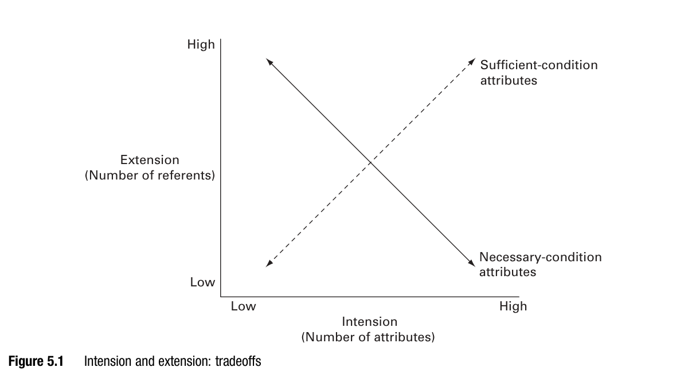
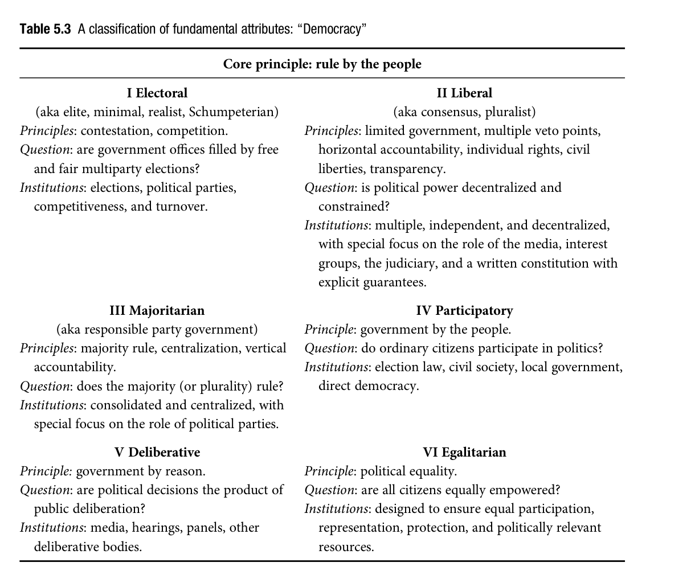
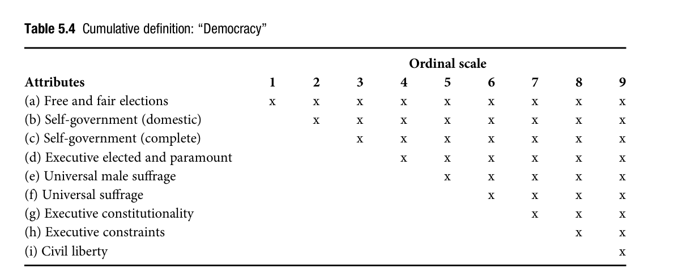

## Two weeks of "tolerance," never defined {.section-title}

We built explanations of a forum where "participants became more tolerant."

We never once asked: **what do we mean by tolerance?**

**Running exercise: What is social media?** Give a one-sentence definition. Name one clear example and one borderline case.

::: notes
Opening, including the title slide. Put the forum sentence back on the board exactly as Week 2 used it: "Forum participants became more tolerant." Ask the class: over two full seminars, did we ever pin down what tolerance *is*? Take two or three quick answers. Expected responses will gesture at willingness to extend a right, or absence of hostility, or something similar — all plausible, none identical, none stated as an explicit definition at the time.

The point is not that Week 2 made a mistake. Description and explanation can proceed for a while on a shared, fuzzy sense of a term. The point is that this only works until it doesn't: the moment two people mean different things by "tolerance," every claim about it — descriptive or causal — becomes ambiguous in a way neither the descriptive-target machinery nor the covering-law/mechanism machinery from Weeks 1–2 can rescue. Concepts are prior to both.

Tell the class directly what today accomplishes: Weeks 1–2 asked what counts as an explanation once you already have a target and a set of variables. Week 3 asks where the target and the variables come from in the first place — how a fuzzy idea like "tolerance" becomes a usable concept at all. This is not a detour from explanation; it is what has to happen before explanation can start.

Social media application (instructor exercise): Begin with an individual provisional definition, then collect two contrasting definitions aloud. Keep a shared board record of the working definition, defining attributes, included cases, excluded cases, and unresolved cases. Students revise the same definition throughout the seminar. This is a classroom application of the readings, not a definition supplied by any of the authors. Use these revisits in place of optional extra examples.

Source: Week 2 forum example, revisited. Course framing.
:::

## Bad concepts break description and causation alike

**Descriptive claim:** "Participants became more tolerant." Tolerant of *what*, exactly?

**Causal claim:** "Education increases tolerance." Which of several different things called "tolerance"?

::: key-line
A vague concept doesn't just weaken an explanation — it can make it impossible to state.
:::

::: project-caption
This isn't hypothetical: it's the actual state of "affective polarization" research. See Druckman & Levendusky (2019), *Public Opinion Quarterly*.
:::

::: notes
Land the pivot concretely using both halves of Weeks 1–2. First, the *explanandum* problem: Hirschman's stylized fact and Elster's "fact to be established" both presuppose that we already know what the fact is a fact about. If "tolerance" bundles three different things — willingness to let a disliked group speak, absence of hostile feeling, and public compliance with a norm — then "tolerance rose" isn't one descriptive claim, it's an ambiguous compression of at least three, and we can't even agree on what needs to be explained.

Second, the *causal-variable* problem: Hedström's variable concepts and Gerring's causal-utility criterion (previewed, not yet named) both require a variable clean enough to serve as one side of a causal claim. "Education increases tolerance" is not testable until "tolerance" picks out one specific, measurable thing — otherwise a study confirming the claim under one operationalization and a study refuting it under another are not actually in disagreement; they were never talking about the same variable.

Make the point land as a live, real methodological problem, not just a classroom hypothetical: Druckman and Levendusky (2019), "What Do We Measure When We Measure Affective Polarization?" (*Public Opinion Quarterly* 83(1): 114–122), is a direct, published version of exactly this diagnosis, in a field this course covers. The field's standard measure of "affective polarization" is the feeling-thermometer difference: how much colder people rate the opposing party than their own. Druckman and Levendusky show this single number bundles together several conceptually distinct things that can move independently — dislike of ordinary out-party *people* versus dislike of party *elites*; polarization driven by policy disagreement versus polarization that persists even holding policy views constant; and a general negativity/social-desirability bias that inflates in-group warmth ratings for reasons unrelated to the out-party at all. Two studies can both report "affective polarization increased" using the identical thermometer-difference measure while capturing substantively different underlying phenomena — the same mega-concept problem as "tolerance," now in a published, widely cited literature rather than a classroom example.

Ask the class to connect this explicitly to the causal-variable problem just stated: if a researcher claims "exposure to X increases affective polarization," which of Druckman and Levendusky's several bundled components is actually the dependent variable? A finding that X increases elite-directed animus and a finding that X leaves people-directed animus unchanged are not in tension — they may both be true — but a single thermometer-difference number cannot tell them apart, and two papers using "the same" measure may not be talking about the same variable at all. This is precisely why explication is not academic housekeeping: an entire literature can accumulate contradictory-looking findings that are actually just measuring different things under one label.

State the thesis for today plainly: a concept is not a free byproduct of having an idea. It has to be built, and it can be built well or badly. Today gives two complementary toolkits for building it well — Gerring's criteria for what makes a concept *good*, and McLeod & Pan's process for how you actually *construct* one — and one live example, Molina et al.'s explication of "fake news," where we watch both toolkits used for real.

Source: Course framing, building on Elster pp. 15–20 and Hedström pp. 11–14 (Week 2). Druckman, James N., and Matthew S. Levendusky. 2019. "What Do We Measure When We Measure Affective Polarization?" *Public Opinion Quarterly* 83(1): 114–122.
:::

## A concept is not the same thing as a word

**Sentence:** "A competent journalist writes clearly."

Five words. **Four concepts:** journalist, competence, writing, clarity.

::: key-line
"A," "the," and other function words are linguistic terms, not concepts.
:::

::: notes
Introduce McLeod & Pan's foundational distinction. A *linguistic term* is the smallest unit in a sentence — every word counts. A *concept* is a basic unit of meaning: a single word or a phrase that denotes some real-world referent (a person, a behavior, a quality, a relationship). Not every linguistic term is a concept — articles and prepositions carry no independent referent — and one concept can take more than one word ("exposure to political posts" is a single concept expressed in four words).

Walk the class through the example sentence live: ask them to name the concepts, not the words. If someone says "a" is a concept, ask what real-world thing it refers to; there isn't one. This distinction matters immediately for today's whole-class exercises: when we ask "what's the concept here," we are asking about the idea being pointed at, not parsing grammar.

Source: McLeod & Pan, pp. 14–17.
:::

## McLeod & Pan's six types of concepts

| Type | Meaning | Examples |
|------------------------|------------------------|------------------------|
| **Singular** | A particular named person, place, or thing | “The September 9 forum” |
| **Class** | Objects grouped by shared attributes | Forums, journalists |
| **Relational** | A connection between concepts | “Positively related to,” “causes” |
| **Variable** | An attribute that varies among objects in a class | Tolerance, competence |
| **Process** | A way things change | Priming, institutionalization |
| **Mega-concept** | Several concepts, often unspecified, bundled together | Democracy, development, social media |

Process concepts are a special subcategory of mega-concepts (p. 17).

::: notes
Introduce McLeod & Pan's six types of concepts briefly, previewing that we'll use them in a moment: *singular* (a particular named person, place, or thing — e.g., "the September 9 forum"), *class* (a category of such things — e.g., "forums" in general, "journalists"), *relational* (a connection between concepts — e.g., "positively related to," "causes"), *variable* (an attribute along which things differ — e.g., "tolerance," "competence"), *process* (a way things change — e.g., "priming," "institutionalization"), and *mega-concept* (a compound tangle of several unspecified concepts at once — e.g., "democracy," "development," and, we'll see shortly, "social media").

Clarify that these types overlap: the authors explicitly treat process concepts as a special subcategory of mega-concepts because of their compounded nature (p. 17). The forum and tolerance examples are course applications. “Social media” functions as a mega-concept in the underspecified claim “Social media is harmful to the political process,” rather than having that status in every use. This is a classroom adaptation of the authors’ diagnosis on pp. 19–20, not their original example.

Why is a relationship a concept? A concept is a unit of meaning, and a relationship has meaning just as an object or attribute does. In “Education increases tolerance,” education and tolerance are variable concepts, while “increases” expresses a relational concept: a causal connection between them. Replace “increases” with “is associated with,” and the claim changes substantially. Education and tolerance now vary together, but we are no longer claiming that education causes tolerance to rise.

McLeod & Pan count relationships as concepts because “greater than,” “part of,” “associated with,” and “causes” specify different meaningful connections. Relational concepts allow us to combine other concepts into hypotheses and theoretical propositions. A relational concept can span several words; we are identifying a unit of meaning rather than counting grammatical words. The education/tolerance sentence is an instructor illustration of their discussion on p. 16.

Walk through the meeting example as an illustration of institutionalization: an informal practice becomes expected, routinized, and formalized. The meeting example is an instructor illustration of McLeod & Pan's definition, not an example from their text.

Emphasize that a variable describes an attribute along which units differ, whereas a process concept describes a particular way change occurs. Variables can also measure change over time. The distinction is between an attribute and a process, not between a static world and a changing one.

For priming, explain that encountering an idea can activate related ideas in memory. McLeod & Pan discuss faster responses to semantically related stimuli as an observable outcome predicted by the process. A process concept helps state how something happens, but naming the process alone does not demonstrate it.

Return briefly to the six-types slide: process concepts are a special subcategory of mega-concepts because they combine multiple elements and relationships. To study a process, unpack those elements and specify the observable outcomes that the proposed process predicts.

Source: McLeod & Pan, p. 17 (process concepts, institutionalization, priming, and their relationship to mega-concepts). Meeting example and variable/process comparison are instructor illustrations. Source: McLeod & Pan, pp. 16–17 (six types), 19–20 (logic adapted to the social media example).
:::

## Gerring's four elements: defining social media

| Element | Meaning | Your social media definition |
|------------------------|------------------------|------------------------|
| **Term** | The linguistic label | “Social media” |
| **Intension** | The defining attributes | Which features must something have to qualify? |
| **Indicator** | What we observe to identify those attributes | What evidence would show each feature is present? |
| **Extension** | The set of cases meeting the definition | Which platforms qualify? Which do not? |

For this exercise, classify **platforms**, rather than individual users or posts.

::: notes
Start with the definitions students wrote at the opening. Ask one student for a defining attribute and another for a case that satisfies it. Candidate attributes might concern user-created content, interaction, or visible connections among users. These are proposals to evaluate, not a settled list of requirements.

Keep intension and extension separate: a list of service names is a partial illustration of the extension, not a statement of the defining attributes. The extension is the full set of cases satisfying the definition within the specified domain. An indicator is evidence for an attribute, such as observing whether users can publish material for other users to see. That differs from the attribute itself.

Fix the unit as a service for the classification exercise. A later study of people would require a different variable, such as their frequency of a specified activity on qualifying platforms. Do not silently switch between platforms, features, posts, and people.

Gerring treats the four elements as interdependent: changing defining attributes may change the cases that qualify and the evidence needed to classify them. Keep the current version on the board for revision.

Source: Gerring, p. 116. Social media is an instructor application.
:::

## Gerring's Figure 5.1: intension and extension

{fig-alt="Gerring's Figure 5.1: a chart plotting intension (number of attributes) against extension (number of referents), with a solid line showing an inverse relationship for necessary-condition attributes and a dashed line showing a direct relationship for sufficient-condition attributes." fig-align="center" width="1050" height="586"}

**Adding necessary attributes narrows membership.** Requiring elections *and* civil liberties admits fewer countries, or the same number.

::: notes
Introduce the intension/extension tradeoff using Gerring's own Figure 5.1, shown on screen. When defining attributes are treated as ***necessary conditions*** (a case must have all of them to qualify), adding attributes to the intension can only shrink or hold constant the extension — never grow it: this is the solid downward-sloping line running from low-intension/high-extension to high-intension/low-extension. Start from "democracy = free and fair elections" and ask the class to predict what happens to the set of countries counted as democracies if we add "civil liberties" as a second necessary condition. Answer: the set can only get smaller (or stay the same); some countries with contested-but-illiberal elections now fall out.

Flag the flip side briefly, without spending much time: if attributes are instead treated as ***sufficient*** conditions (any one alone is enough to qualify — direct popular rule *or* indirect popular rule *or* deliberative rule, each independently sufficient), then adding attributes can only widen the extension, the opposite direction. Gerring notes this sufficient-condition case is much rarer in practice than the necessary-condition case; most social-science attributes are understood as necessary, necessary-and-sufficient, or as a matter of degree (additive/continuous), all of which behave like the necessary-condition case.

Do not let this become a logic-notation exercise. The payoff is entirely practical: whenever a definition changes and someone reacts "wait, that changes who counts," this tradeoff is exactly why — and it is the mechanism behind a concept-formation failure we are about to name in Gerring's criteria.

do this with social mediaHave a student read the current definition before adding a requirement. Hold the unit, domain, and all other attributes fixed. Adding a necessary attribute can only shrink or leave unchanged the set of qualifying platforms. Removing it can only enlarge or leave that set unchanged. Do not assume a strict change: that depends on whether any cases differ on the added requirement.

Ask students to describe each boundary case's relevant features rather than settle the question by brand recognition. Is visibility public, restricted to a group, or only between two people? Does the definition concern the entire service or one feature? A news site with comments tests whether allowing interaction is sufficient for membership. Let alternative answers stand if they follow consistently from different explicit definitions.

Record the revised intension and resulting inclusions and exclusions on the board. The goal is a defensible rule, not unanimous agreement on a label.

Source: Instructor application of Gerring, pp. 122–123, Figure 5.1.

Apply the figure to the class definition of social media: add public visibility as a necessary attribute, hold the other requirements fixed, and ask which platforms would no longer qualify. Removing that requirement can enlarge or leave unchanged the extension. Record the revised rule and one boundary case.

Source: Gerring, pp. 121–123, Figure 5.1.
:::

## Diagnose: "Social media is harmful to the political process."

Sounds like a claim. Is it testable?

1.  What, precisely, is "social media"?
2.  What, precisely, is "harmful"?
3.  Harmful to *what* — voters? officials? institutions?

::: notes
Put our social media adaptation of McLeod & Pan's example sentence on the board and ask the class to diagnose it before you supply the answer. Take two or three responses per question.

“Social media” could refer to time spent scrolling that displaces other activities; exposure to political information; encountering hostile or misleading posts; participation in political discussion; or politicians adapting their messages to attract engagement. Each interpretation points to a different activity, unit, comparison, and research design. These are possible meanings and hypotheses, not established effects. Ask students to select one interpretation and say what would have to vary for the claim to become testable.

"Harmful to the political process" is even worse off: it names no dimension at all. Turnout? Trust in institutions? Knowledge of issues? Quality of deliberation? Each is a legitimate variable concept; the sentence picks none of them.

The diagnosis: "social media" and "the political process" are each *mega-concepts* — compound tangles of unspecified variable concepts — masquerading as single, already-operationalizable variables. This is the same disease "tolerance" has in our forum example, just easier to see from the outside.

Source: Classroom adaptation of McLeod & Pan’s meaning-analysis example, pp. 19–21. Social media scenarios are instructor illustrations.
:::

## Four standards a scientific concept has to meet

| Standard                 | What it demands                             |
|--------------------------|---------------------------------------------|
| **Abstractness**         | Applies beyond one person, place, or moment |
| **Clarity of meaning**   | Says what it does and doesn't include       |
| **Operationalizability** | Can be turned into an observation procedure |
| **Precision**            | Others can understand and evaluate it       |

::: notes
Quickly name McLeod & Pan's four standards and diagnose the underspecified use of "social media" against them, closing the loop from the previous slide. It is plenty abstract — it applies across many times, places, and studies. It fails clarity of meaning outright: as the last slide showed, it doesn't tell us which of five different things it means. Operationalizability is oddly not the bottleneck here — each interpretation suggests possible observations — the bottleneck is that we haven't chosen among them. Precision, which McLeod & Pan treat as the broadest standard (can this be communicated to other scientists and to nonscientists alike?), is unreachable until clarity of meaning is fixed first.

Note the built-in tension the reading flags: abstractness and operationalizability pull against each other — the more abstract a concept, the harder it is to operationalize; the more easily operationalized, the more it risks losing abstractness (a single-item, single-context measure). Concept explication is the discipline for holding both at once, which is exactly what the rest of today builds toward.

Social media application (instructor exercise): Ask students to rewrite one vague phrase and propose an observation that could help classify a borderline service. Distinguish a clearer definition from a merely longer one.

Source: McLeod & Pan, pp. 18–19.
:::

## Seven everyday ways people define concepts (part 1)

| Approach | Example | Weakness |
|------------------------|------------------------|------------------------|
| By examples | "Social media? Discussion forums, photo-sharing apps..." |  |
| By exclusion | "Social media is not email or a static website" |  |
| Comparing subsets | "Opinion leaders vs. everyone else" |  |
| By procedure | "IQ is a score on this test" |  |

**Our definition:** Does listing familiar platforms tell us what makes a new service social media?

::: notes
Frame the first four approaches as useful starting points that cannot, individually, finish the work of defining a research concept. They make an idea concrete by pointing to examples, exclusions, differences among groups, or measurement procedures. Their common limitation is that they may leave the underlying meaning and its applicability beyond the immediate examples unspecified. Use the explanations below as a bank of follow-ups; briefly illustrate each approach and pursue the one most evident in students' opening definitions.

**1. Defining by examples: “Social media means discussion forums and photo-sharing apps.”** This helps a listener recognize the kind of thing we are discussing. It connects an abstract label to familiar cases and gives us candidates for the extension. But what do these examples share that makes them social media? User-created content? Interaction? Public visibility? Connections among users? The list does not tell us which attributes are required, which are optional, or how to combine them into a membership rule.

Ask: “A new website lets readers publish comments beneath news articles. Does it belong on your list, and why?” If the student can only name another familiar platform, they have extended the list without stating the rule. Ask them to identify the relevant shared attribute, then test whether something they intended to exclude also has it. The limitation is not that examples are useless or that we need an exhaustive list. It is that examples alone do not determine how to classify unfamiliar cases. In Gerring's terms, examples illustrate the extension without adequately specifying the intension.

| Approach | Example | Weakness |
|------------------------|------------------------|------------------------|
| By examples | "Social media? Discussion forums, photo-sharing apps..." | Imprecise; misses the essence |
| By exclusion | "Social media is not email or a static website" | Same problem, from the other side |
| Comparing subsets | "Opinion leaders vs. everyone else" | Disguises the general variable |
| By procedure | "IQ is a score on this test" | Reifies the measure as the concept |

**2. Defining by exclusion: “Social media is not email or a static website.”** Exclusions are useful because a concept needs boundaries. They can reveal that a student intends something more specific than all internet communication. However, ask what justifies each exclusion. If email is excluded because its communication is private, is public visibility a necessary attribute? What then happens to a platform whose interactions occur within private groups? If a static website is excluded because visitors cannot contribute content, would adding a comment box make it social media?

The point is not to declare email or any other case definitively inside or outside the category. It is to elicit a positive rule that explains the exclusions and can be applied consistently elsewhere. Saying what a concept is not leaves many possible meanings open. An exclusion based on an incidental feature may also stop working when that feature changes. Distinguish a rule stated negatively, which can be precise, from merely listing things that do not count. A useful negative boundary still needs a specified domain and a reason for drawing it there.

**3. Defining by comparing and contrasting subsets: “Opinion leaders are more informed and more frequently consulted than other people.”** This is McLeod & Pan's example. Comparing groups draws attention to differences worth studying, but the group labels can conceal the attributes used to make the distinction. Being informed and being consulted are not the same characteristic: someone could know a great deal without anyone seeking their advice. Ask whether the proposed definition requires both, and what “more” means relative to the comparison group.

For a social media application, consider: “Highly engaged users are the people who post more than other users.” This points to variation in posting, but it does not establish that posting frequency captures engagement. Does someone who reads carefully, sends private replies, or participates occasionally in lengthy discussions count as less engaged? Ask: “What underlying attribute are you trying to distinguish, and why is posting the right basis for that distinction?” The answer might justify a narrower concept, such as posting frequency, or a broader construct with multiple dimensions.

Also distinguish relative group membership from the attribute itself. A person can enter the “high” group merely because the comparison group changes, even if their behavior stays the same. Relative definitions can serve a research purpose, but the reference population and rule must be explicit. The objective is to make the variable and comparison visible rather than leave them hidden inside a label such as “engaged user.”

**4. Defining by procedure: “IQ is the score produced by this test.”** This tells us how to obtain a number and may make the procedure reproducible. It does not, by itself, tell us what property the number represents or why the test is an adequate representation of that property. Operational precision and conceptual adequacy are different achievements. A procedure can be useful while remaining an incomplete definition.

Translate this into our example: “Social media use is the total recorded by a screen-time tool for the apps we select.” Specifying the apps, observation period, and recording rules could yield a precise operational definition. But why were those apps selected? Does the intended concept include use through a browser or another device? Does the total distinguish encountering political information, watching entertainment, messaging friends, and participating in discussion? These are questions about what the proposed measurement captures, not assumptions about how every screen-time tool works.

Ask: “If two people receive the same total but one reads political posts and the other exchanges private messages, should they have the same value for the concept our study needs?” For total time spent using the selected apps, perhaps yes. For exposure to political information, that total would be insufficient. Let the research question determine which distinctions matter.

Explain the risk of **reification** carefully: treating a measurement result as if it were the underlying conceptual entity itself. If we define the concept entirely by a particular instrument, we lose an independent basis for asking whether the instrument measures it well. McLeod & Pan also warn of an atheoretical tendency: collecting and comparing scores without specifying the meaning that makes those comparisons informative. The remedy is to articulate the intended property, explain why the observations represent it, and remain open to evidence that the definition or measure needs revision.

**Return to students' definitions.** Ask which of these moves they used at the start of class. Choose one definition and work through four questions: What are its examples? What does it exclude? What attribute or difference supplies the membership rule? What observations would let another researcher apply that rule? Keep classification of platforms separate from measurement of people's activities on them; the latter requires additional conceptual work.

Close with the connection to explication: retain the examples, boundary cases, comparisons, and procedures, but explain the conceptual reasoning that links them. The aim is a definition whose meaning can guide observations in a new setting, rather than a label that works only for the cases or instrument already in front of us.

Source: McLeod & Pan, Table 2.2 and pp. 21–26. Opinion leadership and IQ are examples from the reading; social media examples and classroom questions are instructor adaptations.
:::

## Seven everyday ways people define concepts (part 2)

| Approach       | Example                                         | Weakness |
|------------------------|------------------------|------------------------|
| By analogy     | "A frame is like a window on the world"         |          |
| By function    | "Fear appeal = arouses emotional reaction"      |          |
| By antecedents | "Dissonance = tension from conflicting beliefs" |          |

::: key-line
Concept explication is the eighth approach — it doesn't discard these seven, it disciplines them.
:::

::: notes
| Approach | Example | Weakness |
|------------------------|------------------------|------------------------|
| By analogy | "A frame is like a window on the world" | Illuminates by similarity, hides differences |
| By function | "Fear appeal = arouses emotional reaction" | Defines a cause by its effect |
| By antecedents | "Dissonance = tension from conflicting beliefs" | Defines an effect by its cause |

Introduce the remaining three approaches as ways of making an unfamiliar concept understandable through something else: a familiar image, a consequence, or an antecedent. All three can help us think, but each can leave the properties of the concept itself underspecified. Use these notes as a bank of explanations and follow-ups. Give one short example of each and pursue the approach most evident in the class's working definition.

**5. Defining by analogy: “A frame is like a window on the world.”** This is the kind of analogy discussed by McLeod & Pan. A window makes some things visible and leaves others outside the view; that familiar experience can help introduce selection and emphasis. But a conceptual frame does more than mark the edges of what is visible. The analogy does not by itself specify how a frame organizes interpretation or what observations would identify it. The familiar image can become a constraint if we assume that every property of a literal window also applies to a frame.

Apply this to: “Social media is a public square.” The analogy draws attention to people gathering, encountering others, and exchanging views. Ask: “Which part of the comparison is doing the defining work?” Is it public access, interaction, visibility to an audience, or the possibility of political discussion? A metaphor does not tell us which of these properties is necessary for something to count as social media.

Then ask: “Would a private online discussion group count? What about a public website where visitors cannot interact?” These boundary cases reveal what the analogy leaves unresolved. A platform can also organize visibility through rules or ranking systems that differ from how people encounter one another in a physical square. Students should specify the relevant properties rather than assume that resemblance on one dimension establishes resemblance on all dimensions.

The useful move is to translate the analogy into explicit attributes and then test those attributes against cases. We can retain the analogy as an illustration after making its limits clear. McLeod & Pan's criticism is that analogy alone supplies neither enough precision nor a sufficiently clear route to observation.

**6. Defining by function: “A fear appeal is a message that arouses fear.”** This defines the proposed cause through a response it produces. It can be a useful starting point when we notice a recurring effect and want to investigate what generates it. However, fear can depend on the audience and circumstances as well as the message. A message could contain a threat yet fail to frighten a particular recipient. If we classify it as a fear appeal only when someone becomes afraid, we make it difficult to test whether fear appeals produce fear: the outcome has already entered our classification of the cause.

For social media, consider: “Social media is technology that connects people.” Ask whether “connects” means an observable capability, such as allowing users to contact one another, or an outcome, such as increasing their sense of belonging. The first is a candidate defining attribute. The second is a proposed effect whose occurrence needs investigation. The same sentence can hide these different meanings.

Ask: “If someone uses a platform and feels more isolated, does it stop being social media?” If the answer is yes solely because the predicted benefit failed to occur, the definition protects the claim from contrary evidence. It also leaves the boundary too broad: many things outside social media can help people feel connected. Ask students to define the relevant platform properties independently, then state increased connection as a hypothesis to test.

Do not imply that every functional definition is circular. Functional roles can be theoretically useful, particularly for constructs that are not directly observable. The problem arises when the effect is our only basis for identifying the cause and we then present that same effect as evidence for the causal claim. Distinguish intended purpose, available capability, and observed consequence.

**7. Defining by antecedents: “Cognitive dissonance is tension resulting from conflicting cognitions.”** This approaches a concept through what is supposed to produce it. The antecedent helps locate the concept within a causal account, but it does not fully specify the resulting state. Conflicting cognitions and the experience of tension are distinguishable. Identifying one does not automatically establish the other, and tension may have other sources.

Ask: “What would let us distinguish the proposed state from other kinds of discomfort, rather than infer its presence merely because we observed its presumed cause?” The research task is to clarify both the state and its relationship to its proposed antecedents. Causal history may be part of a justified definition, but the classification then depends on evidence about that history; it cannot simply be assumed.

Use a social media application: “Social media fatigue is exhaustion caused by excessive social media use.” This sounds informative, but it combines a proposed state, exhaustion, with a claim about its origin. What counts as exhaustion here: feeling mentally drained, losing motivation to interact, or difficulty concentrating? What counts as excessive use, and can that be specified without first observing fatigue?

Ask: “If two people spend the same amount of time on social media but only one feels exhausted, what have we learned?” We should examine differences in activity, context, and responses rather than declare that both must be fatigued because the presumed antecedent occurred. Conversely, observing exhaustion alone does not establish that social media caused it. If “excessive” means whatever amount produces exhaustion, the proposed explanation becomes circular. Specify the use pattern and the state separately, then investigate their relationship.

Keep the direction of the two causal approaches explicit: defining by function identifies a concept through what it supposedly produces; defining by antecedents identifies it through what supposedly produces it. Both can contribute to theory, but neither causal association alone gives a complete account of the concept's properties.

**Return to the class definition of social media.** Ask students to underline any metaphor, claimed benefit or harm, or statement about origins in their opening sentence. For each, ask: “Is this a defining attribute, an illustration, a possible cause, or a possible consequence?” Have one student rewrite a phrase so that the membership rule and any causal hypothesis can be assessed separately. A candidate revision might specify opportunities to create content and interact with other users, while reserving claims about belonging or polarization for subsequent research. These attributes remain proposals to test against the class's boundary cases, not a final instructor definition.

**Concept explication brings these tools together.** McLeod & Pan's eighth approach analyzes intended meaning, describes essential qualities, identifies dimensions when needed, and specifies connections to empirical observations. Examples and exclusions help test boundaries; comparisons reveal attributes; analogies suggest connections; procedures make observation possible; antecedents and consequences help situate a concept in theory. Their usefulness depends on making those connections explicit and open to revision. Meaning analysis proposes the conceptual and observational links, and empirical analysis evaluates them.

Source: McLeod & Pan, Table 2.2 and pp. 24–26. Framing, fear appeal, and cognitive dissonance draw on the reading; the public-square, connection, and social media fatigue examples are instructor illustrations, not reported findings or validated definitions.
:::

# What makes for a "good" concept?

## Diagnose: "Democracy: a furry, four-legged animal." {.section-title}

What's wrong here — and how is it different from ordinary disagreement about democracy?

::: notes
This is Gerring's own reductio, presented deliberately as an absurd case before the six criteria are named one by one, so the class has a shared benchmark for "obviously bad" against which every subsequent diagnosis can be measured. Ask: is this definition *false*? In one sense no — it's not that "furry, four-legged animal" misdescribes some real feature of democracies; it's that the definition has nothing to do with any established sense of the word at all. Distinguish this from a real scholarly disagreement (e.g., electoral vs. liberal definitions of democracy), where competing definitions still all resonate with *some* recognizable, shared sense of "rule by the people."

Let the class try to name what's broken before revealing the label. Likely answers: "it's not what anyone means by that word," "it's just made up," "it violates common usage." All of these are gesturing at the same thing.

Source: Gerring, p. 117.
:::

## Criterion 1: Resonance

**Bad:** "democracy: a furry, four-legged animal" — pure stipulation, zero shared usage.

**Good:** democracy as *"rule by the people"* — every competing definition still revolves around this core.

::: key-line
Resonance: how faithful is the concept to established usage?
:::

**Revise social media:** Would ordinary users recognize what your definition calls “social media”?

::: notes
Name the criterion: *resonance* — the degree to which a term or definition conforms to established usage rather than clashing with it. A purely stipulative definition, defined "on the authority of the author" alone with no tether to how the term is actually used, has zero resonance; at the limit (nonsense words) it isn't understood at all.

Contrast with the good case: "rule by the people" as democracy's core meaning has strong resonance precisely because virtually every rival scholarly definition — electoral, liberal, majoritarian, participatory, deliberative, egalitarian (we'll see this full taxonomy later) — still orbits this same core idea, even while disagreeing about what "rule by the people" cashes out to institutionally. Resonance doesn't require consensus on every detail; it requires that competing definitions are recognizably arguing about the same thing.

Flag the real methodological version of this failure, not just the cartoon one: jargon terms with no lay resonance ("vouchers," in Gerring's example) may achieve resonance within one specialist community while failing it for a broader audience — resonance is always relative to a specified audience, which is exactly what the next criterion, domain, is about.

Social media application (instructor exercise): Ask for one surprising inclusion or exclusion and whether the research purpose justifies departing from common usage.

Source: Gerring, pp. 116–117.
:::

## Diagnose: A requires political parties, competitive elections, an independent judiciary.

Is this definition *wrong*?

::: notes
Present the case neutrally and let the class debate before naming the criterion. Push back on an initial "yes, it's wrong" reaction: is it wrong, or is it simply *scoped* — built for one domain (contemporary nation-states in the Western tradition) and silently presented as if it covered every domain (ancient Athens' direct assemblies, local community governance, transnational advocacy coalitions, even — Gerring's own example — "democratic" modes of dress and comportment)?

Expected answer once pressed: the definition itself may be perfectly serviceable *within* its intended domain; the problem is failing to say what that domain is. A concept, like an argument, can only be evaluated once its domain of usage is understood — no social-science concept is truly universal, and pretending otherwise is the actual failure, not the narrowness itself.

Source: Gerring, pp. 118–120.
:::

## Criterion 2: Domain

Does our definition describe **modern representative states**, or democracy in other settings too?

| Setting | Democratic feature | Different institutional requirements |
|------------------------|------------------------|------------------------|
| Worker cooperative | Equal member voting rights and shared control | Political parties and a separate judiciary need not be internal institutions |
| Citizens’ assembly | Representative participation and deliberation | Members can be selected by lottery rather than competitive elections |
| Member-run association | Members directly vote on rules and budgets | No elected representatives required in this example |

**Domain:** Specify both the language community and the settings the concept covers.

**Social media:** Whose usage, which platforms, and what time period does your definition cover?

::: notes
Name the criterion: domain includes both the linguistic domain (which audiences and usages the definition addresses) and the empirical domain (which objects and settings it covers). Gerring discusses local communities, nation-states, transnational advocacy coalitions, and even modes of dress and comportment to show that attributes suitable for one setting may not apply in another.

Connect to the preceding diagnosis: political parties, competitive elections, and an independent judiciary are candidate attributes of a particular conception of modern representative or liberal democracy. Ask whether every one of these must also characterize democracy in a workplace, association, or deliberative body. These examples test the scope of a definition; they do not establish that these institutions are unnecessary for democratic government at the national level.

**Worker cooperative:** Members share control of the enterprise, with equal voting rights under the cooperative principle of democratic member control. Some cooperatives elect boards; others make particular decisions directly through member meetings. The point is not that cooperatives never hold elections. It is that their democratic character does not require political parties or a separate judiciary within the organization. They still operate within a wider legal system. Ask: “What democratic principle travels from the state to the workplace, and which institutional attributes do not?”

**Citizens’ assembly selected by lottery:** Participants are selected to form a broadly representative group and deliberate on public questions. Their selection does not depend on winning competitive elections. This is an example of a democratic institution or procedure, not a self-contained democratic state. It can supplement elected institutions and may have an advisory role. Ask: “Are we defining an entire political system, or a democratic way of participating in a decision?” Keep those units distinct.

**Member-run association:** Use a hypothetical small association in which every member has an equal voice and vote on the budget and rules. Members decide directly, without parties, elected representatives, or a judiciary of their own. Its democratic quality depends on the actual opportunities for participation and control, not merely on calling a meeting. Ask: “Would a definition requiring multiparty elections exclude this case for a good reason, or because it was designed for a different domain?”

Draw the distinction explicitly: a definition may be appropriate for comparing national regimes while excluding institutions we reasonably call democratic in other settings. The task is to state that intended domain, not force one institutional checklist onto every use of the word. These examples are classroom extensions of Gerring's domain argument, not examples he supplies in the chapter.

Return to social media: distinguish the language community whose usage students aim to capture from the empirical settings they intend to classify. A definition designed for public political discussion may exclude private messaging by design. Students should say so and explain the purpose, rather than present that boundary as an unrestricted definition for every research question.

Sources: Gerring, pp. 119–121 (domain). [ILO, Worker cooperatives](https://www.ilo.org/worker-cooperatives) and [Recommendation No. 193, cooperative principles](https://www.ilo.org/resource/other/r193-promotion-cooperatives-recommendation-2002). [OECD, Innovative Citizen Participation and New Democratic Institutions](https://www.oecd.org/en/publications/innovative-citizen-participation-and-new-democratic-institutions_339306da-en.html). Member-run association is a hypothetical teaching example.
:::

## Diagnose: affective polarization, stretched

**Partisan meaning:** Positive feelings toward one's own party and negative feelings toward the opposing party or its supporters.

**Then applied to:** Dislike of any other group, without specifying a political divide or an in-group/out-group comparison.

If disliking a rival sports team's fans counts, what distinguishes affective polarization from **general out-group dislike**?

::: notes
Begin with the partisan formulation associated with Iyengar, Sood, and Lelkes (2012): affective divisions between partisan groups, rather than simply differences in policy positions. The relevant targets and comparisons are specified. This provides a literature-grounded starting point for the exercise.

Now pose a hypothetical extension: a researcher observes that people dislike a different occupational group, a rival sports team's fans, or some unfamiliar social group and calls that “affective polarization.” Ask: “Which attributes of the original concept are still present? Which have disappeared?” If the label now means any negative evaluation of any group, the political or partisan division has been dropped. If only one target group's rating is observed, the comparison underlying the claim may also be unspecified.

Connect this to intension and extension. Relaxing the defining requirements expands the range of cases the term can cover. The conceptual stretching occurs when the researcher retains the same label and imports its interpretation without acknowledging or defending the altered definition. The problem is not that group dislike is unimportant; it is that the label may no longer distinguish this phenomenon from general prejudice, antipathy, or intergroup bias.

Do not present the sports-fan example as an error documented in a particular published study. It is a hypothetical application designed to expose the boundary question. Nor should students infer that every extension beyond political parties is illegitimate. A researcher can develop a broader concept around other political identities or group divisions, but must specify the relevant groups, what makes them opposing camps, the affective comparison, and how the broader concept differs from ordinary group dislike.

Ask: “Are we observing dislike, a division in affect between groups, or an increase in that division over time?” A low rating of one group alone does not establish all three. Keep the definition, its measurement, and claims about change separate. Let students diagnose the problem before naming consistency on the next slide.

Sources: [Iyengar, Sood, and Lelkes (2012), “Affect, Not Ideology”](https://academic.oup.com/poq/article-abstract/76/3/405/1894274), for the partisan formulation. Gerring, pp. 121–123, for consistency and conceptual stretching. Broad group-dislike examples are instructor hypotheticals.
:::

## Criterion 3: Consistency

**Bad:** Moving from partisan affective divisions to any group dislike while treating the meaning as unchanged.

**Good:** Explicitly define and justify a broader concept, specify its groups and comparisons, and distinguish it from general out-group dislike.

::: key-line
Consistency: does the concept mean the same thing throughout a work?
:::

**Revise social media:** Are you applying the same membership rule to every candidate platform?

::: notes
Name the criterion: consistency. Gerring asks whether a concept retains its meaning across the contexts in which it is applied. In our affective-polarization example, the problem is a silent shift from a specified partisan divide to undifferentiated dislike of other groups.

There are several defensible responses. Retain the narrower partisan definition and restrict the cases accordingly. Explicitly construct a broader concept of affective divisions across specified groups, explaining its membership requirements and relationship to the partisan version. Or use a label such as out-group dislike when that is all the evidence establishes. A broader definition must supply enough content to distinguish the phenomenon from neighboring concepts; announcing a broader scope is necessary but does not by itself make the definition useful.

Reconnect to intension and extension: removing a defining requirement can enlarge the set of qualifying cases. An explicit redefinition allows readers to evaluate that change. Applying the old label to newly included cases while treating all the old implications as established conceals it.

Return to social media. Suppose the definition requires users to create content and interact with one another. A news website that only allows reading does not meet that definition merely because its articles are shared elsewhere. Either exclude it under the existing rule or revise the rule explicitly and apply it again to every case. This hypothetical transfers the same reasoning to students' working definition.

Source: Gerring, pp. 121–123. Affective polarization and social media are classroom applications; the partisan starting point is Iyengar, Sood, and Lelkes (2012), cited on the preceding slide.
:::

## Diagnose: "the West"

Seven contiguous US states, defined mostly by geography.

What, besides being next to each other, do they share?

::: notes
Present "the West" as a US regional concept and ask the class what unifies it besides contiguity. Push for specifics: climate? History of settlement? Political culture? Economic base? Most answers will struggle — precisely Gerring's point. Compare, only after they've struggled, to "the South," which the class will likely find easier to defend: a genuinely longer, more correlated list of shared historical, political, and cultural attributes (a specific settlement and agricultural history, a distinct regional political culture, clear contrasts with neighboring regions).

Do not yet name the criterion. Let the class sit with the asymmetry: both are geographic labels: only one earns its status as a meaningful social-science category.

Source: Gerring, pp. 124–125.
:::

## Criterion 4: Fecundity

**Bad:** "the West" — a merely contiguous set with little else in common; the boundary feels arbitrary.

**Good:** "the South" — a long list of correlated attributes; the label carries real explanatory punch.

::: key-line
Fecundity: how many attributes do a concept's referents actually share?
:::

**Revise social media:** What do the platforms you group together meaningfully share?

::: notes
Name the criterion: *fecundity* (also called coherence, depth, richness — Gerring lists many synonyms because this criterion has been independently discovered under many names). A fecund concept "carves nature at the joints" — it identifies things that really are alike and separates them from things that are really different, rather than imposing an arbitrary label on a loose grab-bag.

The deepest form of fecundity, per Gerring, is an *essentializing* definition — one that identifies a single core principle from which the concept's other attributes can be seen to follow (Dahl's search for the "primitive notion" behind "power"; "rule by the people" as democracy's essence, which is itself an appeal to fecundity, not just resonance). Note for the class: fecundity and resonance are related but distinct — a concept can resonate (match common usage) while still being only weakly fecund (loosely bundled, not very illuminating), and vice versa.

Bridge to the next criterion: Gerring explicitly calls fecundity and differentiation "flip sides of the same coin" — fecundity asks how alike a concept's members are to each other; differentiation asks how different they are from everything outside the concept. You cannot fully assess one without the other.

Social media application (instructor exercise): Ask what knowing that a service is social media lets us infer about it. Sharing an internet connection alone may give a precise but uninformative class. Seek coherent shared characteristics rather than lengthening the definition for its own sake.

what is the essential

Source: Gerring, pp. 123–127.
:::

## Diagnose: an alphabet soup of "civic groups"

Civic association. Voluntary association. Civil society organization (CSO). Citizen sector organization. NGO. Interest group. Grassroots organization.

Seven terms. How many genuinely different concepts?

::: notes
List Gerring's own example of a "crowded semantic field" and ask the class to sort it: are these seven terms picking out seven genuinely distinct concepts, or largely re-labeling the same thing? Most will (correctly) suspect heavy overlap. Push further: what's the actual cost of this proliferation, beyond mere redundancy? The cost is that a reader can no longer tell, from the term alone, what distinguishes one from another — each new coinage should in principle sharpen a boundary, but in practice these terms mostly poach attributes from each other without clarifying any of them.

Do not yet name the criterion — let students propose it. Likely candidates: "they're not different enough from each other," "there's no clear boundary between them." Both are gesturing at the right idea.

Source: Gerring, pp. 127–129.
:::

## Criterion 5: Differentiation

**Bad:** seven overlapping civic-group terms with no clear boundaries between them — Gerring's "conceptual anarchy."

**Good:** "contestation" — a single attribute that cleanly separates democracies from autocracies.

::: key-line
Differentiation: what is the contrast-space against which this concept defines itself?
:::

**Revise social media:** What separates social media from messaging, publishing, or collaborative editing?

::: notes
Name the criterion: *differentiation* — a concept must be distinguishable from its neighbors, not just internally coherent. "Green" only means something because it's delimited by where "yellow" and "blue" begin (Gerring, citing Pitkin); a new term that "unsettles the semantic field" by poaching attributes from neighbors sows confusion even if it resonates on first reading.

"Contestation" as a defining attribute of democracy earns strong differentiation because it draws a genuinely sharp line against the neighboring concept of autocracy — a polity either does or does not hold meaningfully contested elections, and that single question does real boundary-drawing work. Contrast with the seven civic-group terms, which fail to specify what lies *outside* each of them relative to the others.

Tie explicitly back to fecundity: "apples and oranges" — fecundity asks whether apples cohere as a category; differentiation asks whether apples are cleanly distinguished from oranges. A concept with only one of the two is in trouble either way: coherent-but-undifferentiated collapses into its neighbors, and differentiated-but-incoherent is just an arbitrary boundary around unrelated things.

Social media application (instructor exercise): Test adjacent categories without assuming they must be disjoint. Ask which attribute justifies each distinction and whether overlap should be acknowledged.

Source: Gerring, pp. 127–129.
:::

## What does “social media use” mean in a causal claim?

**Claim:** “Social media use increases political knowledge.”

Two people each spend 30 minutes on social media:

-   One reads explanations of candidates’ policy proposals.
-   One exchanges birthday messages with friends.

Both have the same amount of **social media use**. Have they experienced the same proposed cause?

::: notes
Start with the claim on the slide and ask what the researcher thinks produces learning. Give the two hypothetical examples: reading explanations of candidates' policies and exchanging birthday messages. Both count as social media use under a definition that includes both activities, and both occupy 30 minutes. The classification and time measurement can be perfectly consistent. The question is whether that broad concept is informative for this particular causal argument.

If the proposed explanation is that people learn political facts by encountering political information, then the distinction between these activities matters. A total-time measure combines time spent encountering that information with time spent doing something else. Two identical scores therefore need not represent identical exposure to the proposed cause. We have identified a possible mismatch between the causal explanation and the concept used to express and measure it.

Ask: “What would we need to know in addition to the number of minutes?” Expected answers include what content people encountered, whether it contained political information, and whether they attended to it. These answers help specify the relevant cause. Do not claim that birthday messages can never carry political information or that reading a policy explanation necessarily increases knowledge. The examples specify contrasting activities; their effects remain empirical questions.

A more specific hypothesis might be: “Reading accurate explanations of candidates' policy proposals on social media increases knowledge of those proposals.” The researcher would still need to specify the comparison, observation period, and measurement of knowledge. The point is not to prove the narrower claim; it is to state a cause that fits the proposed explanation well enough to investigate it.

A broad concept is not automatically wrong. If the question were about the effect of access to an entire platform, its combination of activities could be exactly what the researcher wants to study. For example, a comparison of access versus no access would address a different question from a comparison of political versus nonpolitical content. Choose the concept in relation to the question rather than assume narrower is always better.

Source: Instructor social media illustration of Gerring's causal-utility criterion, pp. 130–131. These are hypothetical activities and causal claims, not reported findings.
:::

## Criterion 6: Causal utility

**Does the concept help us state and investigate the causal question?**

**Question:** Does encountering political information on social media help people learn about candidates?

**Too broad for that explanation:** Total time on social media combines political information with many other activities.

**Better matched:** Exposure to accurate explanations of candidates’ policies, compared with exposure to nonpolitical content.

**Outcome:** Knowledge of those policies, assessed separately from exposure.

::: notes
Translate “causal utility” as “usefulness for the causal question.” Gerring's point is that a concept must do more than describe a recognizable category. When it enters a causal argument, its definition should help us identify what is supposed to make a difference and what difference we are trying to explain.

Work through the example in three steps. First, identify the proposed cause: encountering accurate information about candidates' policy proposals. Second, identify the comparison: encountering nonpolitical content instead. Third, identify the outcome: knowledge of those policy proposals. Each term needs a definition that allows it to be distinguished and observed. The concept “social media use” alone does not specify this contrast because both activities qualify as social media use.

Make the research example concrete. Imagine randomly assigning participants to spend the same amount of time reading either a specified set of accurate policy explanations or a specified set of nonpolitical posts in a social media setting. Assess policy knowledge with questions scored for accuracy. This would test the effect of those content conditions in that setting, not the effect of all social media use everywhere. Random assignment concerns how we identify an effect; defining the conditions concerns what effect we are trying to identify. The latter is the conceptual issue on this slide.

Explain why the outcome must be separate. Do not define “informative exposure” as “exposure that made someone more knowledgeable” and then announce that informative exposure increases knowledge. That would build the outcome into the definition of the cause. Identify the content independently of participants' responses, then measure whether knowledge differs. A participant who learns nothing must still count as having received the assigned information.

The broad category remains useful for other purposes, such as describing where people spend time. It can also serve a broad causal question about access to a platform as a whole. The issue is fit: a category that works for one question may combine distinctions that another question needs to preserve. A well-defined broad intervention can have causal utility, and a narrowly named variable can still be poorly defined.

Distinguish this criterion from the previous ones if students ask. Consistency asks whether we keep the same meaning across cases. Differentiation asks whether we distinguish the concept from its neighbors. Causal utility asks whether this particular definition works in the proposed explanation and research design. The two people on the preceding slide can be classified consistently as social media users while that classification remains too broad to represent their exposure to political information.

End by asking students to complete: “For my question, the relevant aspect of social media is ***; I would compare*** with ***; the outcome is*** .” Then ask which activities their narrower concept excludes and why that exclusion serves their question. Their answer should identify the proposed cause independently of its hoped-for effect.

Source: Gerring, pp. 130–131, on concepts in causal arguments, specifying treatments, and distinguishing causes from effects. Social media example and hypothetical experiment are instructor applications.
:::

## Two answers to "how do you actually build one?" {.section-title}

Gerring: **survey → classify attributes → define** (minimal / maximal / cumulative).

McLeod & Pan: **Chaffee's six steps** of concept explication.

::: key-line
Same underlying logic, developed independently in two different literatures.
:::

::: notes
Reorient after the break. The six criteria just covered tell you whether a finished concept is *good*. This segment covers how you actually *arrive* at one — and two readings converge on strikingly similar answers, which is itself worth pointing out explicitly as evidence that this isn't idiosyncratic to either author.

Preview both lists on the board side by side so the alignment is visible from the start:

Gerring's three-step Strategies of Conceptualization: (1) *survey* plausible concepts and existing usages broadly, resisting "premature closure"; (2) *classify attributes* into a single table, distilling many overlapping definitions into a parsimonious lexical map; (3) *define*, choosing among minimal, maximal, or cumulative strategies.

Chaffee's six-step concept explication (via McLeod & Pan): (1) identify the concept; (2) search the literature; (3) examine empirical properties; (4) develop a tentative conceptual definition; (5) define the concept operationally; (6) gather data.

Tell the class we'll work through both using Gerring's own running example (democracy) for steps 1–3 of his framework, then re-run the *identical* logic on a live, current example — Molina et al.'s explication of "fake news" — for the rest of class.

Source: Gerring, pp. 131–137; McLeod & Pan, pp. 26–28.
:::

## Step 1–3 aligned: survey, classify, and search the literature

| Gerring | McLeod & Pan (Chaffee) |
|------------------------------------|------------------------------------|
| **Survey** plausible concepts and usages | **Search the literature** |
| **Classify attributes** into one table | **Examine empirical properties** |
| *(next: define)* | **Identify the concept** *(comes first, but same spirit: what exactly is this?)* |

::: notes
Walk the table left to right, one row at a time, making the equivalence explicit rather than just implied. Gerring's *survey* step (canvass a representative sample of formal definitions and usage patterns before committing to one) is functionally identical to Chaffee's *search the literature* step (review how previous researchers have conceptualized the topic, what purposes each served, what labels have been used). Both are explicitly a caution against jumping straight to a definition.

Gerring's *classify attributes* step (reduce the many overlapping usages into one parsimonious table — his own worked example, Table 5.3, sorts democracy's attributes into six families: electoral, liberal, majoritarian, participatory, deliberative, egalitarian) matches Chaffee's *examine empirical properties* step (what's the range and distribution of how this concept has actually been measured and used).

Note the one place they diverge in sequencing rather than substance: Chaffee puts *identify the concept* — is this even one variable, what's the unit of analysis, what purpose does it serve — as step 1, before the literature search, while Gerring treats "what is this concept, really" as something the survey itself helps answer. Tell the class not to worry about the exact ordering; both authors explicitly say their steps aren't always taken in the listed order. What matters is that all of survey/classify/identify happen *before* committing to a definition — exactly the discipline the "social media is harmful" mega-concept lacked.

Source: Gerring, pp. 131–134; McLeod & Pan, p. 26.
:::

## Step 4, the real choice: minimal, maximal, or cumulative

**Minimal** — necessary conditions only: democracy = free & fair elections. Crisp borders.

**Maximal** — every non-idiosyncratic attribute, ideal-type. Rich, but a matter of degree.

**Cumulative** — attributes ranked by centrality into an ordinal scale.

::: notes
This is Gerring's Table 5.2, and it is the direct payoff of the causal-utility slide from before the break — say so explicitly. *Minimal* definitions (necessary conditions, jointly sufficient to bound the concept, aiming for crisp in/out borders) are what we already saw work well as a scope condition or independent variable; the cost is some loss of resonance, since a stripped-down definition sounds thin to anyone attuned to the concept's usual richness.

*Maximal* definitions (Weber's "ideal-type": synthesizing many diffuse, real-world cases into one purest, most fully elaborated analytical construct) bundle in everything non-idiosyncratic; no actual case need fit perfectly, and cases are scored by degree of resemblance. This is exactly the tool that failed as a scope condition earlier, and exactly the tool Gerring says fits a rich dependent variable well.

*Cumulative* definitions try to split the difference: rank the attributes by how essential each is to the concept and use the count of satisfied attributes as an ordinal scale. This buys some of maximal's degree-sensitivity while keeping minimal's crisp, binary attributes; the cost is that you can't presume equal spacing between levels (an ordinal, not interval, scale).

Tell the class we're about to see exactly what a maximal definition and a cumulative definition look like, worked out in full for democracy — the next two slides show Gerring's own Tables 5.3 and 5.4.

Source: Gerring, pp. 134–137, Table 5.2.
:::

## Democracy’s attributes: the starting point for a definition

{fig-alt="Gerring's Table 5.3: a classification of fundamental attributes of democracy, organized into six families — Electoral, Liberal, Majoritarian, Participatory, Deliberative, and Egalitarian — each with its own principles, guiding question, and institutions, all under the shared core principle of rule by the people."}

::: project-caption
Gerring, Table 5.3 (p. 135) .
:::

::: notes
Start with what this table is doing. Imagine collecting many scholarly definitions of democracy and highlighting every attribute they mention. Some emphasize elections, others rights, participation, deliberation, or equality. Combine near-synonyms and organize related attributes into families. The resulting table maps the meanings already associated with the word. Gerring calls this a lexical definition: an organized account of established usage within a specified linguistic domain. It is not yet the researcher’s final definition or a ready-made measurement instrument.

State the domain. Gerring primarily draws on historical and contemporary Western understandings and focuses on political contexts, especially large polities such as nation-states. He is not claiming this table exhausts every use of democracy in every community or organization. The table is also an abstraction: its institutional categories could be subdivided into more specific attributes.

**The common starting point: rule by the people.** All six families offer interpretations of this principle. They differ over what makes popular rule real: choosing rulers, constraining rulers, letting a majority govern, participating directly, exchanging reasons, or possessing equal political influence. Agreement on a broad principle does not settle which institutional arrangements or attributes define it. This is why “rule by the people” can resonate widely yet leave empirical boundaries unclear.

**Electoral: Can people choose and replace their rulers through competition?** This family emphasizes contestation and competition through free and fair multiparty elections. The institutional focus includes elections, parties, competitiveness, and turnover. Explain that listing turnover as relevant does not mean every election must remove the incumbent: whether meaningful competition permits replacement is a different question from whether replacement happens on a particular occasion. Ask: “If elections are competitive, what other aspects of democracy might we still want to know about?” This opens the remaining families without treating their attributes as already included in the electoral definition.

**Liberal: What constrains those who govern?** This family emphasizes limited government, rights, civil liberties, transparency, and checks on power. “Horizontal accountability” refers to institutions checking other institutions, as distinct from citizens holding rulers accountable through elections. Gerring highlights the judiciary, media, interest groups, and constitutional guarantees. The defining concern is not only who wins office but what officeholders may do once there. Ask: “Does winning an election answer the separate question of what limits the winner’s authority?” Here “liberal” names a conception of democracy, not a contemporary party label.

**Majoritarian: Can the majority govern and be held responsible?** This family emphasizes majority or plurality rule, centralized authority, and vertical accountability. “Vertical accountability” concerns accountability between rulers and citizens. The idea is that voters should be able to identify who governs, authorize a program, and hold those rulers responsible. Notice the possible tension with the liberal family: additional veto points may constrain power while also making it harder for a governing majority to act. This does not make either conception meaningless. It shows why collecting democratic attributes does not automatically yield one internally consistent recipe.

**Participatory: Do ordinary citizens take part?** This family asks about citizens’ involvement in politics, with attention to civil society, local government, direct democracy, and electoral arrangements. It directs us beyond the existence of competitive elections to opportunities and practices of participation. Ask: “Could a system offer meaningful electoral competition while ordinary citizens participate very little between elections?” Treat this as a conceptual possibility, not a claim about a named country. The electoral and participatory questions overlap but are not identical.

**Deliberative: Do public decisions emerge through reasoned discussion?** This family emphasizes public deliberation and institutions such as hearings, panels, media, and other deliberative bodies. Explain the difference between counting participation and examining its character. Many people can speak without considering one another’s reasons; discussion can occur without affecting decisions. Ask: “What would you need to observe to distinguish a public exchange of reasons from a meeting in which people simply announce their positions?” The answer begins to connect a conceptual attribute to indicators, but the table itself does not provide a complete coding rule.

**Egalitarian: Are citizens equally empowered?** This family emphasizes political equality in participation, representation, protection, and politically relevant resources. Ask: “Does formally giving everyone a vote settle whether everyone has comparable opportunities to exercise political influence?” The question identifies a distinction between formal entitlements and effective empowerment. A researcher still needs to specify which inequalities matter to the concept and how to observe them; the label “equality” alone does not finish the definition.

**Why is this not already a final definition?** The problem is not simply that there are too many entries. The table does not yet tell us how they fit together for the researcher’s purpose. Must a case possess every attribute? Are some essential and others optional? Can strength on one compensate for weakness on another? Are we making an in/out classification, describing several dimensions separately, or comparing degrees of resemblance to a benchmark? These are substantive decisions, not instructions supplied by the list itself.

Use a hypothetical contrast. One political system has competitive elections and many institutional checks but limited direct participation. Another has extensive participation but fewer checks on the governing majority. The table tells us which differences to notice. It does not, on its own, tell us how to combine those differences into one classification. Ask students to identify the missing decision rule rather than ask them to declare one system “more democratic.”

**Minimal strategy:** Select the essential attributes that establish membership. This need not mean choosing exactly one attribute. Gerring discusses free and fair elections as a possible minimal definition within the domain of representative polities. Other attributes remain relevant subjects of study, but they are not all requirements of that particular definition. The choice needs justification and still requires operational decisions.

**Maximal strategy:** Construct a coherent ideal type incorporating the relevant, non-idiosyncratic attributes as fully as possible. An ideal type is an analytical benchmark; no actual case need match it perfectly. This does not mean mechanically retaining every entry in the table or summing six columns. Gerring explicitly allows excluding attributes that undermine coherence and warns against combining blatantly contradictory elements. The tension between concentrated majority rule and dispersed constraints helps illustrate why this organizing work matters.

**Cumulative strategy:** Arrange binary attributes by their centrality to the concept, producing ordered levels. The next slide shows Gerring’s proposed ordering. This is an additional argument about the relationship among attributes, not an ordering already established by the lexical table. Students can ask whether the ordering is defensible and what it leaves out.

Clarify the connection to earlier criteria. Fecundity concerns meaningful coherence and what a concept tells us about its cases; it does not simply reward having more attributes. Causal utility concerns fit to the causal task; it does not always require a binary boundary. A rich outcome can be useful, but calling it a dependent variable does not automatically justify combining all six families. The researcher must explain what the outcome means and why its components belong together.

**Apply the same procedure to social media.** Return to the attributes students have proposed: user-created content, interaction, public visibility, profiles, or connections among users. Organize them into a provisional inventory. This is analogous to the classification step, although the classroom brainstorm is not a substitute for reviewing established definitions. Then ask: “Which of these must be present for a platform to qualify under our definition? Which describe a common feature without being necessary? Which might conflict with including a private discussion group?” Keep the inventory separate from the membership rule students ultimately choose.

Close with the distinction: the lexical table records the range of meanings a researcher must consider. A specialized definition states which attributes the researcher adopts, how they relate, and for what purpose. The next slide demonstrates one proposed way to organize that material, not the only possible answer.

Source: Gerring, pp. 133–137 and Table 5.3 (p. 135, credited there to Coppedge and Gerring 2011). Questions, hypothetical comparisons, and social media applications are instructor elaborations.
If you mean level 9, where attribute (i), civil liberty, is added, the difference is:
- Maximal definition: Includes the full range of relevant democratic attributes. Cases can approximate that ideal in different ways.
- Cumulative definition: Puts selected attributes in a specified order. Level 9 requires all nine attributes, (a) through (i); each lower level requires a shorter sequence.
So level 9 is the maximum of that particular cumulative scale, but it is not necessarily a maximal definition of democracy. Gerring explicitly notes that Table 5.4 leaves out some attributes collected in Table 5.3.
The distinction is breadth versus ordering: maximal definitions seek comprehensive coverage; cumulative definitions impose an ordered sequence of requirements.

:::

## The cumulative ordinal scale: Table 5.4

{fig-alt="Gerring's Table 5.4: a cumulative definition of democracy as a nine-point ordinal scale, where attribute (a) free and fair elections is required at every level, and successive levels 2 through 9 each add one more attribute in descending order of centrality: self-government domestic, self-government complete, executive elected and paramount, universal male suffrage, universal suffrage, executive constitutionality, executive constraints, and civil liberty."}

::: project-caption
Gerring, Table 5.4 (p. 138).
:::

::: notes
Show the cumulative scale in full. Read the logic of the x's directly off the table: level 1 requires only free and fair elections; level 2 requires that plus self-government (domestic); level 3 adds complete self-government; and so on up through level 9, which requires all nine attributes including civil liberty. Every polity that qualifies at level 9 also qualifies at every lower level — that's what makes it cumulative (a Guttman-scale-like structure, Gerring notes, but ranking theoretical attributes rather than empirical indicators).

Make the double payoff explicit. First, notice attribute (a) is exactly the minimal definition from three slides ago — cumulative doesn't discard minimal, it starts from it and builds outward. Second, point out — as Gerring himself flags — that not all of Table 5.3's lexical attributes made it into this cumulative scale (nothing here directly represents "deliberative" or full "egalitarian" empowerment, for instance): ranking attributes by centrality is itself a judgment call, and this table reflects one defensible ranking, not the only possible one.

Ask the class: "what do we gain by using this cumulative scale instead of just the six-family maximal table?" Expected answer: a single ordinal number per country (how many attributes it satisfies) that lets you *order* all polities by degree of democracy — solving what Gerring calls the aggregation problem — while still keeping each individual attribute a crisp yes/no. What we lose: we can't say a level-6 country is "twice as democratic" as a level-3 country — only that it ranks higher, since the levels aren't guaranteed to be equally spaced (ordinal, not interval).

Source: Gerring, Table 5.4, p. 138.
:::

## Social media: which definition strategy fits?

1.  **Minimal:** Which attributes are necessary, and together sufficient, for a service to count?
2.  **Maximal:** What additional attributes describe an ideal type?
3.  **Cumulative:** Can you defend an ordering of attributes by centrality?

Which approach fits classifying platforms? Which fits comparing their characteristics?

::: notes
Use the accumulated social media definition rather than introduce a new concept. Ask for one minimal membership rule and one feature a maximal definition would add. Test both against the same boundary cases used earlier.

For a cumulative definition, ask whether there is a defensible ordering of binary attributes from more to less essential. A checklist or weighted sum is not automatically a cumulative definition. It is acceptable to conclude that these attributes do not form a convincing cumulative hierarchy.

Tie the choice to the research purpose. A minimal rule can delimit the population of platforms. An ideal type can describe degrees of resemblance. Neither, by itself, specifies a person's exposure or activity as a causal variable.

Source: Instructor application of Gerring, pp. 135–138.
:::

## Levels of abstraction: what counts as social media?

**Abstract concept:** Social media

| Proposed dimension or attribute | Concrete observations on a platform |
|---|---|
| **User content creation** | Can ordinary users publish their own text, images, or videos for others to access? |
| **Interaction among users** | Can users reply to one another or hold a conversation? |
| **Connections among users** | Can users follow accounts, add contacts, or join groups? |

**Your turn:** Which attributes does your definition require? Would a news website with comments qualify?

::: project-caption
Classroom application of McLeod & Pan’s levels of abstraction (pp. 29–31). Proposed attributes, not a settled definition.
:::

::: notes
Keep the same concept and unit throughout: we are defining social media and examining platforms or websites. We have not switched to measuring individual use or political engagement. The question remains: what makes a platform count as social media under our working definition?

Explain the movement in abstraction. “Social media” is the broad concept. User content creation, interaction, and connections describe proposed aspects of what the concept means. Questions about posting, replying, following, and joining groups specify observations that could provide evidence about those aspects. The table makes the abstract definition more concrete; it does not supply a new concept in place of the one students have been developing.

These attributes are illustrative candidates. Use the attributes in the class's actual definition if they differ. Students should decide whether an attribute is necessary, optional, or outside their intended meaning. Do not imply that all three must be present merely because they appear in the table. A list of dimensions or attributes does not by itself specify a membership rule.

Walk one row slowly. “Interaction among users” is more abstract than “a user can reply to another user's contribution.” Reply functionality is an observable feature that may indicate opportunities for interaction. But it does not establish that people actually converse. If the definition concerns the platform's capabilities, the feature may be relevant evidence. If it requires actual interaction, students must specify observations of activity as well. This illustrates why indicators need justification.

For connections, following accounts, adding contacts, and joining groups are possible manifestations, not automatically interchangeable indicators or three mandatory requirements. Ask whether the proposed dimension requires persistent connections, public visibility, or something else. The intended meaning determines what the researcher should observe.

Apply the table to a hypothetical news website with comments. It may allow users to contribute text and reply to one another. Does that make it social media under our definition? If not, what further distinction is doing the work: whether user contributions are central to the platform, how connections are organized, or another attribute? State and defend that requirement, then apply it to every candidate platform. Do not quietly add a requirement just to exclude an inconvenient case.

McLeod & Pan describe dimensions as less abstract aspects of a concept and indicators as concrete empirical representations. Here, platform attributes can be observed as variables, such as whether a capability is present, while “social media” remains the class whose boundaries we are defining. We are not assuming that the observations must correlate, form one scale, or be added into an engagement score.

Source: Instructor application of McLeod & Pan, pp. 29–31. The social media attributes and observations are classroom proposals, not a validated taxonomy or measurement instrument.
:::

## Social media: from definition to cases

| Task | Apply it to the same concept |
|---|---|
| **Specify the intension** | Which platform attributes define social media? |
| **State the membership rule** | Which attributes are required, and in what combination? |
| **Identify indicators** | What observations tell us whether each attribute is present? |
| **Determine the extension** | Which platforms meet the rule? Which do not? |

**Check:** Can another researcher apply your definition to an unfamiliar platform?

::: notes
Return to the definition students wrote at the opening and its subsequent revisions. Keep the unit as the platform or website. Have a student state the defining attributes, another explain how they combine into a membership rule, and another identify evidence needed to classify a disputed case.

Connect the readings without equating their frameworks. Gerring's definition strategies concern the selection and organization of attributes. McLeod & Pan's levels of abstraction help us articulate the concept's aspects and connect them to observations. A minimal definition is not simply one dimension, and a list of indicators is not automatically a cumulative scale.

Work through the same borderline platform using the stated rule. If students disagree, locate the disagreement: intended meaning, the membership rule, or evidence about the platform. Those are different problems and call for different revisions. Keep an unresolved case open if the necessary evidence is unavailable.

A proposed attribute belongs to the intension; an observation supplies evidence about it; a qualifying platform belongs to the extension. The goal is to connect these levels clearly enough that another researcher can apply the definition. No shift to an individual-level behavior is needed to demonstrate this process.

Source: Instructor synthesis of Gerring, p. 116 and pp. 135–138, and McLeod & Pan, pp. 26–31. Social media is the continuing classroom application.
:::

## "Fake news" is a mega-concept, and it's costing us {.section-title}

Weaponized across the political spectrum. Applied to satire, propaganda, honest mistakes, and outright fabrication alike.

Is "fake news" simply "false information"?

::: notes
Introduce Molina, Sundar, Le & Lee (2019) by first re-diagnosing "fake news" exactly the way we diagnosed "social media is harmful" at the start of class — the parallel should feel deliberate and obvious to the class by now. "Fake news" has ballooned, in real political discourse, well beyond any single stable meaning: it gets applied to deliberately fabricated stories, to satire the audience is expected to recognize as such, to honest reporting errors, to strongly one-sided-but-true partisan framing, and, increasingly, as a rhetorical weapon partisans use to dismiss any claim from an opposing side regardless of its truth value.

Ask the class directly: "if a news outlet were trying to build an automated fake-news detector, why would it be a mistake to simply operationalize 'fake news' as 'false information'?" Let a few answers surface before the next slide supplies the paper's own reasoning: false information alone doesn't distinguish a deliberate fabrication from an honest correction, doesn't distinguish propaganda from satire, and gives a machine-learning classifier no way to separate categories that call for very different responses (labeling, fact-checking, no action at all).

Source: Molina et al. (2019), pp. 180–182.
:::

## A serious prior attempt: two dimensions

**Tandoc, Lim & Ling (2018):** classify content by **facticity** (how true is it?) and **intent to deceive** (is deception the goal?).

Propaganda: high facticity risk, high deceptive intent. Fabrication: low facticity, high intent. Satire: high facticity, low intent.

Why isn't this enough?

::: notes
Present Tandoc et al.'s prior typology respectfully, as real, useful scholarship — not a straw man. Placing content on two dimensions, facticity and intent to deceive, is itself a legitimate application of the "classify attributes" step: it takes a mega-concept and identifies at least two real, distinct dimensions bundled inside it, exactly the McLeod & Pan move from two slides ago.

Then present Molina et al.'s own stated objection, which is a genuine methodological point, not a dismissal: facticity is useful for fact-checking established claims, but breaks down for breaking news about emergent events where no independent verification yet exists to check against. Intent to deceive might in principle be inferred from a source's track record, but is very difficult to establish in any single case in a way precise enough to feed a machine-learning algorithm — "intent" is exactly the kind of latent, hard-to-observe construct McLeod & Pan warned resists direct operationalization.

Land the point: Molina et al. are not saying Tandoc et al. were wrong to dimensionalize "fake news" — they're saying two dimensions, while real, were not *specific* enough for their particular purpose (automated detection), which needed a full explication all the way down to concrete, machine-readable indicators. This is the same "does the definition fit its intended use" logic as causal utility, applied to a measurement rather than a causal-inference purpose.

Source: Molina et al. (2019), pp. 182–183, citing Tandoc, Lim, and Ling (2018).
:::

## Chaffee's step 1, enacted: is "fake news" even one variable?

Molina et al.'s answer: **no.** It's at least eight distinct categories, not one true/false binary.

Real news · False news · Polarized content · Satire · Misreporting · Commentary · Persuasive information · Citizen journalism

::: notes
Show the paper's own resolution to "identify the concept" (Chaffee's step 1): rather than trying to force "fake news" into one binary variable (true/false) or even Tandoc et al.'s two continuous dimensions, Molina et al. conclude the concept genuinely decomposes into eight qualitatively distinct categories, organized as a taxonomy rather than a single scale.

Connect this explicitly to earlier material in two directions. First, to McLeod & Pan's dimensions/indicators ladder: this taxonomy is what happens when "dimensionalizing" a mega-concept produces categories rather than continuous dimensions — a legitimate variant of the same underlying move. Second, to Gerring's minimal/maximal/cumulative choice: ask the class to predict, before the next slides confirm it, whether the paper's definition of any *one* category (say, real news) is likely to be minimal, maximal, or cumulative, given that the whole point is a sharp, machine-usable classifier. (Answer, confirmed on the next slides: minimal — necessary-condition attributes, crisp borders, exactly the causal-utility logic, now applied to a classification rather than a causal-inference task.)

State the paper's own stakes plainly: getting this categorization right isn't academic hairsplitting — the paper argues that bluntly labeling any partisan-but-true content "false" in a blanket way can itself backfire, breeding reactance among readers whose politically congenial content gets over-flagged.

Source: Molina et al. (2019), pp. 183, 186–187.
:::

## Chaffee's step 2, enacted: searching the literature

Southwell, Thorson & Sheble (2017): misinformation needs a **grounding of truth**.

Lazer et al. (2018): process and **intent** matter, not just content.

Jack (2017): disentangles propaganda, disinformation, and neighboring concepts.

::: notes
Briefly show that Molina et al. do exactly what Gerring's "survey" step and Chaffee's "search the literature" step both prescribe: canvass existing conceptualizations before committing to a definition, rather than starting from scratch or from intuition alone. Southwell et al. establish that any definition of misinformation requires some grounded, agreed sense of what counts as true (echoing our own earlier point that "real news" must be defined before "fake news" can be defined by contrast). Lazer et al. insist that *process* and *intent* — not just the surface truth-value of the content — are what distinguish genuine fabrication from other categories. Jack works out the conceptual boundaries separating propaganda, disinformation, and related neighboring terms — precisely a differentiation exercise, in Gerring's sense, applied to this same semantic field.

Keep this brief; the point is only to show the survey/search-the-literature step actually happening in a real paper's introduction, not to teach each cited work in depth.

Social media application (instructor exercise): Use Molina et al. as an example of searching usages and definitions until new material becomes redundant. Students should identify gaps in their provisional definition and the sources needed to resolve them. Classroom agreement does not substitute for a literature review.

Source: Molina et al. (2019), pp. 181–183.
:::

## Chaffee's step 4, enacted: a minimal definition of real news

**Conceptual definition:** news produced through professional journalistic process — verification, independence, editorial review.

Not: "whatever is true." Not: "whatever a fact-checker rates positively."

::: key-line
This is a minimal, necessary-condition definition — the same move as "free and fair elections."
:::

::: notes
Show the paper's actual "tentative conceptual definition" (Chaffee's step 4) for the anchor category, real news, and make the minimal-definition parallel to Gerring's democracy example explicit and named, not just implied. Molina et al. deliberately ground "real" not in some free-floating notion of Truth, but in *journalistic process*: verification, independence, and editorial norms and practices for ensuring accuracy. Their own justification, quoting Lazer et al.: false news typically imitates real news's *form* but lacks its editorial process and intent — so process, not surface content, is the necessary condition that does the real differentiating work.

Ask the class explicitly: "is this a minimal, maximal, or cumulative definition, in Gerring's terms?" It's minimal — a small number of necessary-condition attributes (verification, independence, editorial review) chosen specifically to produce a crisp, replicable in/out judgment, exactly because the paper's purpose (feeding a machine-learning classifier) has the same causal-utility-style requirement as a study needing a clean scope condition: sharp borders matter more here than rich descriptive nuance.

Note the honest complication the paper itself raises: some scholars object that "truth" is always a matter of subjective, community-level sensemaking rather than an objective journalistic fact — Molina et al. explicitly acknowledge this critique and choose to proceed with a process-based grounding anyway, for practical, machine-learning reasons. Flag this as a genuine, defensible methodological choice, not something the paper glosses over.

Source: Molina et al. (2019), pp. 186–187.
:::

## Real news, made concrete: four domains of indicators

| Domain | Example indicators |
|------------------------------------|------------------------------------|
| **Message/linguistic** | Fact-checked; impartial; uses last names to cite sources |
| **Source/intentions** | Independent of the topic being covered |
| **Structural** | Edited and proofread; journalistic style |
| **Network** | *(distinguishes categories by how content spreads)* |

::: notes
Present Molina et al.'s Table 1 indicators for real news as the paper's own version of the dimensions → indicators step (McLeod & Pan) and the intension → indicator step (Gerring) happening simultaneously. The conceptual definition from the last slide (journalistic process) gets cashed out into four concrete, largely machine-detectable indicator domains: *message and linguistic* features (is it fact-checked and impartial? does it cite sources by last name, a specific, checkable stylistic marker of professional reporting, versus first-name-only informal reference?); *source and intentions* (editorial independence from the subject being covered); *structural* features (edited and proofread; recognizable journalistic style and formatting); and *network* features (how the content actually spreads, which becomes more important for distinguishing later categories than for real news itself).

Make the pedagogical point explicit: this is exactly what an "indicator," in Gerring's sense, or a set of "indicators" for a "dimension," in McLeod & Pan's sense, looks like when done well for a genuinely applied, current research problem — concrete, checkable, and each one traceable back to the conceptual definition (process/verification/independence) that justifies it, rather than indicators invented in isolation from any stated concept.

Source: Molina et al. (2019), pp. 187–189, Table 1.
:::

## False news, defined by contrast

**Conceptual definition:** imitates real news's *form*, but lacks its editorial process and *intent* to inform accurately.

| Domain             | False-news indicators (contrast with real news) |
|--------------------|-------------------------------------------------|
| Message/linguistic | Unverified claims; no correction record         |
| Source/intentions  | Deliberate intent to deceive                    |
| Structural         | Mimics journalistic style without its process   |

::: notes
Show false news's conceptual definition as constructed directly against real news's — this is Gerring's *differentiation* criterion doing exactly the work he describes: a concept only makes sense once it's clearly bounded against its neighbor. False news isn't defined as "the opposite of true"; it's defined as content that imitates real news's *form* (so it can pass as legitimate) while lacking the process (verification, independence, correction) and carrying deliberate deceptive intent that Lazer et al. identified as the actual distinguishing feature.

Walk through why "intent to deceive" reappears here despite Molina et al.'s own critique of Tandoc et al. for relying on hard-to-observe intent: the resolution is that intent is now paired with *concrete, checkable process indicators* (does a correction/retraction mechanism exist? is the source's identity verifiable? does the outlet have any editorial accountability structure?) rather than asked to do all the classifying work alone as a bare psychological construct — a genuine explication move, tightening a vague dimension by pairing it with an observable proxy.

Connect this to our social media exercise: both require moving from a broad label to explicit distinctions and observable indicators. Preserve the difference between a taxonomy and dimensions of a variable: false news is a category of online content, while user content creation and interaction are proposed attributes of the platforms we are classifying. Molina et al.’s indicators provide fallible evidence for classification, not a guaranteed test based on any single feature.

Source: Molina et al. (2019), pp. 189–191.
:::

## Contrast case 1: why isn't satire "false news"?

Both are, in some sense, "not real." What's the difference?

::: notes
Pose this as a genuine differentiation puzzle before supplying the paper's answer — ask the class to propose the distinguishing attribute themselves first. The instinctive answer ("satire isn't literally true either") is correct but insufficient; false news also isn't literally true, so facticity alone (Tandoc et al.'s first dimension) can't separate them, which is exactly why Molina et al. argued two dimensions weren't enough.

The paper's actual answer: intent and audience uptake. Satire's creators do not intend for the audience to believe the content is factually accurate, and — crucially — the audience is expected to recognize the non-literal frame (a stated genre convention, exaggeration, absurdist framing, an established satirical outlet's reputation). False news's creators specifically intend deception, and its form is deliberately built to be mistaken for straight reporting. Ask the class: what happens to this distinction when a piece of satire is stripped of its context and shared without attribution — does it become false news, or does it remain satire misinterpreted? (There's no single clean answer; use this to show real taxonomic boundaries are sometimes genuinely contested, not a flaw in the paper.)

Name this explicitly as Gerring's differentiation criterion doing real, load-bearing work in a live methods paper — not just a classroom exercise. The taxonomy needed a category boundary here precisely because "false" alone couldn't do it.

Source: Molina et al. (2019), pp. 191–193 (satire category).
:::

## Contrast case 2: why isn't polarized content "false news"?

::: notes
Present the second contrast case the same way — ask first, confirm second. Polarized or hyperpartisan content can be entirely factually accurate at the level of individual claims while still being highly one-sided: selective in which true facts it reports, framed to support one side, often emotionally charged in tone. None of that requires fabrication.

The paper's distinguishing move: polarized content is differentiated from false news primarily on facticity and structural/framing grounds rather than on intent to deceive in the fabrication sense — the content may not deceive about specific facts at all, even while it misleads by omission or selective emphasis. This is a genuinely different failure mode from false news's core problem (fabricated or unverified claims presented as verified) and from satire's core problem (non-literal content presented, and understood, as non-literal).

Tie back to the paper's own stated motivation for building an 8-category taxonomy rather than a binary real/false classifier: bluntly labeling polarized-but-true content as "false" risks provoking reactance in readers whose politically congenial content gets flagged, undermining the credibility of the whole detection system. A nuanced category for polarized content lets a system flag *something* (selective framing) without falsely claiming the underlying facts are fabricated.

Source: Molina et al. (2019), pp. 193–195 (polarized content category); p. 187 on reactance.
:::

## Whole-class: classify a headline

*A headline reports a real government policy accurately, using only quotes from officials who support it, omitting all critics.*

Which category? Which indicators justify the call?

**Return to social media:** Would this headline change category if it appeared on a different service?

::: notes
Live-apply prompt, whole class, no small groups — take two or three proposed classifications before converging. Push students to justify their answer using specific indicators from the last several slides, not just a gut label. Expected reasoning: this is not false news (no fabricated or unverified claims — message/linguistic indicators like fact-checking would likely pass), and it's not satire (no non-literal framing, no audience expectation of a joke). It is a strong candidate for polarized content: factually accurate at the claim level, but structurally one-sided in sourcing and omission.

If a student proposes "real news," use it productively: ask whether real news's own conceptual definition (editorial independence, verification, and — implicitly — some standard of balance/fairness in sourcing) is actually satisfied here, or only partially. This is a genuinely defensible point of disagreement in the literature, and the goal is to show the class that applying even a well-explicated taxonomy to a live case still requires judgment — explication narrows disagreement, it doesn't eliminate it.

Social media application (instructor exercise): Distinguish the classification of a service from the classification of content on it. A service qualifying as social media does not determine whether a post is real news, commentary, satire, or false news. Ask what evidence pertains to each concept.

Source: Whole-class application of Molina et al.'s taxonomy (2019).
:::

## Concepts come before explanation, not after {.section-title}

A stylized fact needs a defined concept. A causal claim needs a defined variable.

Today's toolkits are what make Weeks 1–2 possible, not a detour from them.

::: notes
Close the loop back to the opening slide and to Weeks 1–2 explicitly. Hirschman's stylized fact and Elster's "fact to be established" both presuppose an already-explicated concept — you cannot decide whether "tolerance rose" deserves to be treated as an important empirical regularity worth explaining until you've decided what tolerance *is*. Hedström's variable concepts and Gerring's causal-utility criterion both presuppose the same thing on the causal side — a variable has to be built (minimal, ideally, for this purpose) before it can appear in a covering-law argument, a statistical decomposition, or a mechanism.

Make the point precise, not just gestural: today didn't add a new explanatory strategy alongside laws, statistics, and mechanisms from Week 2. It supplied the raw material — the explananda and the variables — that any of those three strategies needs before they can even be applied. A perfectly executed statistical decomposition of a badly explicated concept is not a minor flaw; it's an answer to a question that was never clearly asked.

Source: Course synthesis, connecting today to Elster pp. 15–20 and Hedström pp. 11–14, 20–23 (Week 2).
:::

## What's still missing: operationalization

**Week 4:** measurement (Toshkov; Dilliplane) — this is where we go next.

**Social media:** What observation would resolve one disputed case under your definition?

::: notes
Make the forward link an honest, structural one, not an invented transition. Both readings today explicitly bracketed one piece: Gerring names operationalization as his seventh criterion but defers full treatment to his next chapter; McLeod & Pan name "define the concept operationally" as Chaffee's fifth step but treat it comparatively briefly, promising a fuller "empirical analysis" discussion of measurement quality later in their own chapter. Today built the conceptual definition side of the term/intension/indicator/extension structure in depth; the indicator side — how you actually build a good measurement instrument, and how you'd know if it's any good — is next week's material (Toshkov; Dilliplane), already sitting in the course's Week 4 readings.

Preview one thread that will recur: Molina et al.'s entire taxonomy exists specifically because the researchers needed indicators precise enough for a machine-learning classifier — their concept explication was already reaching toward next week's measurement questions by necessity. That's not a coincidence; McLeod & Pan's own point is that meaning analysis (today) and empirical analysis (next week) are two halves of one continuous process, not two separate topics.

Social media application (instructor exercise): Return to the board and select one contested service. Specify the attribute, evidence, observation period, and coding rule needed to decide membership. Then distinguish that task from measuring individual use. Flag remaining uncertainty as something to investigate, not resolve by fiat.

Source: Gerring, p. 116 (operationalization deferred to ch. 7); McLeod & Pan, pp. 26–27 (data-gathering/empirical-analysis deferred); Week 4 readings (Toshkov; Dilliplane).
:::
