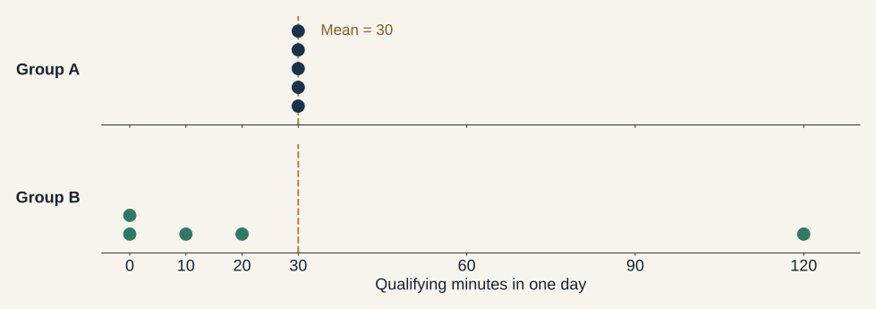

# Material reserved for a later week

These slides and their notes are preserved from the original Week 4 draft. They are not part of the Week 4 presentation or its build. They cover cases, levels of analysis, sampling, variable roles, and descriptive methods. No destination week has been assigned. The distribution figure remains available in `assets/use-distributions.svg`.

## A case has boundaries in space and time

| Possible case | What a score describes |
|----|----|
| Country-year | Political institutions in that country in that year |
| Person-week | That person's use during those seven days |
| Activity episode | One bounded occasion of use |
| Interaction between two accounts | A relation between those accounts |

**Casing:** deciding what constitutes one case for this question.

[Toshkov, pp. 109–111.]{.source}

::: notes
A case is not simply whatever occupies a row in a convenient file. Toshkov defines it as a spatially and temporally bounded object, phenomenon, or event. The researcher makes a substantive decision about those boundaries. A country is one case for some projects, a series of country-years for others, and several regions for still others. Social media use makes the same issue immediate: we could study a person, an episode, an account, or a relationship.

Ask whether three accounts belonging to one person are three independent people. They are not. Ask whether seven days recorded for one person provide seven independent people. They do not. We can retain repeated observations, but their relationship must remain visible in the design and analysis. There is no need to teach clustered standard errors here.

For today's running exercise, choose person-week as the unit whose total duration we want. Episode-level records will supply evidence. This decision makes later aggregation intelligible instead of appearing as an arbitrary statistical operation.

Source: Toshkov, pp. 109–111. Applications are hypothetical.
:::

## Observation and analysis can occur at different levels

|   | What we observe | What we analyze |
|------------------------|------------------------|------------------------|
| Social media use | Episodes on devices | A person's total over a week |
| Suffrage | Legal provisions and historical records | A country's inclusion status in a year |

Aggregation requires a rule for assigning observations to the analytical case.

**More records do not necessarily mean more independent cases.**

[Toshkov, p. 116.]{.source}

::: notes
Give a fully worked oral example. One participant provides 50 episodes across a phone and a laptop. We classify the episodes and combine qualifying time into one person-week total. The study has 50 recorded episodes for this person, not 50 different people. If the analysis compares people, the episodes are inputs to constructing the person's measure.

The suffrage example works similarly. A law, its amendment, a court ruling, and an election account can all provide observations relevant to a country-year. We need a rule for the relevant date and jurisdiction before those pieces of evidence support one classification. A federal right and a local right need not be the same observation.

Toshkov emphasizes that the level of analysis is also the level at which conclusions are pitched. A national average use measure cannot tell us whether the heaviest individual users are the people with a particular attitude. That claim requires evidence about the relevant individual relationship. Keep the explanation concrete rather than launching into a separate ecological inference lecture.

Source: Toshkov, p. 116. Instructor examples.
:::

## Which population does the sample reach?

**Population of interest:** all enrolled students' use in a specified week.

**Sampling frame:** the enrollment roster from which we can select students.

**Sample:** the students selected for observation.

**Observed respondents:** those who actually supply usable records.

A collection of public posts starts with a different set of observable units.

[Toshkov, pp. 111–112, 130–134.]{.source}

::: notes
Distinguish intended population, frame, selected sample, and achieved observations. These are often compressed into “our sample” in casual speech. The enrollment roster is a practical way to enumerate the people we want to describe. If the frame instead consists only of members of a media club, random selection from that list does not extend coverage to all students. If some selected people do not participate, the observed group differs again.

Now compare a public-post dataset. Its rows may be posts, and the represented accounts are accounts that posted visibly. Someone who reads daily without posting could qualify as a user under our definition while never entering that dataset. Downloading more posts does not by itself add those absent people.

Toshkov uses “target population” for the population represented by the sampling frame. Terminology varies, so use explicit labels here: population of interest and frame. The essential distinction is between the people the claim concerns and the people the collection procedure can actually reach. We return to sampling after constructing the measure.

Source: Toshkov, pp. 111–112, 130–134.
:::

## Scale, range, and causal role are separate decisions

| Distinction | Example |
|------------------------------------|------------------------------------|
| Discrete / continuous | Number of posts / elapsed duration |
| Bounded / unbounded | Days with use in a week: 0 through 7 |
| Outcome / explanatory variable | Use may be what we explain or what we use to explain something else |
| Condition / variable | “Any use this week” can define membership in a set |

A count can have a meaningful zero and meaningful ratios.

[Toshkov, pp. 114–116; Lauderdale, p. 52 n. 6.]{.source}

::: notes
These distinctions are orthogonal to the previous slide. Counts are discrete but can be ratio quantities: six posts is twice three posts as a count. Whether a variable is bounded concerns its allowed range. Days of use in a seven-day window is bounded by construction. Elapsed weekly person-time is also bounded by the observation window, even though duration can be recorded at fine resolution.

A variable's role belongs to a particular theoretical question. If we ask whether an intervention changes use, use is an outcome. If we ask whether use changes another outcome, it becomes the explanatory variable of interest. We would also need to consider potential common causes of use and that outcome. Calling a variable explanatory does not establish that it causes anything.

Toshkov notes that set-theoretic work often uses the term condition. Membership in the set of people who used social media this week is one such condition. A fuzzy membership score is a degree of membership under a specified set definition, not automatically minutes, a probability, or an ordinary interval scale. We are introducing the vocabulary rather than teaching QCA today.

Source: Toshkov, pp. 114–116; Lauderdale, p. 52, note 6.
:::

## A measure opens several kinds of description {.section-title}

| Goal | Example question |
|----|----|
| Score a case | How much did this person use social media this week? |
| Describe a distribution | How is use distributed across students? |
| Recover groups or dimensions | Which activity profiles recur? |
| Describe relations | Who interacts with whom? |
| Describe associations | How does use vary with age? |
| Describe a case in depth | What does use mean in one community? |

[Toshkov, pp. 123–144.]{.source}

::: notes
This is the transition from constructing observations to learning from them. Toshkov treats description as a substantive research purpose, not as an inferior preliminary that matters only if we later run a causal model. Paxton's revision of the chronology is itself a consequential descriptive contribution because it changes the pattern needing explanation.

Distinguish the rows. Scoring a person-week supplies a value. Describing a distribution summarizes many such cases along one variable. Looking for profiles considers several variables jointly. Network description examines specified relations between units. Describing associations shifts attention toward how variables vary together. An intensive case study instead emphasizes contextual detail and meanings that standardized columns may miss.

All of these require interpretation. The concepts define what is worth observing, and assumptions connect observations to claims. A rich qualitative account also moves from observable words and actions to concepts and meanings. A numerical summary also rests on theoretical decisions. Ask students which descriptive goal their own research question has before they name a favorite method.

Source: Toshkov, pp. 123–125, Table 5.1, and pp. 125–144.
:::

## Descriptive summaries must fit the variable

| What we measured   | Useful descriptive questions                    |
|--------------------|-------------------------------------------------|
| Categories         | How many cases fall in each? What proportions?  |
| Ordered categories | Which is most common? Where is the median case? |
| Duration or counts | What are the center, spread, and shape?         |

**Mean, median, and mode describe different features.**

A mean alone can hide nonusers, unusually heavy use, or distinct groups.

[Toshkov, pp. 125–130.]{.source}

::: notes
Use activity categories for the first row. We can count cases in each category and compute their share, provided we state whether the categories are exclusive. If a person can belong to several activity categories, percentages can legitimately sum to more than 100, and the presentation should say so. An exclusive primary-activity classification would instead assign each case to one category under a rule.

For ordered categories, the median category identifies where the middle of the distribution lies, but an average of arbitrary numerical codes can impose an unsupported distance assumption. For duration, the mean is an arithmetic average, the median the middle observation, and the mode the most common value or region. Spread describes how dispersed use is, while skew and multiple peaks describe aspects of shape.

Toshkov also discusses empirical and theoretical distributions. A histogram can suggest useful questions, but a bell shape or a long tail does not by itself establish the unique process that produced it. Look at the actual distribution before adopting a mathematically convenient model. The next slide makes this concrete with invented data.

Source: Toshkov, pp. 125–130.
:::

## The same mean can describe different populations

{width="1250" height="480"}

**Both means: 30 minutes.** Medians: A = 30, B = 10.

[Invented daily-use data, illustrating Toshkov, pp. 128–130. Each dot represents a person.]{.source}

::: notes
Let students describe what they see before naming the numerical summaries. In Group A everyone has 30 minutes. In Group B two people have zero, two have modest positive durations, and one has 120. The totals are 150 minutes in each group, divided among five people, so both means are 30. The middle observation in B is 10, while A's median is 30.

Ask what we would learn from reporting only “average use is 30 minutes.” It communicates an average but omits the distributional difference. A question about widespread everyday use would treat the groups differently. A question about whether a small set of people accounts for much activity would focus on the concentration in B. Neither question requires a causal explanation before the description has value.

Emphasize that this is an intentionally small invented example, not evidence about an actual population. The stacked dots at repeated values show different people sharing the same value. The case window is one day for this illustration; it can be summed or described across days only under an explicit longitudinal design.

Source: Instructor illustration of Toshkov, pp. 128–130.
:::

## A large sample still needs a selection argument

**Random sampling:** select cases through known chance mechanisms.

**Stratification:** sample within defined groups.

**Cluster sampling:** select groups, then cases within them or entire groups.

Coverage, nonresponse, and subgroup sizes still affect what population claims we can support.

**A million public posts do not constitute a random sample of a million people.**

[Toshkov, pp. 130–134.]{.source}

::: notes
Return to the roster example. A simple random sample gives each enrolled student the same selection probability. Random selection supplies a basis for population inference, but a particular realized sample need not exactly mirror every population feature. Nor does selection guarantee that every selected person participates. Avoid describing random sampling as magical certainty.

Stratification can ensure deliberate representation of relevant groups, such as years of study. Cluster sampling might select classes and then students within them, reducing collection costs while introducing a structure of dependence that the analysis must recognize. Increasing sample size within an unrepresentative frame does not expand that frame to absent people. Likewise, weighting or model-based adjustment requires information and assumptions rather than automatically fixing every selection problem.

Toshkov discusses diminishing returns to sample size and the extra demands of subgroup estimates. A large overall sample may still contain few cases in a subgroup of interest. We are introducing the design logic today, not calculating confidence intervals or reviewing error formulas. Ask what the frame would be if the only available data were public posts, and how that differs from the population of social media users.

Source: Toshkov, pp. 130–134.
:::

## Finding profiles is another descriptive task

| Method                   | What it summarizes                               |
|------------------------------------|------------------------------------|
| Cluster analysis         | Cases with similar patterns across variables     |
| Multidimensional scaling | Relative similarities or distances among cases   |
| Factor analysis          | Covariation among indicators in fewer dimensions |

Choices about variables, scaling, distance, and interpretation shape the result.

A discovered group of frequent viewers is a pattern to interpret, not an explanation of why they view.

[Toshkov, pp. 134–137, 139–140; Lauderdale, pp. 49–50.]{.source}

::: notes
Anchor each method in a question. Clustering asks which people have similar combinations of viewing, posting, and interaction. Multidimensional scaling seeks a low-dimensional arrangement that reflects specified distances or similarities. Factor analysis models common variation among indicators and may yield scores for cases. These are related forms of simplification, but they are not interchangeable names for the same operation.

Toshkov's original example uses EU states' voting profiles. The choice of legislative dossiers and the definition of similarity shape the grouping. Our social media example has the same issue: minutes, counts, and days have different scales, so feeding them into a distance measure without considering their meaning can give some variables more influence. The algorithm's default is a substantive decision whether or not we explicitly make it.

Connect this back to Lauderdale's unsupervised measurement. Discovering common variation does not prove that the result is a real generative attribute or that an attractive label is correct. It can reveal useful descriptive structure and motivate hypotheses. The interpretation still requires a theory of what the indicators and their common pattern mean.

Source: Toshkov, pp. 134–137, 139–140; Lauderdale, pp. 49–50.
:::

## A network requires a definition of the relation

**Nodes:** people, accounts, or organizations?

**Ties:** following, replying, messaging, or sharing content?

**Direction and weight:** who acts toward whom, and how often?

A network can reveal clusters and bridges. Its interpretation depends on what an edge means.

Two people with similar use totals need not interact with each other.

[Toshkov, pp. 137–138.]{.source}

::: notes
Connect this to last week's relational concept. “Interacts with” has conceptual content. An edge is an operationalization of that relation, and different actions can support different relations. A follow tie, a reply tie, and a message tie are not interchangeable simply because all can be drawn as a line between two nodes.

Distinguish a similarity grouping from a relational network. Two people could have identical weekly activity profiles and never encounter each other. Two people with very different profiles could exchange messages constantly. A graph based on similarity answers a different question from one based on observed contact. Toshkov's voting example constructs a tie from joint opposition, which is itself an explicit relation rather than an unqualified friendship claim.

Ask what else belongs in the codebook for a messaging network. Expected answers include observation window, whether one message suffices for a tie, whether repeated messages change weight, whether the relation is directed, and whether multiple accounts belong to one person. A visually central node is central under a particular network definition; it is not automatically socially influential in every relevant sense.

Source: Toshkov, pp. 137–138. Social media application is hypothetical.
:::

## An association remains a descriptive result without more

Suppose people who spend more time on social media also report less sleep.

A scatterplot or regression can summarize that association.

It does not, by itself, establish what would happen if we changed a person's use.

**The measure needs a conceptual argument. The causal claim needs a research design.**

[Toshkov, pp. 138–140; Lauderdale, pp. 19–20. Hypothetical association.]{.source}

::: notes
State explicitly that the association is hypothetical. The point is the distinction between types of inference, not an empirical claim about social media and sleep. A regression coefficient can summarize how two measured variables vary together in the observed cases. With additional assumptions, it may support population description or prediction. A causal interpretation requires further assumptions about why people have different exposures and outcomes.

Ask students for possible alternative accounts. Sleep difficulties might increase available time for use. Work schedules or other circumstances might affect both. These are candidate explanations, not established facts. Measuring use carefully helps define the exposure, but it does not decide among these causal stories.

Reconnect to the generative/discriminative distinction without conflating the questions. Whether a concept causes its indicators is one question about measurement. Whether social media use causes sleep changes is a separate question about relations between substantive variables. A measure can be useful for describing use while leaving the causal effect of an intervention entirely unresolved. Toshkov deliberately places regression here because the method's name does not determine the inferential claim.

Source: Toshkov, pp. 138–140; Lauderdale, section 1.2, pp. 19–20.
:::

## Close description can change what we think matters

**Ethnographic fieldwork:** observe activities and meanings in their social setting.

**Archival research:** reconstruct events and institutions from historical traces.

Both can expose distinctions that a standardized table leaves out.

What would an interview reveal about 30 minutes of use? What would historical records reveal about a formal voting right?

[Toshkov, pp. 140–143.]{.source}

::: notes
Toshkov's discussion of individual cases is not merely a suggestion to add colorful quotations to numerical analysis. Intensive observation can change which aspects researchers recognize as relevant. An interview or field observation might distinguish routine background coordination from an emotionally significant interaction even when both occupy 30 minutes. That could motivate a new conceptual dimension, a revised question, or a different instrument.

Archival work reconstructs past events from surviving documents and their context. A legal provision, its implementation, and contemporary accounts may illuminate different aspects of voting access. Documents do not interpret themselves. We need to ask who produced them, which setting they describe, and what the evidence can establish. This is an application to the suffrage case, not a claim that Paxton's article conducts every kind of archival inquiry.

The goal is neither to rank qualitative and quantitative methods nor to pretend they produce identical information. Qualitative description can preserve context and meanings, while comparable measures can establish scale and distribution. Both move from observations to claims and both depend on conceptual decisions. Ask which additional observation would change the class's existing social media codebook and why.

Source: Toshkov, pp. 140–143. Instructor applications to the running cases.
:::

