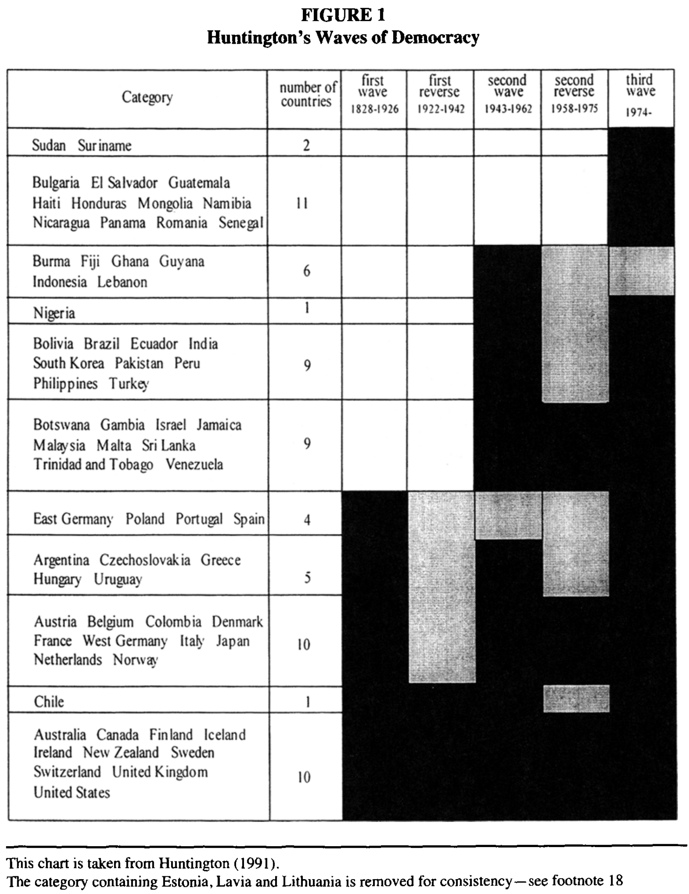
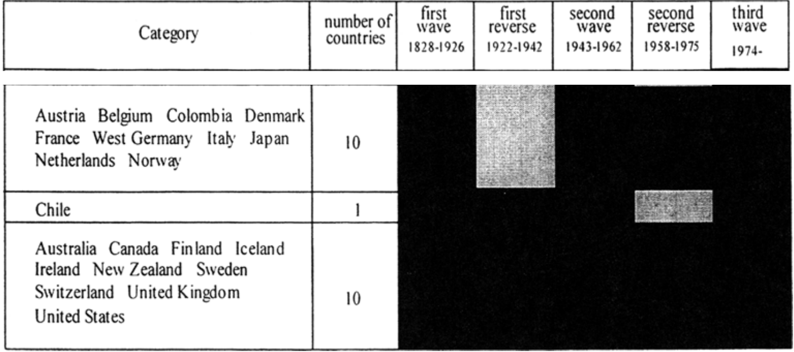
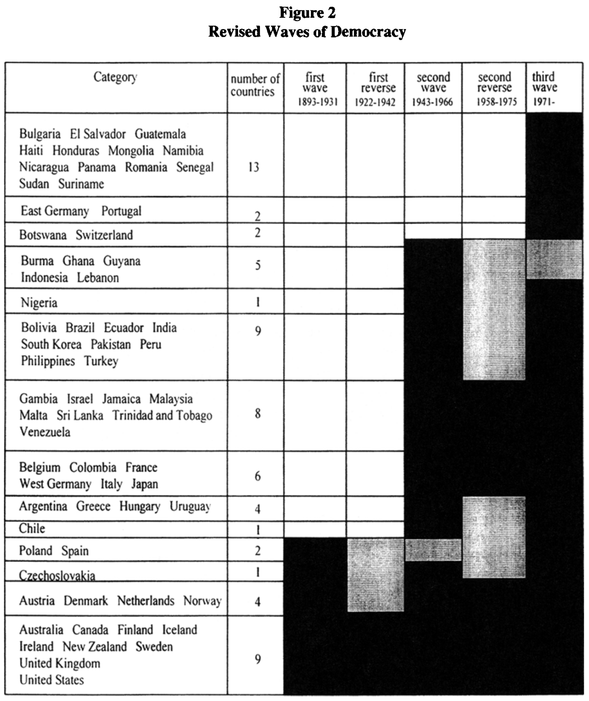
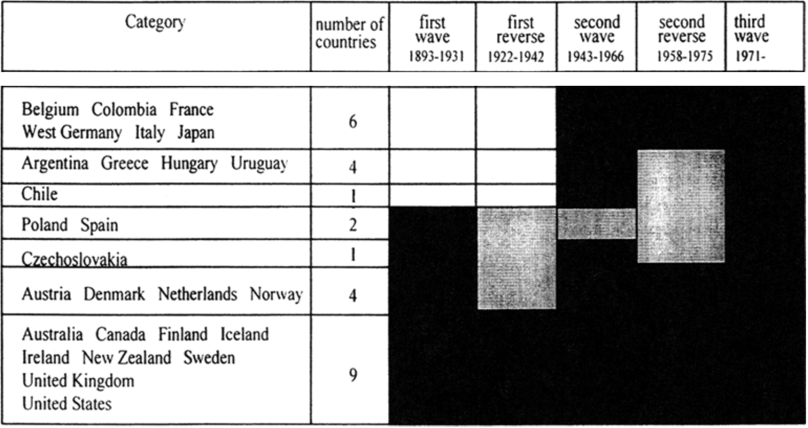
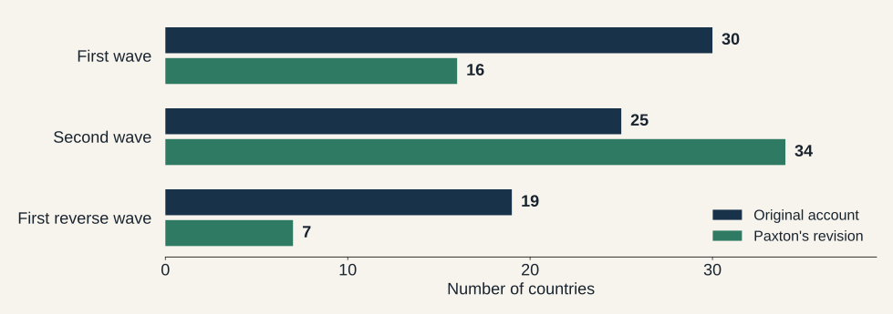
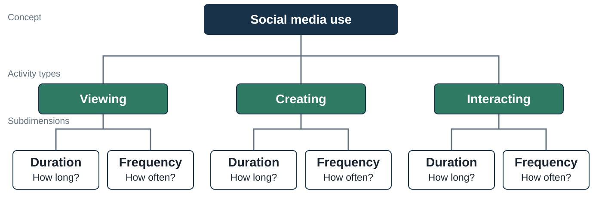
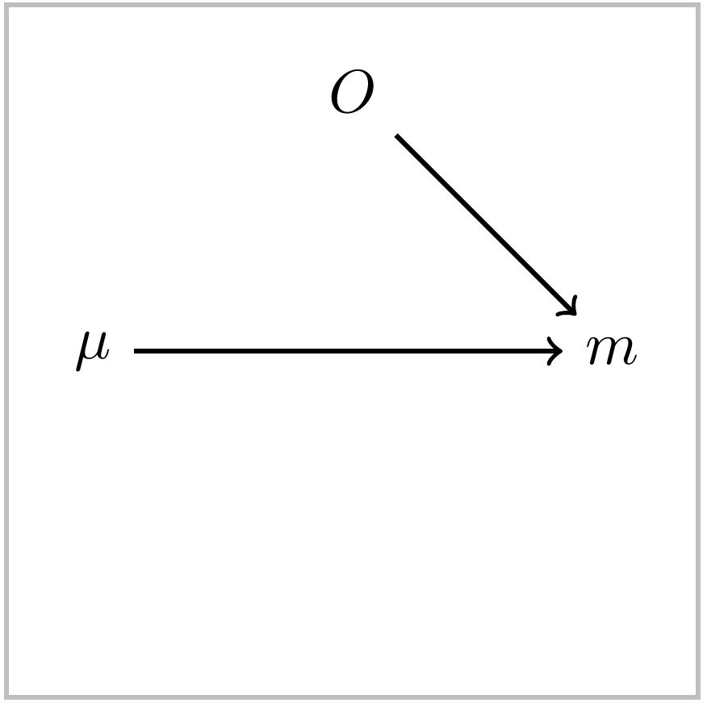
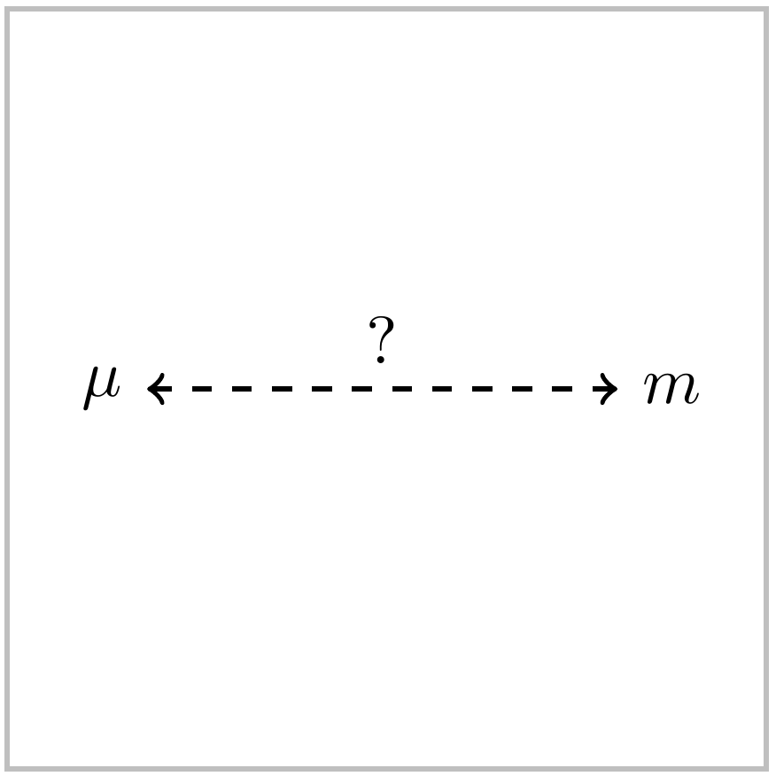
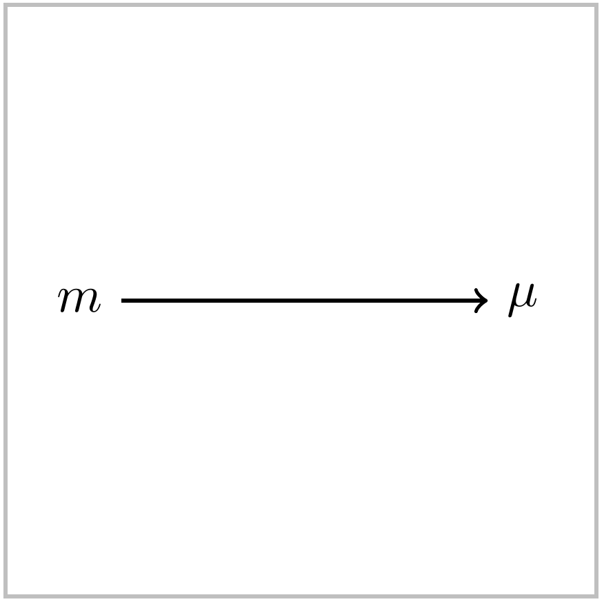
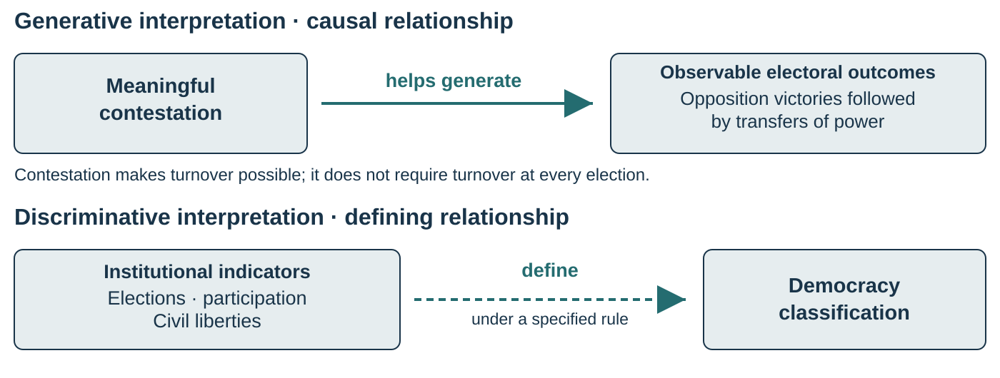

## On explanation...
1. Phenomena: What we observe. This is where description begins.
2. Explanation: Answers the why question. This is the mechanism that produces the observed pattern. 

::: notes
Someone posts something online. Let's say it is AI slop. IT's followed by negative comments. This is the phenomena. The explanation is why. The two concepts here would be AI slop and negative comments. Now let's say it's because people find AI slop disgusting. This is the explanation and it introduces a third concept. 

Another example. Women are portrayed differently on streaming platforms than traditional platforms. This is the phenomena, and your first task is to show that it's true. So you have two concepts gender portray and streaming/tradiional platforms. Now you want to explain why. Is it because of the audience a demand side? Your explanation here would be a statistical explanaition-- show that the audience is different. Or it could be a supply side explanation. here again you could show that the people in charge of the streaming platforms are different.
:::

## Last week: what counts as social media? {.section-title}

Give a definition that includes **shared attributes**, not just platform names.

What is its **intension**? What belongs in its **extension**?

Which borderline case would force you to clarify the definition?

::: notes
Start with retrieval before supplying a new definition. Ask a student to recover the definition the class settled on last week, or reconstruct one if there was no final consensus. Write it on the board and keep it visible. Intension is the set of defining attributes. Extension is the set of cases to which that definition applies. An example list helps people recognize the category, but it leaves the membership rule unstated. Ask what makes a discussion forum fit and what would make a conventional news website with comments a borderline case.

Use the class's working definition: **“An online platform that enables people to create and share user-generated content and interact with one another synchronously or asynchronously..”** Briefly recall the defining attributes; do not repeat last week’s case-classification exercise.

Remind students that a platform can contain several different features. Classifying the whole platform may therefore be too coarse for some questions. This is already a bridge to today's issue: **The definition tells us which features a platform must have to count as social media. Operationalization specifies how we will check whether a particular platform has those features.**. Avoid silently assuming everyone adopted the instructor's definition. Today's working rule will be provisional and explicit.

Source: Week 3, Gerring's term/intension/indicator/extension distinction and McLeod & Pan's explication approach. Social media exercise is a course application.
:::

## Review: conceptualization leaves decisions to make

**Our concept is still social media. We are deciding which platforms qualify.**

| Decision | Question about our definition |
|------------------------------------|------------------------------------|
| Specify the **domain** | Should the definition apply to collaborative tools and private platforms too? |
| Clarify defining attributes | What counts as “interactive” and “user-generated content”? |
| Identify the **extension** | Which platforms satisfy those attributes? |
| Distinguish neighboring concepts | What separates social media from other online communication tools? |

::: notes
Keep this entire review at the platform level. We are still asking “What is social media?” The object being classified is a platform, or a feature if we explicitly choose that scope. We have not yet changed the question to how people use those platforms. Do not introduce duration, frequency, exposure, or an individual's engagement here. The following transition slide will explain why measuring use adds a different concept and a different object of description. maybe talk about misperception study

Start by translating “domain” into ordinary language: “Where do we intend this definition to work, and what kinds of things are we trying to classify with it?” Here it concerns the intended range of application. A definition that works in one setting may need clarification before it can travel to another. Gerring's domain criterion concerns how far a concept can usefully travel while retaining a coherent meaning. It does not instruct us always to narrow the domain.

Anchor the explanation in the preceding borderline cases. Do we intend our social media definition to address all online communication platforms, including collaborative workspaces and private messaging platforms, or a more restricted range? The current wording does not require public visibility or a particular purpose. A shared Google Doc and a private group-chat platform therefore cannot be excluded simply because neither resembles the most familiar examples. We must either accept the implications of the attributes or justify an explicit revision to the intended scope or definition.

If students need a second explanation, recall last week's democracy example. A concept intended to describe national political regimes may invoke national elections and legislatures. If it is also intended to describe student associations or citizens' assemblies, those institutional requirements may not transfer directly. A democratic association need not have national political parties. The domain question is whether the concept is meant to apply to associations and, if so, which defining attributes carry over. Then return immediately to the platform-classification question.

For the second row, unpack the actual words in the class's definition. Does “interactive” mean only that someone can click or search, or does it require some response to user-generated content? Does a reader's comment qualify as user-generated content even when most of the surrounding website contains professional journalism? These are questions about the platform's qualifying features. They are not yet questions about how much an individual does on the platform.

For the third row, separate intension from extension. The intension consists of the defining attributes: online, interactive, and allowing engagement with user-generated content. The extension consists of the platforms that satisfy the resulting rule. Naming Reddit supplies an example in the extension; explaining which attributes it satisfies connects that example to the intension. Domain concerns the intended range of application within which we want the rule to work. Do not substitute a list of familiar examples for that rule.

For the fourth row, ask whether our definition distinguishes social media from other online communication or collaboration tools. If it includes a shared document platform, that is a consequence to consider, not automatically a mistake. A broader definition may be defensible. If the research requires a narrower distinction, students should name the additional attribute and examine which other cases it excludes. Keep the debate about platform membership rather than slipping into a comparison of people's behaviors.

End with an explicit bridge: “Last week we decided what our concepts include. Before we develop a measure of social media use, Paxton shows why preserving that meaning when we write a coding rule matters.” Introduce the suffrage case as the motivation for this week’s measurement decisions.

Source: Week 3 review of Gerring's domain criterion and term/intension/extension distinctions, and McLeod & Pan's explication approach. Applications use the classroom definition and the preceding platform examples.
:::

## Paxton: who disappeared between definition and measure? {.section-title}

**Conceptual definition:** political participation includes all adults.

**Operational rule in several studies:** male suffrage establishes the transition to democracy.

**Consequence:** a country can receive democratic status while women remain excluded.

[Paxton (2000), pp. 92–97.]{.source}

::: notes
> “Last week we worked on defining concepts. Paxton shows why a definition alone is not enough: researchers define democracy to include all adults, but assign democratic status using rules that exclude women.”

Introduce the article as a measurement study, not primarily as a history of the suffrage movement. Paxton begins with definitions that the studies themselves endorse. Their inclusive language encompasses women, but their rules for assigning democratic transition dates often recognize male suffrage alone. Her argument does not require everyone to adopt the most expansive imaginable definition of democracy. It asks whether the chosen operational rule follows the chosen definition.

Use Muller's example: the theoretical definition invokes all citizens and universal adult suffrage, while the operational threshold becomes approximately a majority of adults, allowing universal manhood suffrage to qualify. Huntington supplies a different mismatch: a definition invoking virtually all adults and an operational criterion for the nineteenth century of 50 percent of adult males. Do not treat these as the same numerical threshold.

Ask the class to identify exactly where the loss occurs. The word “adults” is inclusive at the conceptual stage. The operational rule changes the membership condition. Later we will see that changing this rule affects country scores, historical summaries, and explanations.

Source: Paxton, pp. 92–97, especially pp. 94–96.
:::

## Suffrage is one component of democracy

Paxton discusses **competition, participation, and civil liberties**.

Her test asks what happens when participation explicitly includes women.

::: key-line
Under an inclusive definition, women's suffrage is necessary for full democracy. By itself, it is insufficient.
:::

A suffrage date alone cannot establish free competition or political freedom.

[Paxton, pp. 93, 97–100, 108 n. 20.]{.source}

::: notes
Pause on necessary and sufficient because the rest of the case depends on it. If the definition requires broad adult inclusion, the exclusion of women is enough to show that the country fails that requirement. The inclusion of women does not establish that the country satisfies the other requirements. A polity could grant a formal voting right while permitting no meaningful opposition. That is why we must not rename every date in Paxton's exercise the country's definitive arrival at democracy.

Explain Paxton's design: she changes one feature of existing operationalizations to show the consequences. It is an audit of the link between definitions and measurement. She explicitly says the revised dates are not intended as a complete new list of democratic inaugurations. They demonstrate how much the older dates depend on leaving women out.

Ask: would adding women's suffrage settle exclusions by race, property, literacy, or practical obstruction? No. These remain distinct questions about what the definition and evidence require. This is a reason to keep dimensions visible, not a reason to abandon the suffrage correction.

Source: Paxton, pp. 93, 97–100, and note 20, p. 108.
:::

## Paxton's recoding rule changes one requirement

If the original transition predates women's suffrage, move it forward to the suffrage date.

Otherwise, retain the original date.

| Example from Muller's dates | Original | Paxton's revision |
|-----------------------------|---------:|------------------:|
| United States               |     1870 |              1920 |
| United Kingdom              |     1918 |              1928 |
| Belgium                     |     1919 |              1948 |

**These illustrate the effect of one correction, not a complete redating of democracy.**

[Paxton, Table 1, p. 98; explanation, pp. 97–100.]{.source}

::: notes
Walk the United States row through the rule. Muller's date in Paxton's Table 1 is 1870. Paxton substitutes 1920 because it occurs later. This is a 50-year change to the transition date used by that study. The arithmetic is straightforward, but its interpretation matters: the exercise demonstrates the consequences of requiring women's inclusion. It does not establish that every other condition of full democracy was satisfied in 1920.

The United Kingdom row changes by ten years, and Belgium by 29. These are source-reported dates used to reconstruct Paxton's measurement argument, not a universal legal chronology. Suffrage can differ by jurisdiction, eligibility restriction, enactment date, and first exercise. A historical data project would have to document those rules and remaining exclusions explicitly. Paxton notes that the Swiss federal date does not settle every cantonal date.

Keep the main takeaway narrow and clear. A theoretically required attribute changes which country-years qualify. We did not obtain new country histories or estimate a sophisticated model to produce this difference. We applied a different inclusion rule to the existing classification.

Source: Paxton, pp. 97–100, Table 1, and note 11, p. 107.
:::

## A changed date also changes democratic duration

**Illustration using the U.S. dates in Paxton's comparison**

At a hypothetical observation year of 1950:

| Starting date | Elapsed years since that date |
|---------------|------------------------------:|
| 1870          |                            80 |
| 1920          |                            30 |

A study using “years of democracy” inherits the transition rule.

[Date inputs: Paxton, Table 1. Arithmetic illustration assumes uninterrupted duration.]{.source}

::: notes
not sure i would agree with this

Explain why Paxton treats transition dates and democratic stability together. A duration variable is often calculated from a starting date. Changing the starting date changes the accumulated duration, even if the study's final outcome or observation year stays fixed.

This example simply subtracts the two reported starting dates from 1950. It assumes an uninterrupted period for the arithmetic and uses elapsed-year counting, not inclusive calendar-year counting. Do not present it as an independently adjudicated measure of the United States' actual democratic experience. A real stability variable would also need explicit rules for interruptions and restoration.

Now connect the arithmetic to research. If a model relates years of democracy to inequality, recoding the transition changes one of its explanatory variables. If a model explains transitions, it changes the outcome's timing. The same measurement choice thus enters different parts of different studies. Ask students where the effect would enter in each design. This prepares them to see why the next slide's aggregate historical patterns also change.

Source: Paxton, pp. 94, 97–100. The 1950 arithmetic is a classroom illustration.
:::

## Paxton's Figure 1: the original waves

::::: columns
::: {.column width="46%"}
{width="490" height="635"}
:::

::: {.column width="54%"}
**Rows:** countries with similar trajectories.

**Columns:** waves and reverse waves.

**Black:** periods shown as democratic.

**Gray:** reversals from democratic status.

The first wave begins in **1828**. The next slide enlarges the lower rows.
:::
:::::

[Original Figure 1, Paxton, p. 99, reproducing Huntington (1991).]{.source}

::: notes
Give students a reading guide before asking for an interpretation. The rows group countries with similar trajectories under Huntington's classification. The number-of-countries column gives the size of each group. The time columns show the named waves and reverse waves, with dates printed at the top. Black bands show countries counted as democratic; gray bands mark reversals; blank cells precede their inclusion in the democratic pattern. Read a row across, rather than treating every black cell as a new transition.

Explain a wave in Paxton's account of Huntington: many countries move into democracy while relatively few move out. A reverse wave has the opposite pattern. This figure is a summary of classified histories, not raw political events that arrive already labeled democratic. The classifications depend on the operational criteria discussed earlier, including whose suffrage counts.

Use Austria as a reading exercise, following Paxton's note 17. It appears in the group that enters in the first wave, loses democratic status during the first reversal, and returns in the second wave. Contrast Australia in the bottom group, shown as entering during the first wave and remaining democratic. Do not ask students to read the entire small country list from this overview; the next slide enlarges the rows needed for the comparison.

Point to the first-wave heading, 1828–1926. The columns have different lengths and some date ranges overlap, so their equal visual widths do not mean equal elapsed time. Paxton reproduces this figure with a documented adjustment: the Estonia, Latvia, and Lithuania category is removed for comparability. It is therefore the version in her article, not an assertion that every detail reproduces Huntington's original without adjustment.

Source: Paxton, Figure 1, p. 99; discussion pp. 100–102; notes 17–18, pp. 107–108.
:::

## Figure 1, enlarged: who counts as an early democracy?

{width="1250" height="535"}

**Locate Belgium and Switzerland. Both appear in first-wave groups.**

[Paxton, Figure 1, p. 99. Lower rows enlarged; original headings repeated above.]{.source}

::: notes
This is an enlarged extract of the original figure, not a reconstruction of the country classifications. The column headings have been placed above the lower rows so students can read the selected trajectories. Explain that rows from the middle of the full figure are omitted in this detail view.

Ask a student to locate Belgium in the group with Austria, France, and several other countries. Trace its band's first black segment under the first wave. Then locate Switzerland in the bottom group alongside Australia, Canada, and others. That group has a long uninterrupted black band across the later columns. In this account, both countries contribute to the picture of early democratization, though their subsequent trajectories are different.

Now ask what must be true for those bands to establish full democracy under an inclusive definition. The answer includes participation by women, along with the other institutional requirements. The previous operationalization permits these early classifications without that inclusion. Paxton's exercise changes that requirement and asks what happens to the figure.

Do not equate the two groups or claim that every country in a row has the same exact transition year. The diagram bins trajectories within a historical periodization. It provides a convenient visual summary, but the underlying coding rules and dates do the classificatory work. The lesson is that a seemingly familiar historical picture rests on consequential decisions about membership in the category democracy.

Source: Paxton, Figure 1, p. 99, with discussion pp. 100–103. The extract preserves the source's cells and country groupings.
:::

## Paxton's Figure 2: inclusion changes the picture

::::: columns
::: {.column width="46%"}
{width="515" height="615"}
:::

::: {.column width="54%"}
The revised first wave begins in **1893**.

**Belgium** moves to the second wave.

**Switzerland** moves to the revised third-wave grouping.

Country membership and period boundaries both change.
:::
:::::

[Original Figure 2, Paxton, p. 101.]{.source}

::: notes
Orient students to the changed first-wave heading before tracing any countries: it now begins in 1893 and runs to 1931, compared with 1828–1926 in the earlier figure. Paxton also changes other period boundaries. This is not merely the same fixed calendar bins filled with fewer cases. The visual interpretation of the historical sequence changes with the coding.

Trace the two countries introduced in the enlargement. Belgium now appears in the group with Colombia, France, West Germany, Italy, and Japan, entering in the second-wave portion of the diagram. Switzerland appears in a row with Botswana and enters in the revised third-wave grouping. The point is not that new historical events occurred after the first figure was drawn. We changed the requirement for calling the existing political arrangements democratic.

Restate the limits of the exercise. Requiring women's suffrage is one correction to an inclusive definition's operationalization. It does not establish that all other democratic requirements hold in each revised year. Paxton explicitly presents the new dates as a way to demonstrate consequences, not a definitive new chronology of full democracy. Her note 18 also discusses adjustments for difficult cases and independence.

Ask what a theory built to explain the original first wave now has to confront. Its outcome includes fewer early transitions, some transitions occur under later historical conditions, and familiar leaders are no longer necessarily early under the inclusive criterion. That does not make every prior theory false. It changes which event or stage the theory can claim to explain.

Source: Paxton, Figure 2, p. 101; discussion pp. 100–103; note 18, pp. 107–108.
:::

## Figure 2, enlarged: a smaller first-wave group

{width="1150" height="575"}

**Belgium's group moves later; the early groups become smaller.**

[Paxton, Figure 2, p. 101. Lower rows enlarged; original headings repeated above.]{.source}

::: notes
Use the enlarged extract to make students do the comparison themselves. Find Belgium in the first displayed group and follow the row across to its first black cell. That cell is now in the second-wave column. Then inspect the smaller first-wave groups lower in the extract. The revision splits groupings that looked more unified in the original account.

Ask students to distinguish two claims. One is a claim about an individual country's classification and timing. Another is a claim about the collective shape of democratization across countries. The latter follows from aggregating the former. This is why operationalization can alter an explanatory target at a much larger scale than a single coding decision appears to suggest.

Paxton argues that the revised first reversal is much smaller and largely associated with wartime occupation. She describes a more continuous democratization period from 1893 to 1958 rather than strong support for the original separated waves. Present that as her interpretation of the recoding, not as proof that every possible theory of waves or diffusion is wrong. The next slide summarizes her reported counts so the class can put numbers on what changed visually.

The original headings are repeated above the cropped lower rows. The discontinuity between header and rows is a display aid, not a claim that the omitted country groups disappear from Paxton's full figure. Students can consult the full figure on the previous slide.

Source: Paxton, Figure 2, p. 101, and discussion pp. 101–102.
:::

## The historical pattern changes with the rule

{width="1250" height="490"}

The revised first wave begins in **1893**, rather than **1828**.

[Replotted from Paxton's discussion, pp. 100–102. The compared categories have revised timing.]{.source}

::: notes
First orient the class to the chart. The navy bars show counts in Huntington's original periodization as reported by Paxton. The teal bars show Paxton's revised account. The first wave becomes smaller, the second larger, and the first reverse wave smaller. These are not three fixed calendar bins with a completely unchanged classification scheme. Paxton revises the timing of the waves as well as some countries' placement.

Her main argument is that the original image of distinct waves and intervening reversals becomes less persuasive when women's suffrage enters the measure. She describes a long period of democratization from 1893 to 1958, with the remaining first reversal largely associated with wartime occupation. This challenges an influential description of the outcome that theories aim to explain.

Keep the claim proportional to the article. The recoding provides evidence against the strength of the original periodization; it does not prove that all possible accounts of waves or diffusion are false. Paxton's footnote 18 also documents ancillary adjustments concerning some difficult cases and independence. The graphic reproduces her reported counts rather than claiming a fresh replication of the country-level data.

Source: Paxton, pp. 100–102, Figures 1–2, and note 18, pp. 107–108.
:::

## A different outcome can require a different explanation

**Earlier transition dates:** which conditions accompanied expansion of male participation?

**Later inclusion:** did the same conditions explain women's enfranchisement?

The relevant actors, historical contexts, and possible mechanisms may differ.

::: key-line
A theory of one stage of democratization may explain that stage well without explaining the entire inclusion process.
:::

[Paxton, pp. 102–106.]{.source}

::: notes
Clarify both of Paxton's broader consequences. First, the description of Western leadership changes when some Western states include women substantially later than their familiar transition dates suggest. Second, a causal explanation trained on earlier transitions may be an explanation of a particular kind of inclusion rather than of democracy in the general sense claimed.

Her discussion of Moore and Rueschemeyer and colleagues makes this concrete. Their disagreement about the role of the bourgeoisie or working class partly involves which expansion of male participation they explain. Asking about women's suffrage opens a further question about whether these accounts generalize across groups and historical periods. Paxton mentions the possibility that international processes mattered differently for women's movements. She does not establish one replacement universal cause in this article.

Ask what should change in a research design if a transition moves decades later. Students should mention the year at which explanatory conditions are measured, the historical setting, and the actors whose actions require explanation. They need not conclude all previous research is worthless. The defensible conclusion may be a narrower statement about which stage the previous account explains.

Source: Paxton, pp. 102–106.
:::

## Causes and consequences can slip into the definition

Paxton challenges reasons offered for excluding women's suffrage:

-   It was supposedly less central to familiar histories of democratization.
-   Its acquisition supposedly involved less bloodshed.
-   Its extension supposedly prompted fewer efforts to reverse inclusion.

If we define democracy partly by how it arose, what happens when we try to explain how it arose?

[Paxton, p. 96 and p. 107 n. 13.]{.source}

::: notes
Attribute these rationales precisely. Paxton reports and criticizes arguments in Rueschemeyer, Stephens, and Stephens. Do not present them as the instructor's historical claims. Her objection is that the reasons offered concern causes, conflict surrounding change, or consequences rather than the stated criterion of inclusive participation.

Work through the potential circularity slowly. Suppose our outcome includes only transitions driven by a certain kind of class conflict. A later conclusion that class conflict characterizes democratization partly follows from how we selected and named the outcome. The research question should be able to discover that different routes lead to inclusion, including routes not emphasized in the familiar cases.

Return to social media: if we define use as only activity that makes people politically informed, a study claiming that use is associated with information becomes difficult to interpret. We have built an outcome-related condition into the exposure definition. A definition may intentionally concern informative use, but then the researcher must name that narrower target and pose a question that is not settled by its membership rule.

Source: Paxton, p. 96 and note 13, p. 107. Social media example is hypothetical.
:::

## What if democracy is supposed to improve welfare?

**Question:** Does inclusive electoral democracy improve social welfare?

We need to specify both sides:

| Concept | One possible operational choice |
|------------------------------------|------------------------------------|
| Democracy | Meaningful electoral competition with inclusive adult suffrage |
| One aspect of social welfare | Primary-school completion rate |

**Changing the democracy rule changes which observations count as democratic.**

[Classroom application of Paxton's argument, not a welfare finding from her article.]{.source}

::: notes
Explain the change in democracy's role. In the preceding slides, democracy was the outcome whose emergence we wanted to explain. In a welfare study, democracy can instead be the proposed cause. The same operationalization matters in both roles. We now use the democracy label to identify which political conditions correspond to the welfare observations being compared.

Social welfare is itself a broad concept. School completion is one possible educational aspect, not an exhaustive measure of welfare. We could instead ask about child mortality, access to care, poverty, or another explicitly defined outcome. Choose primary-school completion for the classroom illustration and keep that outcome constant as we vary the democracy coding. Do not bundle successful welfare provision into the definition of democracy, because then the proposed effect becomes partly built into the explanatory variable.

Give the substantive reason inclusion might matter. A theory might propose that electoral competition makes officeholders responsive to voters' needs. If a substantial adult group cannot vote, the constituency to which officials are electorally accountable differs. Expanding the electorate could therefore matter to the hypothesized mechanism. This is a theoretical possibility to investigate, not evidence that women share one preference or that suffrage must improve every welfare outcome.

Ask what an early male-suffrage coding actually lets us compare. It may compare regimes with electoral competition among men against other regimes. Calling that contrast the effect of inclusive adult democracy gives it a broader meaning than the operationalization supports. A researcher may legitimately study male electoral inclusion, but should name that specific political arrangement. The next two slides isolate the arithmetic consequences with invented data.

Source: Instructor application of Paxton, pp. 92–94 and 102–106. Paxton discusses consequences for research on democracy's causes and effects, including inequality, but does not report the school-completion example shown here.
:::

## The welfare data stay fixed; the democracy labels change

**Six hypothetical countries in one year. All numbers and classifications are invented.**

| Country | School completion (%) | Male-suffrage rule | Inclusive-suffrage rule |
|------------------|------------------:|------------------|------------------|
| A       |                    80 | Democracy          | Not democracy           |
| B       |                    70 | Democracy          | Not democracy           |
| C       |                    60 | Democracy          | Democracy               |
| D       |                    50 | Democracy          | Democracy               |
| E       |                    40 | Not democracy      | Not democracy           |
| F       |                    30 | Not democracy      | Not democracy           |

A and B meet the first rule but exclude women. C and D meet both.

::: notes
State that these are invented countries and outcomes. We are not reproducing Paxton's country data, claiming these welfare levels occurred historically, or using women's suffrage alone as a sufficient definition of democracy. For the exercise, assume A through D satisfy the same other stipulated democratic requirements. A and B meet the male-suffrage criterion but exclude women; C and D meet the inclusive criterion as well. E and F fail the democratic requirements under either rule.

Read across country A. Its school-completion value is 80 percent in both analyses. It does not lose schooling when we change our coding. What changes is the group to which its observed outcome contributes. Under the first rule it contributes to the democratic mean; under the second it contributes to the nondemocratic mean. Country B moves in the same way. C through F retain their labels.

Ask students to compute the two comparisons before showing the next slide. Under the male-suffrage rule, the democratic group is A, B, C, and D, and the comparison group is E and F. Under the inclusive rule, the democratic group is C and D, while A, B, E, and F form the comparison group. Equal country weights are used for this simple illustration; we are not weighting by population or making an individual-level claim about children.

The coding choice changes the observed contrast even though the outcomes and underlying histories are held fixed. This is precisely the kind of consequence that motivates Paxton's insistence on aligning definitions and measures. It does not tell us which causal effect either comparison identifies.

Source: Fully hypothetical instructor exercise inspired by Paxton's operationalization argument.
:::

## The measured democracy–welfare association changes

| Coding rule | Democratic mean | Other countries' mean | Difference |
|----|---:|---:|---:|
| Male-suffrage rule | 65% | 35% | +30 percentage points |
| Inclusive-suffrage rule | 55% | 55% | 0 percentage points |

**Same six countries. Same welfare outcomes. Different classification rule.**

::: notes
Show the arithmetic explicitly. Under the male-suffrage rule, the democratic mean is (80 + 70 + 60 + 50) / 4 = 65. The comparison mean is (40 + 30) / 2 = 35. The observed difference is 30 percentage points. Under the inclusive rule, the democratic mean is (60 + 50) / 2 = 55. The comparison mean is (80 + 70 + 40 + 30) / 4 = 55, so the difference is zero.

Explain why both sides of the comparison change. A and B leave the democratic group and enter the other group. This is not a claim that newly excluding observations from one mean merely makes a result less precise. Their outcome values now contribute to a different contrast. The classification defines which experiences our empirical claim compares.

Do not let the example become a claim that including women generally weakens an estimated relationship. The direction depends on the data and the research design. With different outcome values, recoding could strengthen the association, weaken it, reverse its sign, or leave it similar. Paxton actually reports in note 16 that her reanalysis of Muller's inequality model strengthened his results under the modified measure. Our invented example illustrates sensitivity of interpretation and arithmetic, not the direction of her empirical reanalysis.

Now return to causal inference. Neither +30 nor zero by itself tells us what school completion would have been had a given country experienced a different political arrangement. Economic conditions, institutions, conflict, and other factors could influence both democracy and welfare. Changing the coding does not change how regimes came about or supply the missing counterfactual. A defensible causal design still has to address that question.

Ask students to repair the overclaim “Democracy raises completion by 30 points.” A defensible description of this table is that countries classified as democratic under the first rule have a 30-point higher average in these invented data. The causal claim would require more. The conceptual claim would also need to name the particular democracy definition used.

Source: Hypothetical classroom arithmetic. Paxton's actual reanalysis is noted on p. 107, note 16; it concerns Muller's model, not this school-completion example.
:::

## A different transition date changes the before–after story

**Suppose a welfare expansion occurred in 1910.** This event is hypothetical.

| Democracy starting date | How we locate the same welfare event |
|-------------------------|--------------------------------------|
| 1870                    | 40 years after the transition        |
| 1920                    | 10 years before the transition       |

A study's time since democratization, policy sequence, and comparison periods can all change.

[Starting dates from Paxton's comparison of Muller's U.S. coding, Table 1. Welfare event invented.]{.source}

::: notes
Separate the source inputs from the invented event. Paxton's Table 1 compares Muller's 1870 transition date for the United States with a 1920 suffrage-based revision. We are using those dates to illustrate arithmetic. We are not asserting that a specific welfare expansion actually occurred in 1910, nor that 1920 settles every requirement of full democracy.

If an analyst studies whether welfare improves after democratization, the chosen transition organizes which years are before, which are after, and how long the regime has been in place. The same hypothetical welfare event is forty years after the earlier date but ten years before the later date. An account that interprets the event as a downstream consequence of the earlier transition is therefore not automatically an account of a consequence of the later inclusion stage.

This does not prove that democracy could not matter before a chosen legal date. Anticipation, gradual reform, prior partial democratization, and long-running political processes would need substantive consideration. It demonstrates why the analyst must say which change the proposed mechanism concerns. Electoral competition among men and the subsequent inclusion of women may be distinct political changes with different timing and potentially different consequences.

Connect the lesson to designs students will meet later without teaching those designs here. Changing the date can alter event time, exposure duration, and which observations are used as a pre-transition comparison. Keeping every other statistical command unchanged does not preserve the same substantive test if the underlying political transition has changed.

Close with the practical stakes: before claiming that democracies improve welfare, define which form or stage of democracy is the proposed cause, identify the welfare dimension and whose welfare is at issue, and make the measurement rules fit those definitions. Then evaluate the causal comparison. Paxton makes the first part of that chain impossible to treat as a harmless data-cleaning detail.

Source: Paxton, Table 1, p. 98, and discussion pp. 97–106. The policy event and research-design illustration are hypothetical.
:::

## What Paxton teaches us to inspect

| Step in a study | Question to ask |
|------------------------------------|------------------------------------|
| Definition | Who or what does the concept include? |
| Operationalization | Does the rule preserve that inclusion? |
| Description | What pattern follows from the resulting scores? |
| Explanation | Which process or stage does the theory actually explain? |

Next: make these choices explicit for social media use.

[Paxton, pp. 92–106.]{.source}

::: notes
Close the opening case by tracing its full chain from definition to explanation. We now have a concrete reason to learn how measurement choices are made. The initial problem is a disconnect between inclusive definitions and male-only operational rules. The score changes then alter transition dates and duration. At an aggregate level, the historical picture changes. Explanatory claims must then be reconsidered in light of the outcome that has actually been measured.

Map the sequence to public-post data. A broad definition includes viewing and other qualifying activity. The operational rule counts only visible posts. A descriptive claim labels prolific posters heavy users and may erase readers. An explanatory claim then risks explaining public production while naming its outcome all social media use. Each step can be stated more precisely once the initial concept and indicator are distinguished.

Ask students which repair would be appropriate in their own work: a revised concept, an expanded indicator set, a different aggregation rule, or a narrower conclusion. Those are different choices. The useful habit is to show the reader the chain from meaning to observations to claims, making each consequential choice inspectable.

Source: Paxton, pp. 92–106. Social media comparison is an instructor synthesis.
:::

## From Paxton's problem to our measurement choices {.section-title}

**A definition does not apply itself.**

Paxton shows that operational choices change who counts, the patterns we describe, and the explanations we test.

**Now: how do we make those choices explicit for social media use?**

Dimensions → target → indicators → procedure → measure

::: notes
Make the change of example deliberate: “We have followed Paxton's case from the definition to its consequences. We will now use social media use as our main working example to learn how to make those choices explicitly.” The class does not need to solve every measurement problem before seeing why it matters. The opening case supplies the motivation; the following section supplies the vocabulary and procedures.

Preview the questions in ordinary language. Which aspect of use interests us? What exactly do we want to know about it? What observations would provide evidence? How will we turn those observations into a value? What claims does that value support? The next slide explicitly distinguishes a platform qualifying as social media from a person's use of it.

Keep Paxton as a brief point of reference when necessary, without retelling her case. The later Gerring and Lauderdale democracy examples serve specific purposes—interpreting concepts and ordered scales—and are not new installments of the suffrage story. Social media remains the main worked application for measurement decisions and exercises.

Source: Instructor synthesis of Paxton and Lauderdale.
:::

## This week: from social media to social media use

|   | Last week's exercise | This week's exercise |
|------------------------|------------------------|------------------------|
| Concept | Social media | Social media use |
| Main question | Which services qualify? | What does a person do with them? |
| Case | Platform or feature | Person during a specified period |
| Possible attributes | Content sharing, interaction | Activity types, with duration and frequency within each |

::: notes
Make the change in unit explicit. Last week we classified services or features. This week we are intentionally asking about people's activity on those services. The platform definition still determines which activities enter the study. We now need a second decision about what counts as using those services and a third decision about the time window.

Social media use is the broad running concept. Political engagement is not our replacement working example. Later, the kind of content can be another aspect to describe if a particular research question calls for it. Likewise, reading, posting, messaging, and watching can be separate forms of use without becoming separate platforms.

Ask: does having an account establish use this week? The expected answer is no under a behavioral definition. Does reading without posting establish use? It can, and our provisional rule will count it. Point out that a dataset of public posts will not directly describe all activity included by that rule. Keep the conceptual domain distinct from what a particular data source happens to record.

Source: Instructor application of Toshkov, pp. 109–116, and Lauderdale, ch. 2.
:::

## A concept can have dimensions and subdimensions

A **dimension** is an aspect of a broader concept.

A **subdimension** distinguishes an aspect within that dimension.

::: notes
Introduce the terms as a hierarchy. Social media use is the broad concept. For this classroom framework, we first organize it by activity type: viewing, creating, and interacting. We then describe each activity type through duration and frequency. Thus viewing has a duration subdimension and a frequency subdimension; creating and interacting have the same two subdimensions. The hierarchy figure below makes those branches visible.

Use a single activity for the first example. Alex views content for 60 minutes in one session. Blair views content for 60 minutes across six sessions. They have equal viewing duration and different viewing frequency. Now suppose Alex never creates content while Blair does. That is a further distinction between activity types, not a different value of viewing frequency. Keeping the levels separate makes the comparison easier to understand.

Explain the terminology carefully. Duration and frequency are cross-cutting attributes because the same questions apply within every activity type. We are treating them as subdimensions in this chosen organization. This is not a claim that every author uses exactly this hierarchy or that dimensions have one natural, fixed order. Another research question could organize the concept differently. We can also calculate overall duration and overall frequency, but those summaries no longer show which activities generated them.

Dimensions need not be statistically independent. People who view frequently may also spend more time viewing, but the two aspects are conceptually distinct. Nor do the activity branches imply mutually exclusive episodes: someone can view while replying. We will need explicit rules for overlaps when measuring total time. For now, the aim is to specify the different questions that a broad label such as use leaves unanswered.

Source: Instructor framework building on Week 3's concept explication, Toshkov's operationalized dimensions (pp. 112–115), and Lauderdale's distinction between concepts and indicators. This hierarchy is a classroom construction, not a figure from the readings.
:::

## Two dimensions of social media {.interaction-grid}

**Timing:** synchronous (real time) or asynchronous (at different times).

**Audience access:** public (open audience) or private (selected participants).

|                  | **Public** | **Private** |
|------------------|------------|-------------|
| **Synchronous**  |            |             |
| **Asynchronous** |            |             |

**Place a platform feature or interaction in each cell.**

::: notes
Use this as a whole-class exercise in crossing two dimensions. A dimension is a way the phenomenon can vary. Here, timing and audience access describe social media interactions. Each dimension has two categories, producing four possible combinations. The cells are intentionally blank for students to supply examples.

Clarify synchronous as interaction that requires participants to be present at the same time, and asynchronous as interaction that permits participation at different times. A quick reply does not automatically turn an asynchronous message thread into a synchronous channel. Public means open to a broad audience; private means access is restricted to selected participants. These are simplified classroom categories; actual access settings can require more detailed rules.

Ask students to name the specific feature or interaction they are placing, rather than assigning an entire platform permanently to a single cell. A platform can support several forms of interaction, so its features can appear in multiple cells. Require an explanation using both dimensions: who can participate or access the interaction, and whether participants need to be present together.

Conclude that knowing the audience does not by itself establish the timing. The dimensions are conceptually distinct, although their distributions need not be statistically independent. This grid classifies forms of interaction; the following hierarchy returns to activity types, duration, and frequency as dimensions and subdimensions of people's social media use.

Source: Instructor classroom framework. The four example cells are intentionally left blank.
:::

## Social media use: dimensions and subdimensions

{width="1350" height="450"}

::: notes
For our working concept of **social media use**:

-   First distinguish **viewing, creating, and interacting**.
-   Within each activity type, ask about **duration** and **frequency**.

This lets us distinguish what people do from how much and how often they do it.

Read the figure from top to bottom rather than across the bottom row. Begin with social media use. Follow the viewing branch: how long does the person view content, and how often do they view it? Then follow creating: how long does the person spend creating content, and how often do they do so? Finally, interacting has its own duration and frequency. The repetition is intentional. Viewing for a long time does not tell us how frequently the person creates or interacts.

Ask students to trace the path for “number of days this week on which a person created content.” The answer is social media use, then creating, then frequency. Ask for the path for “minutes spent replying to others.” The answer is social media use, then interacting, then duration. These proposed measures belong below the bottom row as indicators; the figure itself shows the conceptual organization before selecting the particular indicator.

Explain why activity type appears as a level label rather than as a fourth behavior beside the other three. Viewing, creating, and interacting are the activity categories through which we organize this concept. Within each branch we describe variation in duration and frequency. The figure does not rank viewing below creating or interacting, and it does not claim that one activity causes another. Its lines are conceptual subdivisions, unlike the causal or defining relationships in Lauderdale's later diagrams.

Give provisional meanings for the branches: viewing includes reading or watching content; creating includes composing or sharing an original contribution; interacting includes replying, reacting, and messaging. These categories may overlap in an episode. Sharing an existing item may need its own coding rule or a separate branch, depending on the research question. This is an illustrative starting structure, not an exhaustive taxonomy imposed by the readings. The earlier broad inclusion definition remains in place; we must resolve ambiguous activities explicitly rather than silently discard them.

Finally ask what is lost if we collapse every branch into one weekly total. We retain an overall amount but lose information about which activity consumed the time and how it was distributed across occasions. Overall duration and frequency remain legitimate targets when the question calls for them, provided the aggregation rule handles overlapping activity.

Source: Instructor conceptual diagram applying the assigned readings. No causal direction or empirical relationship is asserted by the connecting lines.
:::

## From a subdimension to an observation

**Hypothetical values for one person's week**

| Activity type | Subdimension | Possible indicator        | Value |
|---------------|--------------|---------------------------|-------|
| Viewing       | Duration     | Minutes spent viewing     | 120   |
| Viewing       | Frequency    | Days with viewing         | 7     |
| Creating      | Duration     | Minutes spent creating    | 20    |
| Creating      | Frequency    | Days with creating        | 2     |
| Interacting   | Duration     | Minutes spent interacting | 60    |
| Interacting   | Frequency    | Days with interacting     | 5     |

**The subdimension names what we want to describe. The indicator specifies how.**

::: notes
Trace the first row back through the figure. The concept is social media use, the activity branch is viewing, the subdimension is duration, and the indicator is qualifying viewing minutes in a specified week. The hypothetical observed value is 120. The next row stays within viewing but changes the subdimension to frequency. Counting days with viewing yields seven. The same procedure applies to creating and interacting.

Frequency illustrates why a subdimension does not determine a unique indicator. We might count days, sessions, or visits. Someone who views content once every day and someone who views it twenty times every day both receive seven days with viewing. If repeated checking within a day is substantively important, we need to define an occasion and count sessions or visits instead. The dimension tells us the kind of distinction we want; the operational rule tells us which version we record.

Duration also needs rules. An app being open need not establish that the person was carrying out a particular activity. We need evidence that identifies the activity and its interval. Minutes and hours are different units for duration, not additional dimensions. The values here are invented to illustrate the mapping and do not make a claim about any actual user.

Do not automatically add the three duration values and report 200 elapsed minutes of total use. These rows do not tell us whether the activities overlapped. Likewise, adding seven, two, and five days does not mean the person used social media on fourteen days in a week. Overall days with use would count distinct days with any qualifying activity, and overall elapsed duration would count overlapping intervals only once. We will work through that aggregation later.

Ask: “Which row would change if the person created content on one additional day but kept total creation time the same?” The creation-frequency row would change while the creation-duration row would not. This checks that students understand both the hierarchy and the distinction between the two subdimensions.

Source: Instructor teaching framework connecting Toshkov, pp. 112–115, with Lauderdale's indicators, pp. 41–49. All values are hypothetical.
:::

## Measurement is a form of inference

Inference: Use something we can observe to make a claim about what we want to say something about.

| Inference | What we observe | What we want to learn |
|------------------------|------------------------|------------------------|
| **Measurement** | Recorded activity | A person's social media use |
| **Population** | Use among sampled people | Use in a specified population |
| **Causal** | Outcomes under observed conditions | Outcomes under a different intervention |

::: notes
Begin with the ordinary-language explanation: measurement requires inference because we use something we can observe to make a claim about what we want to measure. We need a reason for connecting the evidence to the concept. “Inference” here does not necessarily mean a statistical test or a complicated model. It means reasoning from observed evidence to a claim that the evidence does not establish by itself.

talk about reddit Use the phone example slowly. The observation is that a device records an app as open for 30 minutes. The proposed measurement claim is that the person used social media for 30 minutes. To connect those statements, we must ask whether the person was actually using the app, which feature or activity was involved, and whether that activity fits our definition. An open app does not settle these questions by itself. We might use additional records or a diary to interpret the interval. The issue today is the reasoning connecting the observation and target, rather than the later taxonomy of measurement error.

Use Paxton as the second example. Observing that men have voting rights does not by itself establish inclusive democratic participation. Moving from the suffrage observation to a democracy classification requires a definition and a rule connecting the evidence to it. If the definition includes all adults, a male-suffrage rule does not establish the required inclusion. This is why conceptualization remains part of measurement even after we have historical records in hand.

Now walk across the table. In the measurement row, we move from observed indicators to a different quantity describing the same person: records of activity support a claim about their use. In the population row, we ask whether what we learn about observed people tells us about other people in a specified population. Briefly distinguish that question, then leave sampling methods for a later week. The causal row makes a third move: it asks what would have happened under a different condition, not merely what the observed record means or how many people it represents.
:::

## Concept, target (estimand), and estimate

**Target and estimand name the same precise quantity we want to learn.**

| Term | Meaning | Social media example |
|------------------------|------------------------|------------------------|
| **Concept** | The broader idea | Social media use |
| **Target / estimand** | The precise quantity we want | Alex's total elapsed minutes of qualifying use during a specified week |
| **Indicator** | An observation that provides evidence | Recorded start and end times of Alex's activity episodes |
| **Estimate / measure** | What we calculate from the observations | The recorded qualifying time/week |

[Lauderdale, pp. 41–49.]{.source}

::: notes
State the terminology directly: target and estimand are not two different steps. Estimand is the technical word for the precise quantity we want to learn. In this deck, whenever target refers to that precise quantity, it means estimand. The important distinction is between the broader concept, the precisely specified target, and the estimate constructed from observations. Indicators are the evidence used to construct that estimate.

Walk through the same example without changing people or periods. Social media use is the broad concept. It leaves open whether we care about duration, frequency, activity type, or another aspect. Alex's total elapsed minutes of qualifying use during a specified week is one estimand. To finish specifying it, we need rules for qualifying activity, covered devices, and overlapping use. The target does not become whatever a convenient phone report happens to show.

The recorded episode start and end times are indicators. We apply our inclusion rules and combine the qualifying intervals to construct an estimate of Alex's weekly total. Counting overlaps once keeps the calculated quantity in elapsed person-time rather than summed device-time. A hypothetical result of 140 minutes would be the estimate, not the name of the concept and not a separate definition of the target. Distinguishing these terms lets us consider a different observation procedure while retaining the same quantity of interest.

The distinction also works for democracy. Inclusive electoral democracy is the concept. Whether a specified country satisfies an explicit definition in a specified year is a precise classification target. Historical records about suffrage and electoral competition provide indicators. Applying the coding rule to those records produces the measure or classification. A target can concern a category or status; it need not be a continuous numerical total.

Link this slide to the notation students will see in Lauderdale's figures. Mu, written as the Greek letter, denotes the target or estimand. Lowercase m denotes the estimate or constructed measure. These are symbols for the two roles we have just distinguished, not additional concepts students need to insert between target and estimand. Lauderdale also uses the phrase target concept; for teaching clarity, we will distinguish the broader concept from the precisely specified quantity or status of interest.

If students carry the causal example forward, distinguish the targets explicitly. Alex's qualifying minutes this week is a measurement estimand. The average difference in sleep under a specified access block versus usual access is a causal estimand. Both are precise quantities we want to learn, but they require different inferential arguments. Today's table returns to the measurement estimand. Its estimate is a constructed use total, not an estimate of a causal effect. The word estimate alone does not tell us whether a study is making a measurement, population, or causal inference.

Source: Lauderdale, ch. 2 opening and section 2.3, pp. 41–49. Social media examples are classroom illustrations.
:::

## Our provisional definition of social media use

**Social media:** An online interactive platform that allows people to engage with user-generated content.

**Use:** deliberately viewing, creating, sharing, or interacting with content or people through those features.

For today's duration exercise:

-   Include reading and viewing without posting.
-   Include messaging within qualifying features.
-   Exclude merely owning an account or leaving an app idle.

::: notes
Read this as a provisional classroom specification, not as a definition endorsed by any of the assigned authors or a claim that the literature has reached agreement. If the class's Week 3 definition differs, ask what would change when applying it. We need an explicit rule to continue, while preserving the reason for revising it later.

The platform-level intension is the class's definition: an online interactive platform that allows engagement with user-generated content. Retain the earlier decisions about collaboration, private messaging, and platforms versus features; the wording alone does not settle them. The extension contains those services or features that satisfy the rule. The use definition adds a behavioral condition. At the episode level, we can ask which actual occasions satisfy that condition. Reading qualifies even without public participation. Account ownership and unattended background operation do not establish use under this rule.

“Deliberately viewing” refers to using the feature, not to approving the content or paying complete attention to every item. The exercise does not claim to measure attention, comprehension, or persuasion. Messaging is included only through qualifying features; we have not automatically equated every electronic communication channel with social media. Ask students to identify a feature whose inclusion still needs clarification before coding real data.

Source: Instructor exercise applying Week 3 and Lauderdale, ch. 2.
:::

## A measurement specification adds operational detail

**Target:** total elapsed minutes of qualifying use per person over seven specified days.

| Decision | Provisional rule |
|------------------------------------|------------------------------------|
| Devices | Include phone, tablet, and computer |
| Simultaneous use | Count overlapping elapsed time once |
| Activities | Retain viewing, creating, and interacting as separate labels |
| Missing information | Record as unknown, distinct from zero |

**Next: what observations would provide evidence about this target?**

::: notes
Explain why “minutes of use” is still incomplete without these details. Two people could report 60 minutes while one includes laptop activity and the other reports only phone activity. Likewise, summing two devices used simultaneously measures device-minutes rather than elapsed person-time. Either could be an intentionally specified target, but we have chosen elapsed person-time and must combine overlaps accordingly.

Activity labels can overlap: a person may view content while composing a response. We should not add overlapping category durations and assume they equal the total. Retaining multiple labels preserves what happened without forcing every episode into a single activity box. Later, if the question requires an exclusive primary-activity classification, the codebook must specify how to choose it.

Ask students for one unresolved detail. Reasonable answers include time zone, crossing midnight, minimum episode duration, distinguishing idle operation from use, and what to do when a diary and a log describe different aspects of an episode. Choose a rule suited to the question rather than claiming there is a universally correct convention.

Source: Instructor measurement design exercise, drawing on Toshkov, pp. 109–120, and Lauderdale, pp. 41–49.
:::

## Indicators, sources, and what they tell us

**Our target:** total minutes of qualifying social media use over seven days.

| Indicator                             | Possible source  | What it tells us |
|------------------------|------------------------|------------------------|
| Recorded activity start and end times | Device log       |                  |
| Reported minutes of use               | Survey           |                  |
| Reported activity intervals           | Time diary       |                  |
| Number of public posts                | Platform records |                  |

**The indicator is the evidence; the source is where we obtain it.**

[Lauderdale, pp. 46–49; Toshkov, pp. 119–122. Classroom examples.]{.source}

::: notes
Pause to distinguish the target from the evidence. The target is the quantity we want to learn: qualifying elapsed use time over a specified week. An indicator is something we can observe that may tell us about that quantity. A timestamp, a survey response, and a count of posts are observations, but they do not answer the same question equally directly. The conceptual argument connects the chosen observation to the particular target.

Walk through an episode recorded from 10:00 to 10:20. The start and end times are evidence from which we calculate a 20-minute interval. To count it toward our target, we still need to establish that the person was doing a qualifying activity. A record that an app was open alone does not settle that. We then apply the specified rules, including counting overlapping intervals only once, to construct a weekly measure. This makes the steps visible: specify the target, obtain relevant observations, and apply a procedure to construct an estimate.

A reported total of 140 minutes is also observable evidence: we observe the person's answer, rather than directly observing every minute of activity. If our procedure simply uses that answer as the estimate, the indicator and final estimate may have the same numerical value. Their roles still differ: one names the evidence supplied; the other names the result used to represent the target. Do not imply that an indicator must always be transformed arithmetically to become a measure.

Contrast the public post count. It supplies evidence about content creation, but it does not directly tell us total duration. Someone can spend substantial time reading or watching and post nothing. Treating post count as an indirect indicator of duration would require an additional argument about their relationship. It is not automatically an appropriate duration indicator just because it is easy to retrieve. Ask students which target a post count would serve more directly.

Finish by distinguishing indicator from source. Recorded episode times are indicators; a device log or a time diary can be their source. Reported minutes are indicators; a survey can elicit them. Read across each row to connect the observation, its source, and the interpretation it supports. A time diary can provide reported intervals and activity descriptions; these let us reconstruct reported duration and distinguish activities. Different sources may provide evidence about the same target, while one source can supply evidence about several targets. The next slide applies this distinction to Toshkov’s party-position example. We defer formal reliability, validity, and measurement-error analysis; the immediate task is understanding the roles of target, evidence, source, and procedure.

Source: Lauderdale, section 2.3, pp. 46–49; Toshkov, pp. 119–122. All numerical and social media examples are hypothetical classroom illustrations.
:::

## Toshkov's example: where is a party's position?

| Strategy | Evidence | Interpretation required |
|------------------------|------------------------|------------------------|
| Expert surveys | Experts' assessments | What do the experts mean by the scale? |
| Text analysis | Manifestos and speeches | What does expressed language reveal? |
| Roll-call analysis | Recorded legislative choices | What do choices under these constraints reveal? |

Expressed positions and actions can reflect strategy as well as preferences.

[Toshkov, pp. 120–122.]{.source}

::: notes
Retain one of Toshkov's own worked examples so the deck does not replace the entire reading with invented social media illustrations. We want a party's position in a policy space, but parties do not hand us an unambiguous coordinate. Experts make judgments, manifestos express public commitments, and roll calls reveal choices on the proposals that reach a vote. The party leadership, members, and voters may also disagree.

The subtle point is that a measurement method carries theory. A roll-call model requires assumptions about how preferences connect to voting, including how actors evaluate alternatives at different distances from their favored policies. Software does not remove these assumptions. Likewise, a social media measure based on public output requires an argument connecting public output to the particular quantity we want to learn about that concept.

Ask: if two sources disagree, must one simply be useless? Not necessarily. They may reveal different aspects of the actor or different responses to strategic situations. We must first state whether the concept refers to an underlying preference, an expressed position, or observed behavior. This leads directly to Lauderdale's distinction about how concepts relate to observations.

Source: Toshkov, pp. 120–122.
:::

## What makes a measurement meaningful? {.section-title}

We can now produce a score. **Why does it tell us about the concept?**

**Representational question:** What attribute does the measure tell us about, and how does that attribute affect what we observe?

**Pragmatic question:** What useful distinctions does the measure let us make?

**A measurement project can pursue both.**

[Lauderdale, pp. 20–25, 43–45.]{.source}

::: notes
Make the transition explicit: we have specified a target, selected indicators, identified sources, and discussed procedures for constructing a measure. Producing a score does not by itself explain why that score represents the intended concept. A phone may record 60 minutes with an app open. What connects that observation to 60 minutes of qualifying social media use? Toshkov's party-position example raises the same question: what makes an expert assessment or recorded vote evidence of a party's position?

Introduce these as perspectives, not mutually exclusive boxes for sorting every measure. The representational ambition is to learn about an attribute through a connection between that attribute and observable events. The pragmatic perspective asks whether our conceptual distinctions and measurement procedures help us describe and investigate differences. It does not require us to deny that an underlying attribute exists or affects observations.

Do not use pragmatic to mean merely convenient, available, subjective, or arbitrary. A useful measure still needs a clear purpose and a defensible interpretation. Conversely, choosing a definition or scale does not automatically make a project exclusively pragmatic: physical measurement also depends on conventions, instruments, and practical decisions. The next slide explains the representational connection with a concrete example before we return to social science.

Why is this distinction useful? It makes us state what claim the score supports. Under a representational interpretation, we owe an account of how the target attribute affects the observations: for example, why ideology would shape responses to policy questions. Under a pragmatic interpretation, we can specify a defensible summary without first establishing that one independently existing attribute produces all its components. We must instead explain what the procedure defines, which differences it captures, and why those differences matter for the question. Neither interpretation is justified simply by producing a number or giving it a familiar name.

Use democracy to show the practical payoff. An index combining elections, participation, and liberties can distinguish institutional arrangements. Constructing that index does not by itself establish that a hidden quantity called democracy causes those institutions. This distinction prevents us from silently turning a descriptive summary into a causal explanation. It also clarifies disagreements: two researchers may disagree about how well their instruments recover the same target, or they may have defined different summaries and therefore different targets. Those are different disputes and call for different arguments.

Why does Lauderdale push us toward pragmatism? His starting point is that measurement is a human project for communicating and investigating differences. We often have observable records and workable procedures before we have a well-established theory of an underlying attribute. Many social science concepts, such as democracy, summarize bundles of features; we cannot simply assume that a single independent quantity causes all those features. Starting with explicit procedures and the concepts they specify is epistemologically modest: it lets us do useful work without claiming more about the underlying reality than we can support. It also makes choices about inclusion, aggregation, and interpretation available for scrutiny and revision.

Be precise about what pragmatic means in the reading. It is not just asking whether a score is useful. In section 1.3, Lauderdale introduces the operationalist starting point: we can specify procedures, and their outputs help define concepts. In section 2.1, he emphasizes that this perspective does not require one causal direction between target and measure. It permits a generative interpretation when justified, but also permits a discriminative summary. Later he keeps the target distinct from the available estimate, so this is not permission to declare that whatever a convenient instrument records is automatically our intended target.

Even physical measurement involves choices. Lauderdale's height example asks whether a person is standing, lying down, or measured under other conditions. Such conventions matter even when we have good reasons to believe the physical attribute participates in real causal processes. For our social media example, deciding which activities and devices count and whether overlapping minutes count once is similarly necessary to specify the target. Those choices alone do not decide whether our measurement has a representational interpretation; that further depends on the account connecting activity to the records.

Do not present his argument as “representation fails, so use pragmatism instead.” On pp. 24–25 he explicitly rejects treating pragmatism as the universally superior philosophy. He favors a pragmatic realist synthesis: seek representation where possible, be candid when constructing useful summaries, and improve our understanding of the relevant processes. Some social science measures are strongly representational; his example is counting a specified population, where actual people and a defined observation process connect the target to the data. Mention that only to rebut the claim that all social measurement must be exclusively pragmatic, without introducing sampling methods here.

Close with what students should do differently: say whether their score is intended to recover an attribute through its observable consequences or to define a useful summary; explain the connection or construction; and avoid treating a summary as evidence of an underlying cause. A measure can be useful before we have a complete causal account, and a representational account remains an ambition to investigate rather than an achievement guaranteed by the label. The generative/discriminative distinction that follows makes the claim about concepts and indicators more explicit.

Source: Lauderdale, section 1.3, pp. 20–25; sections 2.1–2.2, pp. 43–46; target/measure qualification, pp. 46–48. Democracy and social media applications are instructor explanations.
:::

## Representation: why does a thermometer tell us temperature?

**What we want to know:** the water's temperature.

**What we observe:** the height of liquid in a thermometer.

Warmer water heats the thermometer's liquid → the liquid expands → its level rises.

**That physical connection lets us infer temperature from liquid height.** Calibration connects height to degrees.

Social science analogy: political ideology may help shape answers to policy questions; we use the answers to infer ideology.

::: notes
Replace the abstract phrase “an attribute shapes observable interactions” with a step-by-step explanation. The attribute is the water's temperature. When the thermometer is placed in the water and allowed to equilibrate, heat exchange changes the temperature of its liquid. Thermal expansion changes the liquid's volume and therefore its height in the narrow tube. We observe that height. Calibration establishes how to translate the reading into a temperature on a specified scale. Temperature is not simply another name for liquid height: different instruments can rely on other physical responses to measure the same attribute.

Distinguish the physical direction from the direction of our inference. Temperature helps produce the instrument response. We reason back from that response to temperature. The fact that we read the thermometer first does not mean the reading causes the water to have that temperature. This is the connection that the arrow from target to measure in Figure 2.1 will represent.

Now make the social science analogy explicitly conditional. A researcher may hypothesize that a person's political ideology helps shape answers to questions about taxes, spending, and immigration. The responses then provide evidence about ideology because of that hypothesized relationship. This is a representational ambition, not proof that ideology is one single underlying attribute or that a questionnaire has successfully recovered it. Wording, knowledge, and social context can also shape responses. We will examine measurement quality later; here we are identifying what the researcher is claiming.

The social science example does not have to resemble a thermometer in every respect. The common claim is that the attribute participates in producing observations. Neither the attribute nor the causal link must be directly visible to be investigated, but naming an underlying attribute is not enough to establish the link.

Source: Instructor thermometer and ideology illustrations of Lauderdale, section 1.3, pp. 20–25, and Figure 2.1, p. 43.
:::

## Generative and discriminative concepts make different claims

|   | What the concept means | Example |
|------------------------|------------------------|------------------------|
| **Generative** | An attribute helps produce the indicators | Ideology helps shape answers to policy questions |
| **Discriminative** | Observed attributes define a summary or classification | Elections, participation, and liberties define a democracy classification |

**Pragmatic measurement can use either. Representational measurement takes a generative view.**

[Lauderdale, pp. 41–49.]{.source}

::: notes
Explain the causal direction in ordinary language. With a generative interpretation, a change in the target attribute would change the distribution of observations through some process. A researcher might expect a change in political ideology to affect answers to policy questions, under suitable conditions. This is a hypothesized causal relationship, not something established simply by finding correlated answers. The conceptual claim concerns the process that generates responses.

With a discriminative interpretation, we use observed features to define and distinguish cases. A democracy classification can be defined by a specified combination of elections, participation, and liberties. Those attributes constitute the classification under the rule; we need not posit a separate hidden democracy that causes them. Likewise, calling someone a frequent poster can summarize their recorded activity without supplying an additional hidden cause of those posts. Discriminative does not mean unfair discrimination; here it means making distinctions.

Keep this distinction separate from representational versus pragmatic. Representational measurement takes a generative view. Pragmatic measurement is compatible with generative or discriminative concepts. Also keep it separate from whether we later ask a causal research question. A discriminatively defined exposure can still appear in a causal study, but the measure's construction alone does not tell us what intervention changes it or what its effect would be.

Source: Lauderdale, ch. 2 opening and sections 2.1–2.3, pp. 41–49.
:::

## Figure 2.1: the target helps produce the measure

::::: columns
::: {.column width="44%"}
{width="500" height="500"}
:::

::: {.column width="56%"}
$\mu$ (mu): the target quantity, or **estimand**.

$m$: the **estimate**, or constructed measure.

$O$: other influences on the measure.

The representational claim: changing the target changes what the measurement procedure produces.
:::
:::::

[Original Figure 2.1, Lauderdale, p. 43.]{.source}

::: notes
First read the symbols aloud, without assuming familiarity with Greek notation: mu is the target or estimand, m is the estimate or constructed measure, and O represents other influences. Remind students that target and estimand are synonyms here. An arrow says something about what produces what. It is not a sequence of steps the researcher performs. Start with the horizontal arrow from mu to m, then point to the additional arrow from O.

Lauderdale's concrete example is measuring length with a ruler. If an object becomes longer, applying the same procedure should produce a larger reading. The target participates in the process that generates the observation. The representational perspective relies on such a connection: we learn about an attribute through what it does in observable interactions. The figure compresses the intervening indicators and procedure into a direct connection to m; later in the chapter Lauderdale draws the indicators separately.

A social media application would be measuring elapsed use from records that the activity generates. If the person carries out another qualifying episode and the recording system captures it under the same rules, the recorded total should increase. We need to explain how the behavior gives rise to the record. We cannot infer that relationship merely because the column is labeled use.

Acknowledge O without beginning the deferred measurement-error lesson. It reminds us that the target is not necessarily the only influence on the recorded value. Recording conventions, for example, can affect what a system outputs. Today the important question is what causal connection from the target to the observations we are assuming. We will evaluate the quality of that connection in a later session.

Ask: “Does the arrow mean that calculating a score makes the person use social media?” No. In this diagram the claimed direction runs from the target quantity toward the observations and resulting measure. Keeping that direction clear prepares students to read the next two figures.

Source: Lauderdale, Figure 2.1 and section 2.1, pp. 43–44. Social media application is an instructor illustration.
:::

## Figure 2.2: pragmatism leaves the relationship open

::::: columns
::: {.column width="44%"}
{width="500" height="500"}
:::

::: {.column width="56%"}
$\mu$: the target quantity, or **estimand**.

$m$: the **estimate**, or constructed measure.

The **question mark** leaves the relationship unspecified.

A useful measure can represent a generative attribute or help define a discriminative summary.
:::
:::::

[Original Figure 2.2, Lauderdale, p. 44.]{.source}

::: notes
Put this beside the previous diagram verbally. Figure 2.1 committed to a causal route from the target to the measure. Figure 2.2 removes that compulsory commitment. The question mark and dashed connection indicate that the pragmatic perspective does not require one particular relationship in advance. The two arrowheads are not a claim that reciprocal causal feedback has been established.

Explain the two possibilities in plain language. We may be trying to recover a quantity that participates in producing the observations, as with the length example. Or we may be assembling observations into a useful summary and specifying a concept through that construction. In the latter case, the measure distinguishes people or countries according to an explicit rule. Its usefulness does not by itself show that a separate hidden attribute caused all its components.

For social media use, elapsed minutes can summarize recorded episodes under our rules. A broader activity-profile classification can group combinations of viewing, creating, and interacting. We should state what kind of claim we make rather than treating either output automatically as evidence of a stable inner disposition. Pragmatic measurement allows a generative ambition; it does not require researchers to deny causal processes.

Connect back to the procedural-definition discussion. Leaving the causal relationship open does not require equating our ideal target with whatever the current instrument happens to report. Lauderdale explicitly allows a target distinct from the available measure. We can retain a definition of qualifying use and improve the procedure for describing it.

Ask: “Does this diagram say causality runs both ways?” Expected answer: no. It says the pragmatic perspective does not specify one direction as a necessary starting assumption. The next slide explains the discriminative possibility with a plain-language comparison.

Source: Lauderdale, Figure 2.2 and section 2.1, p. 44, with the qualification on targets and procedures on pp. 46–48.
:::

## Does the attribute explain the observations—or summarize them?

| Generative interpretation | Discriminative interpretation |
|------------------------------------|------------------------------------|
| An underlying attribute helps produce the observations. | Observed attributes determine the classification under our rule. |
| **Ideology:** “Ideology helps explain these policy responses.” | **Democracy:** “These institutions meet our definition of democracy.” |

**Discriminative means distinguishing cases—not identifying an underlying cause.**

[Lauderdale, pp. 41–44. Instructor examples.]{.source}

::: notes
Start with the two claims in the table. In the ideology example, the researcher proposes that an underlying attribute helps generate responses. In the democracy example, the researcher applies a rule to observed institutions to assign a classification. These are interpretations, not fixed properties of the words ideology or democracy: either concept can be conceptualized differently in another study. The classification is useful for distinguishing cases, but its construction does not establish a separate cause of the institutions it summarizes.

Retain the original diagram here as a reference to the reading rather than a student-facing slide:

{width="350"}

Read the labels carefully because their positions switch: m is now on the left and mu on the right. Lauderdale describes the discriminative possibility as one in which the measure defines the target concept. In our teaching terminology, the broad concept receives a precise specification through the measurement scheme; mu denotes that target or estimand, and m denotes the constructed measure. Here the arrow indicates the direction of definition. It should not be read as a claim that typing a number into a spreadsheet physically causes the behavior that already occurred.

Work through the hypothetical threshold. Suppose we define a frequent-use week as one in which a person carries out qualifying social media use on at least five days. We first count days under the behavioral rule. A week with six qualifying days receives the category; a week with two does not. The category summarizes a feature of those observations. The five-day threshold is an instructor choice for this illustration, not a standard from the reading or an established clinical threshold.

Ask why saying “They used social media on six days because it was a frequent-use week” would not explain anything under this definition. The category was assigned on the basis of the same frequency. A separate explanation would identify why that pattern occurred. Discriminative summaries remain useful: they communicate a distinction, support comparisons, and can enter further research. They simply do not supply an additional generative mechanism by receiving a name.

Apply the same logic to democracy. If our definition requires inclusive suffrage, changing the suffrage criterion changes which political arrangements we label democratic. That definitional relation does not by itself show that a hidden democracy attribute caused suffrage, or explain how suffrage was won. Paxton makes the consequences of the chosen rule visible while leaving the causes of different expansions of inclusion open for investigation.

Close the sequence explicitly: Figure 2.1 makes a generative commitment, Figure 2.2 leaves the relationship open under a pragmatic perspective, and Figure 2.3 specifies the discriminative possibility. These are connected distinctions, not three mutually exclusive kinds of research that map one-to-one onto three statistical methods.

Source: Lauderdale, Figure 2.3 and section 2.1, p. 44. Social media example and connection to Paxton are instructor applications.
:::

## Gerring's cumulative definition is discriminative

{width="1350" height="490"}

**Level 5:** attributes a–e. **Level 6:** a–e plus universal suffrage.

The attributes determine the classification **under this definition**.

[Gerring, Table 5.4, from Week 3; interpreted using Lauderdale, pp. 41–44.]{.source}

::: notes
Return to a table students saw last week so they can connect the new terminology to a familiar conceptualization. This is Gerring's cumulative definition of democracy. Each column specifies a level on an ordinal scale. The x marks identify which attributes that level requires. Read down a column, rather than treating each row as an independent point that can be added in any order. Level 5 requires all attributes a through e; level 6 requires all of those plus f, universal suffrage. Level 9 requires all nine attributes.

Explain why this is a discriminative conceptualization in Lauderdale's terms. The combination of institutional attributes defines the category. We assign level 6 because the country meets the requirements through f. We do not need to assume that an independently existing quantity called level-6 democracy causes those institutions. The score summarizes a specified combination of attributes so we can distinguish countries. This is an interpretation of the table using Lauderdale's terminology, not a claim that Gerring labels the table discriminative.

Use the suffrage transition as a concrete example. Suppose a country satisfies a through e, but excludes women from suffrage. It meets the level-5 requirements. If it subsequently satisfies f as well, while retaining the preceding attributes, it meets the requirements for level 6. Here the classification changes because the defining institutional conditions change. This does not explain why suffrage expanded; that is a separate causal question. Nor does the label itself supply a cause of the institutions on which we based it. Connect this to Paxton: making women's inclusion explicit changes what the classification says about a political arrangement.

Distinguish this conceptual rule from a completed operational measure. The table tells us which combinations define the levels, but researchers still need evidence and coding procedures for deciding whether elections are free and fair, suffrage is universal, and the other attributes are satisfied. The rule does not remove the work of interpreting historical records. A country with a later attribute but missing an earlier requirement also calls for explicit handling under a cumulative scheme; it cannot automatically receive the later level just because it possesses that one attribute.

Keep two further claims separate. First, the cumulative ordering is a substantive choice in this definition, not a demonstrated universal historical sequence through which countries must pass. Second, an ordinal step does not guarantee an equal increment in democratic quality. We can use the classification in later explanatory research, but neither the order nor the act of scoring alone establishes a causal mechanism.

Ask: “Do we call this country level 6 because it meets the institutional requirements, or do we claim it has those institutions because it is level 6?” For this definition, the first statement expresses the discriminative logic. The second would require a separate generative account, which the table does not provide.

Source: Gerring, Table 5.4, assigned Week 3 reading; Lauderdale, pp. 41–44. The country transition is a hypothetical teaching illustration, not a historical claim.
:::

## Two relationships between concepts and indicators

{width="1400" height="530"}

**Both use indicators. The arrows express different relationships.**

[Instructor diagrams interpreting Lauderdale, pp. 41–44, 54–56.]{.source}

::: notes
Read the diagrams before introducing the projects. The upper solid arrow represents a proposed causal relationship: meaningful contestation helps generate observable electoral outcomes. We infer the condition from evidence about those outcomes; the direction of our inference is the reverse of the causal arrow. The lower dashed arrow represents a defining relationship: we apply a specified rule to institutional indicators to construct a classification. It is not a causal DAG and does not claim that calculating a score creates institutions. Both interpretations require indicators and explicit measurement procedures. These diagrams are instructor illustrations, not reproductions of Lauderdale’s figures or complete causal models of DD or V-Dem.

Begin with the segue: “Gerring's table shows one way to define levels of democracy. But researchers may want different things from a democracy measure. Some use observations to identify an underlying political condition: meaningful contestation. Others combine institutional attributes to define useful distinctions among countries. Those ambitions lead to different measurement choices.” Clarify that the contrast is deeper than binary versus continuous scores, or simple versus complicated measures. The important question is what the measure is designed to accomplish.

Orient students to the names. Democracy–Dictatorship, abbreviated DD, is the focused classification Lauderdale discusses through Alvarez and colleagues. Varieties of Democracy, abbreviated V-Dem, is a project collecting detailed indicators and constructing several indices. We are comparing the ambitions Lauderdale attributes to these projects, not giving a complete introduction to either dataset or declaring one universally superior.

For DD, explain meaningful contestation in ordinary language: those who hold the most important offices can lose them through elections. An election taking place is not enough if the winner is predetermined, the incumbent can disregard a loss, or competition ends after one election. Uncertainty means the outcome is not fixed in advance; respect for the result means the winner can actually take office; repeatability means the process of competition continues in future elections. The indicators concerning elected offices, multiple parties, and evidence of alternation are intended to identify that political arrangement. Alternation is evidence used under specified rules, not a requirement that every election must replace the government.

Explain the generative interpretation through the link to observations first. Meaningful contestation means incumbents can actually lose power through elections. That condition makes outcomes such as an opposition victory followed by the incumbent relinquishing office possible. Observing such alternation supplies evidence that the competition was consequential rather than merely ceremonial. The proposed direction runs from a competitive political process to observable outcomes; our inference works back from those outcomes to the condition. This is a teaching reconstruction of how to connect DD to Lauderdale's general definition of generative conceptualization, not a claim that he states this exact causal chain in these words.

Keep that link probabilistic and conditional. Contestation does not guarantee that the opposition wins at every election, and an incumbent's repeated victory alone does not logically prove an absence of competition. Voters may keep choosing the incumbent. Nor does any change of leader establish electoral contestation: a coup or a managed succession is not the same evidence as an electoral defeat whose result is respected. DD therefore uses specified institutional and alternation rules rather than treating an arbitrary change in office as sufficient. The indicators and coding rules support an interpretation; they do not by themselves prove its causal account.

Contrast this with a discriminative interpretation: we call a country democratic because its observed institutions meet our chosen definition. The institutions constitute the classification. We need not assume that a separate hidden democracy causes those institutions. Point back to Gerring's cumulative table: the required combination of attributes determines the level. Do not claim that no democratic institution can ever cause another; the narrower point is that the classification rule does not require a hidden common cause of all its components.

Separate this measurement argument from a second causal question. Lauderdale's DD discussion also emphasizes that meaningful contestation might change government behavior because officials anticipate removal. That explains why the authors care about the political condition, but it is not the same as explaining why its indicators provide evidence of it. Contestation leading to observable electoral turnover is the measurement-side illustration; contestation changing leaders' incentives and possibly welfare policy is a downstream hypothesis. A concept's having possible effects on welfare does not, by itself, establish that it generates its measurement indicators. State explicitly that Lauderdale interprets DD as having a generative ambition; the coding rules alone do not establish that interpretation.

For V-Dem, start with a different problem. Two countries could both hold meaningfully contested elections yet differ substantially in freedom of expression, constraints on executives, participation outside elections, deliberation, or political equality. A single yes/no contestation classification intentionally leaves many of those differences undescribed. Researchers interested in them need more detailed information. V-Dem's broad collection supports several conceptions of democracy rather than requiring everyone to treat the same one as the only relevant concept. Connect this to Gerring's earlier classification of democratic attributes: naming several families shows why one overall label can leave important differences hidden.

Explain discriminative ambition carefully. Here it means enabling researchers to distinguish countries according to the institutional attributes relevant to their questions. It does not mean V-Dem is atheoretical, arbitrary, or incapable of supporting causal research. Its concepts and aggregation choices involve substantive judgments. Lauderdale's contrast is that the overall project supports a variety of distinctions rather than committing the entire project to the focused account of meaningful contestation emphasized by DD. A researcher can select a narrow set of V-Dem indicators to investigate a specific mechanism.

Only after establishing the measurement distinction, use the separate democracy–welfare question to show why the target choice matters. If our theory is that the possibility of electoral removal encourages leaders to provide services, we need a measure that captures meaningful electoral competition. If our theory is that expanding political inclusion changes whose needs governments respond to, we need indicators of who can participate, including suffrage. If we are describing how countries differ across democratic institutions, we may want several measures or profiles rather than one classification. The data source alone does not decide which target is appropriate; the research question and proposed process guide that choice. These are classroom applications, not findings that either dataset proves a welfare effect.

Bring Paxton back explicitly. A focused theory of contestation still has to say whose competition and participation count. A country might have meaningful electoral competition among men while excluding women. Whether that arrangement satisfies our target depends on the stated concept. A narrow measure can be useful for one question while failing an inclusive definition for another. Conversely, adding many indicators does not automatically solve every conceptual problem. The lesson is to match the measured attributes to the claim, not to assume either minimalism or breadth guarantees success.

Ask the class: “Suppose two countries receive the same contestation classification but differ in civil liberties. Is that necessarily a failure of the classification?” Expected answer: not if the intended target is contestation alone; it is a limitation if we interpret the score as describing all aspects of democracy. Then ask which additional information their own research question would require. Close by restating the contrast: capture a particular political process thought to matter, or provide a detailed set of distinctions that supports multiple purposes.

Segue to the next slide: “Both interpretations require choices about what to include. Returning to social media use, do we need one focused duration measure or a richer description of activities?” This introduces the scope of a measure without reopening the Paxton case.

Source: Lauderdale, section 2.7, especially pp. 54–56, discussing Alvarez et al. and Coppedge et al. The contestation-to-turnover account is an instructor explanation connecting this discussion to Lauderdale’s general generative/discriminative distinction on pp. 41–44; welfare applications are hypothetical.
:::

## Four perils of quantitative measurement

| Peril | Definition | Social media illustration |
|------------------------|------------------------|------------------------|
| **Narrowness** | A limited measure comes to stand for a broader concept. | Public posts stand for all use. |
| **Fairness** | A procedure misrepresents people relative to a defensible standard. | Equal qualifying use receives different scores because only some devices are recorded. |
| **Unintended consequences** | Using a metric changes behavior in ways that undermine its purpose. | Rewarding comment counts encourages repetitive comments. |
| **Malign intentions** | Measurement is deliberately designed or used to serve a harmful aim. | Activity records are used to identify and punish dissent. |

[Lauderdale, pp. 27–39. Social media scenarios are hypothetical.]{.source}

::: notes
Segue from constructing measures to using them: “Even after we specify what our score means, we need to ask what it leaves out, whom it misrepresents, and what happens when people act on it.” Introduce all four as distinct problems that can overlap in one project. Maintain today’s scope. We are not starting a taxonomy of reliability, validity, or measurement error. Lauderdale develops fairness technically in later chapters. Here the relevant lesson is to identify the normative standard and the decisions or treatments at stake.

Narrowness concerns the conceptual loss that can occur when only some aspects are easy to quantify. Fairness concerns claims about how individuals or groups ought to be treated and whether a procedure meets that standard. Unintended consequences arise when measures change incentives and people adapt in ways that undermine the intended aim. Malign intentions concern deliberate harmful uses, even if the measurement procedure functions as designed.

Ask students which peril appears most directly in Paxton. Narrowness and the politics of whose participation counts are immediate answers. Do not infer the original authors' malicious intent from an operational exclusion. Distinguish a consequential measurement decision from an unsupported claim about the motives of the people who made it. The next slides unpack the categories with explicit examples.

Work through the difference between the four examples. Post counts omit nonposting activity: that is the coverage problem of narrowness. Recording one device but not another can misrepresent equally active people differently: fairness requires stating the target and why those equal activities deserve equal measurement. Rewarding comments can change the behavior being recorded: that is a response to the metric. Deliberately using records to punish dissent is a harmful objective, even if the records accurately identify the activity. The categories locate different problems; they are not mutually exclusive diagnoses.

Do not frame every narrow measure as bad. A public-post count is appropriately narrow when the target is public posting. It becomes misleading when interpreted as all use. Likewise, not every unequal score is unfair, not every behavioral response is undesirable, and an adverse consequence alone does not demonstrate malicious intent. The following slides supply the reasoning needed to distinguish these cases.

Source: Lauderdale, section 1.4, pp. 25–39.
:::

## What becomes invisible when we count only one thing?

**Narrowness:** a partial representation comes to stand for the whole concept.

**Suffrage:** male participation stands in for adult participation.

**Social media use:** public posts stand in for all activity.

**Education:** tested tasks stand in for everything students should learn.

The omitted dimension can gradually disappear from the research question itself.

[Paxton, pp. 93–97; Lauderdale, pp. 27–29. Social media example is hypothetical.]{.source}

::: notes
Narrowness is more than a small numerical discrepancy. If researchers repeatedly use the same limited operationalization, they can begin to treat its coverage as the entire concept. Public production becomes “use,” and the experience of readers disappears. Paxton argues that treating male participation as democratic participation has consequences for which histories and explanatory actors become central.

Lauderdale discusses analogous problems in policing, foreign aid, and education. Recorded crime can displace attention to safety or trust. Easily quantified short-term benefits can attract attention away from longer-term goals. An assessment can privilege individually tested skills while neglecting collaboration. These are reasons to examine what the target should include, not proof that every measure must include everything.

Ask the class for the appropriate repair in our social media example. If the question truly concerns all use, broaden the observations or acknowledge the restricted coverage. If it concerns public content creation, retain the narrow measure and name the concept accordingly. The choice should follow the study's purpose. Adding a longer list of variables without a clearer question is not automatically an improvement.

Source: Lauderdale, pp. 27–29; Paxton, pp. 93–97.
:::

## Fairness: compared with what standard?

**A lower score is not, by itself, evidence of unfair measurement.**

We need to specify the target and what appropriate measurement would require.

| Kind of complaint | What is the comparison? | Hypothetical example |
|------------------------|------------------------|------------------------|
| **Noncomparative** | What this person should receive under the stated standard | “My qualifying laptop use should count toward my total.” |
| **Comparative** | How the procedure measures people relative to one another | “Equal use counts differently depending on the device.” |

[Lauderdale, pp. 29–31. Examples are classroom applications.]{.source}

::: notes
Start with the difference between measurement fairness and fairness in society more broadly. Lauderdale's concern here is whether the procedure measures people or groups appropriately relative to its target. A perfectly recorded difference can reflect an unjust social situation without the recording procedure itself creating the injustice. Conversely, using the same recording rule for everyone can still misrepresent people differently. We need to distinguish what happened in the world, how it was recorded, and what decision someone makes with the result.

Define noncomparative without implying that it only concerns one person. An individual or group can object that the measure fails to give them what they deserve or rightfully expect under a stated standard, even without identifying a better-treated comparison group. If our target explicitly includes use across devices, a participant can reasonably object that their qualifying laptop activity was omitted. That complaint stands even before they compare their score with anyone else's.

Define comparative as a complaint about how the procedure measures individuals or groups relative to others. If the target is total qualifying use, equal amounts of qualifying activity should not receive different totals solely because one person used an unrecorded device. The same episode of exclusion can support both kinds of complaint; these are different ways of formulating the objection, not mutually exclusive kinds of people or harms.

Emphasize the need for a defensible standard. We cannot infer unfair measurement simply because two people have different scores. Their target quantities may actually differ. We must explain which differences are relevant to the intended concept and which should not affect the score. In the reading, disagreements about fairness can therefore be disagreements about conceptualization. Researchers may disagree about what an assessment is supposed to measure, not merely about how to calculate it.

Lauderdale locates measurement fairness in discrepancies between the target and the available measure. Acknowledge that connection plainly, while leaving formal measurement-error models and technical fairness criteria to the later week. We are establishing the conceptual comparison needed before those tools can make sense. The next slide holds the target quantity fixed to make that comparison transparent.

Source: Lauderdale, pp. 29–31. Device examples are hypothetical instructor applications.
:::

## Same recording rule does not guarantee fair measurement

**Target:** total qualifying social media use across devices in one week.

**Procedure:** record phone activity only.

| Hypothetical person | Phone minutes | Laptop minutes | Target total | Recorded total |
|---------------|--------------:|--------------:|--------------:|--------------:|
| Alex                |           120 |              0 |          120 |            120 |
| Blair               |            30 |             90 |          120 |             30 |

**Equal qualifying use, unequal recorded totals.**

If the target were **phone use only**, these scores would answer a different question.

[Instructor illustration of Lauderdale's fairness discussion, pp. 29–31.]{.source}

::: notes
Read the target first, before the numbers. For this invented example, all listed minutes are qualifying activity, the phone and laptop intervals do not overlap, and the observations in the table are known. Alex uses only a phone for 120 minutes. Blair uses a phone for 30 minutes and a laptop for 90. Both have 120 minutes of the target activity, but the phone-only procedure records 120 and 30. This is not a real dataset or a claim about a particular social group.

Ask why applying the identical phone-only rule does not settle fairness. The rule is identical, but its relationship to the intended total differs with the person's device pattern. The relevant standard is that equal amounts of the specified activity receive equal measurement. A researcher who interprets Blair's 30 as less total use would misrepresent the comparison. If a decision allocates participation credit or support on that basis, the measurement problem can have further consequences; those decision rules require their own justification.

Now change only the target to phone use. The recorded totals correctly distinguish phone use in this stipulated example. This demonstrates why the fairness judgment cannot be detached from the concept being measured. Renaming the target is a defensible change only if it fits the research question and is stated openly; it is not a way to claim coverage of total use while refusing to record some of it.

Ask for a repair. To retain the all-device target, seek qualifying evidence across devices, with a feasible and appropriate collection procedure, or explicitly acknowledge incomplete coverage and limit the resulting claims. Do not automatically add the same number of minutes to everyone's score or force all scores to equality. That would not establish how much activity actually occurred. If device records alone are not appropriate, another source such as episode diaries may supply relevant information.

The broader lesson is that identical procedures and equal scores are neither sufficient universal definitions of fairness. We need a stated target, a relevant comparison, and a reasoned account of how the procedure represents that target for different people.

Source: Instructor hypothetical applying Lauderdale, pp. 29–31. Formal fairness assessment is deferred.
:::

## What do Lauderdale's fairness examples show?

**Student assessment:** does a test reflect understanding—or also familiarity with culturally specific expressions?

**Teacher assessment:** do final student scores reflect teaching—or also differences in students' starting points?

**The question:** are people being compared on the attribute we intended to measure?

Numbers can **expose** unequal treatment. They can also give an unjustified comparison an appearance of objectivity.

[Lauderdale, pp. 30–31.]{.source}

::: notes
Retain examples from the reading so the fairness discussion is not only an invented social media scenario. Lauderdale describes research arguing that some verbal-test items advantaged students familiar with particular cultural expressions. The proposed target is understanding or ability relevant to the assessment, while familiarity with those expressions may contribute something else to performance. Attribute this to the studies Lauderdale discusses rather than claiming that every group difference on a test demonstrates unfairness or that we have independently adjudicated that research.

His teacher example separates a student's final level of performance from the teacher's contribution to learning. Teachers can start with classes that differ substantially in prior attainment and circumstances. Comparing only final scores can therefore attribute differences to teachers that do not represent differences in their teaching. Lauderdale discusses attempts to account for prior performance, while noting that adjustment is not a complete solution. We do not need to teach the models here; the point is to articulate the intended target before judging the comparison.

Connect both examples to the preceding table. The important move was not forcing Alex and Blair to have equal scores because equality is always desirable. It was stipulating equal target quantities and showing that the procedure represented them differently. In real studies, the target is usually not fully observed, which makes assessing that claim harder. This is why normative commitments, substantive knowledge, and evidence matter.

Distinguish measurement from allocation. A test can measure a limited skill reasonably well while an institution makes an unjustified decision to use it as the sole basis for access to an opportunity. Conversely, a laudable allocation goal does not automatically make its measure appropriate. Ask students to state whether their complaint concerns the definition, the measurement procedure, the use of the score, or more than one of these.

Close with Lauderdale's balanced conclusion. Nonquantitative judgments can also be unfair. Quantification can make disparities inspectable and require people to articulate their fairness standard. It can also obscure problems if users treat numbers as inherently neutral. The response is to justify the target, comparison, and use—not to assume that either numbers or their absence guarantee fairness.

Source: Lauderdale, pp. 30–31, including his discussion of student testing and teacher assessment. Detailed technical fairness criteria remain deferred.
:::

## A metric can change the behavior it tracks

**Unintended consequences:** responses to a metric undermine the goal it was meant to support.

**Hypothetical platform goal:** encourage useful participation.

**Reward rule:** give visibility for the number of comments posted.

**Possible response:** people split one contribution into many short comments.

The count rises while the intended goal may not improve.

**Goodhart / Campbell:** using an indicator for decisions can change the process producing it.

[Lauderdale, pp. 31–35. Classroom example.]{.source}

::: notes
Make the incentive mechanism explicit. Before rewards attach to comment counts, the count may summarize one kind of activity. After the reward, people have a reason to optimize the count. One route is more useful contributions. Another is splitting comments, repetition, or other actions that increase the recorded total without serving the intended purpose. We are describing a possible response, not reporting a demonstrated effect on a particular platform.

Lauderdale illustrates the same issue with police crime statistics, teaching to the test, aid metrics, and rankings. The people whose performance is assessed sometimes help produce the records, which can create further incentives. Even an independent collector does not eliminate every behavioral response to the metric.

Ask whether all adaptation is bad. No. If a metric rewards the behavior that actually advances the objective, the response can be desirable. The central design question is whether people can improve the score without improving what we intended. This is why thinking about use and incentives belongs in measurement design, rather than after the dataset has already been constructed.

Source: Lauderdale, pp. 31–35. The platform scenario is hypothetical.
:::

## Measurement can also serve a harmful purpose

**Malign intentions:** measurement deliberately serves a harmful objective.

Lauderdale discusses the historical use of intelligence measurement in eugenics and the enforcement of social hierarchy.

A technique's ability to classify or predict does not justify the purpose for which someone uses it.

Questions for a research project:

-   Who sets the categories and decides their use?
-   What decisions will follow from the resulting scores?
-   Whose interests and experiences remain outside the design?

[Lauderdale, pp. 35–40.]{.source}

::: notes
Distinguish intended harm from the previous slide's unintended response. Lauderdale traces how measurement and statistical methods developed partly in projects seeking to rank human groups and justify social hierarchy. The lesson is not that every subsequent use of those methods shares those purposes. It is that a technical method's usefulness cannot settle whether a project or decision is justified.

His contrast between Binet's diagnostic purposes and later claims about immutable, rankable intelligence also reinforces the generative/discriminative distinction. A summary of performance on tasks does not itself establish an innate causal attribute. Factor analysis can summarize common variation without proving the interpretation placed on the factor. We do not need to reproduce the chapter's whole institutional history to make this methodological point.

Return to current classroom design in general terms: even a carefully specified record of activity could be used to support people, allocate resources, monitor them, or penalize them. We must state the intended use and consider its consequences. Lauderdale's conclusion is a reason to understand measurement carefully and use it responsibly, not a reason to abandon all quantitative description.

Source: Lauderdale, pp. 35–40.
:::

## Main concepts to take into your own research

::::: columns
::: {.column width="50%"}
**From concepts to observations**

-   Preserve the definition in the coding rule
-   Specify dimensions and subdimensions
-   Distinguish concept, target, and estimate
-   Justify indicators, sources, and operational rules
:::

::: {.column width="50%"}
**From measures to claims**

-   Representational / pragmatic: what supports the measure?
-   Generative / discriminative: produces indicators or summarizes attributes?
-   Coding choices can change patterns and explanations
-   Inspect narrowness, fairness, incentives, and purpose
:::
:::::

::: notes
Use this as retrieval, not a final recitation. Ask students to choose one takeaway and explain it using either Paxton's suffrage case or social media use, then apply it to their own research.

For the first column, ask what must survive the move from definition to coding rule. Paxton's example shows what happens when a definition includes all adults but the operational rule counts only men. For social media use, distinguish activity types and their duration or frequency, specify the target, and explain what observations from diaries, device records, or other sources can establish. A convenient source does not by itself define the concept or justify the inference.

For the second column, keep the two distinctions separate. A representational account explains how an attribute produces observable evidence; a pragmatic account asks whether the procedure is useful for the stated purpose. Generative concepts posit an attribute that helps produce indicators, whereas discriminative concepts summarize or classify observed attributes. Pragmatic measurement can use either. Ask students to explain the thermometer or ideology example and contrast it with a democracy classification.

Return to Paxton for the link between measurement and explanation: changing who counts changes transition dates, democratic duration, and the historical pattern we seek to explain. Constructing a measure does not itself establish a causal explanation. End with four questions about the student's own proposed measure: What does it leave out? What standard makes comparisons fair? How might people respond to its use? Whose purposes does it serve?

Close by locating the next step. We now have a language for specifying what we want, how we obtain observations, and how the measure supports a claim. A later session can ask how well particular measures perform through reliability, validity, and measurement error. Those topics are deliberately not taught in this deck.

Source: Synthesis of the material covered from Lauderdale, chs. 1–2; Toshkov, ch. 5; Paxton (2000).
:::

## Readings

**Lauderdale, Benjamin E.** *Pragmatic Social Measurement.* Assigned September 15, 2026 draft, chapters 1–2, pp. 17–61.

**Toshkov, Dimiter.** *Research Design in Political Science.* Chapter 5, “Measurement and Description,” pp. 107–144.

**Paxton, Pamela.** 2000. “Women's Suffrage in the Measurement of Democracy: Problems of Operationalization.” *Studies in Comparative International Development* 35(3): 92–111.

[Page references throughout use the readings' printed pagination. Social media scenarios and datasets are classroom illustrations.]{.source}

::: notes
The deck integrates the readings by methodological question rather than presenting one author at a time. Lauderdale supplies the concept–indicator–measure framework, the distinctions about causality, and the consequences of quantification. Toshkov helps explain operationalized dimensions, the evidence supplied by different sources, and levels of measurement. His sections on cases, sampling, and descriptive methods are reserved for a later week. Paxton shows how a concrete operational decision changes substantive findings.

The social media definition, episode examples, and small datasets are teaching constructions. The chart of waves reproduces counts reported in Paxton's discussion, not a new country-level replication. The suffrage dates are clearly attributed to the particular comparison in her article. No general claim is made that a women's-suffrage date alone establishes full democracy.

Reliability, validity, and the formal analysis of measurement error are deferred as requested. The session still addresses conceptual inclusion, fairness standards, and behavioral responses to metrics because these are substantive parts of the assigned chapters. The source QMD contains the full notes. Generated presenter and notes versions should be refreshed from that source rather than edited separately.
:::