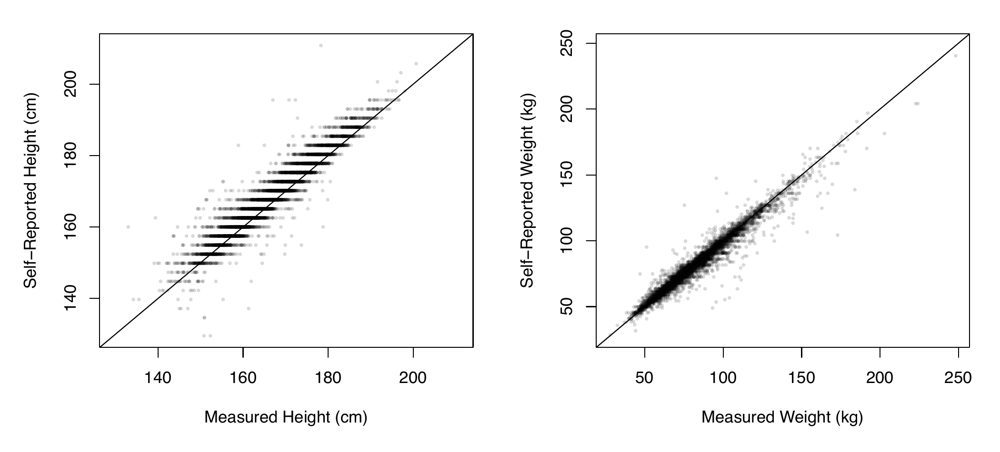
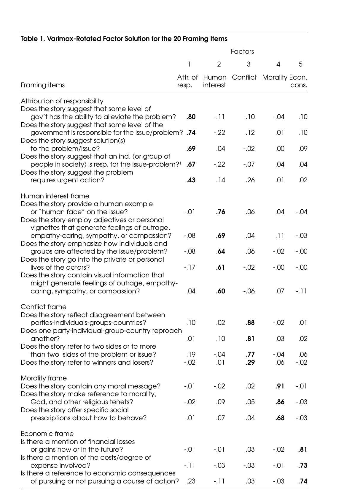

## Last week in review

Last week we followed the path from a concept to a claim:

-   **Operationalization:** Paxton showed how changing a definition or coding rule can change who counts and what pattern we see.
-   **Concept → target → estimate:** We distinguished the idea we care about, the quantity implied by that idea, and the number produced by a procedure.
-   **Dimensions and indicators:** Social media use can include multiple dimensions; each indicator captures only part of the concept.

::: notes
Use this as retrieval practice from Week 4. Ask students to connect Paxton's changing democracy rule to the idea that operationalization can change the empirical pattern. Then ask for an example of a target and estimate from the social-media-use exercise. Briefly recall that Week 4 introduced Toshkov's levels, representation, generative versus discriminative concepts, and the four perils. Today we develop the reliability, validity, and measurement-error tools needed to investigate those problems.
:::

## This week: diagnosing measurement

We will move from the question **“What does this measure represent?”** to:

1.  **Levels of measurement:** How should indicators be turned into numbers?
2.  **Four perils:** What can go wrong when we quantify?
3.  **Measurement error:** How does the observed value differ from the target?
4.  **Reliability and validity:** Is the measure consistent, accurate, or both?
5.  **Evidence:** What can repeated measures, benchmarks, hand-coding, and AI coding tell us?

::: notes
Use this as the roadmap for the session. Tell students that the four perils provide the motivating problems, the true-score framework gives us language for the target and error, reliability and validity separate consistency from accuracy, and the hand-coding/AI example shows how evidence works in practice. We end by returning to fairness: a measure can be reliable overall while still being inaccurate or differently interpretable for some people.
:::

## Toshkov: levels of measurement

| Level | What the values tell us | Example |
|------------------------|------------------------|------------------------|
| **Nominal** | Different or the same | News frame present/absent |
| **Ordinal** | Different, plus higher or lower | Agreement scale |
| **Interval** | Differences have equal meaning | Temperature in °C |
| **Ratio** | Ratios also have meaning; zero means none | Minutes of media use |

::: key-line
The level determines which comparisons and mathematical operations are meaningful.
:::

[Toshkov, levels of measurement.]{.source}

::: notes
Begin with Toshkov's levels of measurement. The categories describe what information the values preserve and therefore which comparisons are legitimate. This foundation comes before the four perils and the later discussion of reliability, validity, and error.

Nominal values distinguish categories. Ordinal values also establish an order, but the distance between adjacent categories is not necessarily equal. Interval values have meaningful and equal differences, but zero is arbitrary. Ratio values add a meaningful zero, so statements such as twice as much become meaningful.

Emphasize that a variable's level depends on what its values represent, not whether researchers happen to encode them with numbers. Coding news frames as 1, 2, and 3 does not make the categories ordinal or quantitative.
:::

## Four perils of quantification

| Peril | Core concern |
|------------------------------------|------------------------------------|
| **Narrowness** | The measure captures only part of what matters. |
| **Fairness** | Measurement errors fall unevenly across people or groups. |
| **Unintended consequences** | People change their behavior in response to the measure. |
| **Malign intentions** | Someone designs or uses the measure to manipulate or harm. |

**We will examine each peril before turning to measurement error.**

[Adapted from Lauderdale, ch. 1.]{.source}

::: notes
The levels slide established the basic language for describing variables. Now introduce the four perils, which the class did not reach last week. Use this slide only as a map. The next four slides treat each peril separately before the deck turns to the true-score equation, reliability, and validity.

Source: Lauderdale, ch. 1, pp. 27–31.
:::

## Peril 1: narrowness

The number may be precise while the representation remains incomplete.

::: key-line
We measure online engagement as the time logs spent on an app.
:::

What important dimensions disappear when the concept becomes a score?

[Lauderdale, ch. 1.]{.source}

::: notes
Narrowness comes from reducing a broad concept to a limited set of indicators. Measurement always requires selection, so some narrowness is unavoidable. The question is whether the omitted dimensions matter for the claim or decision.

Use social-media minutes as the example. Two people can each record 120 minutes while having very different experiences. If the research question concerns exposure to political information, well-being, or social support, duration alone may be too narrow even when recorded perfectly.
:::

## Peril 2: fairness

::::: columns
::: {.column width="52%"}
### Imagine two job candidates

Ralph and Ross are equally qualified.

The screening system recognizes Ralph's CV buzzwords better, so Ralph receives a higher score than Ross.

**Same qualification, different observed scores.**
:::

::: {.column width="48%"}
### The fairness question

Do irrelevant features of the CV change how the system measures qualification?

**Equal on the target should mean equal treatment by the measure.**
:::
:::::

::: diagnosis
The score difference comes from the procedure, not from a difference in qualification.
:::

::: notes
Fairness concerns how measurement errors are distributed. Ralph and Ross are equally qualified, but the system recognizes one style of CV wording better. An irrelevant feature of the measurement process creates the difference in scores.

The problem is not simply that two scores differ. Scores should differ when qualifications differ. The fairness problem is that the procedure gives unequal scores when the underlying target is equal.
:::

## From fairness to measurement error

Ralph and Ross have the same job qualification, but the CV screener gives them different scores.

$$u = m + e$$

::::: columns
::: {.column width="50%"}
$u$ = observed score\
$m$ = true score: job qualification\
$e$ = measurement error
:::

::: {.column width="50%"}
$$m_A=m_B$$

$$u_A\neq u_B$$
:::
:::::

::: diagnosis
Fairness problems appear when the errors, $e$, differ systematically between objects to be raited
:::

::: notes
Now use the CV example to introduce the true-score equation. The observed score $u$ equals the true score $m$ plus measurement error $e$. Alex and Blair have the same value on the target because they are equally qualified, but the procedure introduces different errors and therefore produces different observed scores.

This equation creates the bridge from the qualitative discussion of the four perils to the rest of the session. Reliability asks about the consistency of observed scores. Validity asks whether the scores capture the intended target. Later, fairness will concern how errors vary across people and groups.
:::
## Question from the 1980s SAT

**RUNNER : MARATHON :: \_\_\_\_\_\_\_ : \_\_\_\_\_\_\_**

**Answer Options:**

-   \(A\) envoy : embassy

-   \(B\) martyr : massacre

-   \(C\) oarsman : regatta

-   \(D\) referee : tournament

-   \(E\) horse : stable

::: notes
The difficult items serve as a rough proxy for the students’ underlying verbal ability. The logic is: 1. Find Black and white students who perform equally well on the difficult items. 2. Treat that equal performance as evidence that the students have roughly equal ability. 3. Compare their performance on the easier items. 4. If one group performs worse on those items, the difference may reflect something besides ability, such as familiarity with culturally specific language. So “controlling for performance on hard items” means trying to compare students who are similar on the target before examining whether the measure treats them differently.

Connect this to course evaluations. Suppose the target is an instructor's contribution to student learning, but the observed evaluation score also reflects course difficulty, whether the course is required, class size, students' expected grades, and reactions to the instructor's identity or teaching style. Two equally effective instructors can therefore receive different ratings because they teach different courses or different students. That is a fairness problem when the score difference comes from the measurement context rather than from a genuine difference in teaching quality.

Course evaluations also create a reliability problem. An instructor with a small class or a low response rate receives a score based on very few observations, so a handful of unusually positive or negative responses can move the average substantially. If departments use those noisy scores for promotion, assignments, or employment, instructors can receive different treatment even when their underlying teaching effectiveness is similar. This previews the distinction between systematic bias and random variation in chapter 3.

Close with his balanced judgment: there is no evidence that quantification creates more unfairness than non-quantified judgment, since unfairness is everywhere in social life. Quantification provides a framework for stating what fairness means and how large problems are. Naive quantification can obscure problems. To go further, we need to be able to say precisely how a measure errs.

Source: Lauderdale, pp. 30–31.
:::

## Peril 3: unintended consequences

Goodhart's law: When a measure becomes a target, it ceases to be a good measure.

::: key-line
Example: college ranking.
:::

The measure does not merely describe behavior. It can redirect behavior toward the score.

**Question to ask:** What will people do differently once this number carries rewards or penalties?

[Lauderdale, ch. 1.]{.source}

::: notes
Unintended consequences appear when people know the measure matters and adjust their behavior. The response may improve the measured score without improving the underlying goal.

In the college-ranking example, the ranking initially serves as an indicator of institutional quality. Once the ranking becomes the target, administrators may change admissions, spending, or fundraising practices to improve the number. The institution can rise in the ranking without a corresponding improvement in education. The indicator then changes the activity it was supposed to measure.
:::

## Peril 4: malign intentions

Measurement choices can be designed or used to serve a harmful purpose.

::: key-line
> **Example:** Redlining, changing the meaning of unemployed, removing spending from GDP
:::

Numbers can make a preferred conclusion appear neutral or technical.

**Question to ask:** Who chose the target and indicators, and whose interests do those choices serve?

[Lauderdale, ch. 1.]{.source}

::: notes
Malign intentions concern deliberate choices, not accidental omissions or unforeseen reactions. Someone may define the target, select indicators, or present results in a way intended to conceal harm, justify unequal treatment, or manufacture a favorable conclusion.

Emphasize that the numerical result can be calculated correctly from the chosen indicators and still serve a deceptive purpose. Evaluating a measure therefore requires examining who designed it, what they included or excluded, and how they intend to use the score.
:::

## Reliability and validity

**Reliability:** repeated measurements give similar results.\
**Validity:** the measurements capture the intended target.

::::::::::: dartboard-grid
:::: dartboard-case
::: dartboard
<i style="--x:47%;--y:48%"></i><i style="--x:51%;--y:46%"></i><i style="--x:52%;--y:52%"></i><i style="--x:48%;--y:53%"></i><i style="--x:50%;--y:50%"></i>
:::

### Reliable and valid

Consistent and on target
::::

:::: dartboard-case
::: dartboard
<i style="--x:72%;--y:27%"></i><i style="--x:76%;--y:29%"></i><i style="--x:73%;--y:33%"></i><i style="--x:78%;--y:32%"></i><i style="--x:75%;--y:30%"></i>
:::

### Reliable, not valid

Consistent but systematically off target
::::

:::: dartboard-case
::: dartboard
<i style="--x:28%;--y:35%"></i><i style="--x:67%;--y:31%"></i><i style="--x:37%;--y:69%"></i><i style="--x:69%;--y:65%"></i><i style="--x:49%;--y:48%"></i>
:::

### Valid on average, not reliable

Centered overall but inconsistent
::::

:::: dartboard-case
::: dartboard
<i style="--x:62%;--y:18%"></i><i style="--x:83%;--y:37%"></i><i style="--x:57%;--y:42%"></i><i style="--x:77%;--y:61%"></i><i style="--x:69%;--y:29%"></i>
:::

### Neither

Inconsistent and off target
::::
:::::::::::

::: notes
> “The four perils identify ways quantification can go wrong. Now we need tools for evaluating a measure. Two basic questions come first: Does it produce consistent results? And does it measure what we intended? These are the questions of reliability and validity.”

Introduce the two concepts with the dartboard analogy. Reliability concerns the spread of repeated measurements: do they land near one another? Validity concerns the target: do the measurements represent what we intended to measure?

Start with the upper-left case. Tight clustering around the center gives both reliability and validity. The upper-right case is the key warning: repeated results can agree closely and still share the same bias. The lower-left pattern is centered only when many attempts are averaged; any single measurement is inconsistent. The final pattern has neither consistency nor accuracy.

Connect this to the CV screener. A system could score the same CV consistently every time and therefore be reliable, yet still be invalid as a measure of job qualification because it rewards particular wording. Reliability alone does not establish validity.
:::

## What counts as error depends on the level of measurement

| Level | Example | Error can be… |
|------------------------|------------------------|------------------------|
| Nominal | mode of travel; news frame present? | only right or wrong: $m \neq \mu$ |
| Ordinal | agree–disagree scale | too low, right, or too high |
| Interval | temperature in °C | a difference: $\epsilon = m - \mu$ |
| Ratio | GDP per capita | a difference **or** a ratio: $m/\mu$ |

[Lauderdale, pp. 63–64.]{.source}

::: notes
Introduce levels of measurement here for the first time. Error is a statement that $m$ and $\mu$ differ, and how we can state the difference depends on which mathematical operations are meaningful. For nominal categories, all we can say is whether they match. For ordinal categories we can also say the direction, and only partially compare magnitudes: on a scale A, B, C, D, if the truth is C, A is a bigger error than B, but we cannot compare that to an error between D and C.

For interval measures, the difference $m - \mu$ is the familiar definition. For ratio measures, Lauderdale points out that a proportional error can be more meaningful. Work through the GDP example: the poor country's error is smaller in dollars but five times larger in percentage terms, and probably misrepresents that country's economy more consequentially. Neither choice is automatically right; it depends on the application.

Ask a comm example: a count of minutes of daily social media use is ratio-level. Is underreporting by 20 minutes equally serious for someone who uses 30 minutes and someone who uses 300? The answer depends on the question, which is the point.

Source: Lauderdale, section 3.1, pp. 63–64.
:::

## Self-reported height and weight

{width="1300"}

[Lauderdale, Figure 3.3, p. 89. NHANES 2021–23, respondents aged 16+.]{.source}

::: notes
Use this immediately after reliability and validity. The exam measurements provide a reasonable benchmark for the self-reports. Let students read the figure before giving any numbers. The diagonal is perfect agreement. Ask: does self-report capture variation in true height and weight? Yes, most points are near the line relative to the total spread. Ask: do you see a direction? Height points sit slightly above the line—people over-report.

The example previews the error decomposition. The benchmark lets us look for systematic bias, person-level error, and remaining scatter. It also shows why validity is not a single yes/no property: the same measure can be adequate for one use and inadequate for another.

Source: Lauderdale, section 3.7, Figure 3.3, p. 89.
:::

## What the benchmark reveals

|                              |   Height |   Weight |
|------------------------------|---------:|---------:|
| Reliability, $\rho(m,\mu)^2$ |     0.91 |     0.95 |
| Bias (mean error)            | +1.68 cm | −0.67 kg |
| Error SD                     |  3.07 cm |  4.83 kg |

Men over-report height more (+2.04 vs. +1.38 cm); women under-report weight more (−1.19 vs. −0.06 kg).

[Lauderdale, pp. 90–92.]{.source}

::: notes
Read this table as an application of the concepts students have just learned. The reliability coefficients are high, but the error statistics show that high consistency does not eliminate individual error. Weight has a stronger negative correlation between error and truth: heavier people under-report more. The group differences show how measurement error can vary across people.

Ask students: Which quantities describe consistency? Which describe accuracy? Which reveal a fairness concern? End with Lauderdale's point that whether this matters depends on use. The same measure can be good enough for one purpose and inadequate for another.

Source: Lauderdale, section 3.7, pp. 90–92, Table 3.3.
:::

## Three sources of error

$$m_{ir} - \mu_i = \underbrace{\delta}_{\text{common}} + \underbrace{\gamma_i}_{\text{unit-specific}} + \underbrace{\eta_{ir}}_{\text{measurement-specific}}$$

| Measuring height against a wall | Source |
|------------------------------------|------------------------------------|
| The tape curves at the floor, so *everyone* reads high | common bias $\delta$ |
| *This person* (or a particular group of people) slouches or has voluminous hair | unit-specific bias $\gamma_i$ |
| The pencil mark lands a little differently each time | noise $\eta_{ir}$ |

[Lauderdale, pp. 65–66.]{.source}

::: key-line
**Dartboard connection:** Which source shifts the shots, shifts one person's cluster, or spreads the shots out?
:::

::: notes
delta, gamma, eta

This decomposition is the single most important idea in the chapter, so spend time on it. Units are indexed by $i$, and repeated applications of the procedure to the same unit by $r$. The common error is shared by all units. The unit-specific error is the procedure's consistent mismeasurement of a particular unit. The measurement-specific error varies each time we apply the procedure.

Use Lauderdale's height example row by row. Then stress the consequence: if you measure the same person many times and average, the noise shrinks toward zero. But averaging never fixes the curved tape or the slouch, because those errors recur every time. This is why repetition and agreement can be reassuring about noise while saying nothing about bias.

Now connect the equation to the dartboards. Ask students to identify the visual signature of each error source:

-   **Common bias,** $\delta$: the whole cluster shifts away from the bullseye. This is the “reliable, not valid” pattern.
-   **Unit-specific bias,** $\gamma_i$: one person's repeated shots form a tight cluster in the wrong place. If the shift is patterned by group, it becomes a fairness concern.
-   **Measurement-specific noise,** $\eta_{ir}$: shots spread out from one repetition to the next. This is the “not reliable” pattern.

Ask: **What does averaging repeated measurements remove, and what does it leave behind?** Averaging reduces measurement-specific noise, but it does not remove common or unit-specific bias. Then ask students which component a sampling procedure contributes. Lauderdale notes that any measure based on sampling from a population, such as a survey estimate, has measurement-specific error.

Source: Lauderdale, section 3.2, pp. 65–66.
:::

## Worked example: self-reported social-media minutes

**Setup:** We treat a device log as the target and ask each person to report their minutes twice.

### Step 1: Compare each report with the log

| Person | Logged minutes |  Reports | Report errors |
|--------|---------------:|---------:|--------------:|
| A      |             60 |   55, 45 |       −5, −15 |
| B      |            120 |   95, 85 |      −25, −35 |
| C      |            200 | 145, 155 |      −55, −45 |

### Step 2: Look for the pattern

-   **Common bias:**
-   **Unit-specific bias:**
-   **Noise:**

::: notes
State clearly that this is invented. Assume the logs are accurate for this illustration; whether logs are a gold standard is a question we return to shortly.

Walk through the two steps on the slide. First, subtract the logged minutes from each report. Ask students to calculate one row at a time: A's errors are −5 and −15, B's are −25 and −35, and C's are −55 and −45. Second, ask what pattern they see before introducing any notation. Everyone underreports, so the average error is −30: common bias. A, B, and C sit +20, 0, and −20 away from that average: unit-specific bias. The repeated reports differ by about ±5 around each person's average: measurement-specific noise.

Only after students identify the pattern, explain that mean squared error (MSE) is a single summary that averages squared errors. Lauderdale decomposes it into squared common bias, the variance of unit-specific biases, and noise variance. Do not require students to calculate 1191.7 yet; the conceptual point is that one summary can hide the different sources that the table reveals.

Then ask the important question: what happens if we ask each person ten times and average? The noise term goes away, but the MSE barely changes. And notice the pattern in $\gamma$: heavier users underreport more. The error is correlated with the target. Hold on to that; it matters for the next slide and for fairness.

Source: Hypothetical example applying Lauderdale, section 3.2, pp. 65–67.

-   **Common bias:** everyone reports too few minutes; the average error is **−30**.
-   **Unit-specific bias:** A, B, and C differ from that average by **+20, 0, and −20**.
-   **Noise:** repeated reports vary by about **±5 minutes** around each person's average.
:::

## Reliability is not accuracy

-   I step on the scale 5 times, each time it tells me that I weigh between 160-165 times.
-   Agreement tells us the procedure is **consistent**.
-   It does not tell us whether the procedure measures the target correctly.
-   A stable bias can make a measure **reliable but invalid**.

::: key-line
If someone consistently underreports social-media use by 30 minutes, repeated reports may be consistent while still being inaccurate.
:::

**Question:** What can repeated measurement remove, and what can it never fix?

[Lauderdale, pp. 67–68.]{.source}

::: notes
Use this as the conceptual takeaway before showing any reliability coefficients. Repeated measurement can reduce random, repeat-to-repeat noise, but it cannot remove a common bias or a recurring person-specific bias. A measure can therefore be highly consistent and still miss the target in the same direction every time.

The technical version is Lauderdale's critique of classical test theory: repeated measures estimate how close one measurement comes to the procedure's own long-run average, not necessarily how close it comes to the target. Keep the CTT equations for an optional appendix or instructor reference rather than asking students to parse them here.

Source: Lauderdale, section 3.2, pp. 67–68.
:::

## How do we assess reliability and validity?

| Question | Basic strategy |
|------------------------------------|------------------------------------|
| **Reliability** | Repeat the measurement and ask whether the results are consistent. |
| **Validity** | Compare the measurement with the intended target or a reasonable benchmark. |

::: key-line
Reliability asks whether the procedure gives similar results. Validity asks whether those results represent what we meant to measure.
:::

::: notes
Now that students understand that reliability is not accuracy, introduce the assessment strategies. For reliability, repeat the same procedure and examine whether the results agree. For validity, compare the measure with the target directly when possible, or with a reasonable benchmark and other evidence when the target is not directly observed.

Tell students that these strategies answer different questions. The next slides apply them to benchmark validation and repeated measurements.
:::

## Types of validity evidence

Validity is a cumulative argument, not one statistic. These forms of evidence are commonly treated as parts of **construct validity**:

| Evidence | Basic question |
|------------------------------------|------------------------------------|
| **Face** | Does the measure look sensible on its surface? |
| **Content** | Does it cover the important parts of the concept? |
| **Structural** | Do the indicators relate as the theory predicts? |
| **Convergent** | Does it agree with measures of related constructs? |
| **Discriminant** | Does it remain distinct from measures of different constructs? |
| **Criterion** | Does it agree with a credible external benchmark? |
| **Predictive** | Does it forecast a relevant future outcome? |

::: key-line
No single subtype proves validity. Each rules out a different way the measure could miss the target.
:::

::: notes
Use this as a vocabulary map before the benchmark examples. Explain that validity is an argument built from several kinds of evidence. Terminology varies across textbooks, but these are commonly organized as evidence for construct validity.

Face validity is a quick plausibility check, not strong evidence by itself. Content validity asks whether the measure covers the conceptual domain. Structural validity asks whether indicators relate in the pattern the theory predicts. Convergent validity looks for agreement with related measures, while discriminant validity asks whether the measure remains distinct from measures of different constructs. Criterion validity compares with a credible external benchmark. Predictive validity asks whether the measure forecasts a relevant later outcome.

Emphasize that criterion and predictive evidence often involve an external benchmark, while face, content, structural, convergent, and discriminant evidence help build the broader construct-validity argument. The next slides show what benchmark evidence looks like in practice.
:::

## Validity evidence: examples and failure points

| Evidence | Example | What would weaken it? |
|------------------------|------------------------|------------------------|
| **Face** | A five-item personality index appears to ask about extraversion. | Items look unrelated to extraversion, or merely ask whether someone is popular. |
| **Content** | A news-literacy measure covers source checking, evidence, and lateral reading. | It measures only recall of media facts and omits source evaluation. |
| **Structural** | The five personality items form one expected factor. | Items fail to hang together or load on several unintended factors. |
| **Convergent** | Self-reported news exposure agrees with browser-log exposure. | The two measures of the same construct show little relationship. |
| **Discriminant** | A news-exposure score remains distinct from an unrelated trait such as height. | It correlates just as strongly with an unrelated construct as with news exposure. |
| **Criterion** | A news-consumption measure agrees with an established assessment of news knowledge. | Agreement disappears when compared with the external knowledge benchmark. |
| **Predictive** | A media-literacy score predicts later detection of misinformation. | It does not predict the relevant future behavior or outcome. |

::: key-line
Evidence can support a measure without proving it. **Criterion validity** emphasizes agreement with an external benchmark; **convergent validity** emphasizes agreement across measures of the same construct.
:::

::: notes
Walk through the examples, emphasizing that each subtype addresses a different vulnerability.

For face validity, a five-item personality index may look plausible because its items appear to ask about the trait. That is only a first impression. It would be weak face evidence if the items actually measured popularity, confidence, or social desirability instead.

For content validity, ask whether the measure covers the concept's full domain. A news-literacy scale made only of factual recall would omit source evaluation and evidence checking. For structural validity, ask whether the items behave as the theory predicts. A five-item index that fails to form the expected factor needs explanation.

For convergent validity, compare two measures intended to capture the same construct, such as self-reported news exposure and browser logs. For criterion validity, compare the measure with an external benchmark that should be related to it. Here, news knowledge is not the same construct as news consumption; it functions as the criterion. For discriminant validity, ask whether the measure remains distinct from an unrelated construct. A high correlation with an unrelated trait can signal that the measure is capturing something else.

Criterion validity uses a credible external benchmark, such as an established assessment of news knowledge for a news-consumption measure. Predictive validity asks whether the measure forecasts a relevant later outcome, such as later misinformation detection. In every case, a failure weakens the validity argument; a success supports it but does not prove the measure is valid in every use.
:::

## Hand-coding versus AI coding

| Question | What to check | What it tells us |
|------------------------|------------------------|------------------------|
| **Do hand coders agree?** | Two or more trained coders classify the same items. | **Reliability** of the hand-coding procedure. |
| **Does the AI agree with hand coders?** | Compare AI labels with an independently coded sample. | **Convergent Validity**. |
| **Are the hand-coding rules defensible?** | Does the codebook capture the concept we care about? | **Content Validity/Face Validity** of the coding target and operationalization. |

[Lauderdale, pp. 75–76.]{.source}

::: notes
Use this to separate two questions students often conflate. First, can the coding procedure be applied consistently? That is reliability. Second, do the labels represent the concept we intended? That is validity. Agreement between an AI system and hand coders answers the first question only indirectly and depends on the hand-coded reference.

Ask students what could go wrong: hand coders may disagree, the codebook may omit an important part of the concept, or the AI may reproduce a systematic pattern in the hand-coded labels. The hand-coded sample should be coded independently of any prompt or model tuning used to produce the AI labels.

Source: Lauderdale, sections 3.3–3.6, pp. 75–76, 79.
:::

## Even with a gold standard: two cautions

**Is the validation sample representative?**

A measure validated on some kinds of units may err differently on others. Units absent from the benchmark are effectively unvalidated.

**Was the benchmark used to build the measure?**

If you chose or tuned the procedure to fit the benchmark, error there underestimates error elsewhere. Hold out a test set.

[Lauderdale, pp. 77–79.]{.source}

::: notes
AI CODING EZAMPLES.

hese two cautions are especially relevant to current communication research using supervised classifiers and LLMs. First, representativeness: if you validate a toxicity classifier on comments from one platform or in one dialect, the error rates may not carry to others. Lauderdale suggests reweighting when possible, and regressing errors or squared errors on unit characteristics to look for differences in bias or variance between groups. That last suggestion is itself a fairness diagnostic.

Second, selecting on the benchmark. If you tried several prompts and kept the one that best matched the hand-coded sample, then performance on that sample is optimistic. The standard remedy is a training–test split or cross-validation. Ask students where they have seen a validation number that was computed on the same data used to choose the method.

Flag that Burla et al. do something like this correctly: they refined the codebook using one set of transcripts and assessed agreement on ten different, randomly chosen transcripts.

Source: Lauderdale, section 3.4, pp. 77–79.
:::

## Intercoder and test–retest reliability measure consistency

**Test–retest:** same units, two times. **Intercoder:** same units, two coders.

| Level | Common statistics |
|------------------------------------|------------------------------------|
| Binary / nominal | \% agreement; Cohen's $\kappa$; Scott's $\pi$; Fleiss' $\kappa$; Krippendorff's $\alpha$ |
| Ordinal | weighted $\kappa$; Krippendorff's $\alpha$ (ordinal); Spearman / Kendall; polychoric |
| Interval / ratio | Pearson's $r$; concordance correlation; intraclass correlation |

**They tell you whether measures agree—not whether they measure what you wanted.**

[Lauderdale, pp. 83–86, Table 3.1.]{.source}

::: notes
Lauderdale's term is reliability-as-consistency. We can always compute how much two measures share variation, but without the independence assumption this tells us only that they measure the same thing, not that they measure the target. Researchers still call these reliability, usually with a qualifying adjective: intercoder, test–retest, internal-consistency.

Go through the table briefly. The categorical statistics differ in how they adjust for chance agreement, which depends on base rates. Cohen's kappa uses each coder's own marginal distribution; Scott's pi and Fleiss' kappa pool the coders; Krippendorff's alpha extends to many coders and different levels. For continuous data, statistics differ in whether they count differences in mean or scale between coders as disagreement: Pearson's r ignores them; concordance and intraclass correlation do not.

The bottom line is the takeaway for both case readings. Keep asking: what does this agreement statistic license us to conclude?

Source: Lauderdale, section 3.5, pp. 83–86, Table 3.1.
:::

## Without a benchmark, we assemble validity evidence

| Evidence | Asks whether… | Traditional names |
|------------------------|------------------------|------------------------|
| **Content** | $m$ covers the full conceptual domain of $\mu$ | content validity |
| **Structure** | the process producing $m$ matches the theorized structure of $\mu$ | response-process, structural, factorial |
| **Relational** | $m$ relates to other quantities as $\mu$ should | criterion, concurrent, predictive, convergent, discriminant, face |
| **Overall** | all the evidence supports using $m$ for $\mu$ | construct validity |

[Lauderdale, pp. 86–88, Table 3.2, following Messick (1989).]{.source}

::: notes
When there is no gold or silver standard, which is usual for new concepts, Lauderdale says the question is often less whether we measured the true values than whether we have put a reasonable label on the outputs of our procedure. Researchers still call the resulting analyses validity, but they are not direct measures of fidelity to the target.

Explain the organizing logic: these three categories correspond to the chapter 2 picture. Content concerns the indicators. Structure concerns how indicators are combined. Relational evidence concerns whether the measure behaves as the concept should in relation to other things. Construct validity is the integrated judgment.

Mention face validity's surprising role. It sounds the least rigorous, but Lauderdale argues it becomes very useful because expert judgment is essential to building new measures; later chapters build measurement procedures from expert judgments. We will now use this table to sort the evidence in Semetko and Valkenburg.

Source: Lauderdale, section 3.6, pp. 86–88, Table 3.2.
:::

## Content analysis as measurement {.section-title}

**Semetko & Valkenburg (2000):** five news frames in Dutch press and television

**Burla et al. (2008):** intercoder reliability as a tool for improving a codebook

For each: What is $\mu$? What is $m$? What evidence connects them?

::: notes
Transition to the case readings. Tell students we are not using Semetko and Valkenburg primarily for its substantive findings about Dutch news, though we will mention them. We are using it as a worked example of the measurement process: a concept from the literature, a set of indicators, a coding procedure, reliability evidence, a structural analysis, and substantive claims. Burla et al. then shows a team using intercoder reliability diagnostically rather than only as a number to report.

Write the three questions on the board and keep them visible.

Source: Semetko & Valkenburg (2000); Burla et al. (2008).
:::

## What are they asking?

**Semetko & Valkenburg's research question:**

> Which generic news frames appear in Dutch press and television coverage, and how do those frames vary across media and outlet type?

**The broader Iyengar question they revisit:**

> Does episodic coverage encourage audiences to assign responsibility to individuals, while thematic coverage encourages responsibility to government or society?

Their data code **story content**, not audience interpretations. The paper therefore tests whether patterns in news framing are consistent with, or challenge, the way Iyengar links episodic/thematic presentation to responsibility.

::: notes
Pause here before introducing the codebook. Separate the paper's descriptive question from the broader theoretical claim. Semetko and Valkenburg ask what frames occur in Dutch news and whether they differ across media and outlet types. Iyengar's claim concerns how episodic versus thematic presentation shapes responsibility attribution by audiences. Semetko and Valkenburg do not directly measure audience effects; they measure the content that might create those effects.

This distinction will matter later when we discuss validity and overclaiming: a content measure cannot by itself establish what audiences think.
:::

## The concept: what is a news frame?

Framing selects "some aspects of a perceived reality" to make them salient, promoting a "problem definition, causal interpretation, moral evaluation, and/or treatment recommendation." (Entman 1993, quoted p. 94)

| Approach | How frames are found | Tradeoff |
|------------------------|------------------------|------------------------|
| **Inductive** | read openly; let frames emerge | finds many frames; labor-intensive, hard to replicate |
| **Deductive** | define frames in advance; code for them | replicable, scales up; misses undefined frames |

Their five deductive frames: **responsibility, conflict, human interest, economic consequences, morality.**

[Semetko & Valkenburg, pp. 93–96.]{.source}

::: notes
The authors note there is no single definition of frame, but the definitions they review share features. Entman's is the most used. Ask: is a frame, in this definition, a property of a story, of a journalist's intention, or of an audience's interpretation? The definitions they quote cover all three. Their measure will be a property of stories as coded by readers.

The inductive–deductive contrast parallels last week's discussion of theory-driven versus unsupervised measurement. The authors choose the deductive approach, arguing that the literature shows these five frames account for nearly all frames found in news. That is a strong claim about content coverage; note it and return to it when sorting validity evidence.

Briefly define each frame from pp. 95–96. Conflict: disagreement between actors. Human interest: a human face or emotional angle. Economic consequences: effects on someone's finances. Morality: religious tenets or moral prescriptions. Responsibility: attributing cause or solution to government or individuals, drawing on Iyengar's work on episodic and thematic coverage.

Source: Semetko & Valkenburg, pp. 93–96.
:::

## The instrument

**Units:** 4,123 stories, May–June 1997 (around the Amsterdam EU summit)

-   4 newspapers (2,601 stories, coded every other day) and 3 TV news programs (1,522 stories)
-   Framing analysis on stories about politics, Europe, crime, drugs, or immigration

**Indicators:** 20 yes/no questions, at least three per frame

-   *"Does the story reflect disagreement between parties/individuals/groups?"* (conflict)
-   *"Does the story contain any moral message?"* (morality)

**Measure:** mean of a frame's items, from 0 (absent) to 1 (present)

[Semetko & Valkenburg, pp. 97–101.]{.source}

::: notes
Ask students to identify the parts in last week's vocabulary. The unit of analysis is the story. The indicators are binary coder judgments. The aggregation rule is an unweighted average of items assigned to each frame. The resulting score ranges from 0 to 1.

Point out selection decisions that shape the population being described. In the press, they coded page-one stories, stories mentioning political institutions or politicians, and stories on four topics. On television, they coded all items in the main evening news. Newspapers were coded every other day because of volume. Only 30 percent of TV stories met the criteria for the framing analysis, compared with 85 percent of press stories. These choices affect what “Dutch news” means in the results.

Ask: is the frame score a measure of how much a frame is present, or the share of indicators present? For a story, a 0.67 on conflict means two of three questions were answered yes. Whether that is “more conflict framing” in a meaningful interval sense is an open question we return to.

Source: Semetko & Valkenburg, pp. 97–101.
:::

## Their indicators and factor structure

::: tall-figure
{height="760"}
:::

[Semetko & Valkenburg, Table 1, p. 100.]{.source}

::: notes
Give students a minute to read the items. Ask them to evaluate content: do these questions cover Entman's definition? Notice what the morality frame includes—moral message, religious tenets, social prescriptions about behavior. Notice that the human interest frame includes a visual item that may apply mainly to television.

Point to two items that load weakly on their intended factor: “Does the story suggest the problem requires urgent action?” at .43 and “Does the story refer to winners and losers?” at .29. These were dropped from the scales because they fell below a .50 threshold. Ask whether dropping them is a measurement decision or a conceptual decision. It is both: winners and losers is a common description of conflict framing in the literature, and the empirical structure has redefined the concept.

Also note footnote 1: the individual responsibility item was inversely coded. We will come back to what that implies.

Source: Semetko & Valkenburg, Table 1, p. 100.
:::

## How they established reliability and structure

**Intercoder reliability:** four coders; 50 newspaper and 50 TV stories; agreement **92%–100%** on each question.

**Internal consistency (KR-20):** responsibility .75, human interest .69, conflict .81, morality .77, economic .66.

[Semetko & Valkenburg, p. 99.]{.source}

::: notes
Go through the three kinds of evidence and classify each with Lauderdale's vocabulary. Intercoder agreement is reliability-as-consistency across parallel applications of one procedure. The factor analysis is structural evidence: do indicators group the way the theory says? Cronbach's alpha, computed with the KR-20 version for binary items, is another form of consistency, among items within a frame.

The last line is a nice moment of methodological candor in the paper. The authors chose yes/no questions partly because binary coding yields high agreement. They acknowledge the cost: binary data carry more error relative to a richer underlying quantity and attenuate correlations, which might hide factor structure. They argue that because they found a clear structure anyway, the concern did not apply. Ask students whether that argument is complete. It addresses the factor analysis, but not whether a binary code captures the degree of framing in a story.

Ask the decisive question: does any of this show that the score measures framing as the concept defines it? All three are forms of agreement. None compares the measure to an independent assessment of the target.

Source: Semetko & Valkenburg, p. 99.
:::

## Sorting Semetko and Valkenburg's validity evidence

| Evidence | In the paper | What it leaves open |
|------------------------|------------------------|------------------------|
| **Content** | five frames are grounded in prior literature; each has 3–5 items | coverage is argued, not independently tested; omitted frames remain possible |
| **Structure** | five factors; same clusters; adequate alphas | factors found in items designed to group |
| **Relational** | human interest higher in sensationalist outlets; responsibility higher in serious ones | is this validation or the finding? |
| **Face** | items read like the frame definitions | no external judges reported |

[Semetko & Valkenburg, pp. 95–106; Lauderdale, Table 3.2.]{.source}

::: notes
Fill in the table with the class rather than presenting it complete, if time allows. Content: the claim that five frames are grounded in prior literature is an argument for content coverage, not a formal content-validity study. The deductive approach cannot detect frames not defined in advance. Structure: the factor solution supports the grouping, but because items were written for each frame, finding that they cluster is expected; it rules out some failures rather than confirming the concept.

The relational row is the most interesting. Sensationalist outlets using more human interest framing is the kind of known-groups pattern one could use as validity evidence. But in this paper it is also a main finding. If we use expected differences to validate the measure, we cannot also treat finding those differences as a discovery. Ask students how to break the circularity: validate on a separate sample, or against a different kind of evidence.

Face validity: the items plainly resemble the definitions. Lauderdale would encourage asking independent experts to judge a sample of stories as a separate check.

Source: Semetko & Valkenburg, pp. 95–106; Lauderdale, section 3.6, Table 3.2.
:::

## Does the measure support the claim?

**Claim:** Dutch TV is episodic yet frames *government* as responsible—so Iyengar's argument is "culture bound" (p. 106).
[Semetko & Valkenburg, pp. 99–106; Lauderdale, pp. 96–97.]{.source}

::: notes
This slide applies Lauderdale's section 3.9, which lists three ways to overclaim: treating ordinal information as interval, claiming more validity than the evidence supports, and describing the measure in terms of a broader concept than the one constructed.

Domain: the authors interpret their result as disagreeing with Iyengar, who measured how audience members attributed responsibility after exposure to episodic or thematic news. Semetko and Valkenburg measure content. Their finding is compatible with episodic TV news still leading audiences to individual attributions. Ask whether the claim is about the concept their measure targets.

Construction: the discussion says a high score means responsibility was attributed to government. But the scale combines items about government with an inverted item about individual responsibility. A story that attributes no responsibility to anyone gets credit on the inverted item. Ask students what a score of .25 means. It is a good example of how an aggregation rule can quietly change the meaning of a label.

Level: frame scores are averages of a few binary items, treated as interval quantities in MANOVA. That may be defensible, but it is an assumption. Frame this as a discussion, not a takedown: the paper is a foundational and widely replicated instrument, which is exactly why its measurement choices are worth examining.

Source: Semetko & Valkenburg, pp. 99–106; Lauderdale, section 3.9, pp. 96–97.
:::

## Burla et al.: reliability as a diagnostic tool

**Study:** interviews with 48 low back pain patients; qualitative content analysis.

1.  **Build the codebook:** name, definition, examples, rules; deductive + inductive.
2.  **Pilot:** two coders code 10 transcripts; discuss disagreements; revise. *"Exercising" and "relaxation" merged—yoga is both.*
3.  **Assess:** 10 *new* random transcripts; 17 of 57 major codes; overall $\kappa$ = .67.
4.  **Diagnose and revise** codes using agreement patterns.

[Burla et al. (2008), pp. 114–115.]{.source}

::: notes
Burla et al. write for health researchers using qualitative content analysis, where coding schemes are developed partly from the data. Their argument is that intercoder reliability can be a quality-assurance tool, especially when results will be quantified or subgroups compared.

Walk through the steps. The codebook defines each code with a definition, example, and rules—this is the operationalization. The pilot uses disagreements to refine definitions. The yoga example is lovely: coders could not tell whether yoga was exercise or relaxation, because it is both. The solution was to change the concept, merging two codes. Ask: is that improving reliability, validity, or both? It improves agreement by redefining the category. That may be appropriate, but it changes what can be claimed.

Highlight a strength. They assessed agreement on ten new, randomly chosen transcripts, not on those used to refine the codebook. That is Lauderdale's warning about selecting on the benchmark, handled correctly.

Explain the kappa threshold they use: Everitt's guide calls .41–.60 moderate, above .60 satisfactory, above .80 nearly perfect. Ask students where such thresholds come from. They are conventions, not derived from what the measure will be used for.

Source: Burla et al. (2008), pp. 114–115.
:::

## Reading Burla's Table 2

| Code | Description | Agreement | Of disagreements, left off by coder 1 / 2 | Diagnosis |
|---------------|---------------|--------------:|--------------:|---------------|
| 121 | etiology and description of illness | 46% | 48% / 52% | both struggle → **code too broad** |
| 446 | exercise/sports/relaxation that helps | 71% | 29% / 71% | one coder → **coder misunderstands** |
| 620 | patients' recommendations | 80% | 0% / 100% | coder 2 **uses the code less often** |

**Agreement:** both coders assigned the code. **Disagreements:** only one did; the split shows who left it off and sums to 100%.

Low-frequency codes showed *higher* agreement: narrower definitions.

[Burla et al. (2008), Table 2, p. 116.]{.source}

::: notes
The useful move here is that disagreement is itself data. The last columns record which coder failed to assign the code when the other did, as a share of that code's disagreements, so each pair sums to 100%. Nothing is compared to a true answer here; the two coders are compared only with each other. For code 620, 80% agreement means 20% of assignments were disagreements, and in every one of them coder 2 was the one who left the code off. Watch for confusion on code 446: 71% agreement leaves 29% disagreements, and the split happens to be 29% / 71%. The match is a coincidence; the 29% in the split is not the disagreement rate. When disagreements are evenly split, as for code 121, both coders find the code hard to apply, suggesting the definition is the problem. Here, “etiology and definition” combined causes and diagnoses in one code. When disagreements are lopsided, as for code 446, one coder is likely applying the definition differently, which calls for training rather than redefinition.

Connect to Lauderdale's error decomposition. Coder-specific tendencies are like common bias for that coder. A code that is too broad produces errors that look more like noise. And a code that is consistently misunderstood by both coders in the same way would not show up here at all—that is parallel measurement with correlated errors.

Ask why narrow, rarer codes might show higher agreement. The authors suggest that narrow definitions are easier to apply. Note the tension with our kappa slide: for rare codes, percentage agreement among assignments, as they report it, behaves differently from overall agreement including both-no cases.

Source: Burla et al. (2008), Table 2, p. 116.
:::

## What does Burla's $\kappa$ = .67 certify?

**It supports:** coders apply the codebook consistently enough to code alone.

**It does not show:** that codes capture patients' perspectives.

-   **Which codes?** Only 17 of 57: substantive and frequent. Rare codes were excluded because they lower $\kappa$.
-   **Which method?** Not suitable for grounded theory, which has no fixed coding scheme.
-   **Lauderdale:** two coders trained together are *parallel measurement*.

[Burla et al. (2008), pp. 115–117; Lauderdale, pp. 81–83.]{.source}

::: notes
Be balanced. The paper's claim is modest and appropriate: high agreement justifies single coding of the remaining transcripts, instead of having two coders code everything. That is a reliability-as-consistency claim, and kappa is a reasonable tool for it.

Then the limits. Selecting the codes on which to compute reliability, excluding rare codes because they would lower kappa, means the reported .67 applies to the more frequent codes. Ask whether the excluded codes still appear in the findings. If they do, their reliability is unknown. This is the same structure as Lauderdale's concern with unrepresentative validation samples.

The authors' Table 1 says intercoder reliability is not adequate for grounded theory, because there is no predefined coding scheme and results are not quantified. Connect that to Lauderdale's pragmatic view: when concept and procedure are being developed together, agreement on a fixed procedure is not yet the relevant question.

Finally, from Lauderdale: agreement between coders who share a codebook and training can be high when the shared procedure is systematically wrong. Agreement is necessary for a usable measure, not sufficient for a valid one.

Source: Burla et al. (2008), pp. 115–117, Table 1; Lauderdale, section 3.5, pp. 81–83.
:::

## Readings

**Lauderdale, Benjamin E.** *Pragmatic Social Measurement.* September 15, 2026 draft. Chapter 3, "Measurement Error," pp. 63–97; chapter 4, "Fairness in Measurement," pp. 99–113; chapter 1, pp. 29–31.

**Semetko, Holli A., and Patti M. Valkenburg.** 2000. "Framing European Politics: A Content Analysis of Press and Television News." *Journal of Communication* 50(2): 93–109.

**Burla, Laila, Birte Knierim, Jürgen Barth, Katharina Liewald, Margreet Duetz, and Thomas Abel.** 2008. "From Text to Codings: Intercoder Reliability Assessment in Qualitative Content Analysis." *Nursing Research* 57(2): 113–117.

[Page references use printed pagination. Social media, kappa, and classifier examples are classroom illustrations.]{.source}

::: notes
Lauderdale chapter 3 is the main reading; chapter 4 supplies the fairness examples and the formal criteria; the chapter 1 pages introduce the four perils and fairness in measurement. Semetko and Valkenburg serve as an extended example of a content-analytic measurement procedure, not as a substantive reading on European politics. Burla et al. show reliability assessment used to diagnose and improve a codebook.

Invented examples: the self-reported social media minutes, the kappa table, and the toxicity classifier. All figures and numbers attributed to the readings come from the cited pages.

Source: Reading list for Week 5.
:::